# ADR-001 — Discovery of existing code (brownfield): the "minimum to proceed"

| Field | Value |
|---|---|
| **Status** | Accepted |
| **Date** | 27/08/2026 |
| **Source task** | `tasks-v1.md` → Phase 2 → 2.1 |
| **Rubric axis** | Axis 1 — Brownfield coverage (baseline **1**, target **4**) |
| **Implemented by** | Task 2.2 (skill + template) · wired in 9.2 · verified in 9.3 |
| **Associated adoption** | A7 (`competitive-analysis.md` §7) — exploring the code before proposing + brownfield inventory |

---

## 1. Context

MDPE today only has an entry point for a new product. Evidence:

- `skills/mdpe-backlog-discovery/SKILL.md` (*When to use*) opens with *"Starting a new product or a major new
  cycle"*; the *Quality gate* requires **20-30 features**, **≥2 personas**, MoSCoW by consensus and
  hypotheses with a validation criterion. None of this is obtainable from an existing repository
  without inventing it (gap-map Gap 2.1).
- `skills/mdpe-router/SKILL.md` (*Routing table*) has no row for "I already have code"
  (gap-map Gap 2.2).
- The fast-path `skills/mdpe-tasks/SKILL.md` (Phase 1 — Framing) derives goal/problem/value **from
  pasted text**, not from reading the repository; its *Inputs* section treats technical context as
  "optional technical context" provided by the user (gap-map Gap 2.3).
- `skills/mdpe-transformation/SKILL.md` (*Inputs*) asks for *"Technical context: architecture,
  backend/frontend stack, database, infrastructure, code patterns, conventions"* as free text —
  exactly the information a code inventory would produce, and which today the user has to type
  from memory.

Practical consequence: adopting MDPE in a repository with existing code requires either (i) running
a new-product discovery that doesn't describe the actual system, or (ii) jumping straight to
`mdpe-tasks` and describing the technical context by hand. Option (i) is the framework's biggest
source of fabrication (Axis 8); option (ii) loses traceability to real files (Axis 1, level 4).

Relevant external reference: OpenSpec has an **exploration step that reads the code before any
artifact exists** ([getting-started](https://github.com/Fission-AI/OpenSpec/blob/main/docs/getting-started.md)),
and the TLC catalog maps brownfield into fixed-section documents — including a
**concerns/debt** document that no other analyzed framework has (`competitive-analysis.md` 2.3, 5.15).
Spec-Kit treats brownfield as a first-class phase ("Iterative Enhancement", 1.7).

---

## 2. Decision

### D1 — New skill `mdpe-code-discovery` (option **b**)

Create a dedicated skill, **not** a mode inside `mdpe-backlog-discovery`. Justification against rubric
1.2 in Section 4 (Alternatives).

### D2 — Point in the cycle

`mdpe-code-discovery` is an **alternative entry point**, at the same hierarchical level as
`mdpe-backlog-discovery`, and runs **before** architecture and transformation:

```mermaid
graph TD
    R[mdpe-router] -->|new product| D[mdpe-backlog-discovery]
    R -->|"I already have code"| CD[mdpe-code-discovery]
    D --> B[mdpe-backlog]
    CD -.->|"optional: wants formal backlog"| B
    CD -->|"constraint: existing architecture"| A["mdpe-architecture (Phase 3)"]
    CD -->|"small item (3-25 tasks)"| MT[mdpe-tasks]
    B --> T[mdpe-transformation]
    A --> T
    T --> EC[mdpe-execution-context]
    MT --> C[mdpe-coding]
    EC --> C
```

Position rules:

- **Runs before** `mdpe-architecture`, `mdpe-transformation` and `mdpe-tasks`. Never after.
- **Runs once per repository** and is **re-run per scope** (module/subfolder) or when the
  inventory becomes stale (see D7).
- `mdpe-backlog` is **optional** on the brownfield path. It only comes in when the user wants an
  auditable, versioned trail; it is not a prerequisite for transformation in brownfield.

### D3 — Minimum inputs

| Input | Required | Note |
|---|:---:|---|
| Repository root path | **Yes** | The only required input. Without it, the skill asks and stops. |
| Scope (subfolder/module/service) | No | Recommended for large repos (>~300 code files) or monorepos. Default: root. |
| User's stated goal | No | If present ("I want to add X", "I want to understand Y"), it biases the depth and reading order. |
| Existing documentation (README, ADRs, docs/) | No | If it exists, it is a **secondary input**: the code wins over documentation in case of divergence. |
| Known build/test commands | No | If not provided, they are **inferred from actual manifests** or marked `unknown`. |

### D4 — Minimum outputs

**A single artifact**: `docs/brownfield/inventory.md`.

Justification for choosing a single file (rather than a tree of YAMLs as in discovery/backlog):
alignment with A5 (lazy creation — never generate an empty file) and with Axis 7 (cognitive
cost). One artifact, one template (`brownfield-inventory-template.md` from task 2.2), zero
ghost files.

**Essential** sections (the 4 that define the "minimum to proceed"):

| # | Section | Content | Evidence source |
|---|---|---|---|
| 1 | **Stack and runtime** | languages, frameworks, package manager, versions | only what is in real manifests (`package.json`, `*.csproj`, `pom.xml`, `pyproject.toml`, lockfiles) |
| 2 | **Structure and modules** | relevant tree + **observed** layers (not the desired ones) | directory listing + namespaces/imports |
| 3 | **Observed conventions** | naming, organization, test pattern, lint/format configs | actual config files + code sampling |
| 4 | **Reconstructed feature map** | `cf-NNN` table (see D5) | routes/endpoints, handlers, use cases, screens, jobs, entities |

**Conditional** sections (only when there is evidence; absence is a valid answer and does not fail the gate):

| # | Section | Only when |
|---|---|---|
| 5 | **External integrations** | there is an HTTP client, SDK, queue, broker or service credential in the code |
| 6 | **Test strategy** | there are tests. If none, record "no tests detected" in section 7 instead of creating an empty section 6 |
| 7 | **Concerns / debt** | there is concrete evidence: real `TODO`/`FIXME`, absence of tests, observed duplication, visible coupling, unmaintained dependency |

Mandatory artifact header: `repo`, `scope`, `verified_at` (date + commit/branch if there is
git), `depth` (S/M/L — see D6).

### D5 — Reconstructed feature map contract

One row per feature, in the spirit of A10 (feature ↔ file locator, one-line catalog):

| Field | Rule |
|---|---|
| `id` | `cf-NNN` (*code feature*), sequential, stable. When promoted to a formal backlog, it becomes `feat-NNN` and the `feat` records `origin: cf-NNN`. |
| `name` | derived from the code's own language (route, use case, screen), not invented |
| `description` | one line: what the system **does today**, in current-state voice — not what it should do |
| `files` | **≥1 real, verified path**. Blocking field: without a path, the feature is not emitted. |
| `confidence` | `high` (route/entry point + test + data model) · `medium` (clear code, no test) · `low` (inferred from name/structure, unconfirmed) |
| `gaps` | optional: what could not be determined (mark `unknown`, never fill in by deduction) |

Hard rules:

1. **Every cited path is verified before being written.** An unverified path does not go in.
2. **`TBD`/placeholders are forbidden.** No data → `unknown` or an absent field.
3. **Low confidence is a better answer than invention.** Downgrade the confidence rather than
   complete the story.
4. **Repository with no code** → the skill answers "no code to discover", **emits no features**
   and suggests `mdpe-backlog-discovery` (greenfield). The same applies to a targeted scope that
   contains only configuration/documentation.
5. **Code wins over documentation and wins over an old inventory.** Divergence between the README
   and the code is recorded in section 7 (concerns), with the code as the source of truth.

### D6 — Depth proportional to the repository (auto-sizing)

Application of A3 in brownfield — depth comes from the size of the scope, not from a fixed number:

| Size | Signal | Sections | Feature map |
|---|---|---|---|
| **S** | ≲50 code files | 1-4 (essential) | all observed features |
| **M** | ~50-300 | 1-4 + applicable conditionals | all observed features |
| **L** | >300 or monorepo | 1-4 within the declared scope | features within scope; outside the scope, only the module boundary |

There is no minimum number of features. A repository with 3 reconstructed features produces 3 rows.
Reading is **on demand** (manifests → structure → entry points → sampling), not a full sweep:
inventorying does not mean loading the entire repository into context.

### D7 — Bridge to the following phases

| Situation after the inventory | Route | How the inventory is consumed |
|---|---|---|
| New feature or small improvement (~3-25 tasks) | `mdpe-tasks` | inventory fills the *optional technical context*; the `files` of the touched `cf-NNN` entries become the tasks' concrete **Reference files** |
| Large feature / needs an auditable trail | `mdpe-backlog` (optional) → `mdpe-transformation` | inventory fills the *Technical context* of transformation's *Inputs*; a `cf-NNN` promoted to `feat-NNN` keeps its `origin` |
| Architectural decision at stake | `mdpe-architecture` (Phase 3) | sections 2, 3 and 7 come in as a **constraint**: the observed architecture is the starting point, not a blank slate |
| Just understanding the system | end | the inventory is the deliverable |
| Empty repository / no code | `mdpe-backlog-discovery` | no feature is emitted |

Reconciliation: `verified_at` makes the inventory dateable. When resuming, if the repo has changed
since `verified_at`, **current evidence wins over the inventory** (TLC 5.5 / A6) and the affected
sections are re-inventoried — not the whole file. Formal connection with project memory is left for
Phase 7 (ADR-006); this ADR only guarantees that the artifact is dateable and partially updatable.

---

## 3. "Minimum to proceed" criterion

It is ready to move on to architecture/transformation/tasks when **all** five items below hold:

- [ ] Section 1 (stack) filled in from a real manifest, or marked `unknown` with a reason.
- [ ] Section 2 (structure/modules) reflects the observed tree of the declared scope.
- [ ] Section 3 (conventions) lists ≥1 observed convention with the file/sample evidencing it.
- [ ] Section 4 contains **≥1 reconstructed feature** with ≥1 real, verified path, and a confidence level.
- [ ] No path cited in the artifact is nonexistent; no field contains `TBD`/placeholder.

A repository with no code satisfies the gate differently: the answer "no code to discover" +
redirection to greenfield **is** the correct output, and no artifact is created (A5).

---

## 4. Alternatives considered

### (a) New mode inside `mdpe-backlog-discovery` — **rejected**

- `mdpe-backlog-discovery` has modes, but they are **depth levels of the same 5-stage session**
  (*Refined prioritization* deepens stage 4; *Risk validation*, stage 5). Brownfield is not
  more depth: it is the **opposite direction** — from code to features, instead of from vision to features.
- The skill's *Quality gate* is greenfield by construction (vision, ≥2 personas, 20-30 features, MoSCoW
  ≤30% Must). Making every item conditional would leave the gate ambiguous and reopen the
  fill-in-the-blanks pressure that Phase 8 exists to remove — a regression on Axes 7 and 8.
- Context cost: triggering brownfield would load the entire product-discovery skill (5
  stages, MoSCoW, RICE, hypotheses, risk matrix), against the principle of proportional
  loading (Axis 7).
- Routing: the frontmatter's `description` is what triggers the skill. A single `description`
  covering both "new product" **and** "map an existing codebase" degrades the precision of both
  routes — and Axis 1 level 5 specifically requires "brownfield routed by the router".

### (b) New skill `mdpe-code-discovery` — **chosen**

Against rubric 1.2:

| Axis | Effect of option (b) |
|---|---|
| **1 — Brownfield** (1 → 4) | Its own entry trigger; its own minimum inputs/outputs; level 4 reachable without touching the greenfield gate. |
| **7 — Cognitive cost** | Loads only what is needed to inventory; no rigid minimums inherited. |
| **8 — Hallucination** | Specific anti-fabrication rules (verified path, confidence, "no code to discover") live in the skill's own gate, without coexisting with a gate that asks for 20-30 features. |
| **2 — Architecture** | Delivers an explicit constraint ("observed architecture") for Phase 3, a requirement of Axis 2 level 5. |
| **5 — Graphs** | The `cf-NNN` + `files` map is the "artifact/file" node that A10 requires in Phase 6. |
| Cost | +1 skill in the catalog (8 → 9, plus Phase 3 and possibly 6.4). Mitigated by the mandatory wiring in 9.2, which fails orphan skills. |

Consistent external precedents: the TLC catalog delegates code exploration to a dedicated
neighboring skill (`codenavi`, `competitive-analysis.md` 5.13/5.15) instead of embedding it in the
spec flow; Spec-Kit treats brownfield as its own phase (1.7).

### (c) Extend `mdpe-tasks` to read the repository — **rejected**

Would resolve Gap 2.3, but ties the inventory to the single-item fast-path: each new item
would re-inventory the repo, with no reusable artifact and without feeding `mdpe-architecture` or
`mdpe-transformation`. Raises Axis 1 to at most 2 (guidance without a structured inventory).

### (d) Adopt OpenSpec-style delta specs (ADDED/MODIFIED/REMOVED) — **out of scope for v1**

Already recorded as a conscious rejection in `competitive-analysis.md` §7: it requires a durable
"current state" spec that only comes into existence after A6 + A7. This ADR delivers A7 (the
inventory), which is the precondition. Reassess post-v1.

---

## 5. What is **NOT** required in brownfield

Section required by the acceptance criteria of task 2.1. None of the items below is a prerequisite
for moving from `mdpe-code-discovery` to architecture, transformation or tasks:

**From `mdpe-backlog-discovery`:**

- Product vision template ("For … Who … The … Is a … That … Unlike …").
- SMART strategic goals with baseline/target; anti-goals.
- Personas and empathy maps (the *Quality gate* requires ≥2 — **waived**).
- Divergent/convergent brainstorm of **20-30 features** — **waived**; the number of features is the
  number observed in the code.
- MoSCoW and the scarcity rule (Must ≤ ~30%).
- Value × Effort matrix, `Score = Value × (10 − Effort)`, RICE.
- Hypotheses (value/usability/feasibility) and strategic risks with a probability × impact matrix.
- The `docs/discovery/00..05-*.yml` artifacts and validation against
  `discovery-session.schema.json`.

**From `mdpe-backlog`:**

- `docs/backlog/features/feat-XXX.yml`, `backlog-index.yml`, `roadmap.yml` and the
  `cognitive-backlog.schema.json` — **optional**, only when the user wants the versioned trail.
- Indicative roadmap by phase (MVP/growth/expansion).
- Value criteria with baseline/target/measurement method per feature.
- Backlog version history.

**From the inventory itself:**

- Conditional sections 5, 6 and 7 (absence of evidence is a valid answer).
- Effort, priority or business-value estimates for reconstructed features — the inventory
  describes **what exists**, not what it's worth or what comes next.
- Exhaustive coverage of an L-size repository (the declared scope sets the boundary).
- Diagrams (Mermaid) of the system — left for Phase 6, once the graph model is defined.

**General rule:** the absence of an item from this list **never** fails task 2.2's gate. What fails
it is a nonexistent path, `TBD`, a feature with no source file, or a feature emitted for a repo with
no code.

---

## 6. Consequences

**Positive**

- Axis 1 goes from 1 to 3 with this ADR and enables 4 in task 2.2 (skill + template).
- `mdpe-transformation` and `mdpe-tasks` now receive technical context **derived from real files**
  instead of typed from memory — an indirect gain on Axes 8 and 3.
- Delivers A7 and the precondition for the feature ↔ file tracing that Phase 6 (A10) consumes.
- Creates the "observed architecture" constraint that Phase 3 needs so it doesn't propose a trendy pattern.

**Negative / costs**

- +1 skill to maintain and wire in (router, `mdpe-flow.md`, `mapping-commands-to-skills.md`, README) —
  mandatory work in 9.2, on pain of an orphan skill.
- The inventory is dateable and therefore **goes stale**. Mitigated by `verified_at` + the
  "evidence wins over inventory" rule + partial per-section re-inventory.
- Two entry points increase the chance of misrouting. Mitigated by disjoint `description`s
  ("repository with existing code" vs. "new product") and an explicit row in the *Routing table*.

**Neutral**

- `mdpe-backlog` is no longer a mandatory step on the brownfield path. Does not change the
  greenfield path.
- The `cf-NNN` id convention falls under the id standardization scope of task 9.1.

---

## 7. Verification against task 2.1's test scenarios

| Scenario | Where it is addressed |
|---|---|
| + Minimum inputs, minimum outputs and point in the cycle (before transformation) | D3, D4, D2 (diagram + position rules) |
| + Explicit "minimum to proceed" criterion with what's waived in brownfield | Section 3 (5-item gate) + Section 5 (list of what is not required) |
| + Decision (a) or (b) justified against rubric 1.2 | Section 4 — (b) chosen, with an axis-by-axis table |
| − Does not require full discovery (personas/MoSCoW) | Section 5 explicitly waives personas, MoSCoW, 20-30 features, Value×Effort, RICE, hypotheses and risks |
| − ADR has a "not required" section | Section 5 |

---

## 8. Sources

**Internal (read for this ADR):** `skills/mdpe-backlog-discovery/SKILL.md` · `skills/mdpe-backlog/SKILL.md` ·
`skills/mdpe-transformation/SKILL.md` (*Inputs*) · `skills/mdpe-tasks/SKILL.md` ·
`skills/mdpe-router/SKILL.md` · `docs/analysis/baseline-gap-map.md` (Gaps 2.1-2.3) ·
`docs/analysis/evaluation-rubric.md` (Axes 1, 2, 5, 7, 8) · `docs/analysis/competitive-analysis.md`
(2.3, 5.13, 5.15, 1.7, A3, A5, A6, A7, A10).

**External:** OpenSpec — [getting-started](https://github.com/Fission-AI/OpenSpec/blob/main/docs/getting-started.md)
(exploration step that reads the code before proposing) ·
[overview](https://github.com/Fission-AI/OpenSpec/blob/main/docs/overview.md) (specs as current
state; "enablers, not gates") · Spec-Kit —
[README](https://github.com/github/spec-kit/blob/main/README.md) (brownfield as a first-class
phase) · TLC Spec-Driven —
[SKILL.md v3.3.0](https://github.com/tech-leads-club/agent-skills/blob/main/packages/skills-catalog/skills/%28development%29/tlc-spec-driven/SKILL.md)
(auto-sizing, lazy creation, memory with reconciliation, composition with a code-exploration skill)
and [LobeHub snapshot](https://lobehub.com/skills/tech-leads-club-agent-skills-tlc-spec-driven)
(the 7 brownfield mapping sections, including concerns/debt).

> Content paraphrased from the sources for licensing compliance; URLs verified on
> 27/08/2026 per `competitive-analysis.md`.
