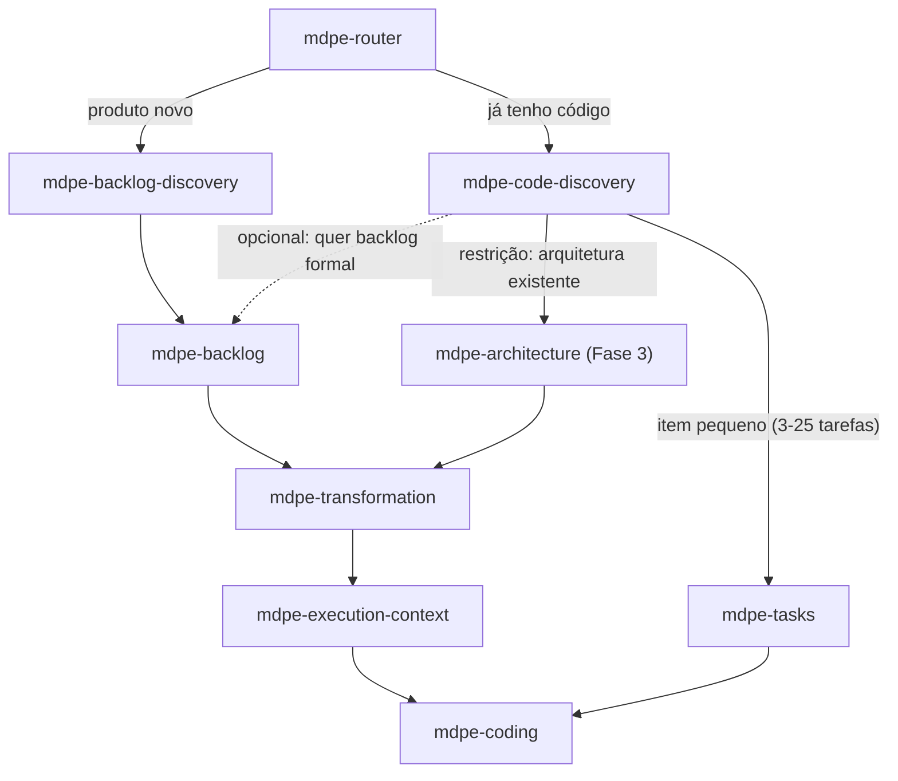

# ADR-001 — Discovery de código existente (brownfield): o "mínimo para seguir"

| Campo | Valor |
|---|---|
| **Status** | Aceito |
| **Data** | 27/08/2026 |
| **Tarefa de origem** | `tasks-v1.md` → Fase 2 → 2.1 |
| **Eixo da rubrica** | Eixo 1 — Cobertura brownfield (baseline **1**, meta **4**) |
| **Implementado por** | Tarefa 2.2 (skill + template) · roteado na 9.2 · verificado na 9.3 |
| **Adoção associada** | A7 (`competitive-analysis.md` §7) — exploração do código antes de propor + inventário brownfield |

---

## 1. Contexto

O MDPE hoje só tem porta de entrada para produto novo. Evidências:

- `skills/mdpe-backlog-discovery/SKILL.md` (*When to use*) abre com *"Starting a new product or a major new
  cycle"*; o *Quality gate* exige **20-30 features**, **≥2 personas**, MoSCoW por consenso e
  hipóteses com critério de validação. Nada disso é obtenível a partir de um repositório existente
  sem inventar (gap-map Lacuna 2.1).
- `skills/mdpe-router/SKILL.md` (*Routing table*) não tem nenhuma linha para "já tenho código"
  (gap-map Lacuna 2.2).
- O fast-path `skills/mdpe-tasks/SKILL.md` (Phase 1 — Framing) deriva objetivo/problema/valor **do
  texto colado**, não da leitura do repositório; sua seção *Inputs* trata contexto técnico como
  "optional technical context" fornecido pelo usuário (gap-map Lacuna 2.3).
- `skills/mdpe-transformation/SKILL.md` (*Inputs*) pede *"Technical context: architecture,
  backend/frontend stack, database, infrastructure, code patterns, conventions"* como texto livre —
  exatamente a informação que um inventário de código produziria, e que hoje o usuário precisa
  digitar de memória.

Consequência prática: adotar MDPE em repositório com código exige (i) rodar uma discovery de produto
novo que não descreve o sistema real, ou (ii) pular para `mdpe-tasks` e descrever o contexto técnico
à mão. A opção (i) é a maior fonte de fabricação do framework (Eixo 8); a (ii) perde rastreabilidade
a arquivos reais (Eixo 1, nível 4).

Referência externa relevante: OpenSpec tem um passo de **exploração que lê o código antes de existir
qualquer artefato** ([getting-started](https://github.com/Fission-AI/OpenSpec/blob/main/docs/getting-started.md)),
e o catálogo TLC mapeia brownfield em documentos de seções fixas — incluindo um doc de
**preocupações/dívida** que nenhum outro framework analisado tem (`competitive-analysis.md` 2.3, 5.15).
Spec-Kit trata brownfield como fase de primeira classe ("Iterative Enhancement", 1.7).

---

## 2. Decisão

### D1 — Nova skill `mdpe-code-discovery` (opção **b**)

Criar uma skill dedicada, **não** um modo dentro de `mdpe-backlog-discovery`. Justificativa contra a rubrica
1.2 na Seção 4 (Alternativas).

### D2 — Ponto no ciclo

`mdpe-code-discovery` é uma **porta de entrada alternativa**, no mesmo nível hierárquico de
`mdpe-backlog-discovery`, e roda **antes** de arquitetura e de transformation:

Regras de posição:

- **Roda antes** de `mdpe-architecture`, `mdpe-transformation` e `mdpe-tasks`. Nunca depois.
- **Roda uma vez por repositório** e é **reexecutada por escopo** (módulo/subpasta) ou quando o
  inventário estiver defasado (ver D7).
- `mdpe-backlog` é **opcional** no caminho brownfield. Só entra quando o usuário quiser trilha
  auditável versionada; não é pré-requisito para transformation em brownfield.

### D3 — Entradas mínimas

| Entrada | Obrigatória | Observação |
|---|:---:|---|
| Caminho da raiz do repositório | **Sim** | Único obrigatório. Sem ele, a skill pergunta e para. |
| Escopo (subpasta/módulo/serviço) | Não | Recomendado em repo grande (>~300 arquivos de código) ou monorepo. Default: raiz. |
| Objetivo declarado do usuário | Não | Se houver ("quero adicionar X", "quero entender Y"), enviesa a profundidade e a ordem de leitura. |
| Documentação existente (README, ADRs, docs/) | Não | Se existir, é **insumo secundário**: o código vence a documentação em caso de divergência. |
| Comandos de build/test conhecidos | Não | Se não informados, são **inferidos dos manifestos reais** ou marcados `desconhecido`. |

### D4 — Saídas mínimas

**Um único artefato**: `docs/brownfield/inventory.md`.

Justificativa da escolha de um arquivo só (e não uma árvore de YAMLs como em discovery/backlog):
alinhamento com A5 (criação preguiçosa — nunca gerar arquivo vazio) e com o Eixo 7 (custo
cognitivo). Um artefato, um template (`brownfield-inventory-template.md` da tarefa 2.2), zero
arquivos-fantasma.

Seções **essenciais** (as 4 que definem o "mínimo para seguir"):

| # | Seção | Conteúdo | Fonte da evidência |
|---|---|---|---|
| 1 | **Stack e runtime** | linguagens, frameworks, gerenciador de pacotes, versões | apenas o que consta de manifestos reais (`package.json`, `*.csproj`, `pom.xml`, `pyproject.toml`, lockfiles) |
| 2 | **Estrutura e módulos** | árvore relevante + camadas **observadas** (não as desejadas) | listagem de diretórios + namespaces/imports |
| 3 | **Convenções observadas** | nomenclatura, organização, padrão de teste, configs de lint/format | arquivos de config reais + amostragem de código |
| 4 | **Mapa de features reconstruídas** | tabela `cf-NNN` (ver D5) | rotas/endpoints, handlers, casos de uso, telas, jobs, entidades |

Seções **condicionais** (só quando há evidência; ausência é resposta válida e não reprova o gate):

| # | Seção | Só quando |
|---|---|---|
| 5 | **Integrações externas** | há client HTTP, SDK, fila, broker ou credencial de serviço no código |
| 6 | **Estratégia de testes** | há testes. Se não houver, registrar "sem testes detectados" na seção 7 em vez de criar a seção 6 vazia |
| 7 | **Preocupações / dívida** | há evidência concreta: `TODO`/`FIXME` reais, ausência de testes, duplicação observada, acoplamento visível, dependência sem manutenção |

Cabeçalho obrigatório do artefato: `repo`, `escopo`, `verificado_em` (data + commit/branch se houver
git), `profundidade` (P/M/G — ver D6).

### D5 — Contrato do mapa de features reconstruídas

Uma linha por feature, no espírito de A10 (localizador feature ↔ arquivo, catálogo de uma linha):

| Campo | Regra |
|---|---|
| `id` | `cf-NNN` (*code feature*), sequencial, estável. Ao promover para backlog formal, vira `feat-NNN` e o `feat` registra `origem: cf-NNN`. |
| `nome` | derivado da linguagem do próprio código (rota, caso de uso, tela), não inventado |
| `descrição` | uma linha: o que o sistema **faz hoje**, em voz de estado atual — não o que deveria fazer |
| `arquivos` | **≥1 caminho real e verificado**. Campo bloqueante: sem caminho, a feature não é emitida. |
| `confiança` | `alta` (rota/entrada + teste + modelo de dados) · `média` (código claro, sem teste) · `baixa` (inferido por nome/estrutura, sem confirmação) |
| `lacunas` | opcional: o que não foi possível determinar (marcar `desconhecido`, nunca preencher por dedução) |

Regras duras:

1. **Todo caminho citado é verificado antes de escrever.** Caminho não verificado não entra.
2. **Proibido `TBD`/placeholder.** Sem dado → `desconhecido` ou campo ausente.
3. **Baixa confiança é resposta melhor que invenção.** Rebaixar a confiança em vez de completar a
   história.
4. **Repositório sem código** → a skill responde "sem código para descobrir", **não emite features**
   e sugere `mdpe-backlog-discovery` (greenfield). Igualmente para escopo apontado que só contém
   configuração/documentação.
5. **Código vence documentação e vence inventário antigo.** Divergência entre README e código é
   registrada na seção 7 (preocupações), com o código como verdade.

### D6 — Profundidade proporcional ao repositório (auto-sizing)

Aplicação de A3 no brownfield — a profundidade sai do tamanho do escopo, não de um número fixo:

| Porte | Sinal | Seções | Mapa de features |
|---|---|---|---|
| **P** | ≲50 arquivos de código | 1-4 (essenciais) | todas as features observadas |
| **M** | ~50-300 | 1-4 + condicionais aplicáveis | todas as features observadas |
| **G** | >300 ou monorepo | 1-4 no escopo declarado | features do escopo; fora do escopo, só a fronteira do módulo |

Não existe mínimo de features. Um repositório com 3 features reconstruídas produz 3 linhas. Leitura
é **sob demanda** (manifestos → estrutura → pontos de entrada → amostragem), não varredura integral:
inventariar não é carregar o repositório inteiro em contexto.

### D7 — Ponte para as fases seguintes

| Situação após o inventário | Rota | Como o inventário é consumido |
|---|---|---|
| Nova feature ou melhoria pequena (~3-25 tarefas) | `mdpe-tasks` | inventário preenche o *optional technical context*; os `arquivos` das `cf-NNN` tocadas viram os **Reference files** concretos das tarefas |
| Feature grande / precisa de trilha auditável | `mdpe-backlog` (opcional) → `mdpe-transformation` | inventário preenche o *Technical context* dos *Inputs* de transformation; `cf-NNN` promovida a `feat-NNN` mantém `origem` |
| Decisão arquitetural em jogo | `mdpe-architecture` (Fase 3) | seções 2, 3 e 7 entram como **restrição**: a arquitetura observada é o ponto de partida, não uma folha em branco |
| Só entender o sistema | fim | o inventário é o entregável |
| Repositório vazio / sem código | `mdpe-backlog-discovery` | nenhuma feature é emitida |

Reconciliação: `verificado_em` torna o inventário datável. Ao retomar, se o repo mudou desde
`verificado_em`, a **evidência atual vence o inventário** (TLC 5.5 / A6) e as seções afetadas são
reinventariadas — não o arquivo todo. A conexão formal com memória de projeto fica para a Fase 7
(ADR-006); este ADR só garante que o artefato é datável e parcialmente atualizável.

---

## 3. Critério de "mínimo para seguir"

Está pronto para seguir para arquitetura/transformation/tasks quando **todos** os cinco itens abaixo
valem:

- [ ] Seção 1 (stack) preenchida a partir de manifesto real, ou marcada `desconhecido` com o motivo.
- [ ] Seção 2 (estrutura/módulos) reflete a árvore observada do escopo declarado.
- [ ] Seção 3 (convenções) lista ≥1 convenção observada com o arquivo/amostra que a evidencia.
- [ ] Seção 4 contém **≥1 feature reconstruída** com ≥1 caminho real e verificado, e nível de confiança.
- [ ] Nenhum caminho citado no artefato é inexistente; nenhum campo contém `TBD`/placeholder.

Repositório sem código satisfaz o gate de outra forma: a resposta "sem código para descobrir" +
encaminhamento ao greenfield **é** a saída correta, e nenhum artefato é criado (A5).

---

## 4. Alternativas consideradas

### (a) Novo modo dentro de `mdpe-backlog-discovery` — **rejeitada**

- `mdpe-backlog-discovery` tem modos, mas eles são **níveis de profundidade da mesma sessão de 5 estágios**
  (*Refined prioritization* aprofunda o estágio 4; *Risk validation*, o estágio 5). Brownfield não é
  mais profundidade: é **direção oposta** — de código para features, em vez de visão para features.
- O *Quality gate* da skill é greenfield por construção (visão, ≥2 personas, 20-30 features, MoSCoW
  ≤30% Must). Tornar cada item condicional deixaria o gate ambíguo e reabriria a pressão de
  preenchimento que a Fase 8 existe para remover — regressão nos Eixos 7 e 8.
- Custo de contexto: acionar brownfield carregaria a skill inteira de discovery de produto (5
  estágios, MoSCoW, RICE, hipóteses, matriz de risco), contra o princípio de carregamento
  proporcional (Eixo 7).
- Roteamento: o `description` do frontmatter é o que faz a skill ser acionada. Um `description`
  único cobrindo "produto novo" **e** "mapear codebase existente" degrada a precisão das duas rotas —
  e o Eixo 1 nível 5 exige justamente "brownfield roteado pelo router".

### (b) Nova skill `mdpe-code-discovery` — **escolhida**

Contra a rubrica 1.2:

| Eixo | Efeito da opção (b) |
|---|---|
| **1 — Brownfield** (1 → 4) | Gatilho de entrada próprio; entradas/saídas mínimas próprias; nível 4 alcançável sem tocar no gate greenfield. |
| **7 — Custo cognitivo** | Carrega só o necessário para inventariar; nenhum mínimo rígido herdado. |
| **8 — Alucinação** | Regras anti-fabricação específicas (caminho verificado, confiança, "sem código para descobrir") ficam no gate da própria skill, sem conviver com um gate que pede 20-30 features. |
| **2 — Arquitetura** | Entrega restrição explícita ("arquitetura observada") para a Fase 3, requisito do nível 5 do Eixo 2. |
| **5 — Grafos** | O mapa `cf-NNN` + `arquivos` é o nó "artefato/arquivo" que A10 pede na Fase 6. |
| Custo | +1 skill no catálogo (8 → 9, mais a Fase 3 e possivelmente a 6.4). Mitigado pelo wiring obrigatório da 9.2, que reprova skill órfã. |

Precedentes externos coerentes: o catálogo TLC delega exploração de código a uma skill vizinha
dedicada (`codenavi`, `competitive-analysis.md` 5.13/5.15) em vez de embutir no fluxo de spec; Spec-Kit
trata brownfield como fase própria (1.7).

### (c) Estender `mdpe-tasks` para ler o repositório — **rejeitada**

Resolveria a Lacuna 2.3, mas amarra o inventário ao fast-path de item único: cada novo item
reinventariaria o repo, sem artefato reutilizável e sem alimentar `mdpe-architecture` nem
`mdpe-transformation`. Sobe o Eixo 1 no máximo para 2 (orientação sem inventário estruturado).

### (d) Adotar delta specs no estilo OpenSpec (ADDED/MODIFIED/REMOVED) — **fora do escopo da v1**

Já registrada como recusa consciente em `competitive-analysis.md` §7: exige uma spec durável de
"estado atual" que só passa a existir depois de A6 + A7. Este ADR entrega o A7 (o inventário), que é
a pré-condição. Reavaliar pós-v1.

---

## 5. O que **NÃO** é obrigatório em brownfield

Seção exigida pelo critério de aceite da tarefa 2.1. Nada abaixo é pré-requisito para seguir de
`mdpe-code-discovery` para arquitetura, transformation ou tasks:

**De `mdpe-backlog-discovery`:**

- Template de visão de produto ("For … Who … The … Is a … That … Unlike …").
- Objetivos estratégicos SMART com baseline/target; anti-objetivos.
- Personas e mapas de empatia (o *Quality gate* pede ≥2 — **dispensado**).
- Brainstorm divergente/convergente de **20-30 features** — **dispensado**; o número de features é o
  número observado no código.
- MoSCoW e a regra de escassez (Must ≤ ~30%).
- Matriz Valor × Esforço, `Score = Valor × (10 − Esforço)`, RICE.
- Hipóteses (valor/usabilidade/viabilidade) e riscos estratégicos com matriz probabilidade × impacto.
- Os artefatos `docs/discovery/00..05-*.yml` e a validação contra
  `discovery-session.schema.json`.

**De `mdpe-backlog`:**

- `docs/backlog/features/feat-XXX.yml`, `backlog-index.yml`, `roadmap.yml` e o
  `cognitive-backlog.schema.json` — **opcionais**, só quando o usuário quiser a trilha versionada.
- Roadmap indicativo por fases (MVP/crescimento/expansão).
- Critérios de valor com baseline/target/método de medição por feature.
- Histórico de versões do backlog.

**Do próprio inventário:**

- Seções condicionais 5, 6 e 7 (ausência de evidência é resposta válida).
- Estimativas de esforço, prioridade ou valor de negócio das features reconstruídas — inventário
  descreve **o que existe**, não o que vale ou o que vem depois.
- Cobertura exaustiva do repositório em porte G (o escopo declarado delimita).
- Diagramas (Mermaid) do sistema — ficam para a Fase 6, quando o modelo de grafo estiver definido.

**Regra geral:** ausência de um item desta lista **nunca** reprova o gate da 2.2. O que reprova é
caminho inexistente, `TBD`, feature sem arquivo de origem e feature emitida em repo sem código.

---

## 6. Consequências

**Positivas**

- Eixo 1 vai de 1 para 3 com este ADR e habilita o 4 na tarefa 2.2 (skill + template).
- `mdpe-transformation` e `mdpe-tasks` passam a receber contexto técnico **derivado de arquivo real**
  em vez de digitado de memória — ganho indireto nos Eixos 8 e 3.
- Entrega a A7 e a pré-condição do rastreio feature ↔ arquivo que a Fase 6 (A10) consome.
- Cria a restrição "arquitetura observada" que a Fase 3 precisa para não propor padrão da moda.

**Negativas / custos**

- +1 skill a manter e a costurar (router, `mdpe-flow.md`, `mapping-commands-to-skills.md`, README) —
  trabalho obrigatório na 9.2, sob pena de skill órfã.
- Inventário é datável e, portanto, **defasa**. Mitigado por `verificado_em` + regra "evidência vence
  inventário" + reinventário parcial por seção.
- Duas portas de entrada aumentam a chance de roteamento errado. Mitigado por `description` disjunto
  ("repositório com código existente" vs "produto novo") e por uma linha explícita na *Routing table*.

**Neutras**

- `mdpe-backlog` deixa de ser passagem obrigatória no caminho brownfield. Não muda o caminho
  greenfield.
- Convenção de id `cf-NNN` entra no escopo da padronização de ids da tarefa 9.1.

---

## 7. Verificação contra os cenários de teste da tarefa 2.1

| Cenário | Onde é atendido |
|---|---|
| + Entradas mínimas, saídas mínimas e ponto no ciclo (antes de transformation) | D3, D4, D2 (diagrama + regras de posição) |
| + Critério explícito de "mínimo para seguir" com o dispensável em brownfield | Seção 3 (gate de 5 itens) + Seção 5 (lista do não-obrigatório) |
| + Decisão (a) ou (b) justificada contra a rubrica 1.2 | Seção 4 — (b) escolhida, com tabela eixo a eixo |
| − Não obriga discovery completo (personas/MoSCoW) | Seção 5 dispensa explicitamente personas, MoSCoW, 20-30 features, Valor×Esforço, RICE, hipóteses e riscos |
| − ADR tem seção de não-obrigatório | Seção 5 |

---

## 8. Fontes

**Internas (lidas para este ADR):** `skills/mdpe-backlog-discovery/SKILL.md` · `skills/mdpe-backlog/SKILL.md` ·
`skills/mdpe-transformation/SKILL.md` (*Inputs*) · `skills/mdpe-tasks/SKILL.md` ·
`skills/mdpe-router/SKILL.md` · `docs/analysis/baseline-gap-map.md` (Lacunas 2.1-2.3) ·
`docs/analysis/evaluation-rubric.md` (Eixos 1, 2, 5, 7, 8) · `docs/analysis/competitive-analysis.md`
(2.3, 5.13, 5.15, 1.7, A3, A5, A6, A7, A10).

**Externas:** OpenSpec — [getting-started](https://github.com/Fission-AI/OpenSpec/blob/main/docs/getting-started.md)
(passo de exploração que lê o código antes de propor) ·
[overview](https://github.com/Fission-AI/OpenSpec/blob/main/docs/overview.md) (specs como estado
atual; "enablers, not gates") · Spec-Kit —
[README](https://github.com/github/spec-kit/blob/main/README.md) (brownfield como fase de primeira
classe) · TLC Spec-Driven —
[SKILL.md v3.3.0](https://github.com/tech-leads-club/agent-skills/blob/main/packages/skills-catalog/skills/%28development%29/tlc-spec-driven/SKILL.md)
(auto-sizing, criação preguiçosa, memória com reconciliação, composição com skill de exploração de
código) e [snapshot LobeHub](https://lobehub.com/skills/tech-leads-club-agent-skills-tlc-spec-driven)
(as 7 seções de mapeamento de brownfield, incluindo preocupações/dívida).

> Conteúdo parafraseado a partir das fontes para conformidade de licenciamento; URLs verificadas em
> 27/08/2026 conforme `competitive-analysis.md`.
