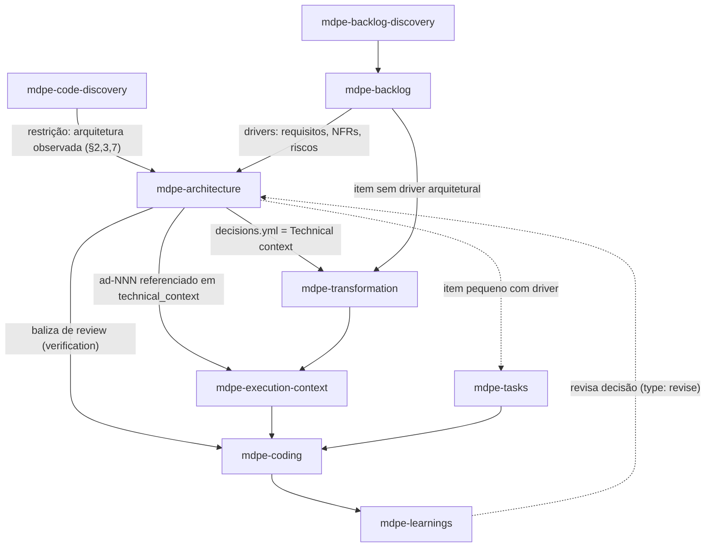

# ADR-002 — Definição de padrões de arquitetura a partir do backlog (`mdpe-architecture`)

| Campo | Valor |
|---|---|
| **Status** | Aceito |
| **Data** | 27/08/2026 |
| **Tarefa de origem** | `tasks-v1.md` → Fase 3 → 3.1 |
| **Eixo da rubrica** | Eixo 2 — Definição de arquitetura (baseline **1**, meta **4**) |
| **Implementado por** | Tarefa 3.2 (skill + templates) · roteado na 9.2 · verificado na 9.3 |
| **Adoções associadas** | Spec-Kit 1.1 (princípios do projeto) · TLC 5.14 (arquitetura como artefato, não dimensão de review) · A4 (cadeia de verificação de conhecimento) · A5 (criação preguiçosa) |
| **Depende de** | ADR-001 (inventário brownfield como restrição) |

---

## 1. Contexto

No MDPE de hoje **ninguém decide arquitetura**. Ela aparece de três formas, todas insuficientes:

1. **Como dimensão de review, depois do fato.** `skills/mdpe-coding/SKILL.md` (Fase 3, dimensão 2):
   *"Architecture — respects patterns, boundaries, and dependency direction"*. O review cobra
   conformidade a uma baliza que **nunca foi escrita** — na prática, cada revisão reconstrói do zero
   qual é o padrão (gap-map Lacuna 1.1).
2. **Como texto livre sem origem.** `skills/mdpe-transformation/SKILL.md` (*Inputs*) pede *"Technical
   context: architecture, backend/frontend stack, database, infrastructure, code patterns,
   conventions"*, e `skills/mdpe-tasks/SKILL.md` (*Inputs*) pede *"Optional technical context: stack,
   architecture/patterns, conventions"*. Em ambos, o usuário digita de memória e nada rastreia a
   decisão a um requisito (gap-map Lacuna 1.2).
3. **Como valor chumbado no template.**
   `skills/mdpe-execution-context/assets/templates/execution-context-template.yml` traz
   `technical_context.architecture.overall_pattern: "Clean Architecture with DDD"` e
   `target_layer: "Infrastructure Layer - Persistence"` como se fossem fatos do projeto. É um padrão
   pré-decidido por template, sem driver e sem alternativa — o oposto de uma decisão.

Somado a isso, há **referências fantasma de arquitetura**: `mdpe-microtask-template.yml` cita
`docs/architecture/decision.md` como input de exemplo e `mdpe-tracking.yml` cita
`docs/adr/ADR-005-user-schema.md` como artefato de exemplo. Nenhuma skill produz esses arquivos
(gap-map Seção C, última linha). O framework **consome** decisões de arquitetura que ele não sabe
gerar.

O lado do backlog tem o insumo e não tem o consumidor: `skills/mdpe-backlog/SKILL.md` §4 registra por
feature *"Technical considerations (architecture, security, scalability)"*, riscos estratégicos e
critérios de valor — material que deveria virar decisão e hoje morre no YAML.

Referência externa: os cinco frameworks do benchmark tratam decisão de arquitetura como artefato
próprio; o MDPE é o único com `○` na linha *"Decisões de arquitetura como artefato próprio"*
(`competitive-analysis.md` §6). Spec-Kit estabelece princípios de projeto uma vez e avalia as fases
seguintes contra eles (1.1) e gera plano técnico na fase `/plan`; o catálogo TLC coloca arquitetura
como **família de skills** (`coupling-analysis`, `modular-decomposition`, `tactical-ddd`,
`legacy-migration-planner`), justamente para não reduzi-la a item de checklist de review (5.14).

---

## 2. Decisão

### D1 — Nova skill `mdpe-architecture`

Criar uma skill dedicada que **produz decisões de arquitetura**, em vez de estender a dimensão de
review de `mdpe-coding` ou o campo de texto livre de `mdpe-transformation`. Justificativa contra a
rubrica 1.2 na Seção 4.

### D2 — Ponto no ciclo: entre backlog e transformation, como *enabler*, não *gate*

Regras de posição:

- **Roda depois** de backlog ou de `mdpe-code-discovery`; **antes** de transformation, tasks e coding.
- **Não é passagem obrigatória.** Item sem driver arquitetural vai direto do backlog para
  transformation. Adotar a postura "enablers, not gates" do OpenSpec: a skill existe para destravar,
  não para criar pedágio.
- **Escopo de execução variável**, não "uma vez por feature": ver D3.
- **Reentrante.** `mdpe-learnings` e um review que colide com uma decisão podem devolver o fluxo para
  cá, gerando uma decisão `type: revise` — nunca uma violação silenciosa (D9).

### D3 — Gatilho: existe **driver**, existe decisão

Uma decisão de arquitetura só nasce de um **driver**: um item do backlog, requisito não-funcional,
risco ou dívida inventariada que **não é satisfeito pelas decisões já registradas**. Sem driver, não
há decisão e não há artefato (A5 — criação preguiçosa).

Drivers reconhecidos, todos com origem em artefato existente:

| Driver | Fonte no MDPE |
|---|---|
| Requisito funcional que muda a fronteira do sistema | `feat-XXX.yml` → descrição, user stories |
| Requisito não-funcional | `feat-XXX.yml` → *technical considerations* (arquitetura, segurança, escalabilidade); objetivos estratégicos com baseline/target |
| Risco estratégico ou técnico | `feat-XXX.yml` → riscos estratégicos com mitigação |
| Meta de valor com número | `feat-XXX.yml` → critérios de valor (baseline/target/método) |
| Dívida ou fragilidade observada | `docs/brownfield/inventory.md` §7 (preocupações/dívida) |
| Arquitetura existente que precisa ser fixada como baliza | `inventory.md` §2 e §3 (estrutura/camadas e convenções observadas) |
| Decisão anterior que a execução invalidou | `{id}-code-review.yml`, learnings, ou aprendizado agregado |

Escopo da execução, derivado do driver — não da feature:

- `system` — decisão foundacional que vale para o produto todo (estilo, camadas, fronteiras).
  Tipicamente uma rodada só, no início ou na adoção em brownfield.
- `feature` — a feature levanta um driver novo (ex.: precisa de assíncrono, precisa de cache).
- `module` — vale para um módulo/serviço específico do escopo inventariado.

### D4 — Entradas

| Entrada | Obrigatória | Observação |
|---|:---:|---|
| ≥1 driver com fonte rastreável | **Sim** | `feat-XXX` (id + campo), `cf-NNN`, seção do inventário, ou id de risco. Sem driver a skill **não decide**: responde que não há decisão a tomar. |
| Decisões já registradas (`decisions.yml`) | **Sim, quando existirem** | Uma nova decisão precisa saber o que já foi decidido, sob pena de contradizer o próprio projeto. |
| `docs/brownfield/inventory.md` §2, §3, §7 | **Sim, quando existir** | Em brownfield é **restrição vinculante**, não sugestão (D7). |
| Restrições de contexto (prazo, capacidade, stack mandatória, compliance) | Não | Se informadas, entram como driver de tipo restrição e aparecem em `consequences`. |
| Documentação/ADRs preexistentes do projeto | Não | Insumo secundário. Divergência com o código: o código vence (regra herdada do ADR-001). |

### D5 — Saídas

**Artefato principal (sempre):** `docs/architecture/decisions.yml` — o conjunto versionado de
decisões do projeto, uma entrada `ad-NNN` por decisão.

**Artefato condicional:** `docs/adr/adr-NNN-{slug}.md` — ADR narrativo, criado **somente** quando a
decisão é `adopt`, `deviate` ou `revise` **e** houve ≥2 alternativas reais em disputa. Decisão
`ratify` sem alternativa vive só como entrada no YAML; gerar um ADR narrativo para ela seria arquivo
de fachada (A5).

Campos da entrada de decisão (contrato que a tarefa 3.2 implementa):

| Campo | Obrigatoriedade | Conteúdo |
|---|:---:|---|
| `id` | essencial | `ad-NNN`, sequencial e estável |
| `title` | essencial | a decisão em uma linha, na voz do que foi decidido |
| `type` | essencial | `ratify` · `adopt` · `deviate` · `revise` · `defer` (D7) |
| `status` | essencial | `proposed` · `accepted` · `superseded` |
| `date` | essencial | data da aceitação |
| `scope` / `scope_ref` | essencial | `system` · `feature` · `module` + o id/caminho do escopo |
| `drivers[]` | essencial, ≥1 | cada um: `source` (id do artefato), `requirement` (o que exige a decisão), `evidence` (campo/caminho real). **Campo bloqueante** — ver D6 |
| `decision` | essencial | um parágrafo, presente imperativo ("o domínio não referencia infraestrutura") |
| `implications[]` | essencial, ≥1 | tipadas; é o que a jusante consome (D8) |
| `verification` | essencial | como se confere conformidade: caminho que deve existir, import proibido, teste nomeado, comando. É o que `mdpe-coding` executa (D9) |
| `alternatives[]` | condicional (obrigatória em `adopt`/`deviate`/`revise`) | ≥1 alternativa real + por que foi rejeitada, **contra o driver** |
| `consequences` | essencial | positivas / negativas-custos / neutras |
| `nfr_target` | condicional | quando o driver traz número (baseline/target), a decisão repete o número que promete servir |
| `supersedes` / `superseded_by` | condicional | trilha de revisão |
| `adr` | condicional | caminho do ADR narrativo, quando existir |
| `spike` | condicional (obrigatória em `defer`) | pergunta a responder, time-box, quem decide depois |

Um bloco `principles[]` no topo de `decisions.yml` é **opcional** e admitido apenas para princípios
que tenham driver real (Spec-Kit 1.1 adaptado). A memória durável de princípios e convenções do
projeto é escopo do ADR-006 (Fase 7); este ADR não a implementa, só evita ocupar o lugar dela.

### D6 — Regra dura: decisão sem driver rastreável não é emitida

`drivers[]` é campo bloqueante, no mesmo espírito do campo `files` das features reconstruídas no
ADR-001. Consequências operacionais:

1. **Padrão sem driver não entra.** "Usar CQRS", "adotar hexagonal", "microserviços" sem um requisito,
   NFR ou risco que os force é rejeitado no gate. Este é o mecanismo anti-padrão-da-moda exigido pelo
   cenário negativo da tarefa 3.2.
2. **`evidence` aponta para artefato real** (`feat-003.yml` → `technical_considerations.scalability`,
   `inventory.md` §7 item 2). Caminho inexistente reprova, como no ADR-001.
3. **Viabilidade não verificada → `defer`, não decisão.** Aplicação da cadeia de verificação de
   conhecimento (A4 / TLC 5.8): código → docs do projeto → documentação oficial → sinalizar incerteza.
   Não se inventa capacidade de framework para sustentar uma decisão; `defer` + spike é a saída
   correta, e o spike já existe como conceito em `mdpe-transformation` Fase 4.
4. **Sem `TBD`.** Sem dado → `unknown` ou campo ausente.

### D7 — Greenfield e brownfield no mesmo contrato, via `type`

| `type` | Quando | Exige `alternatives` | Regra |
|---|---|:---:|---|
| `ratify` | A arquitetura observada no inventário é mantida | Não | Torna explícito o que estava implícito. Em brownfield é o tipo mais comum e **o ponto de partida default**. |
| `adopt` | Decisão nova, sem precedente no repo | Sim | Greenfield típico; em brownfield, só para território novo. |
| `deviate` | Afasta-se da arquitetura observada | Sim | **Só com driver nomeado + nota de migração** (o que acontece com o código que segue o padrão antigo). |
| `revise` | Substitui uma decisão anterior | Sim | Preenche `supersedes`; a anterior vira `superseded`. |
| `defer` | Viabilidade ou trade-off não determinável agora | Não | Exige `spike` com pergunta e time-box. Nunca decidir por dedução. |

Regra de brownfield: **não propor padrão que o repositório não tem sem driver e sem caminho de
migração.** As seções 2, 3 e 7 do inventário entram como restrição vinculante (ADR-001 D7); a dívida
da seção 7 é driver legítimo de `deviate`, e a ausência de driver mantém o `ratify`.

Regra de greenfield: sem inventário, o ponto de partida é folha em branco — o que **aumenta** a
exigência de `alternatives` e `consequences`, porque não há prática observada para ancorar.

### D8 — Como a decisão vira insumo concreto (o núcleo desta ADR)

`implications[]` é tipada exatamente para ter destino a jusante. Sem essa tabela, `mdpe-architecture`
seria mais um documento que ninguém lê.

| Tipo de `implication` | Conteúdo | Destino concreto |
|---|---|---|
| `layers` | camadas e o que mora em cada uma | agrupamento por camada lógica do passo TG-01 (Foundation → Domain → Infrastructure → Application → API → Frontend → Tests) e `metadata.layer` do contexto de execução |
| `boundaries` | direção de dependência, imports proibidos, fronteira de módulo | `technical_context.architecture.layer_dependencies`; e vira **regra verificável** no review (D9) |
| `structure` | diretórios e onde artefatos novos nascem | `technical_context.architecture.directory_structure`; *Reference files* das tarefas de `mdpe-tasks` |
| `patterns` | padrão aplicável + justificativa contra o driver | `technical_context.architecture.architectural_patterns[].justification` — o campo `justification` deixa de ser preenchido de improviso |
| `stack` | tecnologia + versão, **só se verificada** | `technical_context.technology_stack` |
| `conventions` | nomenclatura e organização decorrentes da decisão | `technical_context.code_conventions` |
| `derived_work` | trabalho que a decisão cria (ex.: tabela de outbox, camada de anticorrupção) | candidatos de microtask na Fase 1 de transformation; entram como microtask normal, com IOQD |

Efeitos diretos e verificáveis nos artefatos existentes:

1. `mdpe-transformation` *Inputs* — o item *"Technical context: architecture, …"* passa a ser
   **referência a `docs/architecture/decisions.yml`** (mais o inventário em brownfield), em vez de
   texto livre digitado de memória. Fecha a Lacuna 1.2.
2. `execution-context-template.yml` — `technical_context.architecture.overall_pattern` deixa de ser
   `"Clean Architecture with DDD"` chumbado e passa a carregar `source: ad-NNN`. Sem `ad-NNN`
   aplicável, o campo fica vazio em vez de herdar o exemplo.
3. `docs/architecture/decisions.yml` e `docs/adr/adr-NNN-{slug}.md` tornam **reais** as referências
   fantasma de arquitetura. São **quatro**, não duas: além das já registradas na Seção C do gap-map —
   `mdpe-microtask-template.yml` (`docs/architecture/decision.md`, com `status: "exists"`) e
   `mdpe-tracking.yml` (`docs/adr/ADR-005-user-schema.md`) — a verificação para este ADR encontrou
   duas ainda não catalogadas, ambas em
   `skills/mdpe-execution-context/assets/templates/environment-setup-template.yml`:
   `docs/architecture/patterns/aggregate.md` (com `reviewed: true`) e
   `docs/architecture/clean-architecture.md`. A convenção adotada aqui é `adr-NNN-{slug}.md` em
   minúsculas e `docs/architecture/decisions.yml` como registro; alinhar os quatro exemplos é
   trabalho da tarefa 9.1 (padronização de ids e links), e as duas novas devem ser somadas à Seção C
   do gap-map.
4. `mdpe-tasks` (fast-path) — no cabeçalho *Item summary*, item com driver arquitetural cita os
   `ad-NNN` aplicáveis; item sem driver não ganha seção nenhuma.

### D9 — Contrato de integração com `mdpe-coding`: validar, não redecidir

Este é o ponto que impede a duplicação apontada pelo cenário negativo da tarefa 3.1. A dimensão 2 do
review **não é substituída nem duplicada — é aterrada**:

| Antes | Depois |
|---|---|
| *"Architecture — respects patterns, boundaries, and dependency direction"*, sem baliza escrita | "Conforma às decisões `ad-NNN` em escopo, conferidas pelo campo `verification` de cada uma" |

Regras:

- O review **executa/inspeciona `verification`** e cita o `ad-NNN` em cada achado. Achado sem
  decisão citada volta a ser opinião.
- **Severidade derivada do tipo de implicação:** violar `boundaries` é **Blocker** (quebra direção de
  dependência); violar `patterns`, `structure` ou `conventions` é **Major** por default.
- **Sem `ad-NNN` em escopo**, a dimensão 2 continua valendo no modo atual (heurístico), e o review
  **registra a ausência** — o que gera o driver para uma rodada de `mdpe-architecture` em vez de
  seguir adivinhando.
- **Código que precisa violar uma decisão** rota por `revise` (nova `ad-NNN` com `supersedes`), nunca
  por desvio silencioso aprovado no review.

A obrigação de **evidência** de que a verificação rodou é escopo da Fase 4 (ADR-003 + template de
validação). Aqui só se define **o que** verificar; **como provar** que verificou é lá.

### D10 — Auto-sizing e criação preguiçosa

Aplicação de A3/A5 a esta skill, para não repetir o erro dos mínimos rígidos ("20-30 features",
"15-25 microtasks"):

- **Não existe número mínimo nem máximo de decisões.** A contagem é a contagem de drivers.
- **Zero drivers → zero artefato.** A resposta correta é "nenhuma decisão de arquitetura a tomar para
  este escopo; as decisões vigentes cobrem o caso" (citando os `ad-NNN` vigentes, se houver).
- **ADR narrativo é condicional** (D5). O YAML é o registro; o Markdown é a narrativa de quem tinha
  alternativas em disputa.
- **Uma decisão por driver-conjunto, não por microtask.** Decisão de arquitetura no nível de microtask
  é sinal de decomposição errada, não de arquitetura.

### D11 — Costuras reservadas para as fases seguintes

Declaradas aqui para que a Fase 3 não invada escopo alheio nem crie artefato órfão:

| Fase | Costura que este ADR deixa pronta |
|---|---|
| **4** — loop/fidelidade | `verification` é o insumo da dimensão de arquitetura no relatório de validação com evidência (ADR-003) |
| **5** — métricas | métricas **opcionais** deriváveis de `decisions.yml`: nº de `defer` abertos, nº de decisões `superseded`, achados de conformidade por `ad-NNN`. Nenhuma exige tooling novo (A9) |
| **6** — grafo | `ad-NNN` é o tipo de nó "decisão de arquitetura" do modelo de 6.1; arestas `derives-from` (`feat-XXX` → `ad-NNN`), `constrains` (`ad-NNN` → microtask via `derived_work`/`boundaries`), `validates` (review → `ad-NNN`) |
| **7** — memória | `decisions.yml` é a camada "log de decisões" que o ADR-006 vai formalizar (A6 / TLC 5.5). Ids `ad-NNN` estáveis e `date` já tornam o artefato retomável |
| **9** — wiring | rota no `mdpe-router`, lugar no `mdpe-flow.md`, linha em `mapping-commands-to-skills.md`, tabela do README; e alinhamento das duas referências fantasma (D8.3) |

---

## 3. Critério de "arquitetura suficiente para seguir"

Pode seguir para transformation/tasks quando **todos** valem:

- [ ] Todo driver identificado no escopo está **coberto por uma decisão** ou explicitamente
      **diferido** (`type: defer` com spike).
- [ ] Toda decisão emitida tem ≥1 `driver` com `source` + `evidence` apontando artefato e campo reais.
- [ ] Toda decisão tem ≥1 `implication` tipada e um `verification` conferível.
- [ ] Decisões `adopt`/`deviate`/`revise` têm ≥1 alternativa real rejeitada **contra o driver**, e
      `consequences` com custos, não só benefícios.
- [ ] Em brownfield: nenhuma decisão contradiz o inventário sem ser `deviate` com nota de migração.
- [ ] Nenhum caminho citado é inexistente; nenhum campo contém `TBD`.

Escopo sem driver satisfaz o gate de outra forma: a resposta "nenhuma decisão a tomar" **é** a saída
correta e nenhum artefato é criado.

---

## 4. Alternativas consideradas

### (a) Manter arquitetura só como dimensão de review em `mdpe-coding` — **rejeitada**

É o baseline (nota 1, Lacuna 1.1). Avalia conformidade a uma baliza inexistente, o que produz
julgamento reconstruído a cada review — variável entre sessões e não rastreável a requisito. Não
alcança nem o nível 2 do Eixo 2, que já exige espaço de registro.

### (b) Adicionar uma fase de arquitetura dentro de `mdpe-transformation` — **rejeitada**

- Transformation é **por feature** e tático (decompor, sequenciar, priorizar). Decisão foundacional
  (estilo, camadas, fronteiras) tem escopo `system` e atravessa features: rodar por feature ou
  duplicaria a decisão N vezes ou a esconderia dentro da primeira feature transformada.
- A skill já roda 5 blocos (TL-01..04 + TG-01); somar arquitetura piora o Eixo 7 (custo cognitivo) e
  faz carregar decisão arquitetural em toda decomposição, inclusive nas que não têm driver.
- O consumidor natural da saída **é** transformation. Produtor e consumidor na mesma skill elimina o
  contrato explícito que a Lacuna 1.2 exige.

### (c) Estender o campo *technical considerations* de `mdpe-backlog` — **rejeitada**

O campo existe (`feat-XXX.yml` §4) e é a **fonte de drivers**, não o lugar da decisão: é artefato
estratégico de PO, sem `alternatives`, `consequences`, `verification` nem trilha de revisão, e não é
lido a jusante como baliza. Confundir driver com decisão apaga exatamente o rastreio que o Eixo 2
mede. Elevaria o eixo no máximo a 2.

### (d) Nova skill `mdpe-architecture` — **escolhida**

Contra a rubrica 1.2:

| Eixo | Efeito da opção (d) |
|---|---|
| **2 — Arquitetura** (1 → 4) | Artefato de decisão rastreado a item do backlog + transformation/execution-context referenciando a saída = definição literal do nível 4. Nível 5 fica ao alcance: brownfield respeitado (D7) e review validando contra as decisões (D9) já estão contratados; falta só a consulta à memória (Fase 7). |
| **1 — Brownfield** | Dá destino ao inventário: `ratify`/`deviate` transformam "arquitetura observada" em baliza explícita, requisito do nível 5 do Eixo 1. |
| **3 — Fidelidade** | `verification` por decisão dá ao review critério objetivo em vez de leitura de intenção. |
| **5 — Grafos** | Cria o nó `ad-NNN` que o modelo de 6.1 pede para fechar a cadeia backlog → arquitetura → microtask → artefato. |
| **7 — Custo cognitivo** | Risco real (+1 skill, +2 templates). Mitigado por D10: sem driver, sem artefato; ADR narrativo condicional. |
| **8 — Alucinação** | `drivers[]` bloqueante (D6) e `defer` em vez de decisão inventada (A4) atacam a forma mais caríssima de fabricação: padrão arquitetural inventado, que contamina design → tasks → implementação em cascata (TLC 5.8). |
| Custo | Catálogo vai a 10 skills (8 originais + `mdpe-code-discovery` + esta). Wiring obrigatório na 9.2, que reprova skill órfã. |

Precedente externo: é o consenso dos cinco frameworks analisados
(`competitive-analysis.md` §6, linha *"Decisões de arquitetura como artefato próprio"*: MDPE é o
único `○`).

### (e) Replicar a família de skills de arquitetura do TLC (5.14) — **fora do escopo da v1**

`coupling-analysis`, `modular-decomposition`, `tactical-ddd`, `legacy-migration-planner` como skills
separadas é a direção certa em maturidade, e errada em sequência: sem um registro de decisões
compartilhado, cada uma produziria análise sem lugar para pousar. Esta ADR entrega o registro; a
especialização por técnica fica pós-v1 e, se vier, cada skill emite `ad-NNN` no mesmo contrato.

### (f) Constituição de projeto no estilo Spec-Kit (1.1) como artefato próprio — **parcialmente adotada**

Princípios estáveis do projeto são úteis, mas são **memória**, não decisão pontual: o lugar deles é o
ADR-006 (Fase 7), onde já está prevista a memória de projeto com convenções e armadilhas (A6). Aqui
adota-se só a parte que não pode esperar: um `principles[]` opcional, admitido apenas com driver real
(D5). Evita duplicar a Fase 7 e evita, também, um bloco de princípios genéricos gerados por IA — que
seria o próprio problema da Fase 8 reintroduzido.

---

## 5. O que **NÃO** é obrigatório

Nada abaixo é pré-requisito para seguir de `mdpe-architecture` para transformation/tasks:

**De prática de arquitetura corporativa:**

- Diagramas C4 (contexto/container/componente/código) ou UML. Visualização é escopo da Fase 6; até
  lá, uma decisão pode ser inteiramente textual.
- Workshop formal de atributos de qualidade (ATAM/QAW), cenários de qualidade em notação formal,
  utility tree.
- Catálogo exaustivo de requisitos não-funcionais. Só entra o NFR que **é driver** de uma decisão.
- Tech radar, avaliação de fornecedores, comparativo de mercado, prova de conceito — a menos que
  saiam de um `defer` com spike.
- Documento de arquitetura de software (SAD) ou template pesado tipo arc42/4+1.
- Modelagem de domínio, bounded contexts e estimativa de capacidade quando nenhum driver os exige.

**Do próprio artefato:**

- ADR narrativo em Markdown para toda decisão (condicional — D5).
- `alternatives` em decisão `ratify` (não havia disputa: o repositório já decidiu).
- `nfr_target` quando o driver não traz número.
- Bloco `principles[]`.
- Decisão para escopo sem driver — inclusive item pequeno do fast-path `mdpe-tasks`, que na maioria
  dos casos não terá nenhuma.

**Do fluxo:**

- Rodar `mdpe-architecture` para toda feature. Passagem é condicional ao driver (D2, D3).
- Ter backlog formal: em brownfield, `mdpe-code-discovery` + inventário bastam como origem de drivers
  (ADR-001 D7), sem `docs/backlog/`.
- Reabrir decisões vigentes a cada feature. Elas são entrada, não pauta.

**Regra geral:** ausência de item desta lista **nunca** reprova o gate. O que reprova é decisão sem
driver rastreável, alternativa ausente em `adopt`/`deviate`/`revise`, `verification` inconferível,
caminho inexistente, `TBD`, e decisão que contradiz o inventário sem ser `deviate` com migração.

---

## 6. Consequências

**Positivas**

- Eixo 2 vai de 1 para 3 com este ADR e habilita o 4 na tarefa 3.2.
- Fecha as Lacunas 1.1 e 1.2 e dá produtor às quatro referências fantasma de arquitetura (duas da
  Seção C + duas descobertas aqui, em `environment-setup-template.yml`).
- Remove o padrão chumbado no `execution-context-template.yml`: `overall_pattern` passa a ter origem
  (`ad-NNN`) ou a ficar vazio.
- A dimensão 2 do review ganha baliza objetiva (`verification`), com ganho indireto no Eixo 3.
- Entrega o nó `ad-NNN` que a Fase 6 precisa e a camada de log de decisões que a Fase 7 vai formalizar.
- `drivers[]` bloqueante ataca a fabricação de maior custo: padrão arquitetural inventado propaga em
  cascata por design, tasks e implementação.

**Negativas / custos**

- +1 skill e +2 templates a manter e costurar (router, `mdpe-flow.md`,
  `mapping-commands-to-skills.md`, README) — obrigatório na 9.2, sob pena de skill órfã.
- Passagem condicional é mais difícil de acertar que passagem obrigatória: existe risco de pular a
  skill quando havia driver. Mitigação: transformation/coding **registram a ausência de `ad-NNN`
  aplicável** em vez de improvisar contexto técnico (D8.1, D9).
- Decisões envelhecem. Mitigação: `revise`/`supersedes` + reentrância a partir de learnings (D2);
  reconciliação durável fica para o ADR-006.
- Duas convenções de id novas (`ad-NNN` e `adr-NNN-{slug}.md`) entram no escopo de padronização da 9.1.
- `verification` acrescenta trabalho a cada decisão. É deliberado: é o campo que separa decisão de
  intenção, e sem ele o nível 5 do Eixo 2 é inalcançável.

**Neutras**

- `mdpe-coding` mantém as 7 dimensões de review; a dimensão 2 muda de fonte, não de existência.
- Caminho greenfield e caminho brownfield convergem no mesmo artefato, diferindo por `type`.
- Nenhum artefato existente é removido; `feat-XXX.yml` mantém *technical considerations* como fonte
  de drivers.

---

## 7. Verificação contra os cenários de teste da tarefa 3.1

| Cenário | Onde é atendido |
|---|---|
| + ADR define gatilho, entradas, saídas de arquitetura e onde encaixam no fluxo | D3 (gatilho por driver), D4 (entradas), D5 (saídas), D2 (diagrama + regras de posição) |
| + Mostra como uma decisão vira insumo concreto para transformation | D8 — tabela `implications` → destino, com os 4 efeitos verificáveis (Inputs de transformation, `overall_pattern` com `source`, artefatos fantasma com produtor, cabeçalho de `mdpe-tasks`) |
| + Cobre greenfield e brownfield (respeitando arquitetura existente) | D7 (`ratify`/`deviate` + restrição vinculante do inventário) e D4 (inventário obrigatório quando existe) |
| − Não duplica a dimensão "architecture" de `mdpe-coding` sem integrá-la | D9 — contrato de integração: o review passa a validar contra `ad-NNN` via `verification`, com severidade derivada e rota `revise`; a dimensão não é recriada |
| − Decisão sem rastreio a item do backlog reprova | D6 (campo `drivers[]` bloqueante, com `source` + `evidence` em artefato real) e Seção 3 (gate) |

---

## 8. Fontes

**Internas (lidas para este ADR):** `skills/mdpe-coding/SKILL.md` (Fase 3, dimensão 2; Fase 2, 6
dimensões) · `skills/mdpe-transformation/SKILL.md` (*Inputs*; Fase 1; Fase 4 spikes; TG-01 camadas) ·
`skills/mdpe-backlog/SKILL.md` (§4 features, *technical considerations*, riscos, critérios de valor) ·
`skills/mdpe-execution-context/assets/templates/execution-context-template.yml`
(`technical_context.architecture`, `overall_pattern` chumbado) ·
`skills/mdpe-execution-context/assets/templates/environment-setup-template.yml` (referências
fantasma `docs/architecture/patterns/aggregate.md` e `docs/architecture/clean-architecture.md`) ·
`skills/mdpe-transformation/assets/templates/mdpe-microtask-template.yml` (input de exemplo
`docs/architecture/decision.md`) · `skills/mdpe-learnings/assets/templates/mdpe-tracking.yml`
(artefato de exemplo `docs/adr/ADR-005-user-schema.md`) · `skills/mdpe-tasks/SKILL.md`
(*Inputs*, Phase 5) · `skills/mdpe-code-discovery/SKILL.md` (seções do inventário, regras
anti-fabricação, tabela *Next skill*) · `docs/adr/adr-001-brownfield-discovery.md` (D5, D7, §5) ·
`docs/analysis/baseline-gap-map.md` (Lacunas 1.1, 1.2; Seção C) ·
`docs/analysis/evaluation-rubric.md` (Eixo 2 e âncoras dos Eixos 1, 3, 5, 7, 8) ·
`docs/analysis/competitive-analysis.md` (1.1, 5.8, 5.14, §6, A3-A6, A9-A11).

**Externas:** Spec-Kit —
[README](https://github.com/github/spec-kit/blob/main/README.md) (constituição do projeto; fase
`/plan` como plano técnico) e [metodologia](https://github.com/github/spec-kit/blob/main/spec-driven.md) ·
TLC Spec-Driven — [catálogo de arquitetura](https://github.com/tech-leads-club/agent-skills/tree/main/packages/skills-catalog/skills/%28architecture%29)
(arquitetura como família de skills) e
[SKILL.md v3.3.0](https://github.com/tech-leads-club/agent-skills/blob/main/packages/skills-catalog/skills/%28development%29/tlc-spec-driven/SKILL.md)
(cadeia de verificação de conhecimento; criação preguiçosa; log de decisões `AD-NNN`) ·
OpenSpec — [overview](https://github.com/Fission-AI/OpenSpec/blob/main/docs/overview.md)
("enablers, not gates"; specs como fonte de verdade) ·
OSpec — [clawplays/ospec](https://github.com/clawplays/ospec) (laço plan → act → verify, contexto do
ADR-003).

> Conteúdo parafraseado a partir das fontes para conformidade de licenciamento; URLs reaproveitadas de
> `competitive-analysis.md`, verificadas em 27/08/2026.
