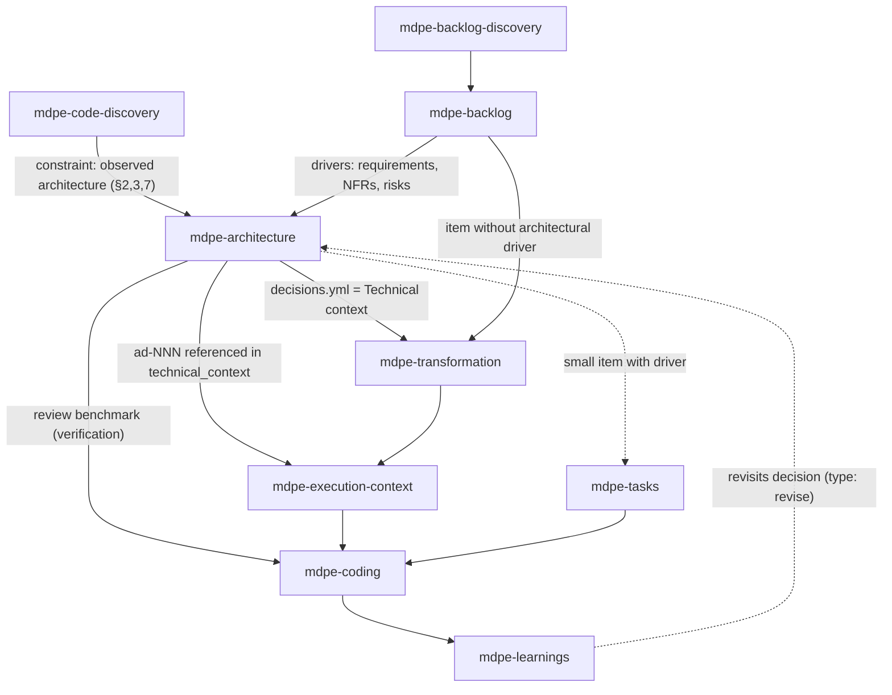

# ADR-002 — Defining architecture standards from the backlog (`mdpe-architecture`)

| Field | Value |
|---|---|
| **Status** | Accepted |
| **Date** | 27/08/2026 |
| **Source task** | `tasks-v1.md` → Phase 3 → 3.1 |
| **Rubric axis** | Axis 2 — Architecture definition (baseline **1**, target **4**) |
| **Implemented by** | Task 3.2 (skill + templates) · routed in 9.2 · verified in 9.3 |
| **Associated adoptions** | Spec-Kit 1.1 (project principles) · TLC 5.14 (architecture as an artifact, not a review dimension) · A4 (knowledge verification chain) · A5 (lazy creation) |
| **Depends on** | ADR-001 (brownfield inventory as constraint) |

---

## 1. Context

In MDPE today **nobody decides architecture**. It shows up in three ways, all of them insufficient:

1. **As a review dimension, after the fact.** `skills/mdpe-coding/SKILL.md` (Phase 3, dimension 2):
   *"Architecture — respects patterns, boundaries, and dependency direction"*. The review checks
   conformance against a benchmark that **was never written** — in practice, each review reconstructs
   from scratch what the pattern is (gap-map Gap 1.1).
2. **As free text with no origin.** `skills/mdpe-transformation/SKILL.md` (*Inputs*) asks for *"Technical
   context: architecture, backend/frontend stack, database, infrastructure, code patterns,
   conventions"*, and `skills/mdpe-tasks/SKILL.md` (*Inputs*) asks for *"Optional technical context: stack,
   architecture/patterns, conventions"*. In both cases, the user types from memory and nothing traces the
   decision back to a requirement (gap-map Gap 1.2).
3. **As a value hardcoded in the template.**
   `skills/mdpe-execution-context/assets/templates/execution-context-template.yml` carries
   `technical_context.architecture.overall_pattern: "Clean Architecture with DDD"` and
   `target_layer: "Infrastructure Layer - Persistence"` as if they were facts about the project. It's a
   pattern pre-decided by the template, with no driver and no alternative — the opposite of a decision.

On top of that, there are **phantom architecture references**: `mdpe-microtask-template.yml` cites
`docs/architecture/decision.md` as a sample input and `mdpe-tracking.yml` cites
`docs/adr/ADR-005-user-schema.md` as a sample artifact. No skill produces these files
(gap-map Section C, last row). The framework **consumes** architecture decisions it doesn't know how
to generate.

The backlog side has the input but no consumer: `skills/mdpe-backlog/SKILL.md` §4 records per
feature *"Technical considerations (architecture, security, scalability)"*, strategic risks, and
value criteria — material that should turn into a decision and today dies inside the YAML.

External reference: the five benchmark frameworks treat architecture decisions as their own artifact;
MDPE is the only one with `○` on the row *"Architecture decisions as their own artifact"*
(`competitive-analysis.md` §6). Spec-Kit establishes project principles once and evaluates the
following phases against them (1.1), and generates a technical plan in the `/plan` phase; the TLC
catalog places architecture as a **family of skills** (`coupling-analysis`, `modular-decomposition`,
`tactical-ddd`, `legacy-migration-planner`), precisely to avoid reducing it to a checklist item in the
review (5.14).

---

## 2. Decision

### D1 — New skill `mdpe-architecture`

Create a dedicated skill that **produces architecture decisions**, instead of extending the review
dimension of `mdpe-coding` or the free-text field of `mdpe-transformation`. Justification against
rubric 1.2 in Section 4.

### D2 — Point in the cycle: between backlog and transformation, as an *enabler*, not a *gate*

Positioning rules:

- **Runs after** backlog or `mdpe-code-discovery`; **before** transformation, tasks, and coding.
- **Not a mandatory pass-through.** An item without an architectural driver goes straight from backlog
  to transformation. Adopt OpenSpec's "enablers, not gates" stance: the skill exists to unblock,
  not to create a toll.
- **Variable execution scope**, not "once per feature": see D3.
- **Reentrant.** `mdpe-learnings` and a review that collides with a decision can send the flow back
  here, generating a `type: revise` decision — never a silent violation (D9).

### D3 — Trigger: a **driver** exists, a decision exists

An architecture decision is only born from a **driver**: a backlog item, non-functional requirement,
risk, or inventoried debt that **is not satisfied by decisions already on record**. Without a driver,
there is no decision and no artifact (A5 — lazy creation).

Recognized drivers, all originating from an existing artifact:

| Driver | Source in MDPE |
|---|---|
| Functional requirement that changes the system boundary | `feat-XXX.yml` → description, user stories |
| Non-functional requirement | `feat-XXX.yml` → *technical considerations* (architecture, security, scalability); strategic objectives with baseline/target |
| Strategic or technical risk | `feat-XXX.yml` → strategic risks with mitigation |
| Value target with a number | `feat-XXX.yml` → value criteria (baseline/target/method) |
| Observed debt or fragility | `docs/brownfield/inventory.md` §7 (concerns/debt) |
| Existing architecture that needs to be fixed as a benchmark | `inventory.md` §2 and §3 (observed structure/layers and conventions) |
| Prior decision invalidated by execution | `{id}-code-review.yml`, learnings, or aggregated learning |

Execution scope, derived from the driver — not from the feature:

- `system` — foundational decision that applies to the entire product (style, layers, boundaries).
  Typically a single round, at the start or upon brownfield adoption.
- `feature` — the feature raises a new driver (e.g., needs async, needs cache).
- `module` — applies to a specific module/service within the inventoried scope.

### D4 — Inputs

| Input | Required | Note |
|---|:---:|---|
| ≥1 driver with a traceable source | **Yes** | `feat-XXX` (id + field), `cf-NNN`, inventory section, or risk id. Without a driver the skill **does not decide**: it responds that there is no decision to make. |
| Decisions already on record (`decisions.yml`) | **Yes, when they exist** | A new decision needs to know what has already been decided, or it risks contradicting the project itself. |
| `docs/brownfield/inventory.md` §2, §3, §7 | **Yes, when it exists** | In brownfield this is a **binding constraint**, not a suggestion (D7). |
| Context constraints (deadline, capacity, mandatory stack, compliance) | No | If provided, they enter as a constraint-type driver and show up in `consequences`. |
| Preexisting project documentation/ADRs | No | Secondary input. In case of divergence with the code, the code wins (rule inherited from ADR-001). |

### D5 — Outputs

**Primary artifact (always):** `docs/architecture/decisions.yml` — the versioned set of project
decisions, one `ad-NNN` entry per decision.

**Conditional artifact:** `docs/adr/adr-NNN-{slug}.md` — narrative ADR, created **only** when the
decision is `adopt`, `deviate`, or `revise` **and** there were ≥2 real alternatives in contention. A
`ratify` decision with no alternative lives only as an entry in the YAML; generating a narrative ADR
for it would be a facade file (A5).

Decision entry fields (contract implemented by task 3.2):

| Field | Required | Content |
|---|:---:|---|
| `id` | essential | `ad-NNN`, sequential and stable |
| `title` | essential | the decision in one line, in the voice of what was decided |
| `type` | essential | `ratify` · `adopt` · `deviate` · `revise` · `defer` (D7) |
| `status` | essential | `proposed` · `accepted` · `superseded` |
| `date` | essential | acceptance date |
| `scope` / `scope_ref` | essential | `system` · `feature` · `module` + the scope's id/path |
| `drivers[]` | essential, ≥1 | each one: `source` (artifact id), `requirement` (what demands the decision), `evidence` (real field/path). **Blocking field** — see D6 |
| `decision` | essential | one paragraph, present imperative tense ("the domain does not reference infrastructure") |
| `implications[]` | essential, ≥1 | typed; this is what downstream consumers use (D8) |
| `verification` | essential | how conformance is checked: path that must exist, forbidden import, named test, command. This is what `mdpe-coding` executes (D9) |
| `alternatives[]` | conditional (required in `adopt`/`deviate`/`revise`) | ≥1 real alternative + why it was rejected, **against the driver** |
| `consequences` | essential | positive / negative-costs / neutral |
| `nfr_target` | conditional | when the driver carries a number (baseline/target), the decision repeats the number it promises to serve |
| `supersedes` / `superseded_by` | conditional | revision trail |
| `adr` | conditional | path to the narrative ADR, when one exists |
| `spike` | conditional (required in `defer`) | question to answer, time-box, who decides later |

A `principles[]` block at the top of `decisions.yml` is **optional** and is only allowed for
principles that have a real driver (adapted Spec-Kit 1.1). The durable memory of project principles
and conventions is the scope of ADR-006 (Phase 7); this ADR does not implement it, it only avoids
taking its place.

### D6 — Hard rule: a decision without a traceable driver is not emitted

`drivers[]` is a blocking field, in the same spirit as the `files` field of the reconstructed
features in ADR-001. Operational consequences:

1. **A pattern without a driver does not get in.** "Use CQRS", "adopt hexagonal", "microservices"
   without a requirement, NFR, or risk forcing them is rejected at the gate. This is the
   anti-fashion-pattern mechanism required by task 3.2's negative scenario.
2. **`evidence` points to a real artifact** (`feat-003.yml` → `technical_considerations.scalability`,
   `inventory.md` §7 item 2). A nonexistent path fails, as in ADR-001.
3. **Unverified feasibility → `defer`, not a decision.** Application of the knowledge verification
   chain (A4 / TLC 5.8): code → project docs → official documentation → flag uncertainty. Framework
   capability is never invented to support a decision; `defer` + spike is the correct output, and the
   spike already exists as a concept in `mdpe-transformation` Phase 4.
4. **No `TBD`.** No data → `unknown` or absent field.

### D7 — Greenfield and brownfield under the same contract, via `type`

| `type` | When | Requires `alternatives` | Rule |
|---|---|:---:|---|
| `ratify` | The architecture observed in the inventory is kept | No | Makes explicit what was implicit. In brownfield it is the most common type and **the default starting point**. |
| `adopt` | New decision, no precedent in the repo | Yes | Typical for greenfield; in brownfield, only for new territory. |
| `deviate` | Departs from the observed architecture | Yes | **Only with a named driver + migration note** (what happens to code that follows the old pattern). |
| `revise` | Replaces a prior decision | Yes | Fills `supersedes`; the prior one becomes `superseded`. |
| `defer` | Feasibility or trade-off cannot be determined now | No | Requires a `spike` with a question and time-box. Never decide by inference. |

Brownfield rule: **do not propose a pattern the repository doesn't have without a driver and without
a migration path.** Sections 2, 3, and 7 of the inventory enter as a binding constraint (ADR-001 D7);
the debt from section 7 is a legitimate driver for `deviate`, and the absence of a driver keeps the
`ratify`.

Greenfield rule: without an inventory, the starting point is a blank slate — which **increases** the
requirement for `alternatives` and `consequences`, because there is no observed practice to anchor to.

### D8 — How a decision becomes a concrete input (the core of this ADR)

`implications[]` is typed exactly so it has a downstream destination. Without this table,
`mdpe-architecture` would be just another document nobody reads.

| `implication` type | Content | Concrete destination |
|---|---|---|
| `layers` | layers and what lives in each one | grouping by logical layer in the TG-01 step (Foundation → Domain → Infrastructure → Application → API → Frontend → Tests) and `metadata.layer` of the execution context |
| `boundaries` | dependency direction, forbidden imports, module boundary | `technical_context.architecture.layer_dependencies`; and becomes a **verifiable rule** in the review (D9) |
| `structure` | directories and where new artifacts are born | `technical_context.architecture.directory_structure`; *Reference files* of `mdpe-tasks` tasks |
| `patterns` | applicable pattern + justification against the driver | `technical_context.architecture.architectural_patterns[].justification` — the `justification` field is no longer filled in off the cuff |
| `stack` | technology + version, **only if verified** | `technical_context.technology_stack` |
| `conventions` | naming and organization resulting from the decision | `technical_context.code_conventions` |
| `derived_work` | work the decision creates (e.g., outbox table, anti-corruption layer) | microtask candidates in transformation Phase 1; enter as a normal microtask, with IOQD |

Direct and verifiable effects on existing artifacts:

1. `mdpe-transformation` *Inputs* — the item *"Technical context: architecture, …"* becomes a
   **reference to `docs/architecture/decisions.yml`** (plus the inventory in brownfield), instead of
   free text typed from memory. Closes Gap 1.2.
2. `execution-context-template.yml` — `technical_context.architecture.overall_pattern` stops being a
   hardcoded `"Clean Architecture with DDD"` and instead carries `source: ad-NNN`. Without an
   applicable `ad-NNN`, the field stays empty instead of inheriting the example.
3. `docs/architecture/decisions.yml` and `docs/adr/adr-NNN-{slug}.md` make the phantom architecture
   references **real**. There are **four**, not two: besides the two already recorded in Section C of
   the gap-map — `mdpe-microtask-template.yml` (`docs/architecture/decision.md`, with
   `status: "exists"`) and `mdpe-tracking.yml` (`docs/adr/ADR-005-user-schema.md`) — the check for
   this ADR found two more not yet cataloged, both in
   `skills/mdpe-execution-context/assets/templates/environment-setup-template.yml`:
   `docs/architecture/patterns/aggregate.md` (with `reviewed: true`) and
   `docs/architecture/clean-architecture.md`. The convention adopted here is `adr-NNN-{slug}.md` in
   lowercase and `docs/architecture/decisions.yml` as the record; aligning the four examples is
   the work of task 9.1 (id and link standardization), and the two new ones should be added to
   Section C of the gap-map.
4. `mdpe-tasks` (fast-path) — in the *Item summary* header, an item with an architectural driver cites
   the applicable `ad-NNN`s; an item without a driver gets no section at all.

### D9 — Integration contract with `mdpe-coding`: validate, don't re-decide

This is the point that prevents the duplication flagged by task 3.1's negative scenario. Review
dimension 2 **is not replaced or duplicated — it is grounded**:

| Before | After |
|---|---|
| *"Architecture — respects patterns, boundaries, and dependency direction"*, with no written benchmark | "Conforms to in-scope `ad-NNN` decisions, checked via each one's `verification` field" |

Rules:

- The review **runs/inspects `verification`** and cites the `ad-NNN` in each finding. A finding
  without a cited decision goes back to being an opinion.
- **Severity derived from the implication type:** violating `boundaries` is a **Blocker** (breaks
  dependency direction); violating `patterns`, `structure`, or `conventions` is **Major** by default.
- **With no `ad-NNN` in scope**, dimension 2 continues to apply in its current (heuristic) mode, and
  the review **records the absence** — which generates the driver for an `mdpe-architecture` round
  instead of continuing to guess.
- **Code that needs to violate a decision** routes through `revise` (a new `ad-NNN` with
  `supersedes`), never through a silent deviation approved in the review.

The obligation to provide **evidence** that verification actually ran is the scope of Phase 4
(ADR-003 + validation template). Here we only define **what** to verify; **how to prove** it was
verified is there.

### D10 — Auto-sizing and lazy creation

Application of A3/A5 to this skill, to avoid repeating the mistake of rigid minimums ("20-30
features", "15-25 microtasks"):

- **There is no minimum or maximum number of decisions.** The count is the count of drivers.
- **Zero drivers → zero artifacts.** The correct response is "no architecture decision to make for
  this scope; the current decisions cover the case" (citing the current `ad-NNN`s, if any).
- **Narrative ADR is conditional** (D5). The YAML is the record; the Markdown is the narrative for
  when there were alternatives in contention.
- **One decision per driver-set, not per microtask.** An architecture decision at microtask level is
  a sign of wrong decomposition, not of architecture.

### D11 — Seams reserved for later phases

Stated here so Phase 3 doesn't invade someone else's scope or create an orphan artifact:

| Phase | Seam this ADR leaves ready |
|---|---|
| **4** — loop/fidelity | `verification` is the input for the architecture dimension in the validation report with evidence (ADR-003) |
| **5** — metrics | **optional** metrics derivable from `decisions.yml`: number of open `defer`s, number of `superseded` decisions, conformance findings per `ad-NNN`. None requires new tooling (A9) |
| **6** — graph | `ad-NNN` is the "architecture decision" node type of the 6.1 model; edges `derives-from` (`feat-XXX` → `ad-NNN`), `constrains` (`ad-NNN` → microtask via `derived_work`/`boundaries`), `validates` (review → `ad-NNN`) |
| **7** — memory | `decisions.yml` is the "decision log" layer that ADR-006 will formalize (A6 / TLC 5.5). Stable `ad-NNN` ids and `date` already make the artifact resumable |
| **9** — wiring | route in `mdpe-router`, place in `mdpe-flow.md`, row in `mapping-commands-to-skills.md`, README table; and alignment of the two phantom references (D8.3) |

---

## 3. Criterion for "architecture sufficient to proceed"

Can proceed to transformation/tasks when **all** of the following hold:

- [ ] Every driver identified in scope is either **covered by a decision** or explicitly
      **deferred** (`type: defer` with a spike).
- [ ] Every decision issued has ≥1 `driver` with `source` + `evidence` pointing to a real artifact
      and field.
- [ ] Every decision has ≥1 typed `implication` and a checkable `verification`.
- [ ] `adopt`/`deviate`/`revise` decisions have ≥1 real alternative rejected **against the driver**,
      and `consequences` with costs, not just benefits.
- [ ] In brownfield: no decision contradicts the inventory unless it is a `deviate` with a migration
      note.
- [ ] No cited path is nonexistent; no field contains `TBD`.

A scope with no driver satisfies the gate in a different way: the response "no decision to make"
**is** the correct output, and no artifact is created.

---

## 4. Alternatives considered

### (a) Keep architecture only as a review dimension in `mdpe-coding` — **rejected**

This is the baseline (score 1, Gap 1.1). It evaluates conformance against a nonexistent benchmark,
which produces a reconstructed judgment on every review — variable across sessions and not
traceable to a requirement. It does not even reach level 2 of Axis 2, which already requires a
place to record decisions.

### (b) Add an architecture phase inside `mdpe-transformation` — **rejected**

- Transformation is **per feature** and tactical (decompose, sequence, prioritize). A foundational
  decision (style, layers, boundaries) has `system` scope and cuts across features: running it per
  feature would either duplicate the decision N times or hide it inside the first transformed
  feature.
- The skill already runs 5 blocks (TL-01..04 + TG-01); adding architecture worsens Axis 7 (cognitive
  cost) and forces every decomposition to carry an architectural decision, including those with no
  driver.
- The natural consumer of the output **is** transformation. Having producer and consumer in the same
  skill eliminates the explicit contract Gap 1.2 requires.

### (c) Extend the *technical considerations* field of `mdpe-backlog` — **rejected**

The field exists (`feat-XXX.yml` §4) and is the **source of drivers**, not the place for the
decision: it is a strategic PO artifact, with no `alternatives`, `consequences`, `verification`, or
revision trail, and it is not read downstream as a benchmark. Confusing driver with decision erases
exactly the traceability Axis 2 measures. It would raise the axis to at most 2.

### (d) New skill `mdpe-architecture` — **chosen**

Against rubric 1.2:

| Axis | Effect of option (d) |
|---|---|
| **2 — Architecture** (1 → 4) | A decision artifact traced to a backlog item + transformation/execution-context referencing the output = the literal definition of level 4. Level 5 is within reach: brownfield respected (D7) and the review validating against decisions (D9) are already contracted; only the consultation of memory (Phase 7) is missing. |
| **1 — Brownfield** | Gives the inventory a destination: `ratify`/`deviate` turn "observed architecture" into an explicit benchmark, a level 5 requirement of Axis 1. |
| **3 — Fidelity** | `verification` per decision gives the review an objective criterion instead of reading intent. |
| **5 — Graphs** | Creates the `ad-NNN` node that the 6.1 model requires to close the backlog → architecture → microtask → artifact chain. |
| **7 — Cognitive cost** | Real risk (+1 skill, +2 templates). Mitigated by D10: no driver, no artifact; conditional narrative ADR. |
| **8 — Hallucination** | Blocking `drivers[]` (D6) and `defer` instead of an invented decision (A4) target the most costly form of fabrication: an invented architectural pattern, which contaminates design → tasks → implementation in cascade (TLC 5.8). |
| Cost | The catalog goes to 10 skills (8 original + `mdpe-code-discovery` + this one). Mandatory wiring in 9.2, which fails an orphan skill. |

External precedent: this is the consensus of the five frameworks analyzed
(`competitive-analysis.md` §6, row *"Architecture decisions as their own artifact"*: MDPE is the
only `○`).

### (e) Replicate TLC's family of architecture skills (5.14) — **out of scope for v1**

`coupling-analysis`, `modular-decomposition`, `tactical-ddd`, `legacy-migration-planner` as separate
skills is the right direction in terms of maturity, and the wrong one in terms of sequencing:
without a shared decision record, each one would produce analysis with no place to land. This ADR
delivers the record; specialization by technique is post-v1, and if it comes, each skill emits
`ad-NNN` under the same contract.

### (f) Spec-Kit-style project constitution (1.1) as its own artifact — **partially adopted**

Stable project principles are useful, but they are **memory**, not a point-in-time decision: their
place is ADR-006 (Phase 7), where project memory with conventions and pitfalls is already planned
(A6). Here we adopt only the part that can't wait: an optional `principles[]`, allowed only with a
real driver (D5). This avoids duplicating Phase 7 and also avoids a block of generic AI-generated
principles — which would reintroduce Phase 8's own problem.

---

## 5. What is **NOT** required

None of the following is a prerequisite to proceed from `mdpe-architecture` to
transformation/tasks:

**From enterprise architecture practice:**

- C4 diagrams (context/container/component/code) or UML. Visualization is Phase 6's scope; until
  then, a decision can be entirely textual.
- Formal quality-attribute workshop (ATAM/QAW), quality scenarios in formal notation, utility tree.
- Exhaustive catalog of non-functional requirements. Only an NFR that **is a driver** for a
  decision goes in.
- Tech radar, vendor evaluation, market comparison, proof of concept — unless they come out of a
  `defer` with a spike.
- Software architecture document (SAD) or a heavy template like arc42/4+1.
- Domain modeling, bounded contexts, and capacity estimation when no driver requires them.

**From the artifact itself:**

- A narrative Markdown ADR for every decision (conditional — D5).
- `alternatives` in a `ratify` decision (there was no dispute: the repository had already decided).
- `nfr_target` when the driver carries no number.
- The `principles[]` block.
- A decision for a scope with no driver — including a small `mdpe-tasks` fast-path item, which in
  most cases won't have any.

**From the flow:**

- Running `mdpe-architecture` for every feature. Passage is conditional on the driver (D2, D3).
- Having a formal backlog: in brownfield, `mdpe-code-discovery` + inventory are enough as a source
  of drivers (ADR-001 D7), without `docs/backlog/`.
- Reopening current decisions on every feature. They are input, not an agenda item.

**General rule:** the absence of an item from this list **never** fails the gate. What fails it is a
decision with no traceable driver, a missing alternative in `adopt`/`deviate`/`revise`, an
unverifiable `verification`, a nonexistent path, a `TBD`, and a decision that contradicts the
inventory without being a `deviate` with migration.

---

## 6. Consequences

**Positive**

- Axis 2 goes from 1 to 3 with this ADR and enables 4 in task 3.2.
- Closes Gaps 1.1 and 1.2 and gives a producer to the four phantom architecture references (two
  from Section C + two discovered here, in `environment-setup-template.yml`).
- Removes the hardcoded pattern in `execution-context-template.yml`: `overall_pattern` now has an
  origin (`ad-NNN`) or stays empty.
- Review dimension 2 gains an objective benchmark (`verification`), with an indirect gain on Axis 3.
- Delivers the `ad-NNN` node that Phase 6 needs and the decision-log layer that Phase 7 will
  formalize.
- Blocking `drivers[]` targets the costliest fabrication: an invented architectural pattern
  cascading through design, tasks, and implementation.

**Negative / costs**

- +1 skill and +2 templates to maintain and wire (router, `mdpe-flow.md`,
  `mapping-commands-to-skills.md`, README) — mandatory in 9.2, on pain of an orphan skill.
- Conditional passage is harder to get right than mandatory passage: there is a risk of skipping
  the skill when there was a driver. Mitigation: transformation/coding **record the absence of an
  applicable `ad-NNN`** instead of improvising technical context (D8.1, D9).
- Decisions age. Mitigation: `revise`/`supersedes` + reentrancy from learnings (D2); durable
  reconciliation is left to ADR-006.
- Two new id conventions (`ad-NNN` and `adr-NNN-{slug}.md`) enter the standardization scope of 9.1.
- `verification` adds work to every decision. This is deliberate: it's the field that separates
  decision from intent, and without it level 5 of Axis 2 is unreachable.

**Neutral**

- `mdpe-coding` keeps its 7 review dimensions; dimension 2 changes source, not existence.
- The greenfield path and the brownfield path converge on the same artifact, differing by `type`.
- No existing artifact is removed; `feat-XXX.yml` keeps *technical considerations* as the source of
  drivers.

---

## 7. Verification against task 3.1's test scenarios

| Scenario | Where it's addressed |
|---|---|
| + ADR defines the architecture trigger, inputs, outputs, and where they fit in the flow | D3 (driver-based trigger), D4 (inputs), D5 (outputs), D2 (diagram + positioning rules) |
| + Shows how a decision becomes a concrete input for transformation | D8 — `implications` table → destination, with the 4 verifiable effects (transformation Inputs, `overall_pattern` with `source`, phantom artifacts with a producer, `mdpe-tasks` header) |
| + Covers greenfield and brownfield (respecting existing architecture) | D7 (`ratify`/`deviate` + binding inventory constraint) and D4 (mandatory inventory when it exists) |
| − Does not duplicate the "architecture" dimension of `mdpe-coding` without integrating it | D9 — integration contract: the review now validates against `ad-NNN` via `verification`, with derived severity and the `revise` route; the dimension is not recreated |
| − A decision with no trace to a backlog item fails | D6 (blocking `drivers[]` field, with `source` + `evidence` in a real artifact) and Section 3 (gate) |

---

## 8. Sources

**Internal (read for this ADR):** `skills/mdpe-coding/SKILL.md` (Phase 3, dimension 2; Phase 2, 6
dimensions) · `skills/mdpe-transformation/SKILL.md` (*Inputs*; Phase 1; Phase 4 spikes; TG-01 layers) ·
`skills/mdpe-backlog/SKILL.md` (§4 features, *technical considerations*, risks, value criteria) ·
`skills/mdpe-execution-context/assets/templates/execution-context-template.yml`
(`technical_context.architecture`, hardcoded `overall_pattern`) ·
`skills/mdpe-execution-context/assets/templates/environment-setup-template.yml` (phantom
references `docs/architecture/patterns/aggregate.md` and `docs/architecture/clean-architecture.md`) ·
`skills/mdpe-transformation/assets/templates/mdpe-microtask-template.yml` (sample input
`docs/architecture/decision.md`) · `skills/mdpe-learnings/assets/templates/mdpe-tracking.yml`
(sample artifact `docs/adr/ADR-005-user-schema.md`) · `skills/mdpe-tasks/SKILL.md`
(*Inputs*, Phase 5) · `skills/mdpe-code-discovery/SKILL.md` (inventory sections, anti-fabrication
rules, *Next skill* table) · `docs/adr/adr-001-brownfield-discovery.md` (D5, D7, §5) ·
`docs/analysis/baseline-gap-map.md` (Gaps 1.1, 1.2; Section C) ·
`docs/analysis/evaluation-rubric.md` (Axis 2 and anchors of Axes 1, 3, 5, 7, 8) ·
`docs/analysis/competitive-analysis.md` (1.1, 5.8, 5.14, §6, A3-A6, A9-A11).

**External:** Spec-Kit —
[README](https://github.com/github/spec-kit/blob/main/README.md) (project constitution; `/plan`
phase as technical plan) and [methodology](https://github.com/github/spec-kit/blob/main/spec-driven.md) ·
TLC Spec-Driven — [architecture catalog](https://github.com/tech-leads-club/agent-skills/tree/main/packages/skills-catalog/skills/%28architecture%29)
(architecture as a family of skills) and
[SKILL.md v3.3.0](https://github.com/tech-leads-club/agent-skills/blob/main/packages/skills-catalog/skills/%28development%29/tlc-spec-driven/SKILL.md)
(knowledge verification chain; lazy creation; `AD-NNN` decision log) ·
OpenSpec — [overview](https://github.com/Fission-AI/OpenSpec/blob/main/docs/overview.md)
("enablers, not gates"; specs as the source of truth) ·
OSpec — [clawplays/ospec](https://github.com/clawplays/ospec) (plan → act → verify loop, context for
ADR-003).

> Content paraphrased from the sources for licensing compliance; URLs reused from
> `competitive-analysis.md`, verified on 27/08/2026.
