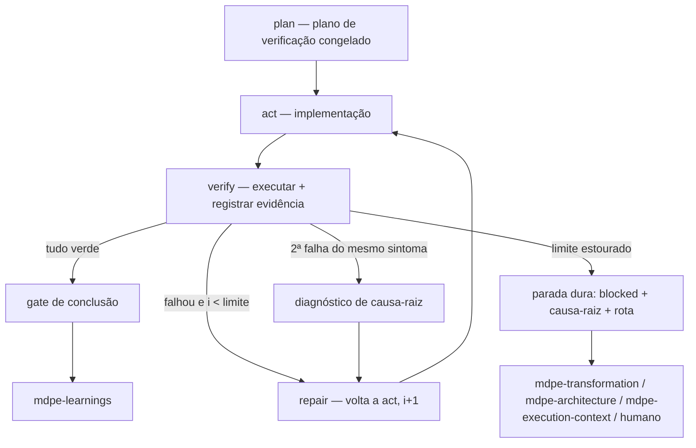

# ADR-003 — Contrato de "loop até verde" com critérios de parada (Loop Engineering)

| Campo | Valor |
|---|---|
| **Status** | Aceito |
| **Data** | 28/08/2026 |
| **Tarefa de origem** | `tasks-v1.md` → Fase 4 → 4.1 |
| **Eixo da rubrica** | Eixo 3 — Fidelidade de implementação e engenharia de loop (baseline **1**, meta **4**) |
| **Implementado por** | Tarefa 4.2 (`mdpe-coding` + template de validação + template de code review) · conciliado na 8.2 · consumido na 5.2 · verificado na 9.3 |
| **Adoções associadas** | A1 (evidência de execução obrigatória) · A2 (loop limitado) · A8 (verificador independente) · A4 (cadeia de verificação de conhecimento) · A5 (criação preguiçosa) |
| **Depende de** | ADR-002 (campo `verification` das decisões `ad-NNN` como insumo da dimensão de arquitetura) |

---

## 1. Contexto

O MDPE tem um loop de correção, mas ele é **declarativo**: existe como frase, não como contrato.

1. **O laço não obriga executar nada.** `skills/mdpe-coding/SKILL.md` (Fase 2) encerra com *"If any
   dimension fails, **return to Phase 1** to fix, then re-validate"*, e a Fase 3 repete o mecanismo
   para Blockers/Majors. Em nenhum ponto se exige rodar build, lint ou teste: o julgamento
   "falhou/passou" é do agente. A Fase 1 sub-fase 5 é literalmente um *"quick pass against the
   unified quality model"* — autoavaliação (gap-map Lacuna 3.1).
2. **O veredito "aprovado" não exige prova.** `validation-report-template.yml` traz, por dimensão,
   `validated: false` e `status: "pending"`, e o bloco `summary.overall_status` aceita `approved` sem
   nenhuma dependência dos campos `commands_executed` e `evidence` — que existem, mas são decorativos
   (Lacuna 3.1). O caminho `decision: ready_for_review` é alcançável com zero saída de comando.
3. **Não há condição de parada.** Nem `mdpe-coding` nem o template têm contador de tentativas, limite
   ou diagnóstico de causa-raiz. O laço "volte à Fase 1 e revalide" é, no texto, infinito
   (Lacuna 3.2).
4. **O template ensina a fabricar por default.** Todo campo numérico nasce em `0`:
   `total_tests: 0`, `passing_tests: 0`, `line_coverage: 0`, `average_cyclomatic_complexity: 0`,
   `critical_vulnerabilities: 0`. Um relatório entregue no default **parece medido** — zero
   vulnerabilidades, zero code smells, complexidade dentro da meta — quando nada foi executado. É a
   pior forma de conteúdo gerado por IA: falso positivo com aparência de métrica (Eixo 8).
5. **Quem valida é quem implementou.** As três fases correm no mesmo agente e na mesma linha de
   raciocínio; a Fase 2 herda o modelo mental da Fase 1, inclusive os pontos cegos que produziram o
   defeito (competitive-analysis 5.4, 3.4).

Do lado do insumo, o material para verificar **já existe e não é usado**:
`mdpe-microtask-template.yml` dá, por critério de qualidade, um campo `how_to_verify` (ex.:
`"dotnet test --collect:\"XPlat Code Coverage\""`); `environment-setup-template.yml` traz
`verification_command` por ferramenta e serviço; o inventário brownfield do ADR-001 registra
*"How to run: `{command}` — evidence: `{manifest or CI file}`* na seção 6; e o ADR-002 entrega, por
decisão `ad-NNN`, um campo `verification` conferível. Existem quatro fontes declaradas de comando de
verificação e nenhuma obrigação de lê-las.

Referência externa: OSpec grava a verificação como registro durável com comando, status e exit code,
e exige evidência de teste **atual** para considerar um objetivo completo (4.1, 4.2); limita reparo a
um lote e no máximo uma re-revisão, transformando falha semântica repetida em bloqueio estável em vez
de ciclagem (4.3). O TLC exige que o relatório do verificador exista, com veredito PASS e **citando
evidência `arquivo:linha`** — relatório ausente, com placeholder ou sem evidência reprova (5.3) — e
limita o laço corrigir→re-verificar a 3 iterações antes de escalar, com autor ≠ verificador (5.4).
Superpowers impõe RED-GREEN-REFACTOR e apaga código escrito antes do teste (3.1).

---

## 2. Decisão

### D1 — O loop é explícito dentro de `mdpe-coding`, não uma skill nova

O laço **plan → act → verify** é formalizado sobre as três fases já existentes de `mdpe-coding`.
Nenhuma skill nova, nenhum artefato novo além do que a 4.2 já vai tocar. Justificativa contra a
rubrica na Seção 4.

| Passo do laço | Onde vive hoje | O que muda |
|---|---|---|
| **plan** | não existe | novo sub-passo **antes** de escrever código: declarar o *plano de verificação* (D2) e congelá-lo |
| **act** | Fase 1 (implementação, 5 sub-fases) | inalterada, exceto pelo commit incremental já previsto |
| **verify** | Fase 2 (6 dimensões) + Fase 3 (7 dimensões) | passa a exigir **execução com evidência** (D3) e postura de verificador (D9) |
| **repair** | *"return to Phase 1"* | ganha contador, limite e comportamento de estouro (D5, D6) |



### D2 — Plano de verificação: declarado antes do código, com comandos resolvidos por cadeia

Antes da primeira linha de implementação, o agente escreve o **plano de verificação**: para cada
critério de aceite e cada dimensão aplicável, qual comando prova o quê.

Ordem de resolução do comando (cadeia de verificação de conhecimento, A4 — **nunca inventar**):

| # | Fonte | Campo |
|:-:|---|---|
| 1 | Micro-task | `quality_criteria[].how_to_verify` |
| 2 | Setup da execução | `mt-XXX-YYY-setup.yml` → `verification_command`, `seeds_command`, `command_executed` |
| 3 | Manifesto real do repositório | scripts de `package.json`, `*.csproj`/`*.sln`, `Makefile`, `pyproject.toml`, `go.mod`, workflow de CI |
| 4 | Decisão de arquitetura | `docs/architecture/decisions.yml` → `verification` de cada `ad-NNN` em escopo |
| 5 | Inventário brownfield | `docs/brownfield/inventory.md` §6 (*How to run*) |
| 6 | Perguntar ao usuário | uma vez, de forma direta |
| 7 | Sem resposta | `not_verifiable` com motivo (D4). **Comando inventado é defeito, não tentativa.** |

Regras do plano:

- **Congelado no passo `plan`.** Alterar o plano depois de ver o resultado (trocar comando, remover
  critério, relaxar filtro de teste) exige registro na iteração correspondente, com motivo. Sem esse
  congelamento, "loop até verde" degenera em "ajustar o alvo até acertar".
- **Cada critério de aceite aponta ≥1 comando ou é marcado `not_verifiable`/`not_applicable`.**
  Critério sem destino é lacuna do plano, não do código.
- **Um comando inexistente descoberto na execução** (script ausente, alvo errado) volta para a cadeia
  acima; não vira comando improvisado.

### D3 — Contrato de evidência: sem execução registrada não existe `pass`

Cada verificação registrada carrega, no mínimo:

| Campo | Obrigatoriedade | Conteúdo |
|---|:---:|---|
| `command` | essencial | o comando **como executado** |
| `exit_code` | essencial | o código de saída real |
| `result` | essencial | `success` \| `failure` — derivado do `exit_code`, não da impressão |
| `output_summary` | essencial | o trecho que sustenta a conclusão (contagem de testes, erro, linha do lint) |
| `run_at` | essencial | data/hora ou commit em que rodou (é o que torna a evidência **atual**) |
| `artifact` | condicional | caminho de relatório/log gerado, quando existir e for real |

Regras duras:

1. **`status: pass` exige ≥1 evidência com `exit_code: 0`.** Sem evidência o valor legal é `pending`.
2. **Verificação manual** (ex.: passo de UI sem teste automatizado) é evidência válida **se** trouxer
   procedimento + resultado observado + artefato (arquivo, log, captura com caminho real). "Conferi e
   está certo" não é evidência.
3. **Evidência envelhece.** Evidência colhida antes do último commit que altera código em escopo é
   inválida: o `run_at` (ou commit) tem de ser posterior. Verde antigo não fecha micro-task.
4. **Nenhum campo numérico nasce preenchido.** Métrica sem medição é **linha ausente**, nunca `0`. O
   default `0` de hoje é evidência falsa e é removido na 4.2.
5. **Autoavaliação não produz evidência.** A sub-fase 5 (self-review) da Fase 1 continua útil como
   higiene, e **não** pode marcar dimensão nenhuma.

### D4 — Vocabulário de status: cinco valores, sem zona cinza

Um único valor por dimensão e por critério, com regra de uso:

| Status | Significado | Exige |
|---|---|---|
| `pass` | verificado com sucesso | evidência com `exit_code: 0` (D3) |
| `fail` | verificado e falhou | evidência da falha |
| `not_applicable` | a dimensão não se aplica a esta micro-task | `reason`; a inaplicabilidade tem de ser **derivável do contrato da micro-task** (ex.: saída sem endpoint → sem teste de CSRF), não decidida na hora de validar |
| `not_verifiable` | aplicável, mas não há comando/ferramenta/autorização | `reason` + `follow_up`; **não conta como aprovação** |
| `pending` | ainda não rodou | nada — e **bloqueia qualquer veredito** |

Isto existe por dois motivos. Primeiro, hoje `pending` é o default e é indistinguível de "não se
aplica", o que empurra o agente a marcar `pass` para "limpar" o relatório. Segundo, é a peça que
conciliará a Fase 4 com a Fase 8: uma dimensão inaplicável se resolve em **uma linha com motivo**, em
vez de um bloco de metas preenchido por dedução (D11).

### D5 — Limite de iterações: 1 verificação + até 3 reparos, por micro-task

- `i1` é a **primeira** verificação, depois da implementação. Não é reparo.
- Cada ciclo reparar → re-verificar é uma iteração: `i2`, `i3`, `i4`. **`i4` falho = limite estourado.**
- O contador é **por micro-task**, registrado em `loop.iterations[]`, e cada iteração registra: o que
  falhou (dimensão + critério), o que foi feito, e a evidência da re-verificação.
- **Um único relatório de validação por micro-task**, acumulando as iterações — não um relatório por
  tentativa. É o que torna `iterations_to_green` uma métrica derivável (Fase 5) sem tooling.
- **Falha de ambiente/setup não é reparo de código**: aborta o laço na hora e roteia para
  `mdpe-execution-context` (D6). Registra-se como iteração com `outcome: environment`, e ela **não**
  consome o orçamento de reparo — mas só uma vez; a segunda ocorrência vira estouro.
- **Teste instável (flaky)** não pode ser transformado em verde por repetição: reexecutar o mesmo
  comando sem mudar código é iteração como qualquer outra e exige registrar a instabilidade no campo
  próprio do template.
- O contador **só reinicia** quando o contrato da micro-task muda (re-decomposição em
  `mdpe-transformation` ou decisão `revise` em `mdpe-architecture`). Reescrever a implementação não
  reinicia nada.

### D6 — Comportamento ao estourar: parada dura, causa-raiz e rota — nunca `approved`

Ao estourar o limite, o agente **para de editar código** e registra um diagnóstico de causa-raiz:

| Campo | Conteúdo |
|---|---|
| `symptom` | o que falha, com a evidência (comando + saída) da última iteração |
| `attempts` | o que foi tentado em cada iteração e **por que cada tentativa não resolveu** |
| `hypothesis` | a causa provável, uma só, apontando `arquivo:linha`, contrato ou dependência |
| `evidence_gap` | o que não foi possível determinar (`unknown` é resposta válida) |
| `options` | 2-3 caminhos com custo, quando houver mais de um |
| `route` | para onde vai (tabela abaixo) |

Rota de escalonamento, sempre uma:

| Rota | Quando | Destino |
|---|---|---|
| `needs_redesign` | a micro-task não é atômica/executável como escrita; o defeito está na decomposição | `mdpe-transformation` |
| `needs_architecture` | cumprir o critério exige violar uma decisão em escopo | `mdpe-architecture` (`revise`, com `supersedes` — ADR-002 D9) |
| `needs_environment` | falha de ambiente, dependência ou serviço | `mdpe-execution-context` |
| `needs_human` | decisão de produto, credencial, autorização ou ambiguidade do critério | humano, com `options` |

Duas regras adicionais:

- **Antes do 3º reparo**, se o mesmo sintoma falhou duas vezes, o diagnóstico de causa-raiz é
  **obrigatório** e substitui a próxima tentativa incremental. Duas falhas do mesmo sintoma indicam
  hipótese errada, não patch insuficiente.
- **`blocked` é veredito legítimo.** Micro-task bloqueada com causa-raiz documentada é resultado
  correto do processo; `approved` sem verde não é.

### D7 — Fidelidade de implementação: definição operacional

Fidelidade é **a saída entregue corresponder ao contrato da micro-task** — não a impressão de que
corresponde. Quatro condições, todas conferíveis:

1. **Cobertura de critérios.** Todo item de `quality_criteria` (`functional`, `non_functional`,
   `code_quality`) tem `status` + evidência, ou `not_applicable`/`not_verifiable` com motivo.
   `total_criteria` tem de bater com o contrato: critério declarado e ausente do relatório é falha de
   fidelidade, mesmo com tudo verde.
2. **Existência da saída.** Todo caminho declarado em `output.generated_artifacts` (contrato IOQD)
   **existe** no repositório ao fim. Caminho prometido e inexistente reprova — é a mesma regra de
   caminho real do ADR-001.
3. **Aderência de escopo.** Código produzido fora do escopo declarado (`output` + integração prevista)
   é registrado como achado. Entregar mais que o contrato é desvio de fidelidade, não bônus.
4. **Cadeia de rastreio fechada.** Cada critério atendido é rastreável ponta a ponta:

```
feat-XXX → mt-XXX-YYY → quality_criteria[].criterion
                      → how_to_verify (comando)
                      → evidence{command, exit_code, output_summary, run_at}
                      → arquivo:linha (achados)  ·  ad-NNN (arquitetura)
```

Essa cadeia é o que a Fase 6 transforma em arestas `validates` e o que a 9.1 cobra como rastreio
verificável do backlog até a evidência.

### D8 — TDD: preferido e evidenciável; **não** é gate

Mantém-se *"prefer TDD: red → green → refactor"* na Fase 1. A evidência **GREEN** é obrigatória (é a
evidência de teste do D3). A evidência **RED** — o teste falhando antes da implementação — é campo
**opcional** e vale como a prova de fidelidade mais forte disponível, porque demonstra que o teste
discrimina comportamento em vez de espelhar o código.

Não se torna obrigatório por um motivo específico: exigir um campo que só o próprio agente pode
afirmar, sem meio de conferência, cria um campo **infalsificável** — e campo infalsificável obrigatório
é vetor de fabricação, exatamente o que a Fase 8 combate. Quando o RED é registrado, é com evidência
real (saída do comando falhando, com `run_at` anterior ao commit de implementação) ou não é registrado.

### D9 — Postura de verificador: re-derivar, não reciclar

Aplicação de A8 sem depender de infraestrutura de subagente:

- O passo `verify` **re-deriva** a lista de critérios e comandos a partir do contrato da micro-task e
  do plano congelado (D2) — não a partir do que a implementação diz ter feito.
- **É proibido** marcar dimensão com base na sub-fase 5 (self-review) da Fase 1.
- Achado que afirma violação cita **`arquivo:linha`**; achado de arquitetura cita também o `ad-NNN`
  (ADR-002 D9). Achado sem citação é opinião e não entra no relatório.
- Delegar o `verify` a um subagente/sessão limpa é **recomendado** quando o harness permite, e
  **opcional**: a exigência portável é a postura e a evidência, não o mecanismo.

### D10 — Raio de impacto: o loop roda comandos, e não todos os comandos

Como esta ADR passa a **exigir** execução, o limite do que se executa sem perguntar tem de ser
explícito (adoção do princípio de raio de impacto, TLC 5.12):

| Sem autorização adicional | Exige autorização explícita para aquela ação |
|---|---|
| build, compilação, type-check | migração/seed contra banco compartilhado ou de produção |
| lint/format em modo verificação | `git push`, abertura de PR, merge |
| testes unitários e de integração em ambiente local/de teste | deploy, mudança de infraestrutura |
| cobertura, benchmark local | comando que apaga dados ou toca serviço compartilhado |
| leitura de arquivos, inspeção estática | alteração de configuração de CI que dispara pipeline |

Se a verificação **depende** de um comando não autorizado, o status é `not_verifiable` com `reason:
requires_authorization` e `follow_up`. Nunca se simula o resultado de um comando que não se pode rodar.

### D11 — Conciliação com a Fase 8: mais informação real, menos campo preenchido

O cenário negativo da tarefa 4.2 é explícito: o reforço não pode virar aumento de obrigatoriedade
vazia. Regras de conciliação, a serem confirmadas na auditoria 8.1:

1. **Campos essenciais novos são poucos e todos derivados de execução real:** os 5 campos de evidência
   (D3) e o bloco `loop` com `iterations[]` + `iterations_to_green` + `limit`.
2. **Em troca, blocos hoje "obrigatórios por template" viram condicionais:** metas de performance,
   matriz de ferramentas de segurança, listas de navegadores/SO, blocos de otimizações sugeridas.
   Dimensão inaplicável = uma linha (`not_applicable` + `reason`).
3. **Nenhum default numérico.** Sem medição, a linha não existe (regra 4 de D3) — o que **reduz**
   contagem de campos preenchidos em relação ao template atual.
4. **Criação preguiçosa (A5):** `root_cause_diagnosis` só existe quando o limite foi atingido;
   `iterations[]` só tem `i1` quando passou de primeira; achados vazios não geram seção.
5. **Uma linha de evidência real vale mais que um bloco de metas.** Onde houver conflito entre volume
   e prova, mantém-se a prova e corta-se o volume.

Efeito esperado: um relatório de micro-task pequena fica **menor** do que o preenchimento integral do
template atual, e ainda assim é o primeiro relatório com informação verificável.

### D12 — Onde a evidência vive

| Artefato | Papel | Situação |
|---|---|---|
| `{microtask-id}-validation.yml` | plano de verificação, dimensões com evidência, bloco `loop`, causa-raiz condicional | existe; template reescrito na 4.2 |
| `{microtask-id}-code-review.yml` | achados com `arquivo:linha` (+ `ad-NNN` em arquitetura), severidade, veredito | **output sem template** (gap-map Seção C); o template mínimo é entregue na 4.2, conforme A8 |

Duas pendências de consistência ficam registradas, sem serem decididas aqui:

- **Caminho divergente do relatório** — `mdpe-coding` diz
  `docs/execution/{microtask-id}-validation-report.yml`; `environment-setup-template.yml` e o próprio
  `validation-report-template.yml` dizem
  `docs/transformation/{feature-id}/execution/mt-XXX-YYY-validation.yml`. É a Lacuna 9.1. O contrato
  desta ADR é **agnóstico de caminho**; a padronização é da 9.1, e a 4.2 deve deixar SKILL e template
  concordando entre si com o mesmo valor. Recomendação (não decisão): convergir para o caminho
  por-feature, que é o usado em dois dos três lugares e mantém os artefatos da feature juntos.
- **Referências a arquivos de comando legados** — `validation-report-template.yml` aponta
  `next_command: "14-cd-04-code-review.txt"`, `related_command: "13-cd-03-validation-tests.txt"` e
  `"12-cd-02-implementation.txt"`. Esses arquivos são a **origem histórica** documentada em
  `docs/mapping-commands-to-skills.md` e **não existem** neste repositório; num framework de skills o
  campo deveria nomear a skill/fase. Não constam da Seção C do gap-map e devem ser somados a ela; a
  correção é da 4.2, por estar no mesmo arquivo.

### D13 — Costuras reservadas para as fases seguintes

| Fase | O que esta ADR deixa pronto |
|---|---|
| **5** — métricas | tudo derivável do relatório, sem tooling (A9): `iterations_to_green`, taxa de retrabalho (micro-tasks com `i > 1`), dimensões `fail` por tipo, contagem de `not_verifiable` (mede *cobertura* de verificação, não qualidade), distribuição de `route` em bloqueios |
| **6** — grafo | aresta `validates` (evidência → critério → micro-task), nó "artefato/arquivo" a partir de `output.generated_artifacts` verificados, e micro-task `blocked` como anotação de caminho crítico |
| **7** — memória | `root_cause_diagnosis` é a matéria-prima de lição de maior valor; assinatura de falha recorrente entra como lição `candidate` → `confirmed` (A12) |
| **8** — anti-alucinação | vocabulário de status (D4), remoção dos defaults numéricos (D3.4) e a lista de campos condicionais (D11) entram na auditoria 8.1 |
| **9** — wiring | Lacuna 9.1 (caminho), referências legadas `.txt` (D12), template de code review, e a cadeia de rastreio de D7 como espinha do 9.1 |

---

## 3. Critério de conclusão de micro-task ("verde suficiente")

Pode fechar e seguir para `mdpe-learnings` quando **todos** valem:

- [ ] Existe **plano de verificação** e ele foi congelado antes da implementação; toda alteração
      posterior está registrada com motivo.
- [ ] **Dimensão 1 (testes)** e **dimensão 3 (critérios de aceite)** estão `pass` com evidência
      atual (`run_at` posterior ao último commit em escopo). Nenhuma das duas pode fechar como
      `not_verifiable`.
- [ ] As demais dimensões estão `pass`, `not_applicable` (com motivo derivável do contrato) ou
      `not_verifiable` (com motivo + `follow_up`). **Nenhuma** `pending`.
- [ ] Todo caminho de `output.generated_artifacts` existe; nenhum caminho citado é inexistente;
      nenhum campo contém `TBD` nem número de default.
- [ ] `loop.iterations_to_green` está registrado e é ≤ limite.
- [ ] Code review sem Blocker/Major aberto; achados citam `arquivo:linha` e, em arquitetura, o
      `ad-NNN` (ou o review registra que não havia decisão em escopo — ADR-002 D9).

**Exceção declarada:** micro-task sem saída de código (documentação, configuração) pode ter a dimensão
1 como `not_applicable` com motivo; nesse caso a dimensão 3 é verificada por existência de artefato +
conferência de conteúdo, com evidência.

**Estouro do limite** satisfaz o gate de outra forma: `blocked` + causa-raiz completa + rota **é** a
saída correta, e o relatório fica igualmente válido como artefato.

---

## 4. Alternativas consideradas

### (a) Manter o loop informal atual (*"return to Phase 1"*) — **rejeitada**

É o baseline (nota 1). Permite `approved` sem execução (Lacuna 3.1) e não tem parada (Lacuna 3.2).
Não alcança nem o nível 2 do Eixo 3, que exige ao menos recomendação de verificar com campo de
evidência.

### (b) TDD RED-GREEN-REFACTOR obrigatório como gate (Superpowers 3.1) — **parcialmente adotada**

Adotada a exigência de **evidência de teste**; recusada a obrigatoriedade da ordem test-first. Dois
motivos: (i) o MDPE precisa cobrir micro-tasks de configuração, infraestrutura, migração e
documentação, em que RED não existe; (ii) um campo "vi o teste falhar antes" que só o agente pode
afirmar é infalsificável, e campo infalsificável obrigatório é convite à fabricação — o problema que a
Fase 8 combate. RED fica opcional e evidenciado (D8).

### (c) Gates determinísticos por script/CLI própria (TLC 5.3, OSpec) — **rejeitada para a v1**

É a forma mais forte de impedir aprovação sem prova: o validador roda, retorna diferente de zero, e o
processo para. Recusada aqui pelo mesmo motivo já registrado em `competitive-analysis.md` §7
("adoções deliberadamente recusadas"): o MDPE **já sofre** por referenciar tooling inexistente
(`tools/mdpe-status.py`, Lacuna 4.1). Criar dependência de binário/script agora repetiria o erro
exato que a Fase 5 vai consertar. O princípio ("exit code decide, não a autoavaliação") é adotado
integralmente no nível do contrato (D3); o mecanismo é o agente executar comandos que **já existem no
projeto**. Reavaliar pós-v1, quando houver um lugar sustentável para ferramentas.

### (d) Nova skill `mdpe-loop` — **rejeitada**

O laço não tem entrada, saída nem gate próprios: ele é a mecânica interna de `mdpe-coding`. Uma skill
separada obrigaria a duplicar as dimensões de validação, criaria uma décima primeira skill para
costurar na 9.2 e pioraria o Eixo 7 sem elevar o Eixo 3 — cujo nível 4 fala explicitamente de
`mdpe-coding` exigindo evidência por dimensão.

### (e) Loop sem limite, iterando até verde — **rejeitada**

É o que o texto atual já permite, e o cenário negativo da tarefa 4.1 reprova. Sem limite, falha
semântica repetida vira ciclagem: N patches incrementais sobre uma hipótese errada, cada um
aumentando a superfície de mudança. OSpec resolve com reparo limitado e bloqueio estável (4.3) e o TLC
com 3 iterações e escalonamento (5.4); D5/D6 seguem esse desenho, com o acréscimo do diagnóstico
obrigatório na segunda falha do mesmo sintoma.

### (f) Verificador em subagente obrigatório (TLC 5.4, Superpowers 3.4) — **parcialmente adotada**

Autor ≠ verificador é a mitigação certa para o ponto cego compartilhado, e depende do harness
permitir despachar subagente com contexto limpo. Torná-lo obrigatório amarraria o MDPE a uma
capacidade de ambiente — o mesmo erro das worktrees obrigatórias, já recusado no benchmark. Adota-se a
**postura** de re-derivação e a proibição de aproveitar a autoavaliação (D9), com delegação
recomendada e opcional. O sensor de discriminação por mutação (TLC 5.4) fica pós-v1: depende de
tooling de mutação, que cairia na recusa (c).

### (g) Contrato explícito de loop dentro de `mdpe-coding` (D1) — **escolhida**

Contra a rubrica 1.2:

| Eixo | Efeito |
|---|---|
| **3 — Fidelidade / loop** (1 → 3 aqui, 4 na 4.2) | O nível 3 pede exatamente "ADR define o contrato: passos, comandos, limite de iterações, causa-raiz, fidelidade" — D1-D7. O nível 4 (evidência por dimensão + contador + teste falho bloqueando `approved`) fica inteiramente contratado para a 4.2. |
| **4 — Mensurabilidade** | Cria a **primeira** fonte de métrica real derivada de artefato: `iterations_to_green`, retrabalho, dimensões falhas. A Fase 5 passa a ter o que reconciliar em vez de tooling prometido. |
| **8 — Alucinação** | Ataca três vetores de uma vez: veredito sem prova (D3), default numérico com cara de medição (D3.4) e comando inventado (D2). |
| **2 — Arquitetura** | Dá execução ao `verification` das decisões `ad-NNN`: o ADR-002 definiu **o que** verificar, este define **como provar** que verificou. |
| **7 — Custo cognitivo** | Risco real de inflar o relatório. Mitigado por D11 (condicionais + fim dos defaults + criação preguiçosa), com expectativa de relatório **menor** para micro-task pequena. |
| Custo | Nenhuma skill nova; 1 template reescrito + 1 template criado (A8). O agente passa a **precisar** executar comandos, o que exige o limite de raio de impacto de D10. |

---

## 5. O que **NÃO** é obrigatório

Nada abaixo é pré-requisito para fechar uma micro-task:

**De prática de qualidade:**

- Ordem test-first (RED antes do código) e evidência RED — preferidos, opcionais (D8).
- Teste de mutação, *mutation score*, sensor de discriminação por injeção de falha.
- Meta numérica de cobertura como gate. Cobertura é **registrada quando medida**; não vira reprovação
  por si, porque cobertura alta com teste que não discrimina comportamento é falso conforto.
- Benchmark, perfilagem de memória, teste de carga — só quando a micro-task declara orçamento de
  performance.
- Matriz de teste de segurança completa (SQLi, XSS, CSRF, bypass de auth/authz) para toda micro-task:
  aplica-se ao que a saída realmente expõe; o resto é `not_applicable` com motivo.
- Matriz de navegadores/SO, contratos de API, compatibilidade retroativa quando a saída não tem
  superfície pública.
- Ferramenta específica citada nos exemplos do template (SonarQube, Snyk, BenchmarkDotNet,
  dotMemory): são exemplos, não requisitos. Sem a ferramenta no projeto → `not_verifiable` ou
  `not_applicable`, jamais um número inventado.
- Worktree ou branch dedicada por tentativa de reparo.
- Verificador em subagente separado (D9) e CLI/validador executável (alternativa c).

**Do artefato:**

- `root_cause_diagnosis` quando o laço fechou dentro do limite.
- `loop.iterations[]` além de `i1` quando passou de primeira.
- Blocos de otimizações sugeridas, lições, melhorias de processo e documentação adicional sem
  conteúdo real — a Fase 8 os classifica; aqui já valem como opcionais.
- Evidência em formato de captura de tela quando a saída de comando basta.

**Do fluxo:**

- Rodar as 6 dimensões em toda micro-task: rodam-se as **aplicáveis**, com motivo para as demais.
- Ter decisões `ad-NNN` em escopo (ADR-002 D9 prevê a ausência).
- Ter inventário brownfield para resolver comandos (é a 5ª fonte da cadeia, não a única).

**Regra geral:** a ausência de item desta lista nunca reprova. O que reprova é `pass` sem evidência,
evidência anterior ao último commit em escopo, comando inventado, default numérico apresentado como
medição, critério do contrato ausente do relatório, caminho de saída inexistente, `pending` no
fechamento, laço sem contador, e `approved` com dimensão de teste ou de aceite falha.

---

## 6. Consequências

**Positivas**

- Eixo 3 vai de 1 para 3 com esta ADR e habilita o 4 na 4.2; é o eixo em que o MDPE está mais atrás
  do benchmark (`○` em *evidência de execução persistida*, *verificador independente* e *limite de
  iterações*, contra `●` em OSpec e TLC).
- Fecha as Lacunas 3.1 e 3.2 e remove um vetor de fabricação que ninguém havia catalogado: os
  defaults `0` do template, que fazem um relatório não executado parecer medido.
- Entrega a primeira métrica **real** do framework (`iterations_to_green`, retrabalho), dando à Fase 5
  algo derivável de artefato em vez de tooling prometido.
- Dá execução ao `verification` das decisões de arquitetura (ADR-002), fechando o par
  "o que verificar" + "como provar".
- Fecha a cadeia de rastreio critério → comando → evidência → arquivo, que é a espinha do 9.1 e a
  aresta `validates` da Fase 6.
- `blocked` com causa-raiz passa a ser resultado legítimo, o que remove o incentivo estrutural a
  aprovar sem prova para "fechar a tarefa".

**Negativas / custos**

- **O agente passa a precisar executar comandos.** Isso muda o perfil de risco da skill, por isso
  D10. Em ambiente sem permissão de execução, o resultado honesto é `not_verifiable` — e uma
  micro-task que não fecha. É deliberado: melhor não fechar do que fechar sem prova.
- Micro-task fecha mais devagar. O ganho é que "fechada" passa a significar algo.
- Risco de inflar o relatório e brigar com a Fase 8. Mitigação em D11, e a auditoria 8.1 deve
  reclassificar os campos deste template com prioridade.
- `not_verifiable` pode ser usado como escape ("nada é verificável, tudo passa"). Mitigação: as
  dimensões 1 e 3 **não podem** fechar como `not_verifiable` (Seção 3), e a contagem de
  `not_verifiable` é métrica de cobertura de verificação na Fase 5 — quem abusa fica visível.
- Limite fixo de 3 reparos é arbitrário e vai errar em casos-limite. Aceito: um número errado com
  parada é melhor que nenhum número; a Fase 5 dará dados para calibrar.
- Congelar o plano de verificação antes de implementar adiciona um passo que hoje não existe, e é
  onde há maior chance de o agente pular a disciplina. É também o único jeito de impedir que o alvo
  se mova depois do resultado.

**Neutras**

- As 6 dimensões da Fase 2 e as 7 da Fase 3 continuam as mesmas; muda o que é preciso para marcá-las.
- Nenhum artefato é removido; um (`{id}-code-review.yml`) ganha o template que já devia ter.
- Micro-task de documentação/configuração continua possível, pela exceção declarada na Seção 3.

---

## 7. Verificação contra os cenários de teste da tarefa 4.1

| Cenário | Onde é atendido |
|---|---|
| + Contrato lista passos verificáveis, limite de iterações e comportamento ao estourar | D1 (plan → act → verify → repair, com diagrama), D2 (comandos por cadeia), D5 (i1 + 3 reparos, contador por micro-task), D6 (parada dura + causa-raiz + 4 rotas) |
| + "Concluído" exige evidência de execução, não afirmação | D3 (5 campos essenciais; `pass` exige `exit_code: 0`; evidência anterior ao último commit é inválida; autoavaliação não marca dimensão) e Seção 3 (dimensões 1 e 3 obrigatoriamente `pass` com evidência atual) |
| + Diagnóstico de causa-raiz após N falhas em vez de patches incrementais | D6 (campos do diagnóstico; obrigatório já na 2ª falha do mesmo sintoma, antes do 3º reparo) |
| − Contrato que permite aprovar sem rodar nada reprova | D3 regras 1 e 5, D4 (`pending` bloqueia veredito; `not_verifiable` não aprova), D3.4 (fim dos defaults numéricos), Seção 3 |
| − Loop sem condição de parada reprova | D5 (limite, contador, regra de flaky e de falha de ambiente, reinício só por mudança de contrato) e D6 (`blocked` como veredito legítimo) |
| + Fidelidade definida (saída bate com IOQD/critérios de aceite) | D7 (4 condições: cobertura de critérios, existência da saída declarada, aderência de escopo, cadeia de rastreio fechada) |

---

## 8. Fontes

**Internas (lidas para este ADR):** `skills/mdpe-coding/SKILL.md` (Fase 1 sub-fase 5; Fase 2 *"return
to Phase 1"*; Fase 3 *return-to-fix loop*; *Quality gate*; *Architecture: validate, don't re-decide*) ·
`skills/mdpe-coding/assets/templates/validation-report-template.yml` (`validated: false` /
`status: "pending"`; `commands_executed`; `evidence`; defaults numéricos em `0`;
`summary.overall_status`; `next_steps.next_command` e `related_command` apontando arquivos `.txt`;
`directory_structure`) · `skills/mdpe-transformation/assets/templates/mdpe-microtask-template.yml`
(`quality_criteria[].how_to_verify`; `aert_validation`) ·
`skills/mdpe-transformation/assets/schemas/mdpe-microtask.schema.json` (contrato IOQD:
`output.generated_artifacts`, `quality_criteria` obrigatórios) ·
`skills/mdpe-execution-context/assets/templates/environment-setup-template.yml`
(`verification_command`, `seeds_command`, `git_commands`, caminho
`docs/transformation/{feature-id}/execution/`) · `skills/mdpe-code-discovery/SKILL.md` e
`assets/templates/brownfield-inventory-template.md` (§6 *How to run*; regras anti-fabricação) ·
`docs/adr/adr-002-architecture-skill.md` (D5 `verification`, D9 integração com o review) ·
`docs/adr/adr-001-brownfield-discovery.md` (regra de caminho real; seção de não-obrigatórios) ·
`docs/analysis/baseline-gap-map.md` (Lacunas 3.1, 3.2, 9.1; Seções C e E) ·
`docs/analysis/evaluation-rubric.md` (Eixo 3 e âncoras dos Eixos 4, 7, 8) ·
`docs/analysis/competitive-analysis.md` (3.1, 3.4, 4.1-4.3, 5.3, 5.4, 5.12, §6, §7 A1/A2/A4/A5/A8/A9,
recusas registradas) · `docs/mapping-commands-to-skills.md` (origem dos comandos `CD-02/03/04`).

**Externas:** OSpec — [clawplays/ospec](https://github.com/clawplays/ospec) (laço plan → act → verify;
evidência com comando, status e exit code; reparo limitado com parada estável;
`execution-metrics.json`) · Superpowers —
[README §The Basic Workflow](https://github.com/obra/superpowers/blob/main/README.md) e
[test-driven-development/SKILL.md](https://github.com/obra/superpowers/blob/main/skills/test-driven-development/SKILL.md)
(RED-GREEN-REFACTOR) · TLC Spec-Driven —
[SKILL.md v3.3.0](https://github.com/tech-leads-club/agent-skills/blob/main/packages/skills-catalog/skills/%28development%29/tlc-spec-driven/SKILL.md)
(gates determinísticos com evidência `arquivo:linha`; verificador independente com laço limitado a 3
iterações; raio de impacto) · Spec-Kit —
[README](https://github.com/github/spec-kit/blob/main/README.md) (pipeline com fase de implementação
verificada).

> Conteúdo parafraseado a partir das fontes para conformidade de licenciamento; URLs reaproveitadas de
> `competitive-analysis.md`, verificadas em 27/08/2026.
