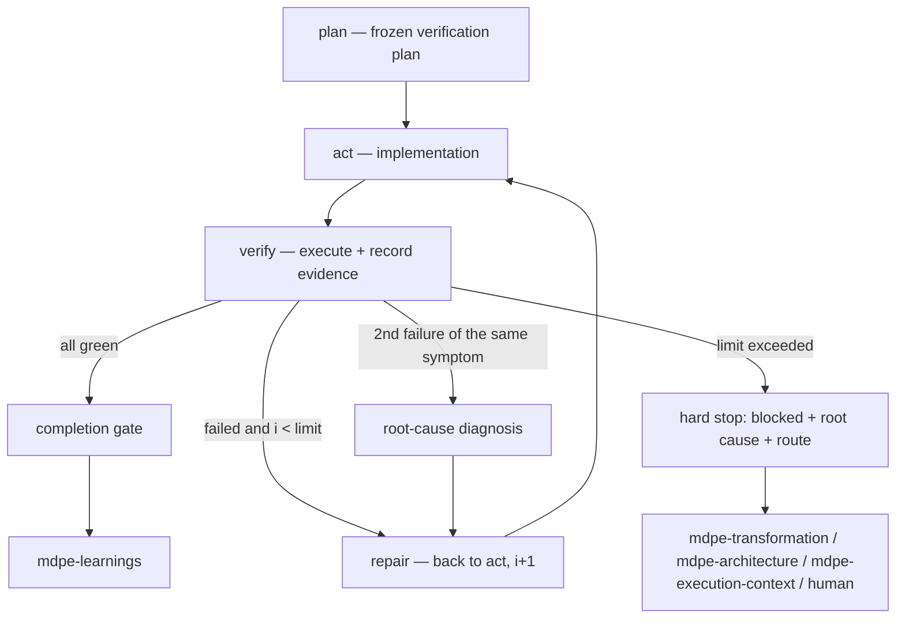

# ADR-003 — "Loop until green" contract with stopping criteria (Loop Engineering)

| Field | Value |
|---|---|
| **Status** | Accepted |
| **Date** | 28/08/2026 |
| **Source task** | `tasks-v1.md` → Phase 4 → 4.1 |
| **Rubric axis** | Axis 3 — Implementation fidelity and loop engineering (baseline **1**, target **4**) |
| **Implemented by** | Task 4.2 (`mdpe-coding` + validation template + code review template) · reconciled in 8.2 · consumed in 5.2 · verified in 9.3 |
| **Associated adoptions** | A1 (mandatory execution evidence) · A2 (bounded loop) · A8 (independent verifier) · A4 (knowledge verification chain) · A5 (lazy creation) |
| **Depends on** | ADR-002 (`verification` field of `ad-NNN` decisions as input to the architecture dimension) |

---

## 1. Context

MDPE has a correction loop, but it is **declarative**: it exists as a sentence, not as a contract.

1. **The loop does not require executing anything.** `skills/mdpe-coding/SKILL.md` (Phase 2) closes
   with *"If any dimension fails, **return to Phase 1** to fix, then re-validate"*, and Phase 3
   repeats the mechanism for Blockers/Majors. At no point is running a build, lint, or test
   required: the "failed/passed" judgment belongs to the agent. Phase 1 sub-phase 5 is literally a
   *"quick pass against the unified quality model"* — self-assessment (gap-map Gap 3.1).
2. **The "approved" verdict does not require proof.** `validation-report-template.yml` provides, per
   dimension, `validated: false` and `status: "pending"`, and the `summary.overall_status` block
   accepts `approved` with no dependency at all on the `commands_executed` and `evidence` fields —
   which exist, but are decorative (Gap 3.1). The `decision: ready_for_review` path is reachable
   with zero command output.
3. **There is no stopping condition.** Neither `mdpe-coding` nor the template has an attempt
   counter, a limit, or root-cause diagnosis. The "return to Phase 1 and revalidate" loop is, as
   written, unbounded (Gap 3.2).
4. **The template teaches fabrication by default.** Every numeric field is born at `0`:
   `total_tests: 0`, `passing_tests: 0`, `line_coverage: 0`, `average_cyclomatic_complexity: 0`,
   `critical_vulnerabilities: 0`. A report delivered with the defaults **looks measured** — zero
   vulnerabilities, zero code smells, complexity within target — when nothing was executed. It is
   the worst form of AI-generated content: a false positive dressed up as a metric (Axis 8).
5. **The one who validates is the one who implemented.** The three phases run in the same agent and
   the same line of reasoning; Phase 2 inherits Phase 1's mental model, including the blind spots
   that produced the defect (competitive-analysis 5.4, 3.4).

On the input side, the material needed for verification **already exists and is unused**:
`mdpe-microtask-template.yml` gives, per quality criterion, a `how_to_verify` field (e.g.,
`"dotnet test --collect:\"XPlat Code Coverage\""`); `environment-setup-template.yml` provides
`verification_command` per tool and service; the ADR-001 brownfield inventory records
*"How to run: `{command}` — evidence: `{manifest or CI file}`* in section 6; and ADR-002 delivers,
per `ad-NNN` decision, a checkable `verification` field. There are four declared sources of
verification commands and no obligation to read them.

External reference: OSpec records verification as a durable log with command, status, and exit
code, and requires **current** test evidence to consider an objective complete (4.1, 4.2); it limits
repair to one batch and at most one re-review, turning repeated semantic failure into a stable block
instead of cycling (4.3). The TLC requires that the verifier's report exist, with a PASS verdict and
**citing `file:line` evidence** — a missing report, one with a placeholder, or one without evidence
fails (5.3) — and limits the fix→re-verify loop to 3 iterations before escalating, with author ≠
verifier (5.4). Superpowers enforces RED-GREEN-REFACTOR and deletes code written before the test
(3.1).

---

## 2. Decision

### D1 — The loop is explicit inside `mdpe-coding`, not a new skill

The **plan → act → verify** loop is formalized on top of `mdpe-coding`'s three existing phases. No
new skill, no new artifact beyond what 4.2 already touches. Justification against the rubric in
Section 4.

| Loop step | Where it lives today | What changes |
|---|---|---|
| **plan** | does not exist | new sub-step **before** writing code: declare the *verification plan* (D2) and freeze it |
| **act** | Phase 1 (implementation, 5 sub-phases) | unchanged, except for the incremental commit already planned |
| **verify** | Phase 2 (6 dimensions) + Phase 3 (7 dimensions) | now requires **execution with evidence** (D3) and a verifier posture (D9) |
| **repair** | *"return to Phase 1"* | gains a counter, a limit, and overflow behavior (D5, D6) |



### D2 — Verification plan: declared before the code, with commands resolved by a chain

Before the first line of implementation, the agent writes the **verification plan**: for each
acceptance criterion and each applicable dimension, which command proves what.

Command resolution order (knowledge verification chain, A4 — **never invent**):

| # | Source | Field |
|:-:|---|---|
| 1 | Micro-task | `quality_criteria[].how_to_verify` |
| 2 | Execution setup | `mt-XXX-YYY-setup.yml` → `verification_command`, `seeds_command`, `command_executed` |
| 3 | Actual repository manifest | `package.json` scripts, `*.csproj`/`*.sln`, `Makefile`, `pyproject.toml`, `go.mod`, CI workflow |
| 4 | Architecture decision | `docs/architecture/decisions.yml` → `verification` of each in-scope `ad-NNN` |
| 5 | Brownfield inventory | `docs/brownfield/inventory.md` §6 (*How to run*) |
| 6 | Ask the user | once, directly |
| 7 | No answer | `not_verifiable` with a reason (D4). **An invented command is a defect, not an attempt.** |

Plan rules:

- **Frozen at the `plan` step.** Changing the plan after seeing the result (swapping the command,
  removing a criterion, relaxing a test filter) requires a record in the corresponding iteration,
  with a reason. Without this freeze, "loop until green" degenerates into "adjust the target until
  it hits."
- **Every acceptance criterion points to ≥1 command or is marked `not_verifiable`/`not_applicable`.**
  A criterion with no destination is a plan gap, not a code gap.
- **A nonexistent command discovered during execution** (missing script, wrong target) goes back
  through the chain above; it does not become an improvised command.

### D3 — Evidence contract: no recorded execution, no `pass`

Every recorded verification carries, at minimum:

| Field | Required | Content |
|---|:---:|---|
| `command` | essential | the command **as executed** |
| `exit_code` | essential | the actual exit code |
| `result` | essential | `success` \| `failure` — derived from `exit_code`, not from the impression |
| `output_summary` | essential | the excerpt supporting the conclusion (test count, error, lint line) |
| `run_at` | essential | date/time or commit at which it ran (this is what makes the evidence **current**) |
| `artifact` | conditional | path to a generated report/log, when it exists and is real |

Hard rules:

1. **`status: pass` requires ≥1 piece of evidence with `exit_code: 0`.** Without evidence, the
   legal value is `pending`.
2. **Manual verification** (e.g., a UI step with no automated test) is valid evidence **if** it
   includes procedure + observed result + artifact (file, log, screenshot with a real path).
   "I checked and it's fine" is not evidence.
3. **Evidence ages.** Evidence collected before the last commit that changes in-scope code is
   invalid: the `run_at` (or commit) must be later. Stale green does not close a micro-task.
4. **No numeric field is born pre-filled.** A metric without measurement is an **absent line**,
   never `0`. Today's `0` default is false evidence and is removed in 4.2.
5. **Self-assessment produces no evidence.** Phase 1's sub-phase 5 (self-review) remains useful as
   hygiene, and **cannot** mark any dimension.

### D4 — Status vocabulary: five values, no gray zone

A single value per dimension and per criterion, with a usage rule:

| Status | Meaning | Requires |
|---|---|---|
| `pass` | verified successfully | evidence with `exit_code: 0` (D3) |
| `fail` | verified and failed | evidence of the failure |
| `not_applicable` | the dimension does not apply to this micro-task | `reason`; inapplicability must be **derivable from the micro-task's contract** (e.g., output with no endpoint → no CSRF test), not decided at validation time |
| `not_verifiable` | applicable, but there is no command/tool/authorization | `reason` + `follow_up`; **does not count as approval** |
| `pending` | not yet run | nothing — and **blocks any verdict** |

This exists for two reasons. First, `pending` is today's default and is indistinguishable from
"does not apply," which pushes the agent to mark `pass` just to "clean up" the report. Second, it
is the piece that will reconcile Phase 4 with Phase 8: an inapplicable dimension resolves to **one
line with a reason**, instead of a block of goals filled in by inference (D11).

### D5 — Iteration limit: 1 verification + up to 3 repairs, per micro-task

- `i1` is the **first** verification, after implementation. It is not a repair.
- Each repair → re-verify cycle is an iteration: `i2`, `i3`, `i4`. **A failed `i4` = limit exceeded.**
- The counter is **per micro-task**, recorded in `loop.iterations[]`, and each iteration records:
  what failed (dimension + criterion), what was done, and the re-verification evidence.
- **A single validation report per micro-task**, accumulating the iterations — not one report per
  attempt. This is what makes `iterations_to_green` a derivable metric (Phase 5) without tooling.
- **Environment/setup failure is not a code repair**: it aborts the loop immediately and routes to
  `mdpe-execution-context` (D6). It is recorded as an iteration with `outcome: environment`, and it
  **does not** consume the repair budget — but only once; the second occurrence becomes an
  overflow.
- **A flaky test** cannot be turned green by repetition: re-running the same command without
  changing code is an iteration like any other and requires recording the instability in the
  template's dedicated field.
- The counter **only resets** when the micro-task's contract changes (re-decomposition in
  `mdpe-transformation` or a `revise` decision in `mdpe-architecture`). Rewriting the implementation
  resets nothing.

### D6 — Overflow behavior: hard stop, root cause, and route — never `approved`

Upon exceeding the limit, the agent **stops editing code** and records a root-cause diagnosis:

| Field | Content |
|---|---|
| `symptom` | what fails, with evidence (command + output) from the last iteration |
| `attempts` | what was tried in each iteration and **why each attempt did not resolve it** |
| `hypothesis` | the probable cause, a single one, pointing to `file:line`, a contract, or a dependency |
| `evidence_gap` | what could not be determined (`unknown` is a valid answer) |
| `options` | 2-3 paths with cost, when there is more than one |
| `route` | where it goes (table below) |

Escalation route, always one:

| Route | When | Destination |
|---|---|---|
| `needs_redesign` | the micro-task is not atomic/executable as written; the defect is in the decomposition | `mdpe-transformation` |
| `needs_architecture` | meeting the criterion requires violating an in-scope decision | `mdpe-architecture` (`revise`, with `supersedes` — ADR-002 D9) |
| `needs_environment` | environment, dependency, or service failure | `mdpe-execution-context` |
| `needs_human` | product decision, credential, authorization, or criterion ambiguity | human, with `options` |

Two additional rules:

- **Before the 3rd repair**, if the same symptom has failed twice, the root-cause diagnosis is
  **mandatory** and replaces the next incremental attempt. Two failures of the same symptom
  indicate a wrong hypothesis, not an insufficient patch.
- **`blocked` is a legitimate verdict.** A micro-task blocked with a documented root cause is a
  correct process outcome; `approved` without green is not.

### D7 — Implementation fidelity: operational definition

Fidelity is **the delivered output matching the micro-task's contract** — not the impression that
it matches. Four conditions, all checkable:

1. **Criteria coverage.** Every item in `quality_criteria` (`functional`, `non_functional`,
   `code_quality`) has `status` + evidence, or `not_applicable`/`not_verifiable` with a reason.
   `total_criteria` must match the contract: a criterion declared but absent from the report is a
   fidelity failure, even with everything else green.
2. **Output existence.** Every path declared in `output.generated_artifacts` (IOQD contract)
   **exists** in the repository at the end. A promised but nonexistent path fails — it is the same
   real-path rule from ADR-001.
3. **Scope adherence.** Code produced outside the declared scope (`output` + planned integration)
   is recorded as a finding. Delivering more than the contract is a fidelity deviation, not a
   bonus.
4. **Closed traceability chain.** Every criterion met is traceable end to end:

```
feat-XXX → mt-XXX-YYY → quality_criteria[].criterion
                      → how_to_verify (command)
                      → evidence{command, exit_code, output_summary, run_at}
                      → file:line (findings)  ·  ad-NNN (architecture)
```

This chain is what Phase 6 turns into `validates` edges and what 9.1 requires as verifiable
traceability from backlog to evidence.

### D8 — TDD: preferred and evidenceable; **not** a gate

*"Prefer TDD: red → green → refactor"* is retained in Phase 1. GREEN evidence is mandatory (it is
the test evidence from D3). RED evidence — the test failing before the implementation — is an
**optional** field and stands as the strongest available proof of fidelity, because it demonstrates
that the test discriminates behavior instead of mirroring the code.

It is not made mandatory for a specific reason: requiring a field that only the agent itself can
assert, with no means of verification, creates an **unfalsifiable** field — and a mandatory
unfalsifiable field is a fabrication vector, exactly what Phase 8 fights. When RED is recorded, it
is with real evidence (failing command output, with `run_at` before the implementation commit) or
it is not recorded at all.

### D9 — Verifier posture: re-derive, don't recycle

Application of A8 without depending on subagent infrastructure:

- The `verify` step **re-derives** the list of criteria and commands from the micro-task's contract
  and the frozen plan (D2) — not from what the implementation claims to have done.
- **It is forbidden** to mark a dimension based on Phase 1's sub-phase 5 (self-review).
- A finding that claims a violation cites **`file:line`**; an architecture finding also cites the
  `ad-NNN` (ADR-002 D9). A finding without a citation is opinion and does not enter the report.
- Delegating `verify` to a subagent/clean session is **recommended** when the harness allows it,
  and **optional**: the portable requirement is the posture and the evidence, not the mechanism.

### D10 — Blast radius: the loop runs commands, but not all commands

Since this ADR now **requires** execution, the boundary of what runs without asking has to be
explicit (adoption of the blast-radius principle, TLC 5.12):

| Without additional authorization | Requires explicit authorization for that action |
|---|---|
| build, compilation, type-check | migration/seed against a shared or production database |
| lint/format in check mode | `git push`, opening a PR, merge |
| unit and integration tests in local/test environment | deploy, infrastructure change |
| local coverage, benchmark | command that deletes data or touches a shared service |
| file reading, static inspection | CI configuration change that triggers a pipeline |

If verification **depends** on an unauthorized command, the status is `not_verifiable` with
`reason: requires_authorization` and `follow_up`. The result of a command that cannot be run is
never simulated.

### D11 — Reconciliation with Phase 8: more real information, fewer filled-in fields

Task 4.2's negative scenario is explicit: reinforcement cannot turn into an increase in empty
obligation. Reconciliation rules, to be confirmed in audit 8.1:

1. **New essential fields are few and all derived from real execution:** the 5 evidence fields (D3)
   and the `loop` block with `iterations[]` + `iterations_to_green` + `limit`.
2. **In exchange, blocks that are today "mandatory by template" become conditional:** performance
   targets, security tooling matrix, browser/OS lists, suggested-optimizations blocks. An
   inapplicable dimension = one line (`not_applicable` + `reason`).
3. **No numeric default.** Without measurement, the line does not exist (D3 rule 4) — which
   **reduces** the count of filled fields compared to the current template.
4. **Lazy creation (A5):** `root_cause_diagnosis` only exists when the limit was reached;
   `iterations[]` only has `i1` when it did not pass on the first try; empty findings generate no
   section.
5. **One line of real evidence is worth more than a block of goals.** Where volume and proof
   conflict, proof is kept and volume is cut.

Expected effect: a small micro-task's report ends up **smaller** than the current template's full
filling, and yet it is the first report with verifiable information.

### D12 — Where the evidence lives

| Artifact | Role | Situation |
|---|---|---|
| `{microtask-id}-validation.yml` | verification plan, dimensions with evidence, `loop` block, conditional root cause | exists; template rewritten in 4.2 |
| `{microtask-id}-code-review.yml` | findings with `file:line` (+ `ad-NNN` for architecture), severity, verdict | **output with no template** (gap-map Section C); the minimal template is delivered in 4.2, per A8 |

Two consistency issues remain on record, without being decided here:

- **Divergent report path** — `mdpe-coding` says
  `docs/execution/{microtask-id}-validation-report.yml`; `environment-setup-template.yml` and
  `validation-report-template.yml` itself say
  `docs/transformation/{feature-id}/execution/mt-XXX-YYY-validation.yml`. This is Gap 9.1. This
  ADR's contract is **path-agnostic**; standardization belongs to 9.1, and 4.2 must leave the SKILL
  and the template agreeing on the same value. Recommendation (not a decision): converge on the
  per-feature path, which is used in two of the three places and keeps the feature's artifacts
  together.
- **References to legacy command files** — `validation-report-template.yml` points to
  `next_command: "14-cd-04-code-review.txt"`, `related_command: "13-cd-03-validation-tests.txt"`
  and `"12-cd-02-implementation.txt"`. These files are the **historical origin** documented in
  `docs/mapping-commands-to-skills.md` and **do not exist** in this repository; in a skills
  framework the field should name the skill/phase instead. They are not in Section C of the gap-map
  and should be added to it; the fix belongs to 4.2, since it is in the same file.

### D13 — Seams reserved for subsequent phases

| Phase | What this ADR leaves ready |
|---|---|
| **5** — metrics | everything derivable from the report, without tooling (A9): `iterations_to_green`, rework rate (micro-tasks with `i > 1`), `fail` dimensions by type, `not_verifiable` count (measures verification *coverage*, not quality), `route` distribution in blocks |
| **6** — graph | `validates` edge (evidence → criterion → micro-task), "artifact/file" node from verified `output.generated_artifacts`, and `blocked` micro-task as a critical-path annotation |
| **7** — memory | `root_cause_diagnosis` is the raw material for the highest-value lesson; a recurring failure signature enters as a `candidate` → `confirmed` lesson (A12) |
| **8** — anti-hallucination | status vocabulary (D4), removal of numeric defaults (D3.4), and the list of conditional fields (D11) feed into audit 8.1 |
| **9** — wiring | Gap 9.1 (path), legacy `.txt` references (D12), the code review template, and D7's traceability chain as the backbone of 9.1 |

---

## 3. Micro-task completion criterion ("sufficiently green")

Can close and move on to `mdpe-learnings` when **all** of the following hold:

- [ ] A **verification plan** exists and was frozen before implementation; every subsequent change
      is recorded with a reason.
- [ ] **Dimension 1 (tests)** and **Dimension 3 (acceptance criteria)** are `pass` with current
      evidence (`run_at` later than the last in-scope commit). Neither one may close as
      `not_verifiable`.
- [ ] The remaining dimensions are `pass`, `not_applicable` (with a reason derivable from the
      contract), or `not_verifiable` (with a reason + `follow_up`). **None** is `pending`.
- [ ] Every path in `output.generated_artifacts` exists; no cited path is nonexistent; no field
      contains `TBD` or a default number.
- [ ] `loop.iterations_to_green` is recorded and is ≤ the limit.
- [ ] Code review has no open Blocker/Major; findings cite `file:line` and, for architecture, the
      `ad-NNN` (or the review records that there was no in-scope decision — ADR-002 D9).

**Declared exception:** a micro-task with no code output (documentation, configuration) may have
Dimension 1 as `not_applicable` with a reason; in that case Dimension 3 is verified by artifact
existence + content check, with evidence.

**Limit overflow** satisfies the gate in another way: `blocked` + complete root cause + route **is**
the correct outcome, and the report remains equally valid as an artifact.

---

## 4. Alternatives considered

### (a) Keep the current informal loop (*"return to Phase 1"*) — **rejected**

This is the baseline (score 1). It allows `approved` without execution (Gap 3.1) and has no
stopping point (Gap 3.2). It does not even reach Axis 3 level 2, which requires at least a
recommendation to verify with an evidence field.

### (b) Mandatory TDD RED-GREEN-REFACTOR as a gate (Superpowers 3.1) — **partially adopted**

The requirement for **test evidence** is adopted; the mandatory test-first ordering is rejected.
Two reasons: (i) MDPE needs to cover configuration, infrastructure, migration, and documentation
micro-tasks, where RED does not exist; (ii) a field of "I saw the test fail first" that only the
agent can assert is unfalsifiable, and a mandatory unfalsifiable field is an invitation to
fabrication — the exact problem Phase 8 fights. RED remains optional and evidenced (D8).

### (c) Deterministic gates via a dedicated script/CLI (TLC 5.3, OSpec) — **rejected for v1**

This is the strongest way to prevent approval without proof: the validator runs, returns nonzero,
and the process stops. Rejected here for the same reason already recorded in
`competitive-analysis.md` §7 ("deliberately declined adoptions"): MDPE **already suffers** from
referencing nonexistent tooling (`tools/mdpe-status.py`, Gap 4.1). Creating a dependency on a
binary/script now would repeat the exact error Phase 5 is going to fix. The principle ("exit code
decides, not self-assessment") is adopted in full at the contract level (D3); the mechanism is the
agent running commands that **already exist in the project**. Reassess post-v1, once there is a
sustainable place for tooling.

### (d) New `mdpe-loop` skill — **rejected**

The loop has no entry, exit, or gate of its own: it is `mdpe-coding`'s internal mechanics. A
separate skill would force duplicating the validation dimensions, would create an eleventh skill to
wire into 9.2, and would worsen Axis 7 without raising Axis 3 — whose level 4 explicitly talks
about `mdpe-coding` requiring evidence per dimension.

### (e) Unbounded loop, iterating until green — **rejected**

This is what the current text already allows, and task 4.1's negative scenario fails it. Without a
limit, repeated semantic failure turns into cycling: N incremental patches on top of a wrong
hypothesis, each one increasing the surface of change. OSpec resolves this with bounded repair and
a stable block (4.3), and the TLC with 3 iterations and escalation (5.4); D5/D6 follow this design,
adding the mandatory diagnosis on the second failure of the same symptom.

### (f) Mandatory verifier in a subagent (TLC 5.4, Superpowers 3.4) — **partially adopted**

Author ≠ verifier is the right mitigation for the shared blind spot, and it depends on the harness
allowing a subagent to be dispatched with a clean context. Making it mandatory would tie MDPE to an
environment capability — the same mistake as mandatory worktrees, already rejected in the
benchmark. The **posture** of re-derivation and the ban on reusing self-assessment (D9) are adopted,
with delegation recommended and optional. The mutation-based discrimination sensor (TLC 5.4) is
left for post-v1: it depends on mutation tooling, which would fall under rejection (c).

### (g) Explicit loop contract inside `mdpe-coding` (D1) — **chosen**

Against rubric 1.2:

| Axis | Effect |
|---|---|
| **3 — Fidelity / loop** (1 → 3 here, 4 in 4.2) | Level 3 asks exactly for "ADR defines the contract: steps, commands, iteration limit, root cause, fidelity" — D1-D7. Level 4 (evidence per dimension + counter + failed test blocking `approved`) is fully contracted for 4.2. |
| **4 — Measurability** | Creates the **first** source of a real metric derived from an artifact: `iterations_to_green`, rework, failed dimensions. Phase 5 now has something to reconcile instead of promised tooling. |
| **8 — Hallucination** | Attacks three vectors at once: verdict without proof (D3), numeric default that looks like a measurement (D3.4), and invented command (D2). |
| **2 — Architecture** | Gives execution to the `verification` of `ad-NNN` decisions: ADR-002 defined **what** to verify, this one defines **how to prove** it was verified. |
| **7 — Cognitive cost** | Real risk of inflating the report. Mitigated by D11 (conditionals + end of defaults + lazy creation), with the expectation of a **smaller** report for a small micro-task. |
| Cost | No new skill; 1 rewritten template + 1 created template (A8). The agent now **needs** to run commands, which requires D10's blast-radius limit. |

---

## 5. What is **NOT** mandatory

Nothing below is a prerequisite for closing a micro-task:

**Quality practice:**

- Test-first ordering (RED before the code) and RED evidence — preferred, optional (D8).
- Mutation testing, *mutation score*, fault-injection discrimination sensor.
- Numeric coverage target as a gate. Coverage is **recorded when measured**; it does not by itself
  cause a failure, because high coverage with a test that doesn't discriminate behavior is false
  comfort.
- Benchmark, memory profiling, load testing — only when the micro-task declares a performance
  budget.
- Full security test matrix (SQLi, XSS, CSRF, auth/authz bypass) for every micro-task: it applies to
  what the output actually exposes; the rest is `not_applicable` with a reason.
- Browser/OS matrix, API contracts, backward compatibility when the output has no public surface.
- Specific tool cited in the template's examples (SonarQube, Snyk, BenchmarkDotNet, dotMemory):
  these are examples, not requirements. No tool in the project → `not_verifiable` or
  `not_applicable`, never an invented number.
- Dedicated worktree or branch per repair attempt.
- Verifier in a separate subagent (D9) and executable CLI/validator (alternative c).

**Artifact:**

- `root_cause_diagnosis` when the loop closed within the limit.
- `loop.iterations[]` beyond `i1` when it passed on the first try.
- Blocks of suggested optimizations, lessons, process improvements, and additional documentation
  with no real content — Phase 8 classifies them; here they already count as optional.
- Screenshot-format evidence when command output is enough.

**Flow:**

- Running all 6 dimensions on every micro-task: the **applicable** ones run, with a reason for the
  rest.
- Having in-scope `ad-NNN` decisions (ADR-002 D9 accounts for their absence).
- Having a brownfield inventory to resolve commands (it is the 5th source in the chain, not the
  only one).

**General rule:** the absence of an item from this list never fails the micro-task. What fails it is
`pass` without evidence, evidence predating the last in-scope commit, an invented command, a numeric
default presented as a measurement, a contract criterion missing from the report, a nonexistent
output path, `pending` at closing, a loop with no counter, and `approved` with a failing test or
acceptance dimension.

---

## 6. Consequences

**Positive**

- Axis 3 goes from 1 to 3 with this ADR and enables 4 in 4.2; it is the axis where MDPE is furthest
  behind the benchmark (`○` in *persisted execution evidence*, *independent verifier*, and
  *iteration limit*, against `●` in OSpec and TLC).
- Closes Gaps 3.1 and 3.2 and removes a fabrication vector nobody had cataloged: the template's `0`
  defaults, which make an unexecuted report look measured.
- Delivers the framework's first **real** metric (`iterations_to_green`, rework), giving Phase 5
  something derivable from an artifact instead of promised tooling.
- Gives execution to the architecture decisions' `verification` (ADR-002), closing the pair "what to
  verify" + "how to prove it."
- Closes the traceability chain criterion → command → evidence → file, which is the backbone of 9.1
  and Phase 6's `validates` edge.
- `blocked` with a root cause becomes a legitimate outcome, which removes the structural incentive
  to approve without proof just to "close the task."

**Negative / costs**

- **The agent now needs to run commands.** This changes the skill's risk profile, hence D10. In an
  environment without execution permission, the honest result is `not_verifiable` — and a
  micro-task that does not close. This is deliberate: better not to close than to close without
  proof.
- A micro-task closes more slowly. The gain is that "closed" now means something.
- Risk of inflating the report and clashing with Phase 8. Mitigated in D11, and audit 8.1 should
  reclassify this template's fields with priority.
- `not_verifiable` can be used as an escape hatch ("nothing is verifiable, everything passes").
  Mitigation: Dimensions 1 and 3 **cannot** close as `not_verifiable` (Section 3), and the
  `not_verifiable` count is a verification-coverage metric in Phase 5 — whoever abuses it becomes
  visible.
- A fixed limit of 3 repairs is arbitrary and will be wrong in edge cases. Accepted: a wrong number
  with a stop is better than no number at all; Phase 5 will provide data to calibrate it.
- Freezing the verification plan before implementing adds a step that does not exist today, and is
  where the agent is most likely to skip the discipline. It is also the only way to prevent the
  target from moving after the result is known.

**Neutral**

- Phase 2's 6 dimensions and Phase 3's 7 remain the same; what changes is what is needed to mark
  them.
- No artifact is removed; one (`{id}-code-review.yml`) gains the template it should have had all
  along.
- Documentation/configuration micro-tasks remain possible, via the exception declared in Section 3.

---

## 7. Verification against task 4.1's test scenarios

| Scenario | Where it is met |
|---|---|
| + Contract lists verifiable steps, iteration limit, and overflow behavior | D1 (plan → act → verify → repair, with diagram), D2 (commands via chain), D5 (i1 + 3 repairs, per-micro-task counter), D6 (hard stop + root cause + 4 routes) |
| + "Done" requires execution evidence, not assertion | D3 (5 essential fields; `pass` requires `exit_code: 0`; evidence predating the last commit is invalid; self-assessment does not mark a dimension) and Section 3 (Dimensions 1 and 3 mandatorily `pass` with current evidence) |
| + Root-cause diagnosis after N failures instead of incremental patches | D6 (diagnosis fields; mandatory already on the 2nd failure of the same symptom, before the 3rd repair) |
| − A contract that allows approving without running anything fails | D3 rules 1 and 5, D4 (`pending` blocks the verdict; `not_verifiable` does not approve), D3.4 (end of numeric defaults), Section 3 |
| − A loop with no stopping condition fails | D5 (limit, counter, flaky and environment-failure rules, reset only via contract change) and D6 (`blocked` as a legitimate verdict) |
| + Fidelity defined (output matches IOQD/acceptance criteria) | D7 (4 conditions: criteria coverage, declared-output existence, scope adherence, closed traceability chain) |

---

## 8. Sources

**Internal (read for this ADR):** `skills/mdpe-coding/SKILL.md` (Phase 1 sub-phase 5; Phase 2
*"return to Phase 1"*; Phase 3 *return-to-fix loop*; *Quality gate*; *Architecture: validate, don't
re-decide*) · `skills/mdpe-coding/assets/templates/validation-report-template.yml`
(`validated: false` / `status: "pending"`; `commands_executed`; `evidence`; numeric defaults at
`0`; `summary.overall_status`; `next_steps.next_command` and `related_command` pointing to `.txt`
files; `directory_structure`) ·
`skills/mdpe-transformation/assets/templates/mdpe-microtask-template.yml`
(`quality_criteria[].how_to_verify`; `aert_validation`) ·
`skills/mdpe-transformation/assets/schemas/mdpe-microtask.schema.json` (IOQD contract:
`output.generated_artifacts`, mandatory `quality_criteria`) ·
`skills/mdpe-execution-context/assets/templates/environment-setup-template.yml`
(`verification_command`, `seeds_command`, `git_commands`, path
`docs/transformation/{feature-id}/execution/`) · `skills/mdpe-code-discovery/SKILL.md` and
`assets/templates/brownfield-inventory-template.md` (§6 *How to run*; anti-fabrication rules) ·
`docs/adr/adr-002-architecture-skill.md` (D5 `verification`, D9 integration with the review) ·
`docs/adr/adr-001-brownfield-discovery.md` (real-path rule; non-mandatory section) ·
`docs/analysis/baseline-gap-map.md` (Gaps 3.1, 3.2, 9.1; Sections C and E) ·
`docs/analysis/evaluation-rubric.md` (Axis 3 and the anchors of Axes 4, 7, 8) ·
`docs/analysis/competitive-analysis.md` (3.1, 3.4, 4.1-4.3, 5.3, 5.4, 5.12, §6, §7 A1/A2/A4/A5/A8/A9,
recorded declines) · `docs/mapping-commands-to-skills.md` (origin of the `CD-02/03/04` commands).

**External:** OSpec — [clawplays/ospec](https://github.com/clawplays/ospec) (plan → act → verify
loop; evidence with command, status, and exit code; bounded repair with a stable stop;
`execution-metrics.json`) · Superpowers —
[README §The Basic Workflow](https://github.com/obra/superpowers/blob/main/README.md) and
[test-driven-development/SKILL.md](https://github.com/obra/superpowers/blob/main/skills/test-driven-development/SKILL.md)
(RED-GREEN-REFACTOR) · TLC Spec-Driven —
[SKILL.md v3.3.0](https://github.com/tech-leads-club/agent-skills/blob/main/packages/skills-catalog/skills/%28development%29/tlc-spec-driven/SKILL.md)
(deterministic gates with `file:line` evidence; independent verifier with a loop bounded to 3
iterations; blast radius) · Spec-Kit —
[README](https://github.com/github/spec-kit/blob/main/README.md) (pipeline with a verified
implementation phase).

> Content paraphrased from the sources for licensing compliance; URLs reused from
> `competitive-analysis.md`, verified on 27/08/2026.
