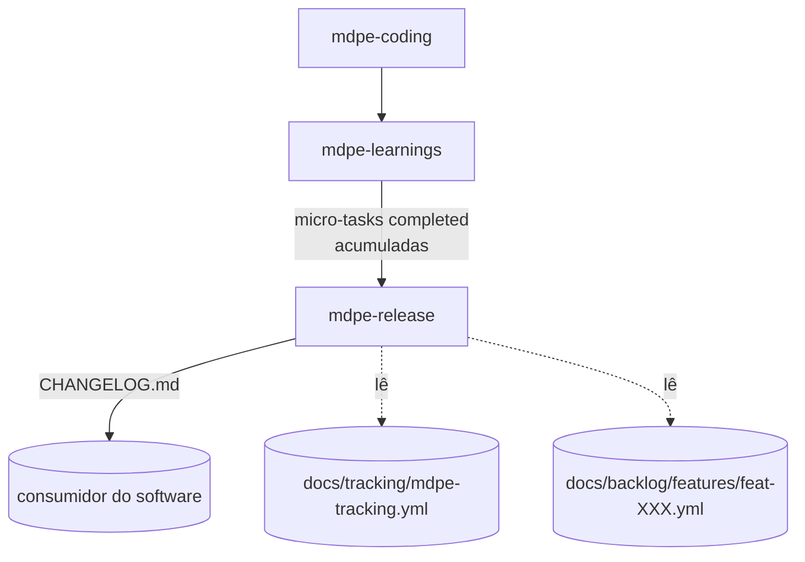

# ADR-007 — Comunicação de release (`mdpe-release`)

| Campo | Valor |
|---|---|
| **Status** | Aceito |
| **Data** | 29/08/2026 |
| **Tarefa de origem** | `tasks-v1.md` → Fase 10 → 10.1 |
| **Eixo da rubrica** | Eixo 9 — Comunicação de release (baseline **0**, meta **4**) |
| **Implementado por** | Tarefa 10.2 (skill + template) · roteado na 10.9 · verificado na 10.10 |
| **Adoções associadas** | Nenhuma de `competitive-analysis.md` (os frameworks comparados ali não tratam de release notes). Fonte externa desta tarefa: Keep a Changelog, Conventional Commits (pesquisa web, ver Seção 8). |
| **Depende de** | ADR-004 (`docs/tracking/mdpe-tracking.yml` — status reconciliado, precedência artefato > tracking) · ADR-003 (evidência por dimensão, `fidelity.declared_outputs[].exists`) |

---

## 1. Contexto

O MDPE fecha o loop de uma micro-task (`mdpe-learnings`) e mede o processo (`mdpe-tracking.yml`),
mas nenhum artefato do framework é dirigido a quem **consome** o software — usuário final, cliente,
time de suporte. Evidências:

- `skills/mdpe-learnings/SKILL.md` (*Outputs*) lista `{microtask-id}-learnings.yml`,
  `aggregated-learnings.yml`, `docs/memory/project-memory.yml` e `mdpe-tracking.yml` — todos
  voltados ao próprio framework ou ao time técnico. Nenhuma linha entrega texto para quem não abre
  YAML.
- `skills/mdpe-router/SKILL.md` (*Routing table*) não tem entrada para "vamos lançar uma versão" /
  "o que mudou nesta entrega".
- `skills/mdpe-transformation/SKILL.md` (passo TG-01) gera `docs/tasks.md`, mas é um checklist de
  execução por micro-task, não uma narrativa de release por versão — e mistura tarefas concluídas e
  pendentes.

Consequência prática: ao fechar uma feature ou uma versão, a única forma de comunicar "o que mudou"
é escrever manualmente, sem rastreio ao que foi de fato implementado e evidenciado — reabrindo
exatamente o risco de alucinação que a Fase 8 (v1) trabalhou para reduzir, agora em um artefato
público em vez de interno.

Referência externa (pesquisa desta tarefa, ver Seção 8): **Keep a Changelog** é o formato de facto —
`Added`/`Changed`/`Deprecated`/`Removed`/`Fixed`/`Security`, ordem reversa cronológica, agrupado por
versão, seções passadas nunca reescritas. **Conventional Commits** é o padrão que alimenta geração
automática de changelog e bump de versão semântica a partir de mensagens de commit — mas o MDPE não
tem mensagens de commit como artefato de primeira classe (a única menção a commit é o carimbo
`generated_at` + branch/commit do `mdpe-graph`, ADR-005 D9); a fonte de verdade aqui é a micro-task
concluída e evidenciada, não a mensagem de commit.

---

## 2. Decisão

### D1 — Nova skill `mdpe-release`, não um passo dentro de `mdpe-learnings`

Motivos, na ordem de peso:

1. **Audiência diferente.** `mdpe-learnings` fala com o framework e o time (lições, métricas,
   memória); `mdpe-release` fala com quem usa o software. Misturar as duas nas mesmas saídas
   obrigaria a escrever em dois registros dentro do mesmo passo — o que o Eixo 7 (custo cognitivo)
   já reprovaria.
2. **Cadência diferente.** `mdpe-learnings` roda a cada fechamento de micro-task; um release agrupa
   várias — de uma ou mais features — cortado quando alguém decide que é hora de lançar, não a cada
   fechamento individual.
3. **Fonte é cross-feature.** Uma versão tipicamente entrega trabalho de mais de um `feat-XXX`. Um
   passo dentro de `mdpe-learnings` (por-microtask) ou de `mdpe-transformation` (por-feature)
   nasceria míope — o mesmo argumento do ADR-005 D2 para `mdpe-graph`.

### D2 — Ponto no ciclo: projeção de fechamento, sob demanda

`mdpe-release` **não é uma etapa obrigatória** do ciclo Discovery → Backlog → Transformation →
Execution. É, como `mdpe-graph`, uma projeção — mas fechando **para fora** do framework, no
vocabulário do Eixo 9, em vez de para dentro (rastreabilidade):



Roda **sob demanda**, quando alguém decide cortar uma versão — nunca a cada micro-task, nunca em
agenda fixa. Não recomputa status: lê o status reconciliado que `mdpe-learnings` já escreveu em
`mdpe-tracking.yml` (ADR-004), do mesmo modo que `mdpe-graph` lê `dependencies/*.yml` sem
recalculá-los (ADR-005 D1).

### D3 — Entradas: só o que já está `completed` e evidenciado

| Entrada | Obrigatória | Papel |
|---|:---:|---|
| Identificador de versão (ex.: `1.4.0`) | **Sim** | Cabeçalho da seção; sem ele, a skill pergunta e para. |
| `docs/tracking/mdpe-tracking.yml` | **Sim** | Fonte do conjunto de micro-tasks `completed` e reconciliadas desde a última versão cortada. |
| `docs/transformation/{feature-id}/microtasks/mt-XXX-YYY.yml` | **Sim, por micro-task incluída** | `traceability.feature_id`, `output.generated_artifacts[].location` — o que a micro-task prometeu e entregou. |
| `docs/backlog/features/feat-XXX.yml` | Não | Nome e descrição da feature em linguagem de produto, para a redação da entrada. |
| `{microtask-id}-validation.yml` | **Sim, por micro-task incluída** | Confirma `fidelity.declared_outputs[].exists` e `summary.overall_status` antes de incluir. |
| Data de corte da versão anterior (do próprio `CHANGELOG.md`, se existir) | Não | Delimita o intervalo "desde a última versão" quando o tracking não é suficiente isoladamente. |

**Regra dura:** uma micro-task só entra na entrada de release se `mdpe-tracking.yml` a reconcilia
como `completed` **e** sua validação está `approved`/`approved_with_reservations` **e** seu artefato
prometido tem `exists: true`. Nenhuma das três condições é dispensável — é a mesma tripla de
evidência que `mdpe-learnings` já exige para não gravar tracking divergente (ADR-004).

### D4 — Saída: um único `CHANGELOG.md`, formato Keep a Changelog

**Um artefato**, na raiz do repositório consumidor (convenção do próprio formato, não do MDPE):
`CHANGELOG.md`. Nenhuma árvore de YAML — o consumidor final não abre `docs/transformation/`.

Estrutura por versão:

```markdown
## [1.4.0] - 2026-08-29

### Added
- <uma linha em linguagem de produto> (`feat-004`)

### Fixed
- <uma linha em linguagem de produto> (`feat-004`)
```

Regras de conteúdo:

1. **Uma entrada por feature tocada na versão**, não uma por micro-task. Uma feature entregue por 6
   micro-tasks gera **uma** linha de changelog, não 6 — o changelog fala a língua de quem usa o
   produto, e "implementei o repositório da entidade X" não é informação para essa audiência.
2. **Categoria por evidência, nunca por adivinhação.** Ver D5.
3. **Linguagem de produto**, derivada da `description` do `feat-XXX` — reescrita para o presente do
   que o usuário passa a poder fazer, nunca copiada literal do jargão técnico da micro-task.
4. **Rastreio interno preservado em comentário HTML** (invisível na renderização, presente no
   arquivo-fonte): `<!-- feat-004: mt-004-001, mt-004-002, mt-004-005 (completed, validated) -->` —
   assim quem quiser auditar a proveniência não precisa confiar na prosa.
5. **Seção `[Unreleased]`** no topo, opcional: quando existem micro-tasks `completed` ainda não
   cortadas em versão, ficam ali até o próximo corte — nunca em uma versão já publicada.

### D5 — Categorização: confiança alta só quando há evidência citável

Keep a Changelog usa seis categorias. O MDPE não tem um campo `type: feature|fix|breaking` em
nenhum template hoje (`mdpe-microtask-template.yml`, `cognitive-backlog-template.yml`,
`architecture-decisions-template.yml`) — inventar uma categorização seria alucinação disfarçada de
formatação. Regra de três níveis:

| Categoria | Quando é atribuída (evidência exigida) |
|---|---|
| **Added** | Default para `feat-XXX` cuja primeira aparição em qualquer versão do `CHANGELOG.md` é esta. Sem entrada anterior citando o mesmo `feat-XXX` → é capacidade nova. |
| **Changed** | Default para `feat-XXX` que **já** apareceu em uma versão anterior do changelog e recebeu novas micro-tasks `completed` nesta janela. |
| **Fixed** | Só quando a micro-task tem lastro de correção: `{microtask-id}-learnings.yml` a classifica como `problems`, **ou** o `{microtask-id}-code-review.yml` de origem tinha `findings[]` com `severity: blocker`/`major` que motivaram a micro-task (rastreável via `traceability.origin_decisions` ou pela vizinhança no mesmo `feat-XXX`). |
| **Security** | Só quando o `ad-NNN` que a micro-task `implements` cita, em `drivers[].evidence`, um risco de segurança verificável (citação literal exigida). Nunca inferido do nome da micro-task. |
| **Deprecated** / **Removed** | Só quando um `ad-NNN` tem `implications[]` com `type` cobrindo remoção/depreciação, citado por `id`. Sem essa implicação declarada, nunca atribuída. |

**Sem evidência para `Fixed`/`Security`/`Deprecated`/`Removed` → cai em `Changed`.** `Changed` é o
default seguro do framework, não `Added` — presumir capacidade nova para algo que já existia seria o
erro inverso. Isso é o análogo, para categorização textual, do princípio "confiança baixa em vez de
invenção" do D-anti-fabricação de `mdpe-code-discovery` (ADR-001).

### D6 — Versionamento semântico: sugerido, nunca decidido pela skill

A skill **sugere** um bump de versão a partir das categorias presentes na janela — `Removed`/
`Deprecated` com impacto de compatibilidade → major; `Added` → minor; só `Fixed`/`Security` → patch —
seguindo a convenção pública de semver que Conventional Commits também usa (Seção 8). A sugestão é
sempre **confirmada pelo usuário antes de escrever o cabeçalho da versão**: a skill nunca decide e
grava o número de versão por conta própria. Isso seguiria o mesmo padrão de "oferece e espera
confirmação" que `mdpe-graph` já usa antes de despachar trabalho (ADR-005 D10).

### D7 — Imutabilidade de versões publicadas

Uma seção de versão já escrita **não é reeditada** por uma execução seguinte de `mdpe-release` — é
a regra central do próprio Keep a Changelog e evita que o changelog vire uma segunda fonte de verdade
divergente do que de fato foi lançado. Uma correção a uma entrada publicada entra como uma nova
entrada na versão seguinte (`### Fixed` — "corrige a descrição incorreta da versão X"), nunca como
edição retroativa.

### D8 — Sem tooling obrigatório

Mesmo contrato do ADR-005 D11: nenhum script de geração de changelog, nenhuma integração com CI, e
nenhuma dependência de mensagens de commit estruturadas (Conventional Commits) é exigida. A fonte é
sempre `mdpe-tracking.yml` + os artefatos de execução, já existentes. Se o repositório consumidor
adotar Conventional Commits por conta própria, isso não substitui esta skill — o `CHANGELOG.md`
continua rastreado a micro-task evidenciada, não a mensagem de commit.

---

## 3. Critério de "release honesto"

Uma seção de versão está válida quando **todas** valem:

- [ ] Toda entrada cita ≥1 `feat-XXX`, e esse `feat-XXX` tem ≥1 micro-task `completed` e evidenciada
      (D3) na janela da versão.
- [ ] Nenhuma entrada foi escrita para uma micro-task `pending`, `in_progress` ou `blocked`.
- [ ] Categoria segue D5; nenhuma `Fixed`/`Security`/`Deprecated`/`Removed` sem a citação de evidência
      exigida — caiu em `Changed` quando a evidência não existe.
- [ ] O comentário de rastreio interno (D4 regra 4) lista as micro-tasks reais que sustentam a linha.
- [ ] Nenhuma versão anterior foi reescrita.
- [ ] O número de versão foi confirmado pelo usuário, não decidido silenciosamente.

**Sem micro-task `completed` desde o último corte** → a resposta correta é *"nada para lançar desde
a versão {X}; nenhuma seção nova foi criada"*, e o arquivo não é tocado.

---

## 4. Alternativas consideradas

### (a) Passo dentro de `mdpe-learnings` — **rejeitada**

Custo zero de wiring. Rejeitada pelos três motivos de D1: audiência, cadência e escopo cross-feature
não combinam com uma skill que fecha uma micro-task por vez. Forçaria `mdpe-learnings` a manter dois
registros de saída com propósitos opostos (interno vs. público) no mesmo passo.

### (b) Nova skill `mdpe-release` (D1-D8) — **escolhida**

Contra a rubrica 1.2:

| Eixo | Efeito |
|---|---|
| **9 — Comunicação de release** (0 → 4) | Skill dedicada, formato canônico, categorização por evidência, imutabilidade — cobre integralmente o nível 4 do eixo novo. |
| **8 — Alucinação** | D5 é a formulação deste ADR do mesmo princípio do ADR-001/ADR-005: sem evidência citável, cai no default seguro, nunca na categoria mais chamativa. |
| **7 — Custo cognitivo** | Uma entrada por feature, não por micro-task (D4 regra 1); nenhum campo novo obrigatório em template existente. |
| Custo | +1 skill a costurar (router, `mdpe-flow.md`, `mapping-commands-to-skills.md`, README); um arquivo novo na raiz do repositório consumidor (`CHANGELOG.md`), fora da árvore `docs/` que as demais skills usam — precedente aceito porque é exigência do próprio formato Keep a Changelog. |

### (c) Automação por Conventional Commits + ferramenta de release (semantic-release e similares) —
**rejeitada para a v1**

Resolveria geração e versionamento de uma vez, mas (i) exige que todo commit do repositório siga um
formato que o MDPE não impõe em lugar nenhum; (ii) repete a Lacuna 4.1 (tooling/CI referenciado sem
existir no repositório) que o ADR-004 já corrigiu; (iii) tornaria o changelog dependente de mensagem
de commit em vez de micro-task evidenciada — uma segunda fonte de verdade. Fica registrada como
extensão futura opcional, nunca pré-requisito (mesmo contrato do ADR-005 D11 para tooling de grafo).

### (d) Um changelog por feature (`docs/backlog/features/feat-XXX-changelog.md`) — **rejeitada**

Evitaria versionamento cross-feature, mas o público de um changelog quer ver **tudo que mudou numa
versão**, não navegar por feature. Fragmentar por feature reproduziria o mesmo problema que motivou
`mdpe-graph` a unificar os `dependencies/*.yml` por feature (ADR-005 §1.1) — desta vez para a
audiência externa.

---

## 5. O que **NÃO** é obrigatório

- Mensagens de commit estruturadas (Conventional Commits) — nunca exigidas como pré-condição.
- Ferramenta de geração automática, CI, ou script de bump de versão — a skill sugere, o humano decide
  e confirma (D6).
- Uma entrada por micro-task — o changelog agrega por feature (D4 regra 1).
- Categorizar toda entrada em algo diferente de `Changed` quando a evidência de `Fixed`/`Security`/
  `Deprecated`/`Removed` não existe (D5) — `Changed` sem qualificação extra é uma saída válida.
- Seção `[Unreleased]` quando não há micro-task `completed` pendente de corte.
- Publicar uma versão a cada fechamento de micro-task — o corte é decidido pelo usuário, não
  disparado automaticamente.
- Traduzir a entrada para mais de um idioma, ou seguir qualquer template de release notes de
  plataforma específica (GitHub Releases, App Store etc.) — fora do escopo desta skill; o
  `CHANGELOG.md` é a fonte, uma adaptação de formato para outra plataforma é trabalho manual a partir
  dele.

**Regra geral:** ausência de item desta lista nunca reprova o gate da Seção 3. O que reprova é entrada
sem micro-task evidenciada, categoria sem a evidência que D5 exige, versão anterior reescrita, ou
número de versão gravado sem confirmação.

---

## 6. Consequências

**Positivas**

- Eixo 9 sai de 0 para 4 com este ADR + a implementação da tarefa 10.2.
- O framework passa a ter um artefato dirigido a quem usa o software, sem reabrir o risco de
  alucinação que a Fase 8 já havia fechado para os artefatos internos — a mesma disciplina de
  evidência é replicada para uma audiência nova.
- `mdpe-tracking.yml` (ADR-004) ganha um segundo consumidor de primeira classe, reforçando por que
  ele precisa ser confiável (status reconciliado, nunca deduzido).

**Negativas / custos**

- +1 skill a costurar, e o único artefato do framework que vive na raiz do repositório consumidor em
  vez de sob `docs/` — precisa ficar claro no wiring (10.9) para não parecer inconsistência.
- Categorização conservadora (D5) significa que a maioria das entradas cairá em `Changed` até que o
  framework tenha um campo de tipo mais explícito em algum template — é o preço de não inventar.
- Corte de versão manual (D6) significa que o changelog não anda solto: se ninguém pedir o corte, ele
  não existe, mesmo com trabalho `completed` acumulado. É a mesma postura de criação preguiçosa do
  ADR-005 (D3), aplicada aqui.

**Neutras**

- Nenhum artefato existente é reescrito. `mdpe-learnings` e `mdpe-tracking.yml` continuam exatamente
  como o ADR-004 os deixou; esta skill só os lê.
- `mdpe-release` não participa do loop de aprendizado (`mdpe-learnings` continua sendo o único ponto
  que grava lição, memória e tracking).

---

## 7. Verificação contra os cenários de teste da tarefa 10.1

| Cenário | Onde é atendido |
|---|---|
| + O ADR define entradas mínimas e saídas mínimas e o ponto no ciclo | D3 (entradas), D4 (saída), D2 (posição — projeção sob demanda, não etapa obrigatória) |
| + Define a fonte de cada entrada de changelog (rastreio a microtask completed + evidenciada) | D3 regra dura, D5, comentário de rastreio (D4 regra 4) |
| + Formato padronizado (Keep a Changelog) com categorias e critério de inclusão | D4, D5 |
| − Não inventa categoria sem evidência citável | D5 (default `Changed` sem qualificação extra) |
| − Não reescreve versão publicada | D7, Seção 3 |

---

## 8. Fontes

**Internas (lidas para este ADR):** `skills/mdpe-learnings/SKILL.md` (*Outputs*, tracking, curadoria
de lições) · `skills/mdpe-learnings/assets/templates/mdpe-tracking.yml` (status reconciliado) ·
`docs/adr/adr-004-execution-metrics.md` (precedência artefato > tracking, D1 projeção derivada) ·
`docs/adr/adr-005-traceability-graph.md` (D1 procedência, D3 criação preguiçosa, D10 oferece e espera
confirmação, D11 sem tooling obrigatório) · `docs/adr/adr-001-brownfield-discovery.md` (confiança
baixa em vez de invenção, como precedente de design para D5) ·
`skills/mdpe-transformation/SKILL.md` (passo TG-01, `docs/tasks.md`) ·
`docs/analysis/baseline-gap-map.md` (Lacuna R.1) · `docs/analysis/evaluation-rubric.md` (Eixo 9).

**Externas:** Keep a Changelog — [keepachangelog.com](https://keepachangelog.com/) (formato:
`Added`/`Changed`/`Deprecated`/`Removed`/`Fixed`/`Security`; ordem reversa cronológica; versões
imutáveis) · Conventional Commits — [conventionalcommits.org](https://www.conventionalcommits.org/)
(convenção de mensagens de commit que alimenta geração automática de changelog e bump semver; citada
como referência de versionamento, não adotada como pré-requisito, ver Alternativa (c)).

> Conteúdo parafraseado a partir das fontes para conformidade de licenciamento; pesquisa web realizada
> em 29/08/2026.
