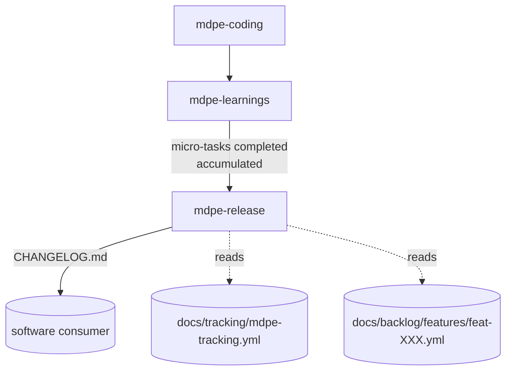

# ADR-007 — Release communication (`mdpe-release`)

| Field | Value |
|---|---|
| **Status** | Accepted |
| **Date** | 29/08/2026 |
| **Source task** | `tasks-v1.md` → Phase 10 → 10.1 |
| **Rubric axis** | Axis 9 — Release communication (baseline **0**, target **4**) |
| **Implemented by** | Task 10.2 (skill + template) · routed in 10.9 · verified in 10.10 |
| **Associated adoptions** | None from `competitive-analysis.md` (the frameworks compared there do not address release notes). External source for this task: Keep a Changelog, Conventional Commits (web research, see Section 8). |
| **Depends on** | ADR-004 (`docs/tracking/mdpe-tracking.yml` — reconciled status, artifact > tracking precedence) · ADR-003 (evidence per dimension, `fidelity.declared_outputs[].exists`) |

---

## 1. Context

MDPE closes the loop of a micro-task (`mdpe-learnings`) and measures the process
(`mdpe-tracking.yml`), but no framework artifact is directed at whoever **consumes** the software —
end user, customer, support team. Evidence:

- `skills/mdpe-learnings/SKILL.md` (*Outputs*) lists `{microtask-id}-learnings.yml`,
  `aggregated-learnings.yml`, `docs/memory/project-memory.yml` and `mdpe-tracking.yml` — all
  directed at the framework itself or the technical team. No line delivers text to someone who
  doesn't open YAML.
- `skills/mdpe-router/SKILL.md` (*Routing table*) has no entry for "let's ship a release" /
  "what changed in this delivery."
- `skills/mdpe-transformation/SKILL.md` (step TG-01) generates `docs/tasks.md`, but that's an
  execution checklist per micro-task, not a release narrative per version — and it mixes completed
  and pending tasks.

Practical consequence: when a feature or version is closed, the only way to communicate "what
changed" is to write it manually, with no trace back to what was actually implemented and
evidenced — reopening exactly the hallucination risk that Phase 8 (v1) worked to reduce, now in a
public artifact instead of an internal one.

External reference (research for this task, see Section 8): **Keep a Changelog** is the de facto
format — `Added`/`Changed`/`Deprecated`/`Removed`/`Fixed`/`Security`, reverse chronological order,
grouped by version, past sections never rewritten. **Conventional Commits** is the standard that
feeds automatic changelog generation and semantic version bumps from commit messages — but MDPE
does not treat commit messages as a first-class artifact (the only mention of a commit is the
`generated_at` timestamp plus branch/commit from `mdpe-graph`, ADR-005 D9); the source of truth here
is the completed and evidenced micro-task, not the commit message.

---

## 2. Decision

### D1 — New skill `mdpe-release`, not a step inside `mdpe-learnings`

Reasons, in order of weight:

1. **Different audience.** `mdpe-learnings` speaks to the framework and the team (lessons, metrics,
   memory); `mdpe-release` speaks to whoever uses the software. Mixing the two in the same outputs
   would force writing in two registers within the same step — which Axis 7 (cognitive cost) would
   already reject.
2. **Different cadence.** `mdpe-learnings` runs at every micro-task closure; a release groups
   several — from one or more features — cut when someone decides it's time to ship, not at every
   individual closure.
3. **Source is cross-feature.** A version typically delivers work from more than one `feat-XXX`. A
   step inside `mdpe-learnings` (per-microtask) or `mdpe-transformation` (per-feature) would be born
   short-sighted — the same argument from ADR-005 D2 for `mdpe-graph`.

### D2 — Point in the cycle: closure projection, on demand

`mdpe-release` **is not a mandatory step** in the Discovery → Backlog → Transformation → Execution
cycle. Like `mdpe-graph`, it is a projection — but closing **outward** from the framework, in the
vocabulary of Axis 9, rather than inward (traceability):



Runs **on demand**, when someone decides to cut a version — never at every micro-task, never on a
fixed schedule. It does not recompute status: it reads the reconciled status that `mdpe-learnings`
has already written to `mdpe-tracking.yml` (ADR-004), the same way `mdpe-graph` reads
`dependencies/*.yml` without recalculating them (ADR-005 D1).

### D3 — Inputs: only what is already `completed` and evidenced

| Input | Required | Role |
|---|:---:|---|
| Version identifier (e.g., `1.4.0`) | **Yes** | Section header; without it, the skill asks and stops. |
| `docs/tracking/mdpe-tracking.yml` | **Yes** | Source of the set of `completed` and reconciled micro-tasks since the last version cut. |
| `docs/transformation/{feature-id}/microtasks/mt-XXX-YYY.yml` | **Yes, per included micro-task** | `traceability.feature_id`, `output.generated_artifacts[].location` — what the micro-task promised and delivered. |
| `docs/backlog/features/feat-XXX.yml` | No | Feature name and description in product language, for drafting the entry. |
| `{microtask-id}-validation.yml` | **Yes, per included micro-task** | Confirms `fidelity.declared_outputs[].exists` and `summary.overall_status` before inclusion. |
| Previous version's cutoff date (from `CHANGELOG.md` itself, if it exists) | No | Delimits the "since the last version" window when tracking alone is insufficient. |

**Hard rule:** a micro-task only enters a release entry if `mdpe-tracking.yml` reconciles it as
`completed` **and** its validation is `approved`/`approved_with_reservations` **and** its promised
artifact has `exists: true`. None of the three conditions is optional — it is the same evidence
triple that `mdpe-learnings` already requires to avoid writing divergent tracking (ADR-004).

### D4 — Output: a single `CHANGELOG.md`, Keep a Changelog format

**One artifact**, at the root of the consuming repository (a convention of the format itself, not
of MDPE): `CHANGELOG.md`. No YAML tree — the end consumer does not open `docs/transformation/`.

Structure per version:

```markdown
## [1.4.0] - 2026-08-29

### Added
- <one line in product language> (`feat-004`)

### Fixed
- <one line in product language> (`feat-004`)
```

Content rules:

1. **One entry per feature touched in the version**, not one per micro-task. A feature delivered by
   6 micro-tasks generates **one** changelog line, not 6 — the changelog speaks the language of
   whoever uses the product, and "implemented the repository for entity X" is not information for
   that audience.
2. **Category by evidence, never by guesswork.** See D5.
3. **Product language**, derived from the `description` of the `feat-XXX` — rewritten in the present
   tense of what the user can now do, never copied verbatim from the micro-task's technical jargon.
4. **Internal traceability preserved in an HTML comment** (invisible in rendering, present in the
   source file): `<!-- feat-004: mt-004-001, mt-004-002, mt-004-005 (completed, validated) -->` —
   so anyone wanting to audit provenance doesn't need to trust the prose.
5. **`[Unreleased]` section** at the top, optional: when there are `completed` micro-tasks not yet
   cut into a version, they stay there until the next cut — never in an already published version.

### D5 — Categorization: high confidence only when there is citable evidence

Keep a Changelog uses six categories. MDPE does not have a `type: feature|fix|breaking` field in any
template today (`mdpe-microtask-template.yml`, `cognitive-backlog-template.yml`,
`architecture-decisions-template.yml`) — inventing a categorization would be hallucination disguised
as formatting. Three-tier rule:

| Category | When it is assigned (evidence required) |
|---|---|
| **Added** | Default for a `feat-XXX` whose first appearance in any version of `CHANGELOG.md` is this one. No prior entry citing the same `feat-XXX` → it is a new capability. |
| **Changed** | Default for a `feat-XXX` that **already** appeared in a previous changelog version and received new `completed` micro-tasks in this window. |
| **Fixed** | Only when the micro-task has fix backing: `{microtask-id}-learnings.yml` classifies it as `problems`, **or** the originating `{microtask-id}-code-review.yml` had `findings[]` with `severity: blocker`/`major` that motivated the micro-task (traceable via `traceability.origin_decisions` or by adjacency within the same `feat-XXX`). |
| **Security** | Only when the `ad-NNN` that the micro-task `implements` cites, in `drivers[].evidence`, a verifiable security risk (literal citation required). Never inferred from the micro-task's name. |
| **Deprecated** / **Removed** | Only when an `ad-NNN` has `implications[]` with a `type` covering removal/deprecation, cited by `id`. Without that declared implication, never assigned. |

**No evidence for `Fixed`/`Security`/`Deprecated`/`Removed` → falls into `Changed`.** `Changed` is
the framework's safe default, not `Added` — assuming a new capability for something that already
existed would be the reverse error. This is the analogue, for textual categorization, of the
"low confidence over invention" principle from the anti-fabrication decision of `mdpe-code-discovery`
(ADR-001).

### D6 — Semantic versioning: suggested, never decided by the skill

The skill **suggests** a version bump based on the categories present in the window —
`Removed`/`Deprecated` with a compatibility impact → major; `Added` → minor; only `Fixed`/`Security`
→ patch — following the public semver convention that Conventional Commits also uses (Section 8).
The suggestion is always **confirmed by the user before writing the version header**: the skill
never decides and records the version number on its own. This follows the same "offer and wait for
confirmation" pattern that `mdpe-graph` already uses before dispatching work (ADR-005 D10).

### D7 — Immutability of published versions

A version section already written **is not re-edited** by a subsequent run of `mdpe-release` — this
is the core rule of Keep a Changelog itself and prevents the changelog from becoming a second source
of truth that diverges from what was actually released. A correction to a published entry goes in as
a new entry in the following version (`### Fixed` — "corrects the incorrect description of version
X"), never as a retroactive edit.

### D8 — No mandatory tooling

Same contract as ADR-005 D11: no changelog generation script, no CI integration, and no dependency on
structured commit messages (Conventional Commits) is required. The source is always
`mdpe-tracking.yml` plus the already existing execution artifacts. If the consuming repository adopts
Conventional Commits on its own, that does not replace this skill — `CHANGELOG.md` remains traced to
an evidenced micro-task, not to the commit message.

---

## 3. "Honest release" criteria

A version section is valid when **all** of the following hold:

- [ ] Every entry cites ≥1 `feat-XXX`, and that `feat-XXX` has ≥1 `completed` and evidenced
      micro-task (D3) within the version's window.
- [ ] No entry was written for a `pending`, `in_progress`, or `blocked` micro-task.
- [ ] Category follows D5; no `Fixed`/`Security`/`Deprecated`/`Removed` without the required evidence
      citation — it falls into `Changed` when the evidence does not exist.
- [ ] The internal traceability comment (D4 rule 4) lists the actual micro-tasks that support the
      line.
- [ ] No previous version was rewritten.
- [ ] The version number was confirmed by the user, not decided silently.

**No `completed` micro-task since the last cut** → the correct response is *"nothing to release
since version {X}; no new section was created"*, and the file is left untouched.

---

## 4. Alternatives considered

### (a) A step inside `mdpe-learnings` — **rejected**

Zero wiring cost. Rejected for the same three reasons as D1: audience, cadence, and cross-feature
scope don't match a skill that closes one micro-task at a time. It would force `mdpe-learnings` to
maintain two output registers with opposite purposes (internal vs. public) in the same step.

### (b) New skill `mdpe-release` (D1-D8) — **chosen**

Against rubric 1.2:

| Axis | Effect |
|---|---|
| **9 — Release communication** (0 → 4) | Dedicated skill, canonical format, evidence-based categorization, immutability — fully covers level 4 of the new axis. |
| **8 — Hallucination** | D5 is this ADR's formulation of the same principle from ADR-001/ADR-005: without citable evidence, fall to the safe default, never to the flashiest category. |
| **7 — Cognitive cost** | One entry per feature, not per micro-task (D4 rule 1); no new mandatory field in any existing template. |
| Cost | +1 skill to wire in (router, `mdpe-flow.md`, `mapping-commands-to-skills.md`, README); one new file at the root of the consuming repository (`CHANGELOG.md`), outside the `docs/` tree that the other skills use — an accepted precedent because it is a requirement of the Keep a Changelog format itself. |

### (c) Automation via Conventional Commits + a release tool (semantic-release and similar) —
**rejected for v1**

Would solve generation and versioning at once, but (i) requires every commit in the repository to
follow a format that MDPE imposes nowhere; (ii) repeats Gap 4.1 (tooling/CI referenced without
existing in the repository) that ADR-004 already fixed; (iii) would make the changelog dependent on
commit messages instead of evidenced micro-tasks — a second source of truth. Recorded as an optional
future extension, never a prerequisite (same contract as ADR-005 D11 for graph tooling).

### (d) One changelog per feature (`docs/backlog/features/feat-XXX-changelog.md`) — **rejected**

Would avoid cross-feature versioning, but a changelog's audience wants to see **everything that
changed in a version**, not browse by feature. Fragmenting by feature would reproduce the same
problem that motivated `mdpe-graph` to unify `dependencies/*.yml` per feature (ADR-005 §1.1) — this
time for the external audience.

---

## 5. What is **NOT** mandatory

- Structured commit messages (Conventional Commits) — never required as a precondition.
- Automatic generation tooling, CI, or a version bump script — the skill suggests, the human decides
  and confirms (D6).
- One entry per micro-task — the changelog aggregates by feature (D4 rule 1).
- Categorizing every entry as something other than `Changed` when evidence for `Fixed`/`Security`/
  `Deprecated`/`Removed` does not exist (D5) — `Changed` with no extra qualification is a valid
  output.
- An `[Unreleased]` section when there is no `completed` micro-task pending a cut.
- Publishing a version at every micro-task closure — the cut is decided by the user, never triggered
  automatically.
- Translating the entry into more than one language, or following any platform-specific release
  notes template (GitHub Releases, App Store, etc.) — out of scope for this skill; `CHANGELOG.md` is
  the source, and adapting the format for another platform is manual work done from it.

**General rule:** the absence of an item from this list never fails the gate in Section 3. What
fails it is an entry without an evidenced micro-task, a category without the evidence D5 requires, a
rewritten previous version, or a version number recorded without confirmation.

---

## 6. Consequences

**Positive**

- Axis 9 goes from 0 to 4 with this ADR plus the implementation of task 10.2.
- The framework now has an artifact directed at whoever uses the software, without reopening the
  hallucination risk that Phase 8 had already closed for internal artifacts — the same evidence
  discipline is replicated for a new audience.
- `mdpe-tracking.yml` (ADR-004) gains a second first-class consumer, reinforcing why it needs to be
  reliable (reconciled status, never inferred).

**Negative / costs**

- +1 skill to wire in, and the only framework artifact that lives at the root of the consuming
  repository instead of under `docs/` — this needs to be made explicit in the wiring (10.9) so it
  doesn't look like an inconsistency.
- Conservative categorization (D5) means most entries will fall into `Changed` until the framework
  has a more explicit type field in some template — that's the price of not inventing.
- Manual version cutting (D6) means the changelog doesn't drift on its own: if nobody requests the
  cut, it doesn't exist, even with `completed` work accumulated. It's the same lazy-creation stance
  as ADR-005 (D3), applied here.

**Neutral**

- No existing artifact is rewritten. `mdpe-learnings` and `mdpe-tracking.yml` remain exactly as
  ADR-004 left them; this skill only reads them.
- `mdpe-release` does not participate in the learning loop (`mdpe-learnings` remains the only point
  that records lessons, memory, and tracking).

---

## 7. Verification against task 10.1's test scenarios

| Scenario | Where it is addressed |
|---|---|
| + The ADR defines minimum inputs and minimum outputs and the point in the cycle | D3 (inputs), D4 (output), D2 (position — on-demand projection, not a mandatory step) |
| + Defines the source of each changelog entry (traced to a completed and evidenced microtask) | D3 hard rule, D5, traceability comment (D4 rule 4) |
| + Standardized format (Keep a Changelog) with categories and inclusion criteria | D4, D5 |
| − Does not invent a category without citable evidence | D5 (`Changed` default with no extra qualification) |
| − Does not rewrite a published version | D7, Section 3 |

---

## 8. Sources

**Internal (read for this ADR):** `skills/mdpe-learnings/SKILL.md` (*Outputs*, tracking, lesson
curation) · `skills/mdpe-learnings/assets/templates/mdpe-tracking.yml` (reconciled status) ·
`docs/adr/adr-004-execution-metrics.md` (artifact > tracking precedence, D1 derived projection) ·
`docs/adr/adr-005-traceability-graph.md` (D1 provenance, D3 lazy creation, D10 offer and wait for
confirmation, D11 no mandatory tooling) · `docs/adr/adr-001-brownfield-discovery.md` (low confidence
over invention, as a design precedent for D5) · `skills/mdpe-transformation/SKILL.md` (step TG-01,
`docs/tasks.md`) · `docs/analysis/baseline-gap-map.md` (Gap R.1) ·
`docs/analysis/evaluation-rubric.md` (Axis 9).

**External:** Keep a Changelog — [keepachangelog.com](https://keepachangelog.com/) (format:
`Added`/`Changed`/`Deprecated`/`Removed`/`Fixed`/`Security`; reverse chronological order; immutable
versions) · Conventional Commits — [conventionalcommits.org](https://www.conventionalcommits.org/)
(commit message convention that feeds automatic changelog generation and semver bumps; cited as a
versioning reference, not adopted as a prerequisite, see Alternative (c)).

> Content paraphrased from the sources for licensing compliance; web research conducted on
> 29/08/2026.
