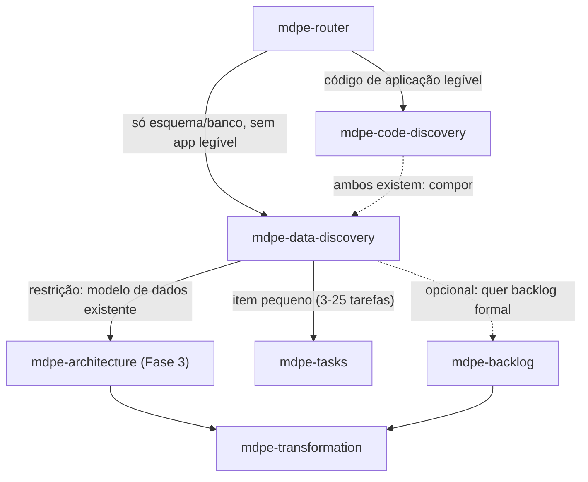

# ADR-008 — Discovery de esquema/banco legado (`mdpe-data-discovery`)

| Campo | Valor |
|---|---|
| **Status** | Aceito |
| **Data** | 29/08/2026 |
| **Tarefa de origem** | `tasks-v1.md` → Fase 10 → 10.3 |
| **Eixo da rubrica** | Eixo 1 — Cobertura brownfield, extensão (baseline **4**, já atingido na v1; esta skill não move a meta do eixo, fecha uma porta de entrada que faltava dentro dele) |
| **Implementado por** | Tarefa 10.4 (skill + template) · roteado na 10.9 · verificado na 10.10 |
| **Adoções associadas** | Reaproveita a postura anti-fabricação de A7/A10 (`competitive-analysis.md`, citadas via ADR-001) sem introduzir adoção nova. Fonte externa desta tarefa: literatura de Database Reverse Engineering (DBRE) (pesquisa web, ver Seção 8). |
| **Depende de** | ADR-001 (`cf-NNN`, entradas/saídas mínimas, regras anti-fabricação, ponte para arquitetura/transformation — este ADR herda a forma, não repete a decisão) |

---

## 1. Contexto

`mdpe-code-discovery` (ADR-001) resolveu a Lacuna 2.1-2.3: o repositório já tem código de aplicação
legível (manifests, rotas, handlers), e a skill reconstrói features a partir dele. Mas há um caso que
essa skill não cobre por desenho, não por descuido:

- `skills/mdpe-code-discovery/SKILL.md` (*Inputs*) e o Phase 2 ("Section 1: Stack & runtime") tratam
  como fonte apenas manifests de aplicação: `package.json`, `*.csproj`, `pom.xml`, `pyproject.toml`,
  lockfiles, `Dockerfile`. Nenhuma menção a schema SQL, DDL, arquivo de migration, ou dump de banco
  como entrada de primeira classe.
- O Phase 5 ("Section 4: Reconstructed feature map") deriva candidatos de "routes and endpoints,
  handlers/controllers, use cases/services, screens/views, scheduled jobs and consumers, and data
  entities" — a **última** fonte da lista, entidades de dados, aparece como apoio à leitura de
  código de aplicação, nunca como ponto de partida próprio.
- Consequência: um banco de dados legado sem camada de aplicação legível (ex.: só um dump SQL Server
  de 200 tabelas, sem código-fonte de aplicação recuperável, ou com a aplicação em uma stack que o
  agente não tem como executar/ler com confiança) **não tem porta de entrada**. O usuário ou força
  `mdpe-code-discovery` a inventariar um "código" que não existe, ou cai de volta em
  `mdpe-backlog-discovery` (greenfield) — perdendo justamente a informação real que o banco contém.

Esta é a Lacuna R.2 (`baseline-gap-map.md` Seção F). O gatilho é estrutural, não de qualidade: um
banco relacional/documental **é** evidência de domínio — tabelas, colunas, tipos, chaves estrangeiras,
constraints e índices codificam decisões de modelagem reais, do mesmo modo que rotas e handlers
codificam decisões de aplicação reais em `mdpe-code-discovery`.

Referência externa (pesquisa desta tarefa, Seção 8): a literatura de **Database Reverse Engineering
(DBRE)** trata a extração de modelo conceitual a partir de esquema relacional como uma disciplina
própria — o esquema, mais os dados e as convenções de nomenclatura observadas, é a evidência; a
inferência de intenção de negócio não observável no esquema (por que uma coluna existe, o que uma
tabela "realmente" representa além do que suas colunas e chaves declaram) é o erro clássico que essa
literatura já nomeia e evita.

---

## 2. Decisão

### D1 — Nova skill `mdpe-data-discovery`, irmã de `mdpe-code-discovery` — não uma seção nova nela

Motivos:

1. **Fonte de evidência incompatível.** `mdpe-code-discovery` lê manifests + amostragem de código;
   esta skill lê DDL/schema + amostragem de dados. Misturar as duas no mesmo *Inputs* obrigaria a
   skill a decidir qual fonte é primária quando ambas existem — decisão que pertence ao usuário, não
   ao gate de uma skill só.
2. **Vocabulário de saída diferente.** `mdpe-code-discovery` produz `cf-NNN` a partir de rota/caso de
   uso/tela. Esta skill produz candidatos a partir de tabela/relação/constraint — o "nome" de uma
   feature reconstruída a partir de um esquema é, na melhor das hipóteses, o nome da entidade
   principal envolvida, nunca um verbo de caso de uso que o esquema não declara.
3. **Precedente já aceito no repositório.** O mesmo argumento que separou `mdpe-frontend-discovery`,
   `mdpe-figma-discovery` e `mdpe-image-discovery` como skills irmãs em vez de modos dentro de
   `mdpe-code-discovery` (`mapping-commands-to-skills.md`, tabela de enablers): contrato de entrada
   diferente + `description` disjunto para roteamento preciso.

### D2 — Ponto no ciclo: entrada brownfield alternativa, mesmo nível de `mdpe-code-discovery`

Regras de posição, herdadas de ADR-001 D2 sem alteração:

- **Roda antes** de `mdpe-architecture`, `mdpe-transformation` e `mdpe-tasks`.
- **Roda uma vez por escopo** (schema/banco/serviço) e é reexecutada quando o esquema mudar (nova
  migration aplicada, tabela removida) — mesma regra de `verified_at` de ADR-001 D7.
- **Compõe com `mdpe-code-discovery`** quando ambos existem: um sistema com aplicação parcialmente
  legível e um banco com tabelas que a aplicação nunca expôs roda as duas skills, e cada inventário
  cita o outro na seção 7 (concerns) quando divergem — nunca um sobrescreve o outro.

### D3 — Entradas mínimas: o esquema é obrigatório; dados de amostra e app são apoio opcional

| Entrada | Obrigatória | Observação |
|---|:---:|---|
| Fonte do esquema (DDL exportado, string de conexão só-leitura, migrations versionadas, ou dump) | **Sim** | Sem ela, a skill pergunta e para. Uma conexão só-leitura é preferível a um dump desatualizado — ver D7 (divergência). |
| Escopo (schema/database/subconjunto de tabelas) | Não | Recomendado quando há >~80 tabelas. Default: todo o esquema acessível. |
| Amostra de dados (linhas reais, mesmo que poucas) | Não | Quando disponível, é a evidência mais forte para decidir se uma FK nullable é uma relação real ou vestigial (D6). Sem ela, a skill infere só da estrutura e marca confiança mais baixa. |
| Objetivo declarado do usuário | Não | Enviesa a ordem de leitura das tabelas, como em ADR-001 D3. |
| Inventário de `mdpe-code-discovery`, se existir | Não | Insumo secundário de composição (D2); nunca obrigatório. |
| Convenções de nomenclatura documentadas (dicionário de dados, se existir) | Não | Usado para checar, nunca para preencher — mesma regra que ADR-001 aplica à documentação existente. |

### D4 — Saída: um único artefato, mesma forma de `brownfield-inventory.md`

**Um artefato**: `docs/brownfield/data-inventory.md` (ou `data-inventory-{scope}.md` por escopo
grande). Mesma justificativa de ADR-001 D4 (criação preguiçosa, um template, zero arquivo-fantasma).

Seções **essenciais**:

| # | Seção | Conteúdo | Fonte da evidência |
|---|---|---|---|
| 1 | **Motor e versão** | SGBD, versão, encoding/collation quando relevante | metadado do próprio esquema (`information_schema`, `sys.*`, `pg_catalog`, export de DDL) |
| 2 | **Entidades e relações** | tabelas/coleções, colunas com tipo e nulidade, chaves primárias, chaves estrangeiras com a cardinalidade que a constraint declara | DDL real; nunca a cardinalidade "provável" sem a FK/constraint que a declare |
| 3 | **Convenções observadas** | nomenclatura de tabela/coluna, padrão de chave (natural vs. substituta), presença/ausência de auditoria (`created_at`, soft delete) | amostragem de nomes reais + presença real das colunas, não suposição de padrão |
| 4 | **Mapa de domínio reconstruído** | tabela `dm-NNN` (ver D5) | agrupamento de tabelas por FK forte + nome semântico compartilhado |

Seções **condicionais**:

| # | Seção | Só quando |
|---|---|---|
| 5 | **Views e procedures** | há views, stored procedures ou triggers no escopo — frequentemente onde lógica de negócio real fica escondida em sistemas legados |
| 6 | **Volume e distribuição** | há acesso a contagem de linhas/estatística; usado para sinalizar tabela morta (0 linhas) ou tabela dominante |
| 7 | **Preocupações / dívida** | há evidência concreta: FK sem índice, coluna nullable que a amostra nunca tem nula (candidata a `NOT NULL` não aplicado), tabela sem chave primária, nome que contradiz o dado real observado |

### D5 — Contrato do mapa de domínio reconstruído

Mesmo espírito do `cf-NNN` de ADR-001 D5, adaptado à evidência disponível:

| Campo | Regra |
|---|---|
| `id` | `dm-NNN` (*data model*), sequencial, estável. Ao promover para backlog/arquitetura, referencia `origin: dm-NNN`, do mesmo modo que `cf-NNN` referencia `origin` em ADR-001. |
| `nome` | nome da entidade principal do agrupamento, tal como o esquema a nomeia — nunca traduzido para um caso de uso que o esquema não declara |
| `descrição` | uma frase: o que as tabelas do grupo **armazenam hoje**, derivada de colunas e tipos reais |
| `tabelas` | **≥1 tabela real e verificada no esquema.** Campo bloqueante: sem tabela real, o domínio não é emitido. |
| `relações` | FKs reais que ligam este grupo a outros `dm-NNN`, citando a constraint |
| `confiança` | `alta` (PK + FK declaradas + amostra de dados confirma o padrão) · `média` (estrutura clara, sem amostra de dados) · `baixa` (nome sugere agrupamento, FK ausente ou fraca) |
| `lacunas` | opcional: o que a estrutura não permite determinar (ex.: "coluna `status` sem CHECK constraint nem enum — valores possíveis desconhecidos sem amostra") |

### D6 — A regra dura desta skill: estrutura observável, nunca intenção de negócio

Esta é a adição que justifica um ADR próprio em vez de apenas herdar D5 de ADR-001 sem comentário.
DBRE (Seção 8) nomeia explicitamente o erro de atribuir semântica de negócio não observável a uma
coluna ou relação. Regra:

1. **Cardinalidade vem da constraint, nunca de suposição.** Uma FK nullable é `0..1`, não `1..1`, até
   prova em contrário (amostra de dados sem nenhum nulo é evidência, não a constraint reescrita).
2. **Nome de coluna não é significado confirmado.** Uma coluna chamada `status` sem `CHECK` nem enum
   documentado tem valores `desconhecido` até que dados reais mostrem o domínio de valores — nunca
   "provavelmente é active/inactive".
3. **Tabela sem FK para outra não é "solta" nem "central" por suposição.** Ausência de relação
   declarada é registrada como ausência, nunca como julgamento sobre a importância da tabela.
4. **Nenhuma regra de negócio é inferida de um nome de trigger/procedure sem ler seu corpo.** Se o
   corpo não pôde ser lido (procedure compilada, permissão insuficiente), a existência é registrada
   e o comportamento marcado `desconhecido` — nunca resumido pelo nome.
5. **Repositório/escopo sem esquema acessível** → a skill responde "sem esquema para descobrir", não
   emite domínios, e sugere `mdpe-code-discovery` (se há aplicação) ou `mdpe-backlog-discovery`
   (greenfield). Mesmo tratamento de ADR-001 D5 regra 4.

### D7 — Esquema vence documentação e dump antigo vence prompt do usuário sobre "como era"

Mesma hierarquia de evidência de ADR-001 D5 regra 5, adaptada: um dicionário de dados desatualizado ou
a lembrança do usuário sobre "como o banco deveria estar" nunca substitui o que o esquema real declara
agora. Divergência vai para a seção 7 (preocupações), com o esquema como verdade.

### D8 — Ponte para as fases seguintes

Idêntica em forma à tabela de ADR-001 D7, com `dm-NNN` no lugar de `cf-NNN`:

| Situação após o inventário | Rota | Como o inventário é consumido |
|---|---|---|
| Nova feature/melhoria pequena | `mdpe-tasks` | `tabelas` do `dm-NNN` tocado tornam-se os **Reference files/tables** da tarefa |
| Feature grande / trilha auditável | `mdpe-backlog` (opcional) → `mdpe-transformation` | preenche o *Technical context*; `dm-NNN` promovido mantém `origin` |
| Decisão arquitetural em jogo | `mdpe-architecture` (Fase 3) | seções 2, 3, 5 e 7 entram como **restrição**: o modelo de dados observado é ponto de partida, não folha em branco |
| Aplicação também existe e é legível | compor com `mdpe-code-discovery` | os dois inventários se citam mutuamente na seção 7 quando divergem |
| Só entender o domínio | fim | o inventário é o entregável |
| Sem esquema acessível | `mdpe-backlog-discovery` ou `mdpe-code-discovery` | nenhum domínio emitido |

---

## 3. Critério de "mínimo para seguir"

- [ ] Seção 1 (motor/versão) preenchida a partir de metadado real do esquema, ou `desconhecido` com o
      motivo.
- [ ] Seção 2 (entidades/relações) reflete tabelas e FKs reais, com cardinalidade da constraint, não
      de suposição.
- [ ] Seção 3 (convenções) lista ≥1 convenção observada com a evidência (nome real, coluna real).
- [ ] Seção 4 contém **≥1 domínio reconstruído** com ≥1 tabela real e nível de confiança.
- [ ] Nenhuma tabela/coluna citada é inexistente; nenhum campo contém `TBD`/placeholder; nenhuma
      cardinalidade ou significado de coluna é apresentado como certo sem a constraint/amostra que o
      sustente (D6).

Esquema inacessível satisfaz o gate de outra forma: "sem esquema para descobrir" + encaminhamento é a
saída correta, e nenhum artefato é criado.

---

## 4. Alternativas consideradas

### (a) Seção nova dentro de `mdpe-code-discovery` — **rejeitada**

Rejeitada pelos três motivos de D1. Adicionalmente: o *Anti-fabrication rules* de
`mdpe-code-discovery` (regra 6, "describe, do not estimate") já é específico a features de aplicação;
sobrecarregar a mesma skill com a regra de D6 (cardinalidade de constraint, não de suposição) forçaria
um gate com duas gramáticas de evidência diferentes.

### (b) Nova skill `mdpe-data-discovery` (D1-D8) — **escolhida**

| Eixo | Efeito |
|---|---|
| **1 — Brownfield** | Fecha a porta de entrada que faltava (Lacuna R.2) sem mover a meta já atingida (4) do eixo — é extensão de cobertura, não elevação de nível. |
| **8 — Alucinação** | D6 é a formulação desta skill do mesmo princípio de ADR-001: estrutura observável vence suposição de intenção. |
| **2 — Arquitetura** | Entrega "modelo de dados observado" como restrição explícita para a Fase 3, do mesmo modo que ADR-001 entrega "arquitetura observada". |
| Custo | +1 skill a costurar. Mitigado pelo wiring obrigatório (10.9). |

### (c) Tratar como modo de profundidade dentro de `mdpe-architecture` — **rejeitada**

`mdpe-architecture` decide a partir de drivers já existentes; não lê esquema bruto por desenho
(`ADR-002`). Colocar leitura de DDL ali inverteria a separação já estabelecida entre "produzir
inventário" (discovery) e "decidir a partir de inventário" (architecture).

---

## 5. O que **NÃO** é obrigatório

Idêntico em espírito a ADR-001 §5, adaptado:

- Amostra de dados — sem ela, a skill roda só com estrutura e confiança mais baixa (D3, D5).
- Leitura de código de aplicação — só entra por composição (D2), nunca como pré-requisito.
- Views/procedures/triggers (seção 5) e volume/distribuição (seção 6) — condicionais, ausência é
  resposta válida.
- Qualquer estimativa de esforço, prioridade ou valor de negócio dos domínios reconstruídos.
- Cobertura exaustiva de esquemas com centenas de tabelas sem escopo declarado.
- Dicionário de dados, ERD externo, ou qualquer ferramenta de modelagem — a skill lê o esquema
  diretamente.

**Regra geral:** ausência de item desta lista nunca reprova o gate da Seção 3. O que reprova é tabela
inexistente, `TBD`, domínio sem tabela real, e cardinalidade/significado apresentado como certo sem a
constraint ou amostra que o sustente.

---

## 6. Consequências

**Positivas**

- Fecha a Lacuna R.2 sem reabrir ADR-001 nem duplicar sua decisão — herda a forma, adiciona a regra
  de evidência específica a esquema (D6).
- Sistemas legados data-first (banco sem aplicação legível, ou aplicação em stack não confiável de
  ler) ganham porta de entrada própria pela primeira vez.
- Compõe com `mdpe-code-discovery` sem exigir escolha exclusiva entre as duas.

**Negativas / custos**

- +1 skill a manter e a costurar.
- Esquemas muito grandes sem documentação de negócio deixam muitos campos `desconhecido` por design
  (D6) — é o preço de não inventar significado, e precisa ser comunicado como resultado esperado, não
  como fraqueza da skill.
- Views/procedures com corpo ilegível (permissão, compilação) ficam registradas como existência sem
  comportamento conhecido — pendência que só se resolve com acesso, não com dedução.

**Neutras**

- Convenção de id `dm-NNN` entra no mesmo escopo de padronização de ids que `cf-NNN` já ocupa.
- Não altera nada em `mdpe-code-discovery`; a composição (D2) é aditiva.

---

## 7. Verificação contra os cenários de teste da tarefa 10.3

| Cenário | Onde é atendido |
|---|---|
| + Entradas mínimas (esquema obrigatório), saídas mínimas, ponto no ciclo | D3, D4, D2 |
| + Critério de "mínimo para seguir" com o dispensável nomeado | Seção 3 + Seção 5 |
| + Skill irmã de `mdpe-code-discovery`, não modo interno, justificada | Seção 4 — (b) escolhida |
| − Nunca infere significado de negócio não observável na estrutura | D6 (5 regras) |
| − Compõe com `mdpe-code-discovery` sem sobrescrever | D2, D8 |

---

## 8. Fontes

**Internas (lidas para este ADR):** `docs/adr/adr-001-brownfield-discovery.md` (forma herdada:
entradas/saídas mínimas, `cf-NNN`, regras anti-fabricação, ponte) ·
`skills/mdpe-code-discovery/SKILL.md` (Inputs, Phase 2/5, Anti-fabrication rules) ·
`docs/mapping-commands-to-skills.md` (precedente de skills irmãs para frontend/Figma/image discovery)
· `docs/analysis/baseline-gap-map.md` (Lacuna R.2) · `docs/analysis/evaluation-rubric.md` (Eixo 1,
extensão).

**Externas:** literatura de Database Reverse Engineering (DBRE) — extração de modelo conceitual a
partir de esquema relacional, dados e convenções de nomenclatura observadas, tratando FKs/constraints
como evidência primária e evitando a atribuição de semântica de negócio não observável (pesquisa web
geral sobre DBRE, sem uma única fonte citável verbatim; ver nota de conformidade abaixo).

> Conteúdo sobre DBRE parafraseado a partir de múltiplas fontes acadêmicas gerais para conformidade de
> licenciamento (nenhuma reproduzida além de paráfrase curta); pesquisa web realizada em 29/08/2026.
