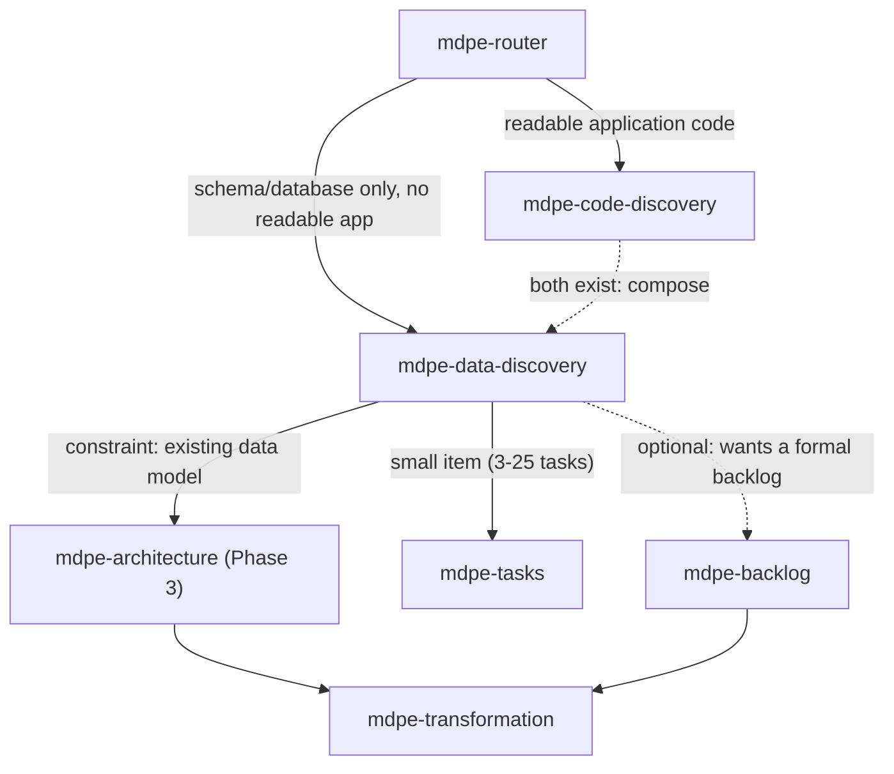

# ADR-008 — Legacy schema/database discovery (`mdpe-data-discovery`)

| Field | Value |
|---|---|
| **Status** | Accepted |
| **Date** | 08/29/2026 |
| **Source task** | `tasks-v1.md` → Phase 10 → 10.3 |
| **Rubric axis** | Axis 1 — Brownfield coverage, extension (baseline **4**, already reached in v1; this skill does not move the axis target, it closes an entry point that was missing within it) |
| **Implemented by** | Task 10.4 (skill + template) · wired in 10.9 · verified in 10.10 |
| **Associated adoptions** | Reuses the anti-fabrication posture of A7/A10 (`competitive-analysis.md`, cited via ADR-001) without introducing a new adoption. External source for this task: Database Reverse Engineering (DBRE) literature (web research, see Section 8). |
| **Depends on** | ADR-001 (`cf-NNN`, minimum inputs/outputs, anti-fabrication rules, bridge to architecture/transformation — this ADR inherits the shape, it does not repeat the decision) |

---

## 1. Context

`mdpe-code-discovery` (ADR-001) solved Gap 2.1-2.3: the repository already has readable application
code (manifests, routes, handlers), and the skill reconstructs features from it. But there is a case
that this skill does not cover by design, not by oversight:

- `skills/mdpe-code-discovery/SKILL.md` (*Inputs*) and Phase 2 ("Section 1: Stack & runtime") treat
  only application manifests as sources: `package.json`, `*.csproj`, `pom.xml`, `pyproject.toml`,
  lockfiles, `Dockerfile`. There is no mention of a SQL schema, DDL, migration file, or database dump
  as a first-class input.
- Phase 5 ("Section 4: Reconstructed feature map") derives candidates from "routes and endpoints,
  handlers/controllers, use cases/services, screens/views, scheduled jobs and consumers, and data
  entities" — the **last** source in the list, data entities, appears only as support for reading
  application code, never as a starting point in its own right.
- Consequence: a legacy database without a readable application layer (e.g., just a 200-table SQL
  Server dump, with no recoverable application source code, or with the application in a stack the
  agent cannot confidently run/read) **has no entry point**. The user either forces
  `mdpe-code-discovery` to inventory an "application" that does not exist, or falls back to
  `mdpe-backlog-discovery` (greenfield) — losing precisely the real information the database
  contains.

This is Gap R.2 (`baseline-gap-map.md` Section F). The trigger is structural, not a matter of quality:
a relational/document database **is** domain evidence — tables, columns, types, foreign keys,
constraints, and indexes encode real modeling decisions, in the same way that routes and handlers
encode real application decisions in `mdpe-code-discovery`.

External reference (research for this task, Section 8): the **Database Reverse Engineering (DBRE)**
literature treats the extraction of a conceptual model from a relational schema as a discipline of
its own — the schema, plus the data and observed naming conventions, is the evidence; inferring
business intent that is not observable in the schema (why a column exists, what a table "really"
represents beyond what its columns and keys declare) is the classic error this literature already
names and avoids.

---

## 2. Decision

### D1 — New skill `mdpe-data-discovery`, sibling of `mdpe-code-discovery` — not a new section within it

Reasons:

1. **Incompatible evidence source.** `mdpe-code-discovery` reads manifests + code sampling; this
   skill reads DDL/schema + data sampling. Mixing the two under the same *Inputs* would force the
   skill to decide which source is primary when both exist — a decision that belongs to the user,
   not to a single skill's gate.
2. **Different output vocabulary.** `mdpe-code-discovery` produces `cf-NNN` from a route/use
   case/screen. This skill produces candidates from table/relationship/constraint — the "name" of a
   feature reconstructed from a schema is, at best, the name of the main entity involved, never a
   use-case verb that the schema does not declare.
3. **Precedent already accepted in the repository.** The same argument that separated
   `mdpe-frontend-discovery`, `mdpe-figma-discovery`, and `mdpe-image-discovery` as sibling skills
   instead of modes within `mdpe-code-discovery` (`mapping-commands-to-skills.md`, enablers table):
   a different input contract + disjoint `description` for precise routing.

### D2 — Point in the cycle: alternative brownfield entry point, same level as `mdpe-code-discovery`

Position rules, inherited from ADR-001 D2 unchanged:

- **Runs before** `mdpe-architecture`, `mdpe-transformation`, and `mdpe-tasks`.
- **Runs once per scope** (schema/database/service) and is re-run when the schema changes (a new
  migration applied, a table removed) — same `verified_at` rule as ADR-001 D7.
- **Composes with `mdpe-code-discovery`** when both exist: a system with a partially readable
  application and a database with tables the application never exposed runs both skills, and each
  inventory cites the other in section 7 (concerns) when they diverge — neither ever overwrites the
  other.

### D3 — Minimum inputs: the schema is required; sample data and the app are optional support

| Input | Required | Note |
|---|:---:|---|
| Schema source (exported DDL, read-only connection string, versioned migrations, or dump) | **Yes** | Without it, the skill asks and stops. A read-only connection is preferable to a stale dump — see D7 (divergence). |
| Scope (schema/database/subset of tables) | No | Recommended when there are >~80 tables. Default: the entire accessible schema. |
| Data sample (real rows, even if few) | No | When available, it is the strongest evidence for deciding whether a nullable FK is a real or a vestigial relationship (D6). Without it, the skill infers from structure alone and marks lower confidence. |
| User-stated objective | No | Biases the reading order of the tables, as in ADR-001 D3. |
| `mdpe-code-discovery` inventory, if it exists | No | Secondary composition input (D2); never required. |
| Documented naming conventions (data dictionary, if it exists) | No | Used to check, never to fill in — the same rule ADR-001 applies to existing documentation. |

### D4 — Output: a single artifact, same shape as `brownfield-inventory.md`

**One artifact**: `docs/brownfield/data-inventory.md` (or `data-inventory-{scope}.md` per large
scope). Same rationale as ADR-001 D4 (lazy creation, one template, zero ghost files).

**Essential** sections:

| # | Section | Content | Evidence source |
|---|---|---|---|
| 1 | **Engine and version** | DBMS, version, encoding/collation when relevant | metadata from the schema itself (`information_schema`, `sys.*`, `pg_catalog`, DDL export) |
| 2 | **Entities and relationships** | tables/collections, columns with type and nullability, primary keys, foreign keys with the cardinality the constraint declares | real DDL; never "likely" cardinality without the FK/constraint that declares it |
| 3 | **Observed conventions** | table/column naming, key pattern (natural vs. surrogate), presence/absence of auditing (`created_at`, soft delete) | sampling of real names + real presence of the columns, not an assumed pattern |
| 4 | **Reconstructed domain map** | `dm-NNN` table (see D5) | grouping of tables by strong FK + shared semantic name |

**Conditional** sections:

| # | Section | Only when |
|---|---|---|
| 5 | **Views and procedures** | there are views, stored procedures, or triggers in scope — often where real business logic is hidden in legacy systems |
| 6 | **Volume and distribution** | there is access to row count/statistics; used to flag a dead table (0 rows) or a dominant table |
| 7 | **Concerns / debt** | there is concrete evidence: FK without an index, a nullable column the sample never has null (candidate for an unenforced `NOT NULL`), table without a primary key, a name that contradicts the real observed data |

### D5 — Contract of the reconstructed domain map

Same spirit as the `cf-NNN` of ADR-001 D5, adapted to the available evidence:

| Field | Rule |
|---|---|
| `id` | `dm-NNN` (*data model*), sequential, stable. When promoted to backlog/architecture, it references `origin: dm-NNN`, the same way `cf-NNN` references `origin` in ADR-001. |
| `name` | name of the group's main entity, as the schema names it — never translated into a use case the schema does not declare |
| `description` | one sentence: what the group's tables **store today**, derived from real columns and types |
| `tables` | **≥1 real table verified in the schema.** Blocking field: without a real table, the domain is not emitted. |
| `relationships` | real FKs linking this group to other `dm-NNN`, citing the constraint |
| `confidence` | `high` (PK + FK declared + data sample confirms the pattern) · `medium` (clear structure, no data sample) · `low` (name suggests grouping, FK absent or weak) |
| `gaps` | optional: what the structure does not allow determining (e.g., "`status` column without a CHECK constraint or enum — possible values unknown without a sample") |

### D6 — The hard rule of this skill: observable structure, never business intent

This is the addition that justifies a dedicated ADR rather than simply inheriting ADR-001's D5
without comment. DBRE (Section 8) explicitly names the error of attributing non-observable business
semantics to a column or relationship. Rule:

1. **Cardinality comes from the constraint, never from assumption.** A nullable FK is `0..1`, not
   `1..1`, until proven otherwise (a data sample with no nulls is evidence, not a rewritten
   constraint).
2. **Column name is not confirmed meaning.** A column named `status` without a documented `CHECK` or
   enum has `unknown` values until real data shows the value domain — never "probably
   active/inactive".
3. **A table with no FK to another is not "orphaned" or "central" by assumption.** Absence of a
   declared relationship is recorded as absence, never as a judgment about the table's importance.
4. **No business rule is inferred from a trigger/procedure name without reading its body.** If the
   body could not be read (compiled procedure, insufficient permission), the existence is recorded
   and the behavior marked `unknown` — never summarized from the name.
5. **Repository/scope with no accessible schema** → the skill responds "no schema to discover," emits
   no domains, and suggests `mdpe-code-discovery` (if there is an application) or
   `mdpe-backlog-discovery` (greenfield). Same treatment as ADR-001 D5 rule 4.

### D7 — Schema wins over documentation, and an old dump wins over the user's prompt about "how it used to be"

Same evidence hierarchy as ADR-001 D5 rule 5, adapted: an outdated data dictionary or the user's
recollection of "how the database should be" never replaces what the real schema declares now.
Divergence goes into section 7 (concerns), with the schema as ground truth.

### D8 — Bridge to the following phases

Identical in shape to ADR-001 D7's table, with `dm-NNN` in place of `cf-NNN`:

| Situation after the inventory | Route | How the inventory is consumed |
|---|---|---|
| Small new feature/improvement | `mdpe-tasks` | the touched `dm-NNN`'s `tables` become the task's **Reference files/tables** |
| Large feature / auditable trail | `mdpe-backlog` (optional) → `mdpe-transformation` | fills the *Technical context*; a promoted `dm-NNN` keeps `origin` |
| Architectural decision at stake | `mdpe-architecture` (Phase 3) | sections 2, 3, 5, and 7 enter as a **constraint**: the observed data model is a starting point, not a blank slate |
| Application also exists and is readable | compose with `mdpe-code-discovery` | the two inventories cite each other in section 7 when they diverge |
| Only understanding the domain | end | the inventory is the deliverable |
| No accessible schema | `mdpe-backlog-discovery` or `mdpe-code-discovery` | no domain emitted |

---

## 3. "Minimum to proceed" criterion

- [ ] Section 1 (engine/version) filled from real schema metadata, or `unknown` with the reason.
- [ ] Section 2 (entities/relationships) reflects real tables and FKs, with cardinality from the
      constraint, not from assumption.
- [ ] Section 3 (conventions) lists ≥1 observed convention with evidence (real name, real column).
- [ ] Section 4 contains **≥1 reconstructed domain** with ≥1 real table and a confidence level.
- [ ] No cited table/column is nonexistent; no field contains `TBD`/placeholder; no cardinality or
      column meaning is presented as certain without the constraint/sample that supports it (D6).

An inaccessible schema satisfies the gate in a different way: "no schema to discover" + routing is
the correct output, and no artifact is created.

---

## 4. Alternatives considered

### (a) New section within `mdpe-code-discovery` — **rejected**

Rejected for the three reasons in D1. Additionally: `mdpe-code-discovery`'s *Anti-fabrication rules*
(rule 6, "describe, do not estimate") is already specific to application features; overloading the
same skill with D6's rule (constraint-based cardinality, not assumption) would force a gate with two
different evidence grammars.

### (b) New skill `mdpe-data-discovery` (D1-D8) — **chosen**

| Axis | Effect |
|---|---|
| **1 — Brownfield** | Closes the missing entry point (Gap R.2) without moving the axis's already-reached target (4) — it is coverage extension, not level elevation. |
| **8 — Hallucination** | D6 is this skill's formulation of the same principle from ADR-001: observable structure beats assumed intent. |
| **2 — Architecture** | Delivers "observed data model" as an explicit constraint for Phase 3, the same way ADR-001 delivers "observed architecture." |
| Cost | +1 skill to wire in. Mitigated by mandatory wiring (10.9). |

### (c) Treat as a depth mode within `mdpe-architecture` — **rejected**

`mdpe-architecture` decides from drivers that already exist; it does not read raw schema by design
(`ADR-002`). Putting DDL reading there would invert the separation already established between
"producing an inventory" (discovery) and "deciding from an inventory" (architecture).

---

## 5. What is **NOT** required

Identical in spirit to ADR-001 §5, adapted:

- Data sample — without it, the skill runs with structure only and lower confidence (D3, D5).
- Reading application code — only enters via composition (D2), never as a prerequisite.
- Views/procedures/triggers (section 5) and volume/distribution (section 6) — conditional, absence
  is a valid answer.
- Any estimate of effort, priority, or business value for the reconstructed domains.
- Exhaustive coverage of schemas with hundreds of tables without a declared scope.
- A data dictionary, external ERD, or any modeling tool — the skill reads the schema directly.

**General rule:** the absence of an item from this list never fails the Section 3 gate. What fails
the gate is a nonexistent table, `TBD`, a domain without a real table, and cardinality/meaning
presented as certain without the constraint or sample that supports it.

---

## 6. Consequences

**Positive**

- Closes Gap R.2 without reopening ADR-001 or duplicating its decision — inherits the shape, adds
  the evidence rule specific to schemas (D6).
- Legacy data-first systems (a database with no readable application, or an application in a stack
  that is not reliable to read) get their own entry point for the first time.
- Composes with `mdpe-code-discovery` without requiring an exclusive choice between the two.

**Negative / costs**

- +1 skill to maintain and wire in.
- Very large schemas without business documentation leave many fields `unknown` by design (D6) — that
  is the price of not inventing meaning, and it needs to be communicated as an expected outcome, not
  as a weakness of the skill.
- Views/procedures with an unreadable body (permission, compilation) are recorded as existing with no
  known behavior — a pending item that can only be resolved with access, not with deduction.

**Neutral**

- The `dm-NNN` id convention enters the same id-standardization scope that `cf-NNN` already occupies.
- Does not change anything in `mdpe-code-discovery`; the composition (D2) is additive.

---

## 7. Verification against task 10.3's test scenarios

| Scenario | Where it is addressed |
|---|---|
| + Minimum inputs (required schema), minimum outputs, point in the cycle | D3, D4, D2 |
| + "Minimum to proceed" criterion with the dispensable items named | Section 3 + Section 5 |
| + Sibling skill of `mdpe-code-discovery`, not an internal mode, justified | Section 4 — (b) chosen |
| − Never infers business meaning not observable in the structure | D6 (5 rules) |
| − Composes with `mdpe-code-discovery` without overwriting | D2, D8 |

---

## 8. Sources

**Internal (read for this ADR):** `docs/adr/adr-001-brownfield-discovery.md` (inherited shape:
minimum inputs/outputs, `cf-NNN`, anti-fabrication rules, bridge) ·
`skills/mdpe-code-discovery/SKILL.md` (Inputs, Phase 2/5, Anti-fabrication rules) ·
`docs/mapping-commands-to-skills.md` (precedent of sibling skills for frontend/Figma/image discovery)
· `docs/analysis/baseline-gap-map.md` (Gap R.2) · `docs/analysis/evaluation-rubric.md` (Axis 1,
extension).

**External:** Database Reverse Engineering (DBRE) literature — extraction of a conceptual model from
a relational schema, data, and observed naming conventions, treating FKs/constraints as primary
evidence and avoiding the attribution of non-observable business semantics (general web research on
DBRE, with no single verbatim-citable source; see compliance note below).

> Content about DBRE paraphrased from multiple general academic sources for licensing compliance
> (nothing reproduced beyond a short paraphrase); web research conducted on 08/29/2026.
