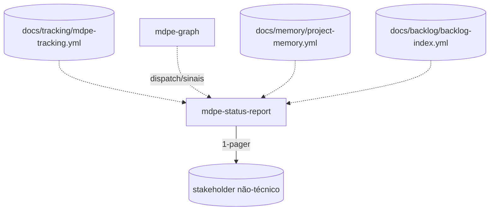

# ADR-009 — Comunicação com stakeholders (`mdpe-status-report`)

| Campo | Valor |
|---|---|
| **Status** | Aceito |
| **Data** | 29/08/2026 |
| **Tarefa de origem** | `tasks-v1.md` → Fase 10 → 10.5 |
| **Eixo da rubrica** | Eixo 10 — Comunicação com stakeholders (baseline **0**, meta **4**) |
| **Implementado por** | Tarefa 10.6 (skill + template) · roteado na 10.9 · verificado na 10.10 |
| **Adoções associadas** | Nenhuma de `competitive-analysis.md`. Fonte externa: formato RAG e "1-pager" de status report (pesquisa web, ver Seção 8). |
| **Depende de** | ADR-004 (`mdpe-tracking.yml` — status reconciliado) · ADR-005 (`mdpe-graph` — waves, caminho crítico, dispatch, sinais) · ADR-006 (`docs/memory/project-memory.yml` — decisões/convenções em força, staleness) |

---

## 1. Contexto

O framework já sabe responder "onde estamos" — mas só em um vocabulário que exige abrir YAML ou ler
Mermaid. Evidências:

- `skills/mdpe-router/SKILL.md` (Passo 0) anuncia estado lendo `docs/memory/project-memory.yml` e
  cita `ad-NNN`, `staleness[]`, `metadata.repo_state` — dirigido a quem já conhece o vocabulário do
  framework.
- `skills/mdpe-graph/SKILL.md` (Phase 6 — Dispatch) responde "o que roda agora" nomeando `mt-XXX-YYY`
  e citando campo de artefato de origem — correto e rastreável, mas ilegível para alguém que só quer
  saber se o projeto está no prazo.
- `skills/mdpe-learnings/SKILL.md` grava `mdpe-tracking.yml` com métricas derivadas (throughput,
  iterações até verde, findings por severidade) — dados reais, vocabulário de execução.
- Nenhum artefato do framework tem uma leitura de **farol** (no prazo / em risco / bloqueado) nem uma
  seção que omita ids técnicos por padrão.

Consequência prática: um patrocinador, cliente ou gestor não-técnico não tem como perguntar "como
está o projeto" e receber uma resposta em 30 segundos sem que alguém traduza o YAML para ele. Isso é
a Lacuna R.3.

Referência externa (pesquisa desta tarefa, Seção 8): o formato **RAG** (Red-Amber-Green) é o padrão
de facto para farol de status em relatórios de projeto; o formato **"1-pager"** — accomplished /
in-progress / risks-and-blockers / next, cada seção com poucos bullets — é a forma mais citada de
comprimir status para quem decide sem tempo de ler um relatório longo.

---

## 2. Decisão

### D1 — Nova skill `mdpe-status-report`, observadora como `mdpe-graph` — não um passo do router

Motivos:

1. **Audiência oposta à do Passo 0 do router.** O router já lê a memória e anuncia estado — para o
   **agente decidir a próxima rota**. Este relatório existe para uma **pessoa fora do ciclo de
   execução** decidir algo diferente (aprovar orçamento, remover um bloqueio, ajustar prazo). Um
   mesmo texto não serve às duas leituras sem comprometer uma delas.
2. **Cadência sob demanda, nunca por rota.** O router lê memória a cada interação; este relatório é
   pedido, tipicamente semanal/quinzenal ou antes de uma reunião — cadência de comunicação, não de
   execução.
3. **Precedente já aceito.** Mesma decisão estrutural de `mdpe-graph` (ADR-005 D2): observador,
   projeção derivada, nunca um passo obrigatório em outra skill.

### D2 — Ponto no ciclo: projeção transversal, lida sob demanda

Roda **sob demanda**, nunca em gatilho automático. Não recomputa nada: lê `mdpe-tracking.yml`
(ADR-004), a leitura de dispatch/sinais que `mdpe-graph` já produz (ADR-005 D10, Phase 5-6), e
`docs/memory/project-memory.yml` (ADR-006) — mesma regra de "ler, nunca recomputar" das outras
projeções.

### D3 — Estrutura do corpo: farol + 4 seções, sem jargão técnico

Formato canônico (pesquisa Seção 8, adaptado às fontes reais do MDPE):

| Bloco | Conteúdo | Fonte |
|---|---|---|
| **Farol** | 🟢 no prazo / 🟡 em risco / 🔴 bloqueado, com **uma frase** do motivo | derivado de D4 |
| **Accomplished** | o que foi entregue desde o último relatório, em linguagem de produto | features com micro-tasks `completed` desde a data do relatório anterior (mesma fonte de `mdpe-release`, sem duplicar sua saída — ver D6) |
| **In progress** | o que está em andamento agora, sem detalhar micro-task | features com micro-tasks no estado `in_progress`/onda aberta, nomeadas pela feature, não pela micro-task |
| **Risks & blockers** | o que ameaça o prazo ou está parado, com o que se precisa de quem lê o relatório | `mdpe-tracking.yml` sinais de overrun/bloqueio + `mdpe-graph` órfãos/ciclos relevantes ao escopo do relatório, **traduzidos**, nunca citados por id no corpo |
| **Next** | o que vem a seguir | dispatch de `mdpe-graph` (D10/Phase 6) — o que roda na próxima onda, traduzido |

**Regra dura de linguagem:** nenhum `mt-XXX-YYY`, `ad-NNN`, `feat-XXX` ou nome de arquivo aparece no
corpo principal. O corpo fala de features e capacidades; os ids ficam exclusivamente no apêndice
(D5).

### D4 — Farol: derivado de sinal real, nunca de opinião

O farol não é uma nota subjetiva do agente. Regra de derivação, em ordem — a primeira condição que
casar decide a cor:

| Farol | Condição (a primeira que casar decide) |
|---|---|
| 🔴 **Bloqueado** | ≥1 micro-task `blocked` com `root_cause_diagnosis` sem rota resolvida, **ou** `mdpe-graph` reporta um ciclo cross-feature aberto no escopo do relatório |
| 🟡 **Em risco** | ≥1 dependência `external` com `status: unavailable`/`in_development` no caminho crítico, **ou** `mdpe-graph` mostra paralelismo disponível menor que o declarado com motivo nomeado, **ou** `mdpe-tracking.yml` mostra ≥2 overruns de loop no escopo desde o último relatório |
| 🟢 **No prazo** | nenhuma das condições acima se aplica |

Cada farol carrega, no apêndice, a citação exata do sinal que o produziu — a mesma disciplina de
"nunca uma alegação sem o campo que a sustenta" do `mdpe-graph` (ADR-005 D1), aplicada aqui à cor.

### D5 — Apêndice de proveniência: onde os ids vivem

Seção final, opcional de ler, obrigatória de existir quando o corpo faz qualquer afirmação: uma
tabela `afirmação do corpo` → `artefato + campo` → `id técnico`. Quem quer verificar lê o apêndice;
quem só quer saber o farol lê a primeira linha. Mesmo espírito da tabela de arestas do `mdpe-graph`
(ADR-005 D3): "o diagrama é a leitura humana; a tabela é a prova" — aqui, "o corpo é a leitura
humana; o apêndice é a prova".

### D6 — Não duplica `mdpe-release`; lê o que ele já projetou quando existir

A seção **Accomplished** tem a mesma fonte de evidência que `mdpe-release` (ADR-007 D3: tripla
`completed` + validado + artefato existente). Regra de precedência: se um `CHANGELOG.md` já foi
cortado no período do relatório, **Accomplished cita as entradas dele** em vez de recalcular a lista
— precedência "artefato mais próximo da audiência externa vence", análoga à precedência de
`implements` do `mdpe-graph` (ADR-005 D5 regra 2). Sem changelog no período, a skill deriva
diretamente do tracking, com a mesma tripla de evidência.

### D7 — O relatório não é gate, e não decide nada

Mesma cláusula do `mdpe-graph` (ADR-005 D12) e do `mdpe-learnings` (memória não é gate): nada aqui
aprova orçamento, muda prazo, ou resolve um bloqueio. O relatório **relata e nomeia o que se precisa**
("bloqueado esperando decisão sobre X") — a decisão é de quem lê, sempre fora da skill.

### D8 — Sem tooling obrigatório; sem periodicidade automática

Mesmo contrato do ADR-005 D11 e do ADR-007 D8: nenhum dashboard, nenhuma integração de e-mail/Slack,
nenhum agendamento é exigido. O relatório é um arquivo Markdown gerado sob pedido.

---

## 3. Critério de "relatório honesto"

- [ ] O corpo principal (farol + 4 seções) não cita nenhum id técnico (`mt-*`, `ad-*`, `feat-*`,
      caminho de arquivo).
- [ ] O farol segue a árvore de decisão de D4; a condição que o produziu está citada no apêndice.
- [ ] Toda afirmação do corpo tem uma linha correspondente no apêndice, com artefato + campo.
- [ ] **Accomplished** cita o `CHANGELOG.md` do período quando ele existe (D6), em vez de recalcular.
- [ ] Nenhuma seção afirma algo que o `mdpe-tracking.yml`/`mdpe-graph`/memória não sustentam.
- [ ] Nada no relatório é apresentado como decisão, aprovação ou prazo confirmado — apenas relato.

**Sem tracking, sem grafo e sem memória** → resposta correta: *"nada para reportar; nenhum ciclo de
execução ainda produziu dados"*, e nenhum artefato é criado.

---

## 4. Alternativas consideradas

### (a) Passo dentro de `mdpe-graph` — **rejeitada**

`mdpe-graph` já responde "o que roda agora" (D10) em vocabulário técnico, correto para sua audiência
(quem despacha trabalho). Sobrepor uma tradução para stakeholder no mesmo artefato misturaria duas
audiências em um arquivo cuja regra central é "toda aresta tem procedência citável no corpo" —
exatamente o que este relatório deve evitar no corpo principal (D3).

### (b) Nova skill `mdpe-status-report` (D1-D8) — **escolhida**

| Eixo | Efeito |
|---|---|
| **10 — Comunicação com stakeholders** (0 → 4) | Skill dedicada, farol derivado de sinal real, corpo sem jargão, apêndice de proveniência — cobre o nível 4 do eixo novo. |
| **8 — Alucinação** | D4 é a aplicação deste ADR do princípio "toda alegação cita o campo que a sustenta", replicado do `mdpe-graph`, para uma cor de farol em vez de uma aresta. |
| **7 — Custo cognitivo** | O relatório existe para **reduzir** carga cognitiva de quem lê — 1 página, sem ids no corpo. |
| Custo | +1 skill a costurar; risco de o relatório envelhecer entre pedidos (mitigado por carimbo de geração, mesma prática do `mdpe-graph`). |

### (c) Gerar o relatório a partir de um dashboard externo (BI, Grafana) — **rejeitada**

Repetiria a Lacuna 4.1 (tooling referenciado sem existir no repositório) que o ADR-004 já corrigiu.
Ficaria fora do versionamento e da conferência via diff.

---

## 5. O que **NÃO** é obrigatório

- Periodicidade fixa — sob demanda apenas.
- Dashboard, e-mail automático, integração com Slack/Teams.
- Detalhar micro-tasks no corpo — a seção **In progress** nomeia features, nunca `mt-XXX-YYY`.
- Recalcular o que `mdpe-release` já publicou no período — cita o `CHANGELOG.md` (D6).
- Um farol diferente de 🟢 quando nenhuma condição de D4 se aplica — 🟢 sem qualificação extra é
  saída válida.
- Apêndice quando o corpo está vazio (nada a reportar) — sem afirmação, não há o que provar.

**Regra geral:** ausência de item desta lista nunca reprova o gate. O que reprova é id técnico no
corpo, farol sem a condição de D4 que o sustente, ou afirmação sem linha correspondente no apêndice.

---

## 6. Consequências

**Positivas**

- Eixo 10 sai de 0 para 4. O framework passa a ter uma leitura de estado que não exige conhecer o
  vocabulário interno.
- Reaproveita três fontes já existentes (tracking, grafo, memória) sem introduzir cálculo novo —
  mesma disciplina de "ler, nunca recomputar" do `mdpe-graph`.

**Negativas / custos**

- +1 skill a costurar.
- Relatório pode envelhecer entre pedidos; mitigado por carimbo de geração e pela regra de "sob
  demanda apenas" (não finge atualização contínua).
- Tradução de sinal técnico para farol (D4) é uma árvore de decisão fixa — pode simplificar demais um
  caso realmente ambíguo; nesse caso, a skill nomeia a ambiguidade no apêndice em vez de forçar uma
  cor.

**Neutras**

- Não altera nenhum artefato existente (`mdpe-tracking.yml`, grafo, memória continuam exatamente como
  estão).
- Não participa de nenhum loop de aprendizado.

---

## 7. Verificação contra os cenários de teste da tarefa 10.5

| Cenário | Onde é atendido |
|---|---|
| + Formato RAG/1-pager com farol e 4 seções | D3 |
| + Fonte por seção, sem cálculo novo | D2, D4, D6 |
| + Toda afirmação do corpo rastreável em apêndice | D5, Seção 3 |
| − Nunca decide nem aprova nada | D7 |
| − Nenhum id técnico no corpo principal | D3 regra dura, Seção 3 |

---

## 8. Fontes

**Internas:** `docs/adr/adr-004-execution-metrics.md` (tracking, status reconciliado) ·
`docs/adr/adr-005-traceability-graph.md` (D1 procedência, D2 skill observadora, D10 dispatch, D12 não
é gate) · `docs/adr/adr-006-memory-model.md` (índice de memória, staleness) ·
`skills/mdpe-router/SKILL.md` (Passo 0 — vocabulário técnico da leitura de estado atual) ·
`docs/analysis/baseline-gap-map.md` (Lacuna R.3) · `docs/analysis/evaluation-rubric.md` (Eixo 10).

**Externas:** formato RAG (Red-Amber-Green) para farol de status de projeto e formato "1-pager"
(accomplished / in-progress / risks-and-blockers / next) para relatórios dirigidos a stakeholders
não-técnicos — pesquisa web geral sobre templates de status report ágil, sem fonte única citável
verbatim.

> Conteúdo parafraseado a partir de múltiplas fontes gerais para conformidade de licenciamento;
> pesquisa web realizada em 29/08/2026.
