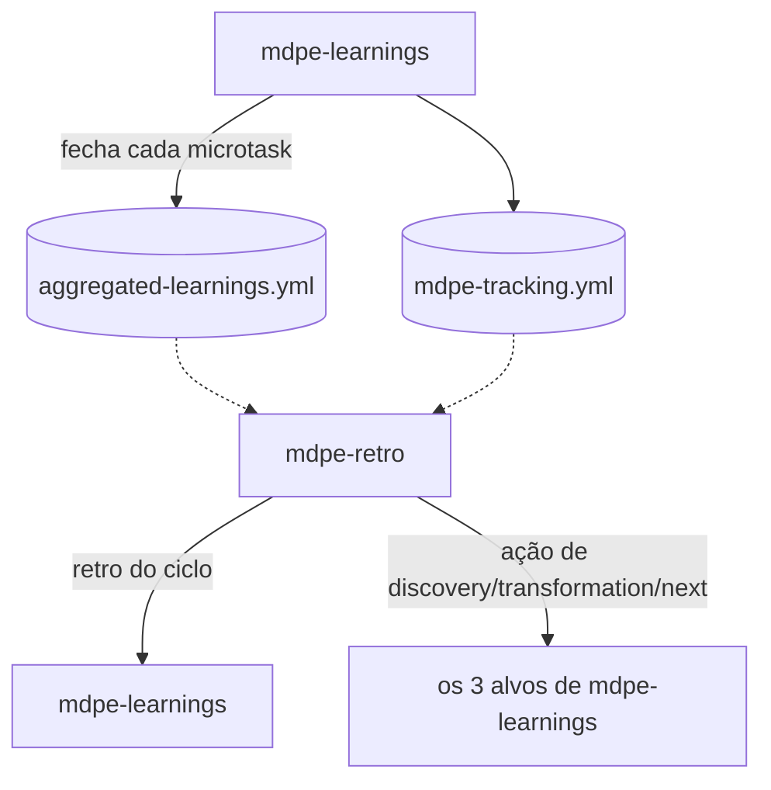

# ADR-010 — Retrospectiva de ciclo (`mdpe-retro`)

| Campo | Valor |
|---|---|
| **Status** | Aceito |
| **Data** | 29/08/2026 |
| **Tarefa de origem** | `tasks-v1.md` → Fase 10 → 10.7 |
| **Eixo da rubrica** | Eixo 11 — Retrospectiva de ciclo (baseline **0**, meta **4**) |
| **Implementado por** | Tarefa 10.8 (skill + template) · roteado na 10.9 · verificado na 10.10 |
| **Adoções associadas** | Nenhuma de `competitive-analysis.md`. Fonte externa: formato What Went Well / To Improve / Action Items e variantes (Start-Stop-Continue, 4Ls) (pesquisa web, ver Seção 8). |
| **Depende de** | ADR-004 (`mdpe-tracking.yml`) · ADR-006 (`aggregated-learnings.yml`, curadoria `candidate → confirmed → retired`, três alvos de feedback de `mdpe-learnings`) |

---

## 1. Contexto

`mdpe-learnings` já extrai lição por micro-task e já agrega ocorrências no registro de lições
(`aggregated-learnings.yml`), mas a agregação para nesse nível — nunca sobe a uma cerimônia de
fechamento de ciclo. Evidências:

- `skills/mdpe-learnings/SKILL.md` (cabeçalho): *"Runs: once per micro-task (aggregated across the
  project)"* — a palavra "aggregated" descreve o **registro de lições**, cuja unidade de leitura é a
  lição individual (`ls-NNN`) e sua contagem de ocorrências, nunca uma narrativa de "como foi este
  ciclo".
- A seção *Curation* de `mdpe-learnings` (promoção `candidate → confirmed`, graduação, retirada) é um
  mecanismo de **qualidade de uma lição isolada** ao longo do tempo, não uma cerimônia periódica com
  início e fim declarados.
- Nenhum template do framework tem campo `owner` em item de ação com prazo agregado, nem noção de
  fronteira de sprint/ciclo/feature-set. A tabela *Feedback routing* de `mdpe-learnings` roteia **uma
  lição por vez** para um dos três alvos (Discovery, Transformation, Next executions) — sem uma visão
  consolidada de "o que aconteceu neste conjunto de fechamentos".

Consequência prática: o time nunca vê um retrato consolidado do ciclo — só uma sequência de lições
isoladas e um tracking numérico. É a Lacuna R.4.

Referência externa (pesquisa desta tarefa, Seção 8): o formato canônico de retrospectiva ágil é
**What Went Well / What to Improve / Action Items**, com variantes (Mad-Sad-Glad, Start-Stop-
Continue, 4Ls). Um item de ação sem responsável (`owner`) é citado universalmente como
anti-padrão — ação sem dono não sobrevive ao próximo ciclo.

---

## 2. Decisão

### D1 — Nova skill `mdpe-retro`, que **lê** `mdpe-learnings` — não substitui nem reabre a curadoria

Motivos:

1. **Granularidade diferente.** `mdpe-learnings` fecha uma micro-task; `mdpe-retro` fecha um
   conjunto — feature, sprint, ou o período que o usuário nomear. Uma cerimônia de ciclo dentro de
   uma skill por-microtask nasceria míope, o mesmo argumento do ADR-005 D2 para `mdpe-graph` e do
   ADR-007 D1 para `mdpe-release`.
2. **Não reabre curadoria.** A promoção `candidate → confirmed` e a graduação de lição em
   `mdpe-learnings` continuam exatamente onde estão (ADR-006). `mdpe-retro` **lê** o estado atual do
   registro — não decide se uma lição amadureceu, e não grava nele.
3. **Cadência de cerimônia, não de execução.** Roda ao fim de um ciclo declarado pelo usuário —
   nunca por microtask, nunca em agenda fixa do framework.

### D2 — Ponto no ciclo: fechamento agregado, sob demanda

Roda **sob demanda**, quando o usuário declara o fim de um ciclo/sprint/feature-set. Lê
`aggregated-learnings.yml` e `mdpe-tracking.yml` — nunca recomputa nem re-cura uma lição.

### D3 — Escopo do ciclo: declarado pelo usuário, nunca inferido

O framework não tem noção própria de "sprint" (não há campo de sprint em nenhum template). O escopo
do ciclo é **sempre** informado por quem pede a retro: um intervalo de datas, um conjunto de
`feat-XXX`, ou "desde a última retro". Sem escopo declarado, a skill pergunta e para — nunca infere um
recorte de tempo por conta própria.

### D4 — Estrutura: What Went Well / To Improve / Action Items, cada bullet com evidência

| Bloco | Conteúdo | Fonte |
|---|---|---|
| **What went well** | lições `confirmed` ou `retired` (graduadas) no escopo, e micro-tasks fechadas em `i1` sem finding acima de Nitpick | `aggregated-learnings.yml` → `lessons[]` com `status: confirmed`/`retired`; `mdpe-tracking.yml` |
| **What to improve** | lições `confirmed` ainda não graduadas, overruns de loop, findings `blocker`/`major` recorrentes | `aggregated-learnings.yml`; `mdpe-tracking.yml` |
| **Action items** | uma ação por item de "to improve" com evidência suficiente para ser acionável | derivado dos dois blocos acima, nunca inventado |
| **Trend** *(condicional)* | comparação com a retro anterior do mesmo tipo de ciclo, só quando ela existe | retro anterior (`docs/retro/*.md`) + tracking atual |

**Regra dura:** todo bullet de "what went well"/"what to improve" cita a lição (`ls-NNN`) ou o campo
de tracking que o sustenta. Nenhum bullet é impressão do agente sobre "como foi o ciclo" sem essa
citação — mesma disciplina de evidência do `mdpe-graph` (ADR-005 D1) e do `mdpe-release` (ADR-007 D5),
aplicada a uma retrospectiva.

### D5 — Todo item de ação tem `owner`, mesmo que "a definir"

Aplicando a literatura de retrospectivas (Seção 8): ação sem responsável não sobrevive ao próximo
ciclo. Regra: o campo `owner` é **sempre preenchido** — com um nome/papel real quando o contexto
permite inferir com segurança (ex.: a lição já aponta um alvo de `mdpe-learnings` com dono natural),
ou literalmente `"a definir"` quando não há. **Nunca ausente.** É a única obrigatoriedade nova que
este ADR introduz, e é dirigida a evitar o anti-padrão universal, não a aumentar volume — o valor
"a definir" é uma resposta válida e completa.

### D6 — Ações roteiam para os mesmos três alvos de `mdpe-learnings`; a retro nunca cria um quarto

`mdpe-learnings` já define os três alvos de feedback (Discovery, Transformation, Next executions).
`mdpe-retro` **reaproveita a mesma tabela** — uma ação de retro que aponta para "ajustar a
granularidade de decomposição" roteia para Transformation, do mesmo modo que uma lição individual
roteraria. Nenhum quarto alvo é inventado; a retro é uma **lente de agregação sobre a mesma tabela de
roteamento**, não um sistema de rota paralelo.

### D7 — Tendência entre ciclos: só com histórico real, nunca extrapolada de um ciclo só

A seção **Trend** só existe quando há ≥1 retro anterior no mesmo escopo (`docs/retro/*.md`) para
comparar. Com um único ciclo, não há tendência — dizer "throughput subiu" sem um ponto anterior é
inventar uma linha de tendência. É a mesma regra de "contagens antes de razões" e "razão sempre com
denominador" do `mdpe-learnings`/ADR-004 (tracking), aplicada a comparação entre ciclos.

### D8 — A retro não é gate; não avalia pessoas

Mesma cláusula do `mdpe-graph` (D12) e do `mdpe-learnings` (memória não é gate), com uma adição
específica a retrospectivas: **nenhum bullet atribui uma falha a uma pessoa**. Lições e findings são
sobre o trabalho e o processo (as 4 categorias que `mdpe-learnings` já define: técnico, processo,
estratégico, problemas) — nunca sobre quem executou. Isso é a mesma disciplina que a literatura de
retrospectivas nomeia como foco em processo, não em indivíduo, e evita que a cerimônia produza dado
que ninguém quer que fique registrado.

---

## 3. Critério de "retro honesta"

- [ ] Escopo do ciclo foi declarado pelo usuário — nunca inferido.
- [ ] Todo bullet de "what went well"/"what to improve" cita a lição ou o campo de tracking que o
      sustenta.
- [ ] Todo item de ação tem `owner` preenchido — nome/papel real ou `"a definir"`, nunca ausente.
- [ ] Toda ação roteia a um dos três alvos existentes de `mdpe-learnings` — nenhum alvo novo
      inventado.
- [ ] Seção **Trend** só existe com ≥1 retro anterior real para comparar.
- [ ] Nenhum bullet atribui falha a uma pessoa.

**Sem lição confirmada nem dado de tracking no escopo declarado** → resposta correta: *"nada
consolidado para retro neste escopo; feche ao menos uma micro-task primeiro"*, e nenhum artefato é
criado.

---

## 4. Alternativas consideradas

### (a) Estender `mdpe-learnings` para também fazer a cerimônia de ciclo — **rejeitada**

Rejeitada pelos três motivos de D1: granularidade, curadoria e cadência não combinam com a mesma
skill que fecha uma micro-task por vez. Forçaria `mdpe-learnings` a manter dois relógios (por
microtask e por ciclo) na mesma execução.

### (b) Nova skill `mdpe-retro` (D1-D8) — **escolhida**

| Eixo | Efeito |
|---|---|
| **11 — Retrospectiva de ciclo** (0 → 4) | Skill dedicada, formato canônico com evidência obrigatória, `owner` sempre presente — cobre o nível 4 do eixo novo. |
| **8 — Alucinação** | D4 replica, para uma cerimônia periódica, o mesmo princípio de "toda alegação cita o campo que a sustenta" já aplicado em `mdpe-graph`/`mdpe-release`/`mdpe-status-report`. |
| **6 — Memória** | A retro é o primeiro artefato do framework que **lê** o registro de lições como conjunto, em vez de lição a lição — reforça o valor do registro que `mdpe-learnings` mantém. |
| Custo | +1 skill a costurar; depende de `aggregated-learnings.yml` já ter conteúdo real (sem ele, a retro tem menos a dizer — resultado correto, não falha). |

### (c) Gerar a retro automaticamente a cada N micro-tasks fechadas — **rejeitada**

Reintroduziria periodicidade automática que o D2 explicitamente recusa (escopo é sempre declarado
pelo usuário). Um ciclo é uma decisão humana sobre o que conta como "um sprint" — o framework não tem
e não deve inventar essa fronteira.

---

## 5. O que **NÃO** é obrigatório

- Uma cadência fixa — sob demanda, com escopo declarado (D3).
- Um número mínimo de "what went well"/"what to improve" — um ciclo limpo pode ter só uma lição a
  reportar, ou nenhuma (mesmo espírito do "clean close writes nothing" de `mdpe-learnings`).
- Seção **Trend** sem histórico (D7).
- Um `owner` nominal quando não há como saber — `"a definir"` é resposta completa (D5).
- Comparação de métricas fora do que o tracking já deriva — nenhum número novo é calculado aqui.

**Regra geral:** ausência de item desta lista nunca reprova o gate. O que reprova é bullet sem
evidência, ação sem `owner` (mesmo que "a definir"), Trend sem histórico real, ou atribuição de falha
a uma pessoa.

---

## 6. Consequências

**Positivas**

- Eixo 11 sai de 0 para 4. O time passa a ter um retrato consolidado do ciclo em vez de lições
  isoladas.
- Reaproveita a curadoria e o roteamento que `mdpe-learnings` já mantém — nenhum sistema paralelo.
- `owner` sempre presente em ação fecha o anti-padrão mais citado da literatura de retrospectivas.

**Negativas / custos**

- +1 skill a costurar.
- Depende de `mdpe-learnings` ter produzido dado real; em um projeto muito novo, a primeira retro
  pode ter pouco conteúdo — resultado correto (D3, "clean close"), não uma falha da skill.
- `Trend` fica ausente até o segundo ciclo, o que é esperado, mas precisa ser comunicado como tal.

**Neutras**

- Não altera `mdpe-learnings`, `aggregated-learnings.yml` nem `mdpe-tracking.yml`.
- Não introduz um quarto alvo de roteamento (D6).

---

## 7. Verificação contra os cenários de teste da tarefa 10.7

| Cenário | Onde é atendido |
|---|---|
| + Formato What Went Well / To Improve / Action Items | D4 |
| + Todo bullet cita evidência (lição/tracking) | D4 regra dura, Seção 3 |
| + Todo item de ação tem responsável (real ou "a definir") | D5 |
| − Tendência só aparece com ≥2 ciclos reais | D7 |
| − Nenhum bullet atribui falha a uma pessoa | D8 |

---

## 8. Fontes

**Internas:** `skills/mdpe-learnings/SKILL.md` (curadoria `candidate→confirmed→retired`,
*Feedback routing*, os 3 alvos, `aggregated-learnings.yml`, `mdpe-tracking.yml`) ·
`docs/adr/adr-006-memory-model.md` (camadas de memória, curadoria) ·
`docs/adr/adr-004-execution-metrics.md` (contagens antes de razões, razão com denominador) ·
`docs/adr/adr-005-traceability-graph.md` (D1 procedência, D2 skill dedicada por granularidade, D12
não é gate) · `docs/analysis/baseline-gap-map.md` (Lacuna R.4) ·
`docs/analysis/evaluation-rubric.md` (Eixo 11).

**Externas:** formato de retrospectiva ágil What Went Well / What to Improve / Action Items, e
variantes (Mad-Sad-Glad, Start-Stop-Continue, 4Ls); item de ação sem responsável como anti-padrão
citado universalmente na literatura de retrospectivas ágeis — pesquisa web geral, sem fonte única
citável verbatim.

> Conteúdo parafraseado a partir de múltiplas fontes gerais para conformidade de licenciamento;
> pesquisa web realizada em 29/08/2026.
