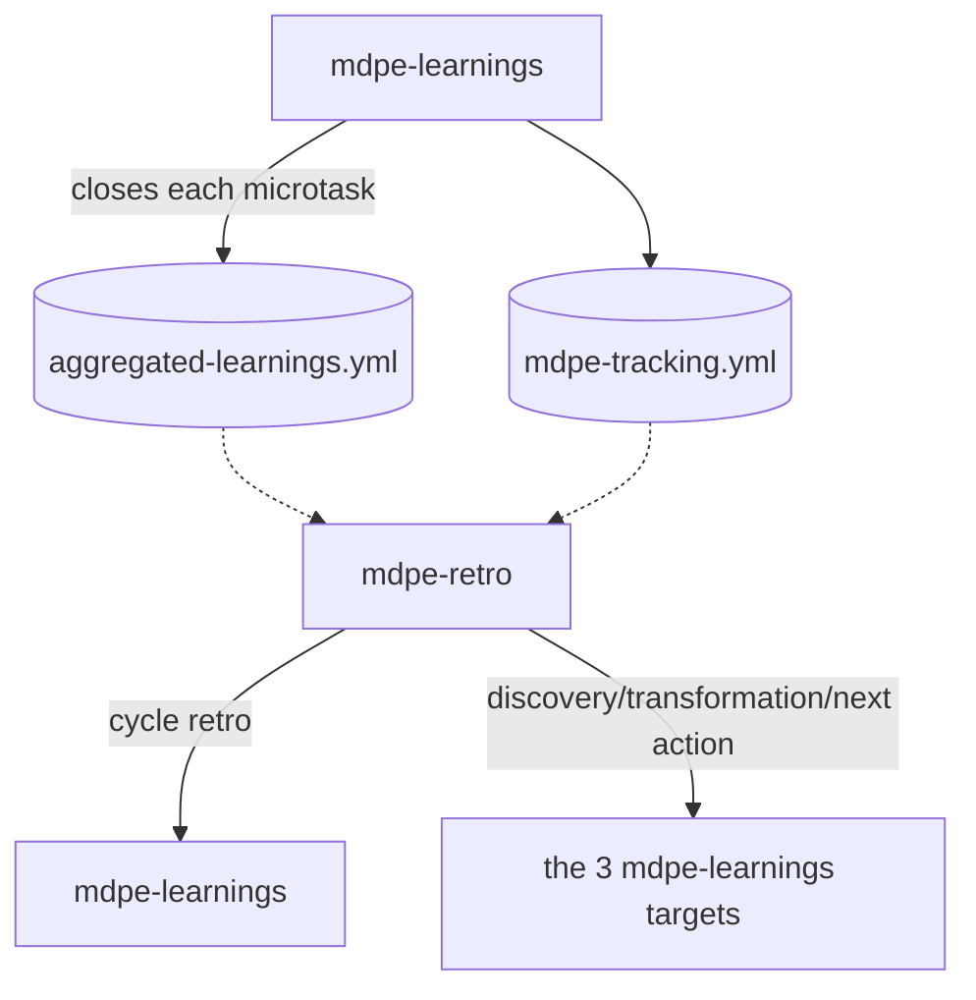

# ADR-010 — Cycle retrospective (`mdpe-retro`)

| Field | Value |
|---|---|
| **Status** | Accepted |
| **Date** | 29/08/2026 |
| **Source task** | `tasks-v1.md` → Phase 10 → 10.7 |
| **Rubric axis** | Axis 11 — Cycle retrospective (baseline **0**, target **4**) |
| **Implemented by** | Task 10.8 (skill + template) · routed in 10.9 · verified in 10.10 |
| **Associated adoptions** | None from `competitive-analysis.md`. External source: the What Went Well / To Improve / Action Items format and variants (Start-Stop-Continue, 4Ls) (web research, see Section 8). |
| **Depends on** | ADR-004 (`mdpe-tracking.yml`) · ADR-006 (`aggregated-learnings.yml`, `candidate → confirmed → retired` curation, three feedback targets of `mdpe-learnings`) |

---

## 1. Context

`mdpe-learnings` already extracts a lesson per micro-task and already aggregates occurrences in the
lesson registry (`aggregated-learnings.yml`), but the aggregation stops at that level — it never rises
to a cycle-closing ceremony. Evidence:

- `skills/mdpe-learnings/SKILL.md` (header): *"Runs: once per micro-task (aggregated across the
  project)"* — the word "aggregated" describes the **lesson registry**, whose unit of reading is the
  individual lesson (`ls-NNN`) and its occurrence count, never a narrative of "how this cycle went".
- The *Curation* section of `mdpe-learnings` (`candidate → confirmed` promotion, graduation,
  retirement) is a mechanism for **quality of a single lesson** over time, not a periodic ceremony
  with a declared start and end.
- No framework template has an `owner` field on an action item with an aggregated deadline, nor any
  notion of a sprint/cycle/feature-set boundary. The *Feedback routing* table of `mdpe-learnings`
  routes **one lesson at a time** to one of three targets (Discovery, Transformation, Next
  executions) — with no consolidated view of "what happened across this set of closures".

Practical consequence: the team never sees a consolidated picture of the cycle — only a sequence of
isolated lessons and a numeric tracking log. This is Gap R.4.

External reference (research for this task, Section 8): the canonical agile retrospective format is
**What Went Well / What to Improve / Action Items**, with variants (Mad-Sad-Glad, Start-Stop-
Continue, 4Ls). An action item with no owner is universally cited as an anti-pattern — an action
without an owner does not survive into the next cycle.

---

## 2. Decision

### D1 — New skill `mdpe-retro`, which **reads** `mdpe-learnings` — it does not replace or reopen curation

Rationale:

1. **Different granularity.** `mdpe-learnings` closes a micro-task; `mdpe-retro` closes a
   set — a feature, a sprint, or whatever period the user names. A cycle ceremony embedded inside a
   per-microtask skill would be short-sighted, the same argument as ADR-005 D2 for `mdpe-graph` and
   ADR-007 D1 for `mdpe-release`.
2. **Does not reopen curation.** The `candidate → confirmed` promotion and lesson graduation in
   `mdpe-learnings` stay exactly where they are (ADR-006). `mdpe-retro` **reads** the current state of
   the registry — it does not decide whether a lesson has matured, and does not write to it.
3. **Ceremony cadence, not execution cadence.** It runs at the end of a cycle declared by the
   user — never per microtask, never on a fixed framework schedule.

### D2 — Point in the cycle: aggregated closure, on demand

Runs **on demand**, when the user declares the end of a cycle/sprint/feature-set. Reads
`aggregated-learnings.yml` and `mdpe-tracking.yml` — never recomputes nor re-curates a lesson.

### D3 — Cycle scope: declared by the user, never inferred

The framework has no notion of its own of a "sprint" (there is no sprint field in any template). The
cycle scope is **always** provided by whoever requests the retro: a date range, a set of
`feat-XXX`, or "since the last retro". Without a declared scope, the skill asks and stops — it never
infers a time window on its own.

### D4 — Structure: What Went Well / To Improve / Action Items, each bullet with evidence

| Block | Content | Source |
|---|---|---|
| **What went well** | lessons `confirmed` or `retired` (graduated) within the scope, and micro-tasks closed at `i1` with no finding above Nitpick | `aggregated-learnings.yml` → `lessons[]` with `status: confirmed`/`retired`; `mdpe-tracking.yml` |
| **What to improve** | lessons `confirmed` but not yet graduated, loop overruns, recurring `blocker`/`major` findings | `aggregated-learnings.yml`; `mdpe-tracking.yml` |
| **Action items** | one action per "to improve" item with enough evidence to be actionable | derived from the two blocks above, never invented |
| **Trend** *(conditional)* | comparison with the previous retro of the same cycle type, only when one exists | previous retro (`docs/retro/*.md`) + current tracking |

**Hard rule:** every "what went well"/"what to improve" bullet cites the lesson (`ls-NNN`) or the
tracking field that supports it. No bullet is the agent's impression of "how the cycle went" without
that citation — the same evidence discipline as `mdpe-graph` (ADR-005 D1) and `mdpe-release`
(ADR-007 D5), applied to a retrospective.

### D5 — Every action item has an `owner`, even if "to be defined"

Applying the retrospective literature (Section 8): an action with no owner does not survive into the
next cycle. Rule: the `owner` field is **always filled in** — with a real name/role when the context
allows safe inference (e.g., the lesson already points to an `mdpe-learnings` target with a natural
owner), or literally `"to be defined"` when it does not. **Never absent.** This is the only new
obligation this ADR introduces, and it is aimed at avoiding the universal anti-pattern, not at
increasing volume — the value "to be defined" is a valid and complete answer.

### D6 — Actions route to the same three `mdpe-learnings` targets; the retro never creates a fourth

`mdpe-learnings` already defines the three feedback targets (Discovery, Transformation, Next
executions). `mdpe-retro` **reuses the same table** — a retro action pointing to "adjust decomposition
granularity" routes to Transformation, the same way an individual lesson would. No fourth target is
invented; the retro is an **aggregation lens over the same routing table**, not a parallel routing
system.

### D7 — Trend across cycles: only with real history, never extrapolated from a single cycle

The **Trend** section only exists when there is ≥1 previous retro in the same scope (`docs/retro/*.md`)
to compare against. With a single cycle, there is no trend — saying "throughput went up" without a
prior data point is inventing a trend line. This is the same rule as "counts before ratios" and
"ratio always with a denominator" from `mdpe-learnings`/ADR-004 (tracking), applied to comparison
across cycles.

### D8 — The retro is not a gate; it does not evaluate people

Same clause as `mdpe-graph` (D12) and `mdpe-learnings` (memory is not a gate), with an addition
specific to retrospectives: **no bullet attributes a failure to a person**. Lessons and findings are
about the work and the process (the 4 categories `mdpe-learnings` already defines: technical,
process, strategic, issues) — never about who executed it. This is the same discipline the
retrospective literature calls focusing on process, not on the individual, and it prevents the
ceremony from producing data no one wants on record.

---

## 3. Criteria for an "honest retro"

- [ ] The cycle scope was declared by the user — never inferred.
- [ ] Every "what went well"/"what to improve" bullet cites the lesson or the tracking field that
      supports it.
- [ ] Every action item has an `owner` filled in — a real name/role or `"to be defined"`, never
      absent.
- [ ] Every action routes to one of the three existing `mdpe-learnings` targets — no new target
      invented.
- [ ] The **Trend** section only exists with ≥1 real previous retro to compare against.
- [ ] No bullet attributes a failure to a person.

**No confirmed lesson and no tracking data in the declared scope** → correct response: *"nothing
consolidated for a retro in this scope; close at least one micro-task first"*, and no artifact is
created.

---

## 4. Alternatives considered

### (a) Extend `mdpe-learnings` to also perform the cycle ceremony — **rejected**

Rejected for the same three reasons as D1: granularity, curation, and cadence do not fit within the
same skill that closes one micro-task at a time. It would force `mdpe-learnings` to keep two clocks
(per microtask and per cycle) in the same execution.

### (b) New skill `mdpe-retro` (D1-D8) — **chosen**

| Axis | Effect |
|---|---|
| **11 — Cycle retrospective** (0 → 4) | Dedicated skill, canonical format with mandatory evidence, `owner` always present — covers level 4 of the new axis. |
| **8 — Hallucination** | D4 replicates, for a periodic ceremony, the same principle of "every claim cites the field that supports it" already applied in `mdpe-graph`/`mdpe-release`/`mdpe-status-report`. |
| **6 — Memory** | The retro is the first framework artifact that **reads** the lesson registry as a set, rather than lesson by lesson — reinforcing the value of the registry `mdpe-learnings` maintains. |
| Cost | +1 skill to integrate; depends on `aggregated-learnings.yml` already having real content (without it, the retro has less to say — a correct outcome, not a failure). |

### (c) Auto-generate the retro every N closed micro-tasks — **rejected**

Would reintroduce automatic periodicity that D2 explicitly rejects (scope is always declared by the
user). A cycle is a human decision about what counts as "a sprint" — the framework does not have, and
should not invent, that boundary.

---

## 5. What is **NOT** mandatory

- A fixed cadence — on demand, with a declared scope (D3).
- A minimum number of "what went well"/"what to improve" items — a clean cycle may have only one
  lesson to report, or none (same spirit as `mdpe-learnings`'s "clean close writes nothing").
- A **Trend** section without history (D7).
- A named `owner` when there is no way to know — `"to be defined"` is a complete answer (D5).
- Metric comparisons beyond what tracking already derives — no new number is computed here.

**General rule:** absence of an item from this list never fails the gate. What fails the gate is a
bullet without evidence, an action without an `owner` (even if "to be defined"), a Trend without real
history, or attributing a failure to a person.

---

## 6. Consequences

**Positive**

- Axis 11 goes from 0 to 4. The team now has a consolidated picture of the cycle instead of isolated
  lessons.
- Reuses the curation and routing that `mdpe-learnings` already maintains — no parallel system.
- `owner` always present on an action closes the most commonly cited anti-pattern in the
  retrospective literature.

**Negative / costs**

- +1 skill to integrate.
- Depends on `mdpe-learnings` having produced real data; on a very new project, the first retro may
  have little content — a correct outcome (D3, "clean close"), not a skill failure.
- `Trend` is absent until the second cycle, which is expected, but needs to be communicated as such.

**Neutral**

- Does not change `mdpe-learnings`, `aggregated-learnings.yml`, or `mdpe-tracking.yml`.
- Does not introduce a fourth routing target (D6).

---

## 7. Verification against task 10.7 test scenarios

| Scenario | Where it is addressed |
|---|---|
| + What Went Well / To Improve / Action Items format | D4 |
| + Every bullet cites evidence (lesson/tracking) | D4 hard rule, Section 3 |
| + Every action item has an owner (real or "to be defined") | D5 |
| − Trend only appears with ≥2 real cycles | D7 |
| − No bullet attributes a failure to a person | D8 |

---

## 8. Sources

**Internal:** `skills/mdpe-learnings/SKILL.md` (`candidate→confirmed→retired` curation,
*Feedback routing*, the 3 targets, `aggregated-learnings.yml`, `mdpe-tracking.yml`) ·
`docs/adr/adr-006-memory-model.md` (memory layers, curation) ·
`docs/adr/adr-004-execution-metrics.md` (counts before ratios, ratio with denominator) ·
`docs/adr/adr-005-traceability-graph.md` (D1 provenance, D2 dedicated skill by granularity, D12
is not a gate) · `docs/analysis/baseline-gap-map.md` (Gap R.4) ·
`docs/analysis/evaluation-rubric.md` (Axis 11).

**External:** the agile retrospective format What Went Well / What to Improve / Action Items, and
variants (Mad-Sad-Glad, Start-Stop-Continue, 4Ls); an action item with no owner cited universally as
an anti-pattern in the agile retrospective literature — general web research, no single citable
verbatim source.

> Content paraphrased from multiple general sources for licensing compliance;
> web research conducted on 29/08/2026.
