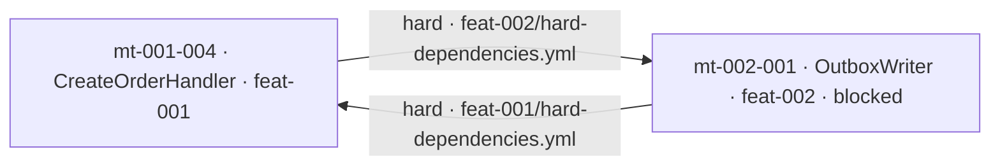

# Impact Analysis — worked example of graph queries

> **Source task:** `tasks-v1.md` → Phase 6 → 6.3 (Impact analysis and graph queries).
> **Governing decision:** `docs/adr/adr-005-traceability-graph.md` (D5 `impacts` closure, D7 the five
> use cases, D10 dispatch).
> **Implemented in:** `skills/mdpe-graph/SKILL.md` → **Queries** section (Q1-Q6, 7-rule protocol,
> "an honest answer" gate), `skills/mdpe-graph/assets/references/graph-queries.md` (full
> Q3 procedure) and `skills/mdpe-graph/assets/templates/impact-analysis-template.md` (record).
> **Purpose of this document:** to prove the six queries against a complete dataset — including what
> **fails** an answer. This is the operational test for 6.3, not an introduction to the graph.

## 0. About the dataset (read before any cited path)

Every path, id, and value below belongs to a **synthetic example repository** called *Acme Orders
API* — the same name used in the `worked_example` of `mdpe-tracking.yml`, so both examples can be
read together. **None of these paths exist in this repository** (`mdpe-skills`), which contains the
framework rather than an application. The only real paths cited here belong to the framework itself
(`skills/…`, `docs/adr/…`).

The dataset was assembled with four defects **planted on purpose**, because a query is only proven
when there's something to find: a cross-feature cycle, a promised artifact that doesn't exist, a
decision with no work behind it, and a superseded decision still in use. None of these is
hypothetical — each is a situation that MDPE artifacts can already state, and that nothing before
Phase 6 could read.

---

## 1. Dataset

### 1.1 Provenance

| Artifact | Relevant content |
|---|---|
| `docs/discovery/00-discovery-session-complete.yml` | `metadata.id: discovery-session-20260810-001` |
| `docs/brownfield/inventory.md` §4 | `cf-003` "Transactional email sending" · `files: src/Infrastructure/Email/EmailSender.cs` · `confidence: high` · **promoted** · `cf-005` "CSV report export" · `files: src/Reports/CsvExporter.cs` · `confidence: medium` · **not promoted** |
| `docs/backlog/backlog-index.yml` | `feat-001` "Order creation" · must-have · `traceability.feature_origin[].source: discovery-session-20260810-001` · `feat-002` "Order notification" · should-have · `origin: cf-003` · `feat-003` "Order cancellation" · must-have · **no transformation** |

### 1.2 Decisions — `docs/architecture/decisions.yml`

| id | title | type | status | scope | links |
|---|---|---|---|---|---|
| `ad-002` | The domain does not reference infrastructure | constraint | accepted | `system` | — |
| `ad-003` | Synchronous publishing on commit | choice | superseded | `feature` / `feat-002` | `superseded_by: ad-004` |
| `ad-004` | Event publishing via outbox | choice | accepted | `feature` / `feat-002` | `supersedes: ad-003` |
| `ad-005` | Idempotency via natural key on the consumer | constraint | accepted | `feature` / `feat-002` | **no micro-task implements it** |

### 1.3 Micro-tasks — `docs/transformation/{feature-id}/microtasks-index.yml`

| id | name | category | estimate | wave | status (tracking) |
|---|---|---|---|---|---|
| `mt-001-001` | `orders` table migration | database | 3h | `wave_1_foundation` | pending |
| `mt-001-002` | `Order` aggregate | domain | 4h | `wave_1_foundation` | **completed** |
| `mt-001-003` | `OrderRepository` | infrastructure | 5h | `wave_2_persistence` | pending |
| `mt-001-004` | `CreateOrderHandler` | application | 4h | `wave_3_application` | pending |
| `mt-001-005` | `POST /orders` endpoint | api | 3h | `wave_4_api` | pending |
| `mt-001-006` | Endpoint OpenAPI contract | docs | 1h | `wave_4_api` | pending |
| `mt-001-007` | Endpoint contract tests | tests | 2h | `wave_5_tests` | pending |
| `mt-002-001` | `OutboxWriter` | infrastructure | 4h | `wave_1_outbox` | **blocked** |
| `mt-002-002` | Publishing worker | infrastructure | 5h | `wave_2_publisher` | pending |

### 1.4 Dependencies

`docs/transformation/feat-001/dependencies/hard-dependencies.yml` → `dependencies[].source/.target`:

| source | target | reason (as stated in the artifact) |
|---|---|---|
| `mt-001-001` | `mt-001-003` | the repository needs the schema applied |
| `mt-001-002` | `mt-001-003` | the repository persists the aggregate |
| `mt-001-003` | `mt-001-004` | the handler uses the repository |
| `mt-001-004` | `mt-001-005` | the endpoint calls the handler |
| `mt-001-006` | `mt-001-007` | the contract test needs the contract |
| `mt-002-001` | `mt-001-004` | **the handler consumes the outbox writer** |

`docs/transformation/feat-002/dependencies/hard-dependencies.yml`:

| source | target | reason |
|---|---|---|
| `mt-001-004` | `mt-002-001` | **the writer is triggered by the handler** |
| `mt-002-001` | `mt-002-002` | the worker reads what the writer wrote |

> The last two bolded rows are the **planted cycle**, and its shape is as realistic as it gets:
> each feature declared the dependency in **its own** direction, in **its own** file, and nothing ever
> compared the two. Each feature's `graph_validation.cycles_detected` is **empty and correct** — within
> a single feature there is no cycle. See Q5.

`soft-dependencies.yml` (feat-001): `mt-001-001` → `mt-001-002` ("having the schema ready makes the
aggregate easier") · `mt-001-005` → `mt-001-006` ("preferable to have the endpoint before writing the
contract").

`external-dependencies.yml`: `mt-001-001` → `PostgreSQL 16.x` (`type: service`, `status: available`) ·
`mt-002-002` → `RabbitMQ 3.13` (`type: service`, `status: in_development`, `criticality: high`).

### 1.5 Execution plan (read, never recomputed)

`feat-001/dependencies/waves.yml`: `wave_1_foundation` = `mt-001-001` (3h) + `mt-001-002` (4h),
`can_run_parallel: true` · `wave_2_persistence` = `mt-001-003` · `wave_3_application` = `mt-001-004` ·
`wave_4_api` = `mt-001-005` (3h) + `mt-001-006` (1h), `can_run_parallel: true` (only a soft link
between them) · `wave_5_tests` = `mt-001-007`.

`feat-002/dependencies/waves.yml`: `wave_1_outbox` = `mt-002-001`, with
`upstream_dependencies: ["mt-001-004 (hard, cross-feature)"]` · `wave_2_publisher` = `mt-002-002`.

`feat-001/dependencies/critical-path.yml`: `sequence[]` = `mt-001-002` → `mt-001-003` → `mt-001-004` →
`mt-001-005`, `metadata.total_time: 16h`.
`feat-002/dependencies/critical-path.yml`: `sequence[]` = `mt-002-001` → `mt-002-002`, `total_time: 9h`.

`feat-001/dependencies/parallelizable.yml`: `group_1_wave_1` = {`mt-001-001`, `mt-001-002`}, `gain: 3h` ·
`group_2_wave_4` = {`mt-001-005`, `mt-001-006`}, `gain: 1h`.

### 1.6 Execution and artifacts

| micro-task | promised artifact (`output.generated_artifacts[].location`) | evidence |
|---|---|---|
| `mt-001-001` | `src/Infrastructure/Migrations/20260812_CreateOrders.cs` | context only (`docs/execution/mt-001-001-context.yml`, `architecture.no_decision_in_scope: true`) |
| `mt-001-002` | `src/Domain/Orders/Order.cs` | `mt-001-002-validation.yml` → `overall_status: approved_with_reservations`, `loop.iterations_to_green: i2`, `fidelity.declared_outputs[0].exists: true` · `mt-001-002-code-review.yml` → `verdict.status: approved_with_reservations`, `scope.architecture_decisions_in_scope: [ad-002]`, `dimensions.architecture.decisions_checked[0].result: pass`, 1 minor issue open |
| `mt-001-003` | `src/Infrastructure/Orders/OrderRepository.cs` | context only (`docs/execution/mt-001-003-context.yml`, `architecture.applies[0].id: ad-002`) |
| `mt-001-004` | `src/Application/Orders/CreateOrderHandler.cs` | none |
| `mt-001-005` | `src/Api/Orders/OrdersController.cs` | none |
| `mt-001-006` | `docs/api/orders.openapi.yml` | none |
| `mt-001-007` | `tests/Contract/OrdersEndpointTests.cs` | none |
| `mt-002-001` | `src/Infrastructure/Outbox/OutboxWriter.cs` | context (`docs/transformation/feat-002/execution/mt-002-001-context.yml`, `architecture.applies[0].id: ad-004`) · `mt-002-001-validation.yml` → `overall_status: blocked`, `fidelity.declared_outputs[0].exists: false` with `note: "landed at src/Infrastructure/Messaging/OutboxWriter.cs"` |
| `mt-002-002` | `src/Infrastructure/Outbox/OutboxPublisherWorker.cs` | context only (`docs/transformation/feat-002/execution/mt-002-002-context.yml`, `architecture.applies[0].id: ad-003`) |

Projection read by all queries below: `docs/graph/traceability-graph.md`,
`generated_at 2026-08-28 09:15`, `main @ 9f2c1ab`, **no drift** (protocol, rule 1).

---

## 2. Q3-A — Impact of changing `mt-001-002` (kind: `content`)

**Question.** "We're about to touch the `Order` aggregate. What's in scope?"

**Seed normalization.** `mt-001-002` is already a micro-task node — nothing to normalize. Stated for
completeness, since a seed given as a file path would have resolved to the micro-task that `produces`
it.

**Reached nodes.** `hops` = distance in propagating edges; `chain` = the **declared** edges that
support the line.

| node | type | class | hops | chain (edge · artifact → field) | status | route |
|---|---|---|---|---|---|---|
| `mt-001-003` | microtask | blocks | 1 | `mt-001-002` --hard--> `mt-001-003` · `feat-001/dependencies/hard-dependencies.yml` → `dependencies[].source/.target` | pending | re-plan |
| `mt-001-004` | microtask | blocks | 2 | + `mt-001-003` --hard--> `mt-001-004` · same file | pending | re-plan |
| `mt-001-005` | microtask | blocks | 3 | + `mt-001-004` --hard--> `mt-001-005` · same file | pending | re-plan |
| `mt-002-001` | microtask | blocks | 3 | + `mt-001-004` --hard--> `mt-002-001` · **`feat-002`**`/dependencies/hard-dependencies.yml` → `dependencies[].source/.target` | **blocked** | `mdpe-transformation` (cycle, Q5) and then `mdpe-coding` |
| `mt-002-002` | microtask | blocks | 4 | + `mt-002-001` --hard--> `mt-002-002` · `feat-002/…/hard-dependencies.yml` | pending | re-plan |
| `src/Domain/Orders/Order.cs` | artifact | files in scope | 1 | `mt-001-002` --produces--> path · `microtasks/mt-001-002.yml` → `output.generated_artifacts[].location` | **`exists: false` today** (see drift, §5) | `mdpe-coding` |
| `src/Infrastructure/Orders/OrderRepository.cs` | artifact | files in scope | 2 | + `mt-001-003` --produces--> path · `microtasks/mt-001-003.yml` → `output.generated_artifacts[].location` | contract only | `mdpe-coding` |
| `src/Application/Orders/CreateOrderHandler.cs` | artifact | files in scope | 3 | + `mt-001-004` --produces--> path · same | contract only | `mdpe-coding` |
| `src/Api/Orders/OrdersController.cs` | artifact | files in scope | 4 | + `mt-001-005` --produces--> path · same | contract only | `mdpe-coding` |
| `src/Infrastructure/Outbox/OutboxWriter.cs` | artifact | files in scope | 4 | + `mt-002-001` --produces--> path · same | **`exists: false`** | `mdpe-coding` — fidelity failure |
| `src/Infrastructure/Outbox/OutboxPublisherWorker.cs` | artifact | files in scope | 5 | + `mt-002-002` --produces--> path · same | contract only | `mdpe-coding` |
| `ad-002` | decision | decision to honour | terminal | `mt-001-002` --implements--> `ad-002` · `mt-001-002-code-review.yml` → `scope.architecture_decisions_in_scope` (precedes the context of `mt-001-003`, which declares the same) | accepted | `mdpe-coding` — architecture dimension of the review |
| `ad-004` | decision | decision to honour | terminal | `mt-002-001` --implements--> `ad-004` · `feat-002/execution/mt-002-001-context.yml` → `technical_context.architecture.applies[].id` | accepted | `mdpe-coding` |
| `mt-001-002:validation` | evidence | evidence to redo | terminal | --validates--> `mt-001-002` · `mt-001-002-validation.yml` → `summary.overall_status` (`approved_with_reservations`, `i2`) | invalidated by the change | `mdpe-coding`, then `mdpe-learnings` |
| `mt-001-002:review` | evidence | evidence to redo | terminal | --validates--> `mt-001-002` · `mt-001-002-code-review.yml` → `verdict.status` | invalidated | `mdpe-coding` |
| `mt-002-001:validation` | evidence | evidence to redo | terminal | --validates--> `mt-002-001` · `mt-002-001-validation.yml` → `summary.overall_status` (`blocked`) | already `blocked` | `mdpe-coding` |
| `mt-001-006` | microtask | **reorders** | terminal | `mt-001-005` -.soft.-> `mt-001-006` · `feat-001/dependencies/soft-dependencies.yml` → `dependencies[].source/.target`, reason stated there | pending | dispatch note — does not block |
| `ext:rabbitmq-3.13` | external | **blocks** | terminal | `mt-002-002` -.external.-> resource · `feat-002/dependencies/external-dependencies.yml` → `dependencies[].microtask/.resource`, `status: in_development`, `criticality: high` | unavailable | monitor — blocks `mt-002-002` |

**One-line summary.** 17 nodes reached, 6 in the `blocks` class; the change leaves `feat-001`, crosses
the cycle, and stops at `RabbitMQ 3.13`, which doesn't exist yet — so `mt-002-002` wouldn't close even
if everything else were ready.

**Checked and not reached** — a result, not an omission:

| not reached | why |
|---|---|
| `mt-001-001` | it's a **predecessor** of the seed (soft) and of `mt-001-003` (hard). An edge in the opposite direction isn't reach. |
| `mt-001-007` | it only connects to the reached set through `mt-001-006` --hard--> `mt-001-007`, and `mt-001-006` entered as a **terminal** relation (soft): a terminal node is not re-expanded, so it contributes no dependents. |
| `docs/api/orders.openapi.yml` | artifact of `mt-001-006`, for the same reason — a terminal node contributes no artifacts. |
| `ext:postgresql-16` | external dependency of `mt-001-001`, which is not in the reached set. |
| `feat-003`, `cf-005`, `ad-005` | no declared edge path connects them to the seed. |
| `ad-003` | `superseded`; the seed doesn't implement it, and `supersedes` is only walked starting from an `ad` seed. |

**Plan consequences** (cited, never recomputed):

- **Critical path touched: yes.** `mt-001-002` is the first node in
  `feat-001/dependencies/critical-path.yml` → `sequence[]`, and the other three in the sequence
  (`mt-001-003`, `mt-001-004`, `mt-001-005`) are all in the reached set. `metadata.total_time: 16h` —
  this document does **not** compute a new total; re-estimating is `mdpe-transformation`'s job.
- **Waves affected:** `wave_1_foundation`, `wave_2_persistence`, `wave_3_application`, `wave_4_api`
  (partially, via `reorders`), and, in `feat-002`, `wave_1_outbox` and `wave_2_publisher`.

**Mandatory label.** The reached set is **computed**: the `impacts` closure of
`depends-on(hard)` ∪ `implements`⁻¹ ∪ `produces` ∪ `derives-from`⁻¹, with soft, external, forward
`implements`, and `validates` walked **once** over the propagating set. **No artifact declares
`impacts`**, and it does not appear in the projection's edge table. Every line above rests solely on
declared edges.

**The visited set did work here.** `mt-002-001` --hard--> `mt-001-004` (a `feat-001` file) closes the
cycle back at `mt-001-004`, already visited at hop 2 — the walk stops there. Without the visited set
this query would never terminate. The cycle itself is reported by Q5, not "resolved" here.

**Record.** This answer was written to `docs/graph/impact-mt-001-002.md` (from
`skills/mdpe-graph/assets/templates/impact-analysis-template.md`) because it precedes a scope
negotiation. The rule is lazy: a conversation is enough; a file only when someone wants the record.

---

## 3. Q3-B — Impact of revising `ad-002` (kind: `revise`)

This is the case Phase 7 needs: **impact of a recorded decision**. The question "if `ad-002` is
revised, what's in scope?" had no possible answer before Phase 6.

**Normalization.** Seed `ad-002` → expands first via `implements`⁻¹ and via `supersedes`.

| node | class | hops | chain | status | route |
|---|---|---|---|---|---|
| `mt-001-002` | decision in scope | 1 | `ad-002` <--implements-- `mt-001-002` · `mt-001-002-code-review.yml` → `scope.architecture_decisions_in_scope` | **completed** — done against the old decision | `mdpe-architecture`, then `mdpe-coding` |
| `mt-001-003` | decision in scope | 1 | `ad-002` <--implements-- `mt-001-003` · `docs/execution/mt-001-003-context.yml` → `technical_context.architecture.applies[].id` | pending | `mdpe-architecture` |
| `mt-001-004`, `mt-001-005`, `mt-002-001`, `mt-002-002` | blocks | 2-5 | hard re-expansion starting from `mt-001-003` and the cycle — same edges as Q3-A | pending / blocked | re-plan |
| artifacts of all the above | files in scope | +1 | `produces` of each · `microtasks/*.yml` → `output.generated_artifacts[].location` | see §1.6 | `mdpe-coding` |
| `mt-001-002:validation`, `mt-001-002:review` | evidence to redo | terminal | `validates` → `mt-001-002` | approved against the old decision | `mdpe-coding` + `mdpe-learnings` |
| `mt-001-006` | reorders | terminal | soft from `mt-001-005` | pending | dispatch note |
| `ext:rabbitmq-3.13` | blocks | terminal | external dependency of `mt-002-002`, `status: in_development` | unavailable | monitor |

**Not reached:** `ad-003` and `ad-004` — `ad-002` has no `supersedes` or `superseded_by`; the
`ad-003`/`ad-004` chain is independent. `mt-001-001` — `no_decision_in_scope: true` in its context, i.e.
the **absence** of the `implements` edge is the data point (it's the type-2 orphan from Q4), not a gap
to be filled.

**What this answer delivers to memory.** It's not the reached set, it's the **adjacency**: whoever
works on `mt-001-003` next has, by neighborhood, the short list of what needs reading — `ad-002`
(`implements`), `feat-001` (`derives-from`), and lessons linked via `learned-from` when they exist.
Reading by neighborhood is the mechanism; the memory format is a Phase 7 decision and nothing here
presumes it.

---

## 4. Q5 — Cycles

**Answer.**

| cycle | edges | scope | route |
|---|---|---|---|
| `mt-001-004` ⇄ `mt-002-001` | `mt-001-004` --hard--> `mt-002-001` (`feat-002/dependencies/hard-dependencies.yml`, reason "the writer is triggered by the handler") · `mt-002-001` --hard--> `mt-001-004` (`feat-001/dependencies/hard-dependencies.yml`, reason "the handler consumes the outbox writer") | **cross-feature** | `mdpe-transformation` — re-decomposition |

`soft` cycles: none. `derives-from`: acyclic. `impacts`, being a transitive closure, is not evaluated
for cycles.

**The point that justifies the phase.** `feat-001/dependencies/full-graph.yml` →
`graph_validation.cycles_detected: []`, and the same for `feat-002` — **both correct**. Within each
feature there is no cycle; the `mdpe-transformation` quality gate got it right both times. The cycle
only shows up when the two files are read within the same projection, and nothing in the framework did
that before. Practical consequence already observable in the dataset: `mt-002-001` was executed out of
order — nobody knew which of the two comes first — and it ended up `blocked` with the output landing in
the wrong place.

---

## 5. Q4 — Orphans, and drift

**Orphans, by type.** A generic count isn't actionable; the type is what carries the route.

| type | node | observed condition | route |
|---|---|---|---|
| feature not decomposed | `feat-003` | must-have in `backlog-index.yml` with no `mt` referencing it via `traceability.feature_id` | `mdpe-transformation` |
| micro-task with no decision in scope | `mt-001-001` | context already generated, `architecture.no_decision_in_scope: true`, no `implements` edge | `mdpe-architecture` |
| decision with no work | `ad-005` | `accepted`, `scope_ref: feat-002`, no `mt` implementing it in contract, context, or review | revise scope or decompose |
| promised artifact that doesn't exist | `src/Infrastructure/Outbox/OutboxWriter.cs` | `mt-002-001-validation.yml` → `fidelity.declared_outputs[0].exists: false`, `note` points to `src/Infrastructure/Messaging/OutboxWriter.cs` | `mdpe-coding` — fidelity failure |
| `cf-NNN` not promoted | `cf-005` | reconstructed feature with no `feat` and no `mt` | **not a defect** — a conscious decision |

No occurrence, and that's a result too: a `completed` micro-task with no evidence (the only
`completed` one has both validation and review) and an orphaned lesson (no `{id}-learnings.yml` exists
at all — the `learning` node stays conditional as long as its template doesn't exist).

`orphans_count` = 5 nodes across 5 types (4 actionable + 1 conscious).

**Drift**, compared against the previous generation of the projection:

| drift | element | observed | route |
|---|---|---|---|
| artifact turned `exists: false` | `src/Domain/Orders/Order.cs` | it was `exists: true` in the previous generation; the file is now at `src/Domain/Orders/Aggregates/Order.cs` | `mdpe-coding` — reconcile the declared path in the contract |
| superseded `ad` still referenced | `ad-003` | `superseded_by: ad-004`, and `feat-002/execution/mt-002-002-context.yml` → `architecture.applies[0].id` still says `ad-003` | `mdpe-architecture` |

`drift_count` = 2. Drift is **reported, never fixed by inference** — the graph doesn't repoint
anything.

**Path mismatch** (Gap 9.1, made visible as data instead of a footnote):

| file | declared at | found at |
|---|---|---|
| `mt-001-001-context.yml` | `docs/transformation/feat-001/execution/` | `docs/execution/` |
| `mt-001-003-context.yml` | `docs/transformation/feat-001/execution/` | `docs/execution/` |

Not an orphan: it's a convention mismatch between `mdpe-execution-context` and `mdpe-learnings`,
logged for task 9.1 and never silently resolved.

---

## 6. Q6 — Parallelism, and Q2 — critical path

**What can run now.**

- **Dispatchable:** `mt-001-001` — `wave_1_foundation` (the lowest open wave of `feat-001`),
  `upstream_hard: []` in `full-graph.yml`, external dependency `PostgreSQL 16.x` with
  `status: available`. Context already generated, so the route is `mdpe-coding`, not
  `mdpe-execution-context`.
- **Parallelism available:** **1 of 2** declared in `parallelizable.yml` → `group_1_wave_1`.
- **Why it was reduced:** `mt-001-002` is `completed` (`mdpe-tracking.yml` → `microtasks[].status`) —
  it's not dispatchable again. The group didn't shrink due to a block; it shrank because half of it
  already closed.
- **`feat-002` has nothing dispatchable:** `wave_1_outbox` contains `mt-002-001`, which is `blocked`,
  and its `depends-on(hard)` `mt-001-004` is `pending`. Dual route: `mdpe-transformation` for the cycle
  (Q5), `mdpe-coding` for the fidelity issue (Q4).

**Consistency with the waves.** The dispatchable set `{mt-001-001}` is a **subset** of
`group_1_wave_1` = {`mt-001-001`, `mt-001-002`}, within the lowest open wave. No group was assembled
here. If `mt-001-003` "seemed" parallelizable, that would be a **divergence report** for
`mdpe-transformation`, not a dispatch — assembling its own group would turn this skill into a second
source of ordering.

**Critical path (Q2).** `feat-001`: `mt-001-002` → `mt-001-003` → `mt-001-004` → `mt-001-005`, `16h`.
`feat-002`: `mt-002-001` → `mt-002-002`, `9h`. Both **read** from `critical-path.yml`. **There is no
global critical path** in this answer: combining the two sequences would be a recomputation, and with
the Q5 cycle still open the cross-feature path is undefined by construction. Saying so is the correct
answer; adding `16h + 9h` would be inventing a number.

`critical_path_length` = 16h / 4 nodes (`feat-001`) and 9h / 2 nodes (`feat-002`).
`parallelism_available` = 1 of 2, with the reason named. `cycles_detected` = 1 (cross-feature).

---

## 7. Two failed answers

The value of an example lies as much in what it rejects as in what it produces. The two answers below
are about the **same** Q3-A question, and both **fail** the "an honest answer" gate.

### 7.1 Failed — ignored soft and external

> "Changing `mt-001-002` blocks `mt-001-003`, `mt-001-004`, `mt-001-005`, `mt-002-001`, and
> `mt-002-002`, via the hard dependencies. Five micro-tasks in scope."

The hard reach is **correct**, and the answer is still wrong. What was left out:

- **`ext:rabbitmq-3.13`** with `status: in_development`. It's the **real** blocker of the `feat-002`
  segment: even with all five micro-tasks ready, `mt-002-002` doesn't close. An answer that omits this
  makes an impossible plan look executable.
- **`mt-001-006`** via soft: `mt-001-005` → `mt-001-006` changes the **order** of `wave_4_api`, and
  order is exactly what the person asking the question is about to touch.

Fails the protocol, rule 4 — and it's the literal negative scenario from task 6.3: *"an analysis that
ignores soft/external dependencies fails."*

### 7.2 Failed — no chain

> "Touching the `Order` aggregate affects the application layer, persistence, the outbox, and probably
> the contract tests, because domain changes tend to propagate to the edge."

No id, no edge, no source artifact. Beyond being unverifiable, it's also **wrong**: it includes
`mt-001-007` ("contract tests"), which Q3-A showed to be **not reached** — it's only reachable through
`mt-001-006`, which entered as a terminal relation. The answer would be accidentally right on four
points and wrong on one, and there'd be no way to tell which is which.

Fails on three gate items at once: a node with no declared edge chain, a node reached by inference
("tend to propagate"), and a reached set presented without the computed label. It's the other negative
scenario from 6.3: *"an impact answer that doesn't cite the nodes/edges supporting it fails."*

---

## 8. Verification against the test scenarios of task 6.3

| Scenario | Where it's satisfied |
|---|---|
| + Given a change to a node, correctly lists the affected downstream nodes | §2 (Q3-A, seed `mt-001-002`, 17 nodes with chain, class, hops, status, and route) and §3 (Q3-B, seed `ad-002` — the revised-decision case). The "correctly" part is verifiable: every line cites an artifact and field, and §2 lists what was checked and **not** reached, with the reason per line |
| + Detects cycles and orphans and reports them | §4 (cross-feature cycle `mt-001-004` ⇄ `mt-002-001`, with both edges and their two files, plus the observation that the per-feature gate got it right in both features) and §5 (5 orphans across 5 types, each with a route; 2 drift items; 2 path mismatches) |
| + Identifies parallelizable tasks consistent with the waves | §6 — `{mt-001-001}` as a subset of `group_1_wave_1` in the lowest open wave, with the named reason for the reduction (`mt-001-002` `completed`) and the rule that divergence is reported, not dispatched |
| − An analysis that ignores soft/external dependencies fails | §7.1 — an answer with the correct hard reach, failed for omitting `ext:rabbitmq-3.13` (`in_development`, the real blocker) and `mt-001-006` (soft, changes the order of `wave_4_api`). The rule is in the protocol (rule 4) and the gate |
| − An impact answer that doesn't cite the nodes/edges supporting it fails | §7.2 — a prose answer, with no id or edge, that still includes `mt-001-007` by inference when it's demonstrably not reached. Fails on three gate items |

**Connection to Phase 5** (metrics): derived readings come from the queries, and this example produces
all of them — `orphans_count` = 5 by type (§5), `critical_path_length` = 16h/4 nodes and 9h/2 nodes
(§6), `parallelism_available` = 1 of 2 with reason (§6), `cycles_detected` = 1 cross-feature (§4),
`drift_count` = 2 (§5). These are **readings**, taken when someone asks: no series, no attached target
(ADR-004 D8).

**Connection to Phase 7** (memory): §3 is the "impact of a recorded decision" query, and the section's
closing explains the mechanism memory will use — retrieval by **adjacency** (`derives-from`,
`implements`, `learned-from`), not loading the entire repository. The memory format remains open for
Phase 7.

---

## 9. Sources

**Internal (from this repository, real):** `docs/adr/adr-005-traceability-graph.md` (D5 edge catalog
and the `impacts` closure; D7 the five use cases with operational definition; D9 drift audit; D10
dispatch; §5 what is not mandatory) · `skills/mdpe-graph/SKILL.md` (**Queries** section: Q1-Q6, 7-rule
protocol, "an honest answer" gate) ·
`skills/mdpe-graph/assets/references/graph-queries.md` (Q3 step by step, propagating vs terminal,
class precedence, catalog of classes and routes) ·
`skills/mdpe-graph/assets/templates/traceability-graph-template.md` and
`assets/templates/impact-analysis-template.md` · `skills/mdpe-transformation/assets/templates/dependencies-template.yml`
(fields `source`/`target`/`reason`, `microtask`/`resource`/`status`/`criticality`,
`waves.{key}.microtasks[]`, `sequence[]`, `metadata.total_time`, `parallelization_groups`,
`graph_validation.cycles_detected`) · `skills/mdpe-coding/assets/templates/validation-report-template.yml`
(`fidelity.declared_outputs[].exists`, `loop.iterations_to_green`, `overall_status` vocabulary) ·
`skills/mdpe-coding/assets/templates/code-review-template.yml` (`verdict.status`,
`scope.architecture_decisions_in_scope`, `dimensions.architecture.decisions_checked[]`) ·
`skills/mdpe-learnings/assets/templates/mdpe-tracking.yml` (reconciled status; block G reserved) ·
`docs/analysis/competitive-analysis.md` (A11 dispatching graph; A13 cross-artifact consistency) ·
`docs/analysis/evaluation-rubric.md` (Axis 5, level 5 depends on this task) ·
`docs/analysis/baseline-gap-map.md` (Gaps 5.1, 5.2, 6.2, 9.1).

**Dataset:** synthetic and fully described in §1. No path from the *Acme Orders API* exists in this
repository; no value was copied from a real project.
