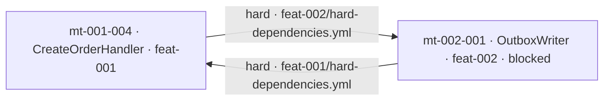

# Impact Analysis — exemplo trabalhado das consultas sobre o grafo

> **Tarefa de origem:** `tasks-v1.md` → Fase 6 → 6.3 (Análise de impacto e consultas sobre o grafo).
> **Decisão de registro:** `docs/adr/adr-005-traceability-graph.md` (D5 fechamento `impacts`, D7 os cinco
> casos de uso, D10 despacho).
> **Implementado em:** `skills/mdpe-graph/SKILL.md` → seção **Queries** (Q1-Q6, protocolo de 7 regras,
> gate "an honest answer"), `skills/mdpe-graph/assets/references/graph-queries.md` (procedimento
> completo da Q3) e `skills/mdpe-graph/assets/templates/impact-analysis-template.md` (registro).
> **Objetivo deste documento:** provar as seis consultas contra um dataset completo — incluindo o que
> **reprova** uma resposta. É o teste operacional da 6.3, não uma introdução ao grafo.

## 0. Sobre o dataset (leia antes de qualquer caminho citado)

Todo caminho, id e valor abaixo pertence a um **repositório-exemplo sintético** chamado *Acme Orders
API* — o mesmo nome usado no `worked_example` do `mdpe-tracking.yml`, para que os dois exemplos possam
ser lidos juntos. **Nenhum desses caminhos existe neste repositório** (`mdpe-skills`), que contém o
framework e não uma aplicação. Os únicos caminhos reais citados aqui são os do próprio framework
(`skills/…`, `docs/adr/…`).

O dataset foi montado com quatro defeitos **plantados de propósito**, porque uma consulta só se prova
quando há algo para achar: um ciclo cross-feature, um artefato prometido inexistente, uma decisão sem
trabalho e uma decisão superseded ainda em uso. Nenhum deles é hipotético — cada um é uma situação que
os artefatos do MDPE já conseguem declarar e que nada, antes da Fase 6, conseguia ler.

---

## 1. Dataset

### 1.1 Proveniência

| Artefato | Conteúdo relevante |
|---|---|
| `docs/discovery/00-discovery-session-complete.yml` | `metadata.id: discovery-session-20260810-001` |
| `docs/brownfield/inventory.md` §4 | `cf-003` "Envio de e-mail transacional" · `files: src/Infrastructure/Email/EmailSender.cs` · `confidence: high` · **promovida** · `cf-005` "Exportação de relatórios em CSV" · `files: src/Reports/CsvExporter.cs` · `confidence: medium` · **não promovida** |
| `docs/backlog/backlog-index.yml` | `feat-001` "Criação de pedido" · must-have · `traceability.feature_origin[].source: discovery-session-20260810-001` · `feat-002` "Notificação de pedido" · should-have · `origin: cf-003` · `feat-003` "Cancelamento de pedido" · must-have · **sem transformation** |

### 1.2 Decisões — `docs/architecture/decisions.yml`

| id | título | type | status | escopo | ligações |
|---|---|---|---|---|---|
| `ad-002` | O domínio não referencia infraestrutura | constraint | accepted | `system` | — |
| `ad-003` | Publicação síncrona no commit | choice | superseded | `feature` / `feat-002` | `superseded_by: ad-004` |
| `ad-004` | Publicação de eventos via outbox | choice | accepted | `feature` / `feat-002` | `supersedes: ad-003` |
| `ad-005` | Idempotência por chave natural no consumidor | constraint | accepted | `feature` / `feat-002` | **nenhuma micro-task a implementa** |

### 1.3 Micro-tasks — `docs/transformation/{feature-id}/microtasks-index.yml`

| id | nome | categoria | estimativa | wave | status (tracking) |
|---|---|---|---|---|---|
| `mt-001-001` | Migração da tabela `orders` | database | 3h | `wave_1_foundation` | pending |
| `mt-001-002` | Agregado `Order` | domain | 4h | `wave_1_foundation` | **completed** |
| `mt-001-003` | `OrderRepository` | infrastructure | 5h | `wave_2_persistence` | pending |
| `mt-001-004` | `CreateOrderHandler` | application | 4h | `wave_3_application` | pending |
| `mt-001-005` | Endpoint `POST /orders` | api | 3h | `wave_4_api` | pending |
| `mt-001-006` | Contrato OpenAPI do endpoint | docs | 1h | `wave_4_api` | pending |
| `mt-001-007` | Testes de contrato do endpoint | tests | 2h | `wave_5_tests` | pending |
| `mt-002-001` | `OutboxWriter` | infrastructure | 4h | `wave_1_outbox` | **blocked** |
| `mt-002-002` | Worker de publicação | infrastructure | 5h | `wave_2_publisher` | pending |

### 1.4 Dependências

`docs/transformation/feat-001/dependencies/hard-dependencies.yml` → `dependencies[].source/.target`:

| source | target | reason (citada no artefato) |
|---|---|---|
| `mt-001-001` | `mt-001-003` | o repositório precisa do schema aplicado |
| `mt-001-002` | `mt-001-003` | o repositório persiste o agregado |
| `mt-001-003` | `mt-001-004` | o handler usa o repositório |
| `mt-001-004` | `mt-001-005` | o endpoint chama o handler |
| `mt-001-006` | `mt-001-007` | o teste de contrato precisa do contrato |
| `mt-002-001` | `mt-001-004` | **o handler consome o writer do outbox** |

`docs/transformation/feat-002/dependencies/hard-dependencies.yml`:

| source | target | reason |
|---|---|---|
| `mt-001-004` | `mt-002-001` | **o writer é acionado pelo handler** |
| `mt-002-001` | `mt-002-002` | o worker lê o que o writer gravou |

> As duas últimas linhas em negrito são o **ciclo plantado**, e a forma dele é a mais realista que existe:
> cada feature declarou a dependência no **seu** sentido, no **seu** arquivo, e nada nunca comparou os
> dois. O `graph_validation.cycles_detected` de cada feature está **vazio e correto** — dentro de uma
> feature não há ciclo. Ver Q5.

`soft-dependencies.yml` (feat-001): `mt-001-001` → `mt-001-002` ("o schema pronto facilita o agregado") ·
`mt-001-005` → `mt-001-006` ("preferível ter o endpoint antes de escrever o contrato").

`external-dependencies.yml`: `mt-001-001` → `PostgreSQL 16.x` (`type: service`, `status: available`) ·
`mt-002-002` → `RabbitMQ 3.13` (`type: service`, `status: in_development`, `criticality: high`).

### 1.5 Plano de execução (lido, nunca recalculado)

`feat-001/dependencies/waves.yml`: `wave_1_foundation` = `mt-001-001` (3h) + `mt-001-002` (4h),
`can_run_parallel: true` · `wave_2_persistence` = `mt-001-003` · `wave_3_application` = `mt-001-004` ·
`wave_4_api` = `mt-001-005` (3h) + `mt-001-006` (1h), `can_run_parallel: true` (só há soft entre elas) ·
`wave_5_tests` = `mt-001-007`.

`feat-002/dependencies/waves.yml`: `wave_1_outbox` = `mt-002-001`, com
`upstream_dependencies: ["mt-001-004 (hard, cross-feature)"]` · `wave_2_publisher` = `mt-002-002`.

`feat-001/dependencies/critical-path.yml`: `sequence[]` = `mt-001-002` → `mt-001-003` → `mt-001-004` →
`mt-001-005`, `metadata.total_time: 16h`.
`feat-002/dependencies/critical-path.yml`: `sequence[]` = `mt-002-001` → `mt-002-002`, `total_time: 9h`.

`feat-001/dependencies/parallelizable.yml`: `group_1_wave_1` = {`mt-001-001`, `mt-001-002`}, `gain: 3h` ·
`group_2_wave_4` = {`mt-001-005`, `mt-001-006`}, `gain: 1h`.

### 1.6 Execução e artefatos

| micro-task | artefato prometido (`output.generated_artifacts[].location`) | evidência |
|---|---|---|
| `mt-001-001` | `src/Infrastructure/Migrations/20260812_CreateOrders.cs` | só contexto (`docs/execution/mt-001-001-context.yml`, `architecture.no_decision_in_scope: true`) |
| `mt-001-002` | `src/Domain/Orders/Order.cs` | `mt-001-002-validation.yml` → `overall_status: approved_with_reservations`, `loop.iterations_to_green: i2`, `fidelity.declared_outputs[0].exists: true` · `mt-001-002-code-review.yml` → `verdict.status: approved_with_reservations`, `scope.architecture_decisions_in_scope: [ad-002]`, `dimensions.architecture.decisions_checked[0].result: pass`, 1 minor aberto |
| `mt-001-003` | `src/Infrastructure/Orders/OrderRepository.cs` | só contexto (`docs/execution/mt-001-003-context.yml`, `architecture.applies[0].id: ad-002`) |
| `mt-001-004` | `src/Application/Orders/CreateOrderHandler.cs` | nenhuma |
| `mt-001-005` | `src/Api/Orders/OrdersController.cs` | nenhuma |
| `mt-001-006` | `docs/api/orders.openapi.yml` | nenhuma |
| `mt-001-007` | `tests/Contract/OrdersEndpointTests.cs` | nenhuma |
| `mt-002-001` | `src/Infrastructure/Outbox/OutboxWriter.cs` | contexto (`docs/transformation/feat-002/execution/mt-002-001-context.yml`, `architecture.applies[0].id: ad-004`) · `mt-002-001-validation.yml` → `overall_status: blocked`, `fidelity.declared_outputs[0].exists: false` com `note: "landed at src/Infrastructure/Messaging/OutboxWriter.cs"` |
| `mt-002-002` | `src/Infrastructure/Outbox/OutboxPublisherWorker.cs` | só contexto (`docs/transformation/feat-002/execution/mt-002-002-context.yml`, `architecture.applies[0].id: ad-003`) |

Projeção lida por todas as consultas abaixo: `docs/graph/traceability-graph.md`,
`generated_at 2026-08-28 09:15`, `main @ 9f2c1ab`, **sem defasagem** (protocolo, regra 1).

---

## 2. Q3-A — Impacto de mudar `mt-001-002` (kind: `content`)

**Pergunta.** "Vamos mexer no agregado `Order`. O que entra em escopo?"

**Normalização do seed.** `mt-001-002` já é nó de micro-task — nada a normalizar. Declarado por
completude, porque um seed dado como caminho de arquivo teria virado a micro-task que o `produces`.

**Nós alcançados.** `hops` = distância em arestas propagantes; `chain` = as arestas **declaradas** que
sustentam a linha.

| nó | tipo | classe | hops | chain (aresta · artefato → campo) | status | rota |
|---|---|---|---|---|---|---|
| `mt-001-003` | microtask | blocks | 1 | `mt-001-002` --hard--> `mt-001-003` · `feat-001/dependencies/hard-dependencies.yml` → `dependencies[].source/.target` | pending | re-planejar |
| `mt-001-004` | microtask | blocks | 2 | + `mt-001-003` --hard--> `mt-001-004` · mesmo arquivo | pending | re-planejar |
| `mt-001-005` | microtask | blocks | 3 | + `mt-001-004` --hard--> `mt-001-005` · mesmo arquivo | pending | re-planejar |
| `mt-002-001` | microtask | blocks | 3 | + `mt-001-004` --hard--> `mt-002-001` · **`feat-002`**`/dependencies/hard-dependencies.yml` → `dependencies[].source/.target` | **blocked** | `mdpe-transformation` (ciclo, Q5) e depois `mdpe-coding` |
| `mt-002-002` | microtask | blocks | 4 | + `mt-002-001` --hard--> `mt-002-002` · `feat-002/…/hard-dependencies.yml` | pending | re-planejar |
| `src/Domain/Orders/Order.cs` | artifact | files in scope | 1 | `mt-001-002` --produces--> caminho · `microtasks/mt-001-002.yml` → `output.generated_artifacts[].location` | **`exists: false` hoje** (ver drift, §5) | `mdpe-coding` |
| `src/Infrastructure/Orders/OrderRepository.cs` | artifact | files in scope | 2 | + `mt-001-003` --produces--> caminho · `microtasks/mt-001-003.yml` → `output.generated_artifacts[].location` | só contrato | `mdpe-coding` |
| `src/Application/Orders/CreateOrderHandler.cs` | artifact | files in scope | 3 | + `mt-001-004` --produces--> caminho · idem | só contrato | `mdpe-coding` |
| `src/Api/Orders/OrdersController.cs` | artifact | files in scope | 4 | + `mt-001-005` --produces--> caminho · idem | só contrato | `mdpe-coding` |
| `src/Infrastructure/Outbox/OutboxWriter.cs` | artifact | files in scope | 4 | + `mt-002-001` --produces--> caminho · idem | **`exists: false`** | `mdpe-coding` — falha de fidelidade |
| `src/Infrastructure/Outbox/OutboxPublisherWorker.cs` | artifact | files in scope | 5 | + `mt-002-002` --produces--> caminho · idem | só contrato | `mdpe-coding` |
| `ad-002` | decision | decision to honour | terminal | `mt-001-002` --implements--> `ad-002` · `mt-001-002-code-review.yml` → `scope.architecture_decisions_in_scope` (precede o contexto de `mt-001-003`, que declara o mesmo) | accepted | `mdpe-coding` — dimensão architecture do review |
| `ad-004` | decision | decision to honour | terminal | `mt-002-001` --implements--> `ad-004` · `feat-002/execution/mt-002-001-context.yml` → `technical_context.architecture.applies[].id` | accepted | `mdpe-coding` |
| `mt-001-002:validation` | evidence | evidence to redo | terminal | --validates--> `mt-001-002` · `mt-001-002-validation.yml` → `summary.overall_status` (`approved_with_reservations`, `i2`) | invalidada pela mudança | `mdpe-coding`, depois `mdpe-learnings` |
| `mt-001-002:review` | evidence | evidence to redo | terminal | --validates--> `mt-001-002` · `mt-001-002-code-review.yml` → `verdict.status` | invalidada | `mdpe-coding` |
| `mt-002-001:validation` | evidence | evidence to redo | terminal | --validates--> `mt-002-001` · `mt-002-001-validation.yml` → `summary.overall_status` (`blocked`) | já `blocked` | `mdpe-coding` |
| `mt-001-006` | microtask | **reorders** | terminal | `mt-001-005` -.soft.-> `mt-001-006` · `feat-001/dependencies/soft-dependencies.yml` → `dependencies[].source/.target`, reason citada lá | pending | nota de despacho — não bloqueia |
| `ext:rabbitmq-3.13` | external | **blocks** | terminal | `mt-002-002` -.external.-> recurso · `feat-002/dependencies/external-dependencies.yml` → `dependencies[].microtask/.resource`, `status: in_development`, `criticality: high` | indisponível | monitorar — bloqueia `mt-002-002` |

**Resumo em uma linha.** 17 nós alcançados, 6 na classe `blocks`; a mudança sai de `feat-001`, atravessa
o ciclo e para no `RabbitMQ 3.13`, que ainda não existe — então `mt-002-002` não fecharia nem com todo o
resto pronto.

**Checado e não alcançado** — resultado, não omissão:

| não alcançado | por quê |
|---|---|
| `mt-001-001` | é **predecessor** do seed (soft) e de `mt-001-003` (hard). Aresta no sentido oposto não é alcance. |
| `mt-001-007` | só se liga ao alcance por `mt-001-006` --hard--> `mt-001-007`, e `mt-001-006` entrou por relação **terminal** (soft): nó terminal não é reexpandido, então não contribui dependentes. |
| `docs/api/orders.openapi.yml` | artefato de `mt-001-006`, pelo mesmo motivo — terminal não contribui artefatos. |
| `ext:postgresql-16` | externa de `mt-001-001`, que não está no alcance. |
| `feat-003`, `cf-005`, `ad-005` | nenhum caminho de aresta declarada os liga ao seed. |
| `ad-003` | `superseded`; o seed não a implementa, e `supersedes` só é varrida a partir de um seed `ad`. |

**Consequências de plano** (citadas, nunca recalculadas):

- **Caminho crítico tocado: sim.** `mt-001-002` é o primeiro nó de
  `feat-001/dependencies/critical-path.yml` → `sequence[]`, e os outros três da sequência
  (`mt-001-003`, `mt-001-004`, `mt-001-005`) estão todos no alcance. `metadata.total_time: 16h` — este
  documento **não** calcula um total novo; re-estimar é trabalho de `mdpe-transformation`.
- **Ondas afetadas:** `wave_1_foundation`, `wave_2_persistence`, `wave_3_application`, `wave_4_api`
  (parcialmente, via `reorders`) e, em `feat-002`, `wave_1_outbox` e `wave_2_publisher`.

**Rótulo obrigatório.** O alcance é **computado**: fechamento `impacts` de
`depends-on(hard)` ∪ `implements`⁻¹ ∪ `produces` ∪ `derives-from`⁻¹, com soft, external, `implements`
para frente e `validates` varridas **uma vez** sobre o conjunto propagante. **Nenhum artefato declara
`impacts`**, e ela não aparece na tabela de arestas da projeção. Toda linha acima se sustenta apenas em
arestas declaradas.

**O visited set fez trabalho aqui.** `mt-002-001` --hard--> `mt-001-004` (arquivo de `feat-001`) fecha o
ciclo de volta em `mt-001-004`, já visitado no hop 2 — a caminhada para ali. Sem o visited set esta
consulta não termina. O ciclo em si é reportado pela Q5, não "resolvido" aqui.

**Registro.** Esta resposta foi gravada em `docs/graph/impact-mt-001-002.md` (a partir de
`skills/mdpe-graph/assets/templates/impact-analysis-template.md`) porque precede uma negociação de
escopo. A regra é preguiçosa: conversa basta, arquivo só quando alguém quer o registro.

---

## 3. Q3-B — Impacto de revisar `ad-002` (kind: `revise`)

Este é o caso que a Fase 7 precisa: **impacto de uma decisão registrada**. A pergunta "se `ad-002` for
revista, o que entra em escopo?" não tinha resposta possível antes da Fase 6.

**Normalização.** Seed `ad-002` → expande primeiro por `implements`⁻¹ e por `supersedes`.

| nó | classe | hops | chain | status | rota |
|---|---|---|---|---|---|
| `mt-001-002` | decision in scope | 1 | `ad-002` <--implements-- `mt-001-002` · `mt-001-002-code-review.yml` → `scope.architecture_decisions_in_scope` | **completed** — feita contra a decisão antiga | `mdpe-architecture`, depois `mdpe-coding` |
| `mt-001-003` | decision in scope | 1 | `ad-002` <--implements-- `mt-001-003` · `docs/execution/mt-001-003-context.yml` → `technical_context.architecture.applies[].id` | pending | `mdpe-architecture` |
| `mt-001-004`, `mt-001-005`, `mt-002-001`, `mt-002-002` | blocks | 2-5 | reexpansão hard a partir de `mt-001-003` e do ciclo — mesmas arestas da Q3-A | pending / blocked | re-planejar |
| artefatos de todas as anteriores | files in scope | +1 | `produces` de cada uma · `microtasks/*.yml` → `output.generated_artifacts[].location` | ver §1.6 | `mdpe-coding` |
| `mt-001-002:validation`, `mt-001-002:review` | evidence to redo | terminal | `validates` → `mt-001-002` | aprovadas contra a decisão antiga | `mdpe-coding` + `mdpe-learnings` |
| `mt-001-006` | reorders | terminal | soft de `mt-001-005` | pending | nota de despacho |
| `ext:rabbitmq-3.13` | blocks | terminal | externa de `mt-002-002`, `status: in_development` | indisponível | monitorar |

**Não alcançado:** `ad-003` e `ad-004` — `ad-002` não tem `supersedes` nem `superseded_by`; a cadeia
`ad-003`/`ad-004` é independente. `mt-001-001` — `no_decision_in_scope: true` no seu contexto, ou seja,
a **ausência** da aresta `implements` é o dado (é o órfão tipo 2 da Q4), não uma lacuna a preencher.

**O que esta resposta entrega à memória.** Não é o alcance, é a **adjacência**: quem for trabalhar em
`mt-001-003` tem, por vizinhança, a lista curta do que precisa ler — `ad-002` (`implements`), `feat-001`
(`derives-from`) e as lições ligadas por `learned-from` quando existirem. Ler por vizinhança é o
mecanismo; o formato da memória é decisão da Fase 7 e nada aqui o presume.

---

## 4. Q5 — Ciclos

**Resposta.**

| ciclo | arestas | escopo | rota |
|---|---|---|---|
| `mt-001-004` ⇄ `mt-002-001` | `mt-001-004` --hard--> `mt-002-001` (`feat-002/dependencies/hard-dependencies.yml`, reason "o writer é acionado pelo handler") · `mt-002-001` --hard--> `mt-001-004` (`feat-001/dependencies/hard-dependencies.yml`, reason "o handler consome o writer do outbox") | **cross-feature** | `mdpe-transformation` — re-decomposição |

Ciclos `soft`: nenhum. `derives-from`: acíclico. `impacts`, sendo fechamento transitivo, não é avaliada
para ciclo.

**O ponto que justifica a fase.** `feat-001/dependencies/full-graph.yml` →
`graph_validation.cycles_detected: []` e o de `feat-002` idem — **ambos corretos**. Dentro de cada
feature não existe ciclo; o quality gate de `mdpe-transformation` acertou nas duas vezes. O ciclo só
aparece quando os dois arquivos são lidos na mesma projeção, e nada no framework fazia isso antes.
Consequência prática já observável no dataset: `mt-002-001` foi executada fora de ordem — ninguém sabia
qual das duas vem primeiro — e terminou `blocked` com a saída no lugar errado.

---

## 5. Q4 — Órfãos, e a deriva

**Órfãos, por tipo.** Contagem genérica não é acionável; o tipo é que carrega a rota.

| tipo | nó | condição observada | rota |
|---|---|---|---|
| feature não decomposta | `feat-003` | must-have em `backlog-index.yml` sem nenhuma `mt` que a referencie em `traceability.feature_id` | `mdpe-transformation` |
| micro-task sem decisão em escopo | `mt-001-001` | contexto já gerado, `architecture.no_decision_in_scope: true`, nenhuma aresta `implements` | `mdpe-architecture` |
| decisão sem trabalho | `ad-005` | `accepted`, `scope_ref: feat-002`, nenhuma `mt` a implementa em contrato, contexto ou review | revisar escopo ou decompor |
| artefato prometido inexistente | `src/Infrastructure/Outbox/OutboxWriter.cs` | `mt-002-001-validation.yml` → `fidelity.declared_outputs[0].exists: false`, `note` aponta `src/Infrastructure/Messaging/OutboxWriter.cs` | `mdpe-coding` — falha de fidelidade |
| `cf-NNN` não promovido | `cf-005` | feature reconstruída sem `feat` e sem `mt` | **não é defeito** — decisão consciente |

Sem ocorrência, e isso é resultado: micro-task `completed` sem evidência (a única `completed` tem
validation e review) e aprendizado sem alvo (nenhum `{id}-learnings.yml` existe — o nó `learning` segue
condicional enquanto seu template não existir).

`orphans_count` = 5 nós em 5 tipos (4 acionáveis + 1 consciente).

**Deriva**, comparada contra a geração anterior da projeção:

| deriva | elemento | observado | rota |
|---|---|---|---|
| artefato passou a `exists: false` | `src/Domain/Orders/Order.cs` | era `exists: true` na geração anterior; o arquivo está hoje em `src/Domain/Orders/Aggregates/Order.cs` | `mdpe-coding` — reconciliar o caminho declarado no contrato |
| `ad` superseded ainda apontada | `ad-003` | `superseded_by: ad-004`, e `feat-002/execution/mt-002-002-context.yml` → `architecture.applies[0].id` ainda diz `ad-003` | `mdpe-architecture` |

`drift_count` = 2. Deriva é **relatada, nunca corrigida por dedução** — o grafo não repointa nada.

**Pendência de caminho** (a Lacuna 9.1, visível como dado em vez de nota de rodapé):

| arquivo | declarado em | encontrado em |
|---|---|---|
| `mt-001-001-context.yml` | `docs/transformation/feat-001/execution/` | `docs/execution/` |
| `mt-001-003-context.yml` | `docs/transformation/feat-001/execution/` | `docs/execution/` |

Não é órfão: é desencontro de convenção entre `mdpe-execution-context` e `mdpe-learnings`, registrado
para a tarefa 9.1 e nunca resolvido em silêncio.

---

## 6. Q6 — Paralelismo, e Q2 — caminho crítico

**O que roda agora.**

- **Despachável:** `mt-001-001` — `wave_1_foundation` (a onda aberta mais baixa de `feat-001`),
  `upstream_hard: []` em `full-graph.yml`, externa `PostgreSQL 16.x` com `status: available`. Contexto já
  gerado, então a rota é `mdpe-coding` e não `mdpe-execution-context`.
- **Paralelismo disponível:** **1 de 2** declarados em `parallelizable.yml` → `group_1_wave_1`.
- **Por que foi reduzido:** `mt-001-002` está `completed` (`mdpe-tracking.yml` → `microtasks[].status`) —
  não é despachável de novo. O grupo não encolheu por bloqueio; encolheu porque metade dele já fechou.
- **`feat-002` não tem nada despachável:** `wave_1_outbox` contém `mt-002-001`, que está `blocked`, e sua
  `depends-on(hard)` `mt-001-004` está `pending`. Rota dupla: `mdpe-transformation` para o ciclo (Q5),
  `mdpe-coding` para a fidelidade (Q4).

**Coerência com as ondas.** O conjunto despachável `{mt-001-001}` é **subconjunto** de
`group_1_wave_1` = {`mt-001-001`, `mt-001-002`}, dentro da onda aberta mais baixa. Nenhum grupo foi
montado aqui. Se `mt-001-003` "parecesse" paralelizável, isso seria **relato de divergência** para
`mdpe-transformation`, não despacho — montar grupo próprio faria desta skill uma segunda fonte de ordem.

**Caminho crítico (Q2).** `feat-001`: `mt-001-002` → `mt-001-003` → `mt-001-004` → `mt-001-005`, `16h`.
`feat-002`: `mt-002-001` → `mt-002-002`, `9h`. Ambos **lidos** de `critical-path.yml`. **Não existe
caminho crítico global** nesta resposta: juntar as duas sequências seria recálculo, e com o ciclo da Q5
aberto o caminho cross-feature é indefinido por construção. Dizer isso é a resposta certa; somar `16h +
9h` seria inventar um número.

`critical_path_length` = 16h / 4 nós (`feat-001`) e 9h / 2 nós (`feat-002`).
`parallelism_available` = 1 de 2, com a razão nomeada. `cycles_detected` = 1 (cross-feature).

---

## 7. Duas respostas reprovadas

O valor de um exemplo está tanto no que ele recusa quanto no que produz. As duas respostas abaixo são
sobre a **mesma** pergunta da Q3-A e as duas **reprovam** pelo gate "an honest answer".

### 7.1 Reprovada — ignorou soft e external

> "Mudar `mt-001-002` bloqueia `mt-001-003`, `mt-001-004`, `mt-001-005`, `mt-002-001` e `mt-002-002`,
> pelas dependências hard. Cinco micro-tasks em escopo."

O alcance hard está **certo**, e a resposta ainda está errada. O que ficou de fora:

- **`ext:rabbitmq-3.13`** com `status: in_development`. É o bloqueador **real** do trecho de `feat-002`:
  mesmo com as cinco micro-tasks prontas, `mt-002-002` não fecha. Uma resposta que omite isso faz um
  plano impossível parecer executável.
- **`mt-001-006`** por soft: `mt-001-005` → `mt-001-006` muda a **ordem** de `wave_4_api`, e a ordem é
  exatamente o que quem faz a pergunta vai mexer.

Reprova pelo protocolo, regra 4 — e é o cenário negativo literal da tarefa 6.3: *"análise que ignora
dependências soft/external reprova"*.

### 7.2 Reprovada — sem cadeia

> "Mexer no agregado `Order` afeta a camada de aplicação, a persistência, o outbox e provavelmente os
> testes de contrato, porque mudanças de domínio tendem a se propagar até a borda."

Nenhum id, nenhuma aresta, nenhum artefato-fonte. Além de não ser verificável, ela **erra**: inclui
`mt-001-007` ("testes de contrato"), que a Q3-A demonstrou **não alcançado** — chega-se a ele só através
de `mt-001-006`, que entrou por relação terminal. A resposta acertaria por acidente em quatro pontos e
erraria em um, e ninguém teria como saber qual é qual.

Reprova por três itens do gate ao mesmo tempo: nó sem cadeia de arestas declaradas, nó alcançado por
inferência ("tendem a se propagar"), e alcance apresentado sem o rótulo de computado. É o outro cenário
negativo da 6.3: *"resposta de impacto sem citar os nós/arestas que a sustentam reprova"*.

---

## 8. Verificação contra os cenários de teste da tarefa 6.3

| Cenário | Onde é atendido |
|---|---|
| + Dada uma mudança em um nó, lista corretamente os nós downstream afetados | §2 (Q3-A, seed `mt-001-002`, 17 nós com cadeia, classe, hops, status e rota) e §3 (Q3-B, seed `ad-002` — o caso de decisão revista). O "corretamente" é conferível: cada linha cita artefato e campo, e §2 lista o que foi checado e **não** alcançado, com o motivo por linha |
| + Detecta ciclos e órfãos e os reporta | §4 (ciclo cross-feature `mt-001-004` ⇄ `mt-002-001`, com as duas arestas e seus dois arquivos, mais a constatação de que o gate por-feature acertou nas duas features) e §5 (5 órfãos em 5 tipos, cada um com rota; 2 itens de deriva; 2 pendências de caminho) |
| + Identifica tarefas paralelizáveis coerentes com as waves | §6 — `{mt-001-001}` como subconjunto de `group_1_wave_1` na onda aberta mais baixa, com a razão nomeada da redução (`mt-001-002` `completed`) e a regra de que divergência é relato, não despacho |
| − Análise que ignora dependências soft/external reprova | §7.1 — resposta com o alcance hard correto, reprovada por omitir `ext:rabbitmq-3.13` (`in_development`, o bloqueador real) e `mt-001-006` (soft, muda a ordem da `wave_4_api`). A regra está no protocolo (regra 4) e no gate |
| − Resposta de impacto sem citar os nós/arestas que a sustentam reprova | §7.2 — resposta em prosa, sem id nem aresta, que ainda inclui `mt-001-007` por inferência quando ele é demonstradamente não alcançado. Reprova por três itens do gate |

**Conexão com a Fase 5** (métricas): as leituras derivadas saem das consultas, e este exemplo produz
todas — `orphans_count` = 5 por tipo (§5), `critical_path_length` = 16h/4 nós e 9h/2 nós (§6),
`parallelism_available` = 1 de 2 com razão (§6), `cycles_detected` = 1 cross-feature (§4),
`drift_count` = 2 (§5). São **leituras**, tomadas quando alguém pergunta: nenhuma série, nenhuma meta
acoplada (ADR-004 D8).

**Conexão com a Fase 7** (memória): §3 é a consulta "impacto de decisão registrada", e o fecho da seção
explica o mecanismo que a memória vai usar — recuperação por **adjacência** (`derives-from`,
`implements`, `learned-from`), não carga do repositório inteiro. O formato da memória segue aberto para a
Fase 7.

---

## 9. Fontes

**Internas (deste repositório, reais):** `docs/adr/adr-005-traceability-graph.md` (D5 catálogo de
arestas e o fechamento `impacts`; D7 os cinco casos de uso com definição operacional; D9 auditoria de
deriva; D10 despacho; §5 o que não é obrigatório) · `skills/mdpe-graph/SKILL.md` (seção **Queries**:
Q1-Q6, protocolo de 7 regras, gate "an honest answer") ·
`skills/mdpe-graph/assets/references/graph-queries.md` (Q3 passo a passo, propagante vs terminal,
precedência de classe, catálogo de classes e rotas) ·
`skills/mdpe-graph/assets/templates/traceability-graph-template.md` e
`assets/templates/impact-analysis-template.md` · `skills/mdpe-transformation/assets/templates/dependencies-template.yml`
(campos `source`/`target`/`reason`, `microtask`/`resource`/`status`/`criticality`,
`waves.{key}.microtasks[]`, `sequence[]`, `metadata.total_time`, `parallelization_groups`,
`graph_validation.cycles_detected`) · `skills/mdpe-coding/assets/templates/validation-report-template.yml`
(`fidelity.declared_outputs[].exists`, `loop.iterations_to_green`, vocabulário de `overall_status`) ·
`skills/mdpe-coding/assets/templates/code-review-template.yml` (`verdict.status`,
`scope.architecture_decisions_in_scope`, `dimensions.architecture.decisions_checked[]`) ·
`skills/mdpe-learnings/assets/templates/mdpe-tracking.yml` (status reconciliado; bloco G reservado) ·
`docs/analysis/competitive-analysis.md` (A11 grafo que despacha; A13 consistência cross-artefato) ·
`docs/analysis/evaluation-rubric.md` (Eixo 5, nível 5 depende desta tarefa) ·
`docs/analysis/baseline-gap-map.md` (Lacunas 5.1, 5.2, 6.2, 9.1).

**Dataset:** sintético e integralmente descrito na §1. Nenhum caminho da *Acme Orders API* existe neste
repositório; nenhum valor foi copiado de projeto real.
