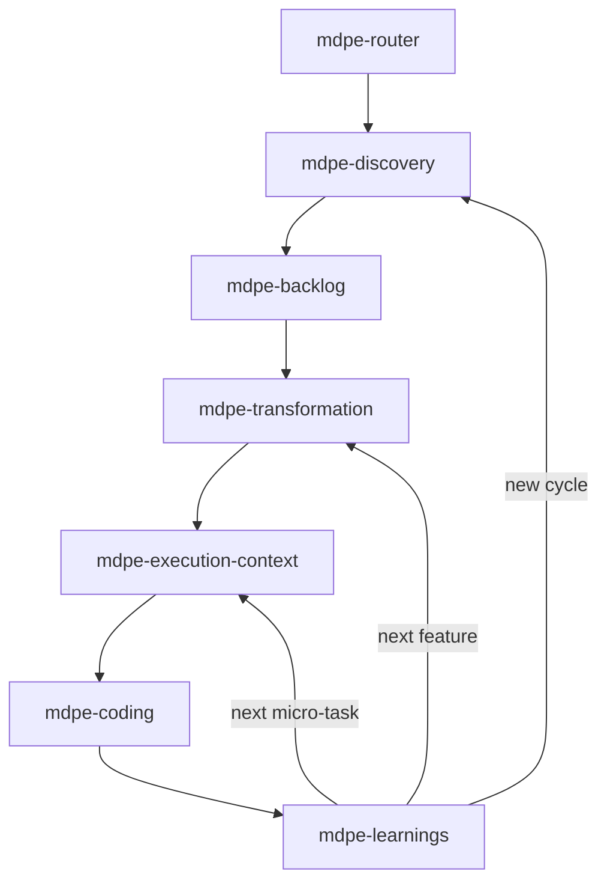
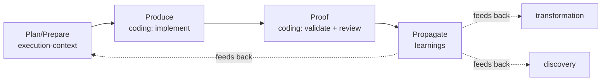

# MDPE Skills Flow

This document shows how the 7 MDPE skills connect across the MDPE lifecycle
(Discovery → Backlog → Transformation → Execution), including the feedback
loops that make MDPE cognitive.

## Skill routing flow

## Lifecycle mapping

| MDPE stage | Skill | Runs | Main outputs |
|------------|-------|------|--------------|
| Discovery | `mdpe-discovery` | once per project | `docs/discovery/*.yml` |
| Backlog | `mdpe-backlog` | once per project | `docs/backlog/backlog-index.yml`, `features/feat-XXX.yml` |
| Transformation | `mdpe-transformation` | once per feature | `docs/transformation/{feature-id}/**`, `tasks.md` |
| Execution — Plan/Prepare | `mdpe-execution-context` | once per micro-task | `*-context.yml`, `*-setup.yml` |
| Execution — Produce/Proof | `mdpe-coding` | once per micro-task | code, `*-validation-report.yml`, `*-code-review.yml` |
| Execution — Propagate | `mdpe-learnings` | once per micro-task | `*-learnings.yml`, `aggregated-learnings.yml` |
| Fast path (Discovery-lite → Transformation → Plan/Prepare) | `mdpe-tasks` | once per item/feature | single `docs/mdpe-tasks/{item-id}.md` |

## The MDPE cycle (Plan → Prompt → Produce → Proof → Propagate)

## Minimal path

For a minimum viable run of the framework:

1. `mdpe-discovery` (produce discovery YAMLs)
2. `mdpe-backlog` (structure the cognitive backlog)
3. `mdpe-transformation` (decompose the first feature, generate `tasks.md`)
4. `mdpe-execution-context` (context + setup for the first micro-task)
5. `mdpe-coding` (implement → validate → review)
6. `mdpe-learnings` (extract learnings), then loop back to step 4 or 3.

## Fast path (single item/feature)

For a single backlog item, feature, or piece of free text that doesn't need the
full traceable pipeline:

1. `mdpe-tasks` — produces one Markdown file with phased, checkbox tasks, each
   carrying its own IOQD, dependencies, priority, and inline execution context.
2. `mdpe-coding` per task (the inline context replaces a separate
   `mdpe-execution-context` step).
3. Optionally `mdpe-learnings` once the item is fully done.
