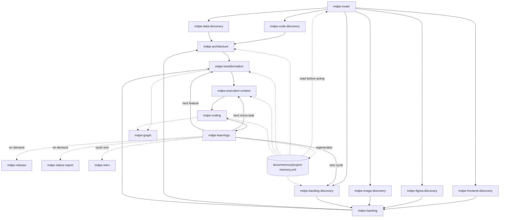
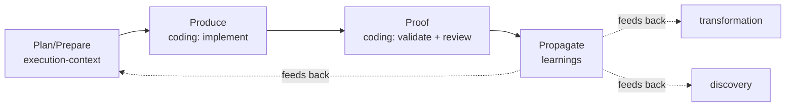

# MDPE Skills Flow

This document shows how the **18 MDPE skills** connect across the MDPE lifecycle
(Discovery → Backlog → Architecture → Transformation → Execution), including the
feedback loops that make MDPE cognitive, the five discovery entry points (code, data,
frontend, Figma, image), the architecture enabler, the traceability graph, the
outward-facing projections (release, status report, retro), and the project memory
that both feeds and is fed by every stage.

Looking for a category-based view instead (Plan, Transform, Do, Check, Learn,
Tools) — grouping skills by what kind of work they do, not by when they run?
See [`docs/skills-by-category.md`](skills-by-category.md).

## Skill routing flow

`mdpe-code-discovery` replaces `mdpe-backlog-discovery` when the repository already
contains readable application code (brownfield): it inventories stack, modules, and
reconstructed features instead of running a greenfield vision/persona/MoSCoW session.
`mdpe-data-discovery` is its sibling for a legacy schema/database with no application
code worth reading — the two compose when both exist, each citing the other where
they diverge. `mdpe-frontend-discovery`, `mdpe-figma-discovery`, and
`mdpe-image-discovery` are narrower, design-led siblings at the same level: they
reconstruct features from an existing frontend codebase, a Figma prototype, or plain
images, respectively — pick the one matching what the user actually has.
`mdpe-architecture` is an enabler, not a mandatory stage between backlog/discovery and
transformation — it runs only when a driver demands an architectural choice.
`mdpe-graph` is an observer that renders the traceability already produced by
transformation and coding; it never gates the pipeline.

Three further skills project completed execution **outward**, on demand, once
`mdpe-learnings` has closed micro-tasks: `mdpe-release` (a changelog for whoever
consumes the software), `mdpe-status-report` (a one-page, jargon-free brief for a
non-technical stakeholder), and `mdpe-retro` (a cycle-end look-back with owned action
items). None of the three recomputes what another skill already produced, and none
runs on a schedule — see their own decisions of record
(`docs/adr/adr-007-release-notes.md`, `docs/adr/adr-009-status-report.md`,
`docs/adr/adr-010-cycle-retro.md`).

`docs/memory/project-memory.yml` is a derived index, regenerated by `mdpe-learnings`
(and by `mdpe-architecture`/`mdpe-code-discovery` at their own triggers), and read by
every skill before it acts — see `docs/adr/adr-006-memory-model.md`.

## Lifecycle mapping

| MDPE stage | Skill | Runs | Main outputs |
|------------|-------|------|--------------|
| Code Discovery (brownfield entry point) | `mdpe-code-discovery` | once per repository, or when it goes stale | `docs/brownfield/inventory.md` |
| Data Discovery (brownfield entry point, sibling of code discovery) | `mdpe-data-discovery` | once per schema/database scope, or when it goes stale | `docs/brownfield/data-inventory.md` |
| Frontend Discovery (design-led entry point) | `mdpe-frontend-discovery` | once per frontend scope, or when it goes stale | `docs/frontend/inventory.md` |
| Figma Discovery (design-led entry point) | `mdpe-figma-discovery` | once per prototype/scope, or when the prototype changes | `docs/design/figma-inventory.md` |
| Image Discovery (design-led entry point) | `mdpe-image-discovery` | once per image batch | `docs/design/image-inventory.md` |
| Discovery (greenfield) | `mdpe-backlog-discovery` | once per project | `docs/discovery/*.yml` |
| Backlog | `mdpe-backlog` | once per project | `docs/backlog/backlog-index.yml`, `features/feat-XXX.yml` |
| Architecture (enabler) | `mdpe-architecture` | once per driver-set, when a driver demands it | `docs/architecture/decisions.yml`, conditional `docs/adr/adr-NNN-{slug}.md` |
| Transformation | `mdpe-transformation` | once per feature | `docs/transformation/{feature-id}/**`, `tasks.md` |
| Execution — Plan/Prepare | `mdpe-execution-context` | once per micro-task | `*-context.yml`, `*-setup.yml` |
| Execution — Produce/Proof | `mdpe-coding` | once per micro-task | code, `*-validation.yml`, `*-code-review.yml` |
| Execution — Propagate | `mdpe-learnings` | once per micro-task | `*-learnings.yml`, `aggregated-learnings.yml`, `docs/memory/project-memory.yml` |
| Graph (observer) | `mdpe-graph` | on demand, when the graph is missing or stale | traceability graph + waves×features Mermaid, impact analyses |
| Release (outward projection) | `mdpe-release` | on demand, when a version is cut | `CHANGELOG.md` |
| Status report (outward projection) | `mdpe-status-report` | on demand, when a stakeholder asks | `docs/status/{date}-status-report.md` |
| Retro (cycle-end ceremony) | `mdpe-retro` | on demand, when a cycle/sprint/feature-set is declared closed | `docs/retro/{scope-slug}-{date}.md` |
| Fast path (Discovery-lite → Transformation → Plan/Prepare) | `mdpe-tasks` | once per item/feature | single `docs/mdpe-tasks/{item-id}.md` |

## The MDPE cycle (Plan → Prompt → Produce → Proof → Propagate)

## Minimal path

For a minimum viable run of the framework:

1. `mdpe-backlog-discovery` (produce discovery YAMLs)
2. `mdpe-backlog` (structure the cognitive backlog)
3. `mdpe-architecture` — only if a driver in the backlog demands an architectural
   choice; otherwise skip straight to step 4
4. `mdpe-transformation` (decompose the first feature, generate `tasks.md`)
5. `mdpe-execution-context` (context + setup for the first micro-task)
6. `mdpe-coding` (implement → validate → review)
7. `mdpe-learnings` (extract learnings, regenerate the memory index), then loop back
   to step 5 or 4.

## Brownfield path (repository already has code, or a legacy schema)

For adopting MDPE on an existing codebase or a legacy database, without running a
greenfield discovery session:

1. `mdpe-code-discovery` — inventory the repository (stack, modules, conventions,
   reconstructed features) into `docs/brownfield/inventory.md`. If there is no
   readable application code — only a schema, DDL, or a read-only connection to a
   legacy database — run `mdpe-data-discovery` instead, into
   `docs/brownfield/data-inventory.md`. Run **both** when a codebase and a schema it
   doesn't fully expose both exist; each cites the other where they diverge, and
   neither overrides the other.
2. `mdpe-architecture` — ratify the observed architecture (and/or data model) as a
   binding constraint before new work starts (`type: ratify`), and decide on any new
   driver.
3. `mdpe-transformation` or `mdpe-tasks` — decompose a reconstructed or new feature,
   citing the inventory/inventories and the `ad-NNN` decisions as technical context.
4. Continue as the minimal path from step 5 onward.

See `docs/adr/adr-001-brownfield-discovery.md` and `docs/adr/adr-008-data-discovery.md`
for what is explicitly **not** required in this path (personas, MoSCoW, a 20-30
feature brainstorm, and the rest of the greenfield discovery apparatus).

## Design-led path (frontend / Figma / image)

For turning an existing frontend, a Figma prototype, or plain images/screenshots
into features, without running a greenfield discovery session:

1. Pick the entry point matching what is actually available:
   - `mdpe-frontend-discovery` — an existing frontend codebase → `docs/frontend/inventory.md`.
   - `mdpe-figma-discovery` — a Figma file/prototype link → `docs/design/figma-inventory.md`.
   - `mdpe-image-discovery` — screenshots, mockups, sketches, or photos →
     `docs/design/image-inventory.md`.
2. Optionally run more than one against the same product (e.g. Figma inventory vs.
   frontend inventory) to compare designed vs. built — each skill's conditional
   sections name where that comparison goes.
3. `mdpe-transformation` or `mdpe-tasks` — decompose a reconstructed or new feature,
   citing the inventory as technical/design context.
4. Continue as the minimal path from step 5 onward.

Same anti-fabrication posture as brownfield: no screen, frame, or image reference is
invented, and "no usable input" is a correct terminal answer, not a failure.

## Fast path (single item/feature)

For a single backlog item, feature, or piece of free text that doesn't need the
full traceable pipeline:

1. `mdpe-tasks` — produces one Markdown file with phased, checkbox tasks, each
   carrying its own IOQD, dependencies, priority, and inline execution context.
2. `mdpe-coding` per task (the inline context replaces a separate
   `mdpe-execution-context` step).
3. Optionally `mdpe-learnings` once the item is fully done.

## Outward projections (release, status report, retro)

For turning completed, evidenced execution into something outside the framework's
own vocabulary — a changelog, a stakeholder brief, or a cycle retrospective. All
three run **on demand only**, read what `mdpe-learnings` and `mdpe-graph` already
produced, and never recompute status:

1. `mdpe-release` — when cutting a version: projects `completed` and evidenced
   micro-tasks into `CHANGELOG.md`, one entry per feature touched, category assigned
   only when the evidence for it exists. Never rewrites a published version.
2. `mdpe-status-report` — when a stakeholder asks how the project is doing: a RAG
   traffic light plus Accomplished / In progress / Risks & blockers / Next, with zero
   technical ids in the main body and a provenance appendix for anyone who wants to
   check a claim.
3. `mdpe-retro` — when a cycle/sprint/feature-set is declared closed: aggregates
   `aggregated-learnings.yml` and `mdpe-tracking.yml` over the declared scope into
   What Went Well / What to Improve / Action Items, every action carrying an owner
   (or explicitly "to be defined"). Routes actions to the same three
   `mdpe-learnings` feedback targets — no new target is invented.

None of the three gates the pipeline, and any of the three can run independently of
the other two — cutting a release does not require a status report or a retro, and
vice versa.
