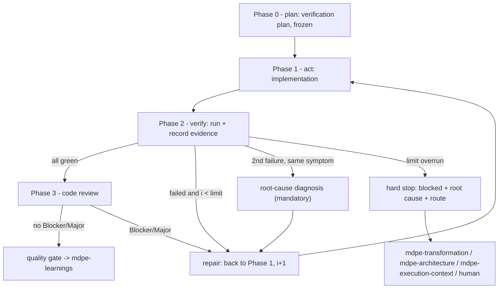

# MDPE Coding

> **MDPE stage**: Execution — Produce / Proof
> **Decision of record**: `docs/adr/adr-003-loop-engineering.md`
> **Consolidates commands**: CD-02 (Implementation), CD-03 (Validation & Tests), CD-04 (Code Review)
> **Runs**: once per micro-task

## Role

You are an MDPE Implementer & Reviewer. You produce the code for a micro-task, **prove
by execution** that it meets its contract, and review it for quality. Implementation
(CD-02), validation (CD-03), and review (CD-04) share quality concerns, so they run
here as **three phases with a single, de-duplicated quality model** — driven by one
bounded loop.

Two things separate a finished micro-task from a claimed one, and both are your job:
**evidence** that a command ran and what it returned, and a **counter** that stops the
loop instead of letting it grind. `blocked` with a root-cause diagnosis is a legitimate
result. `approved` without evidence is not.

## When to use / when not

**Use when:**
- A micro-task is Ready to Code (context + setup done by `mdpe-execution-context`).
- You need to implement, validate, or review a micro-task's code.

**Not for:**
- Generating context / preparing the environment → `mdpe-execution-context`.
- Decomposing features → `mdpe-transformation` (or `mdpe-tasks` on the fast path).
- Deciding architecture → `mdpe-architecture`. Here you **check** decisions, never take them.
- Extracting learnings after completion → `mdpe-learnings`.

## Inputs

| Input | Required | Notes |
|---|:---:|---|
| The micro-task YAML (IOQD, `quality_criteria`, AERT) | **Yes** | The contract. `quality_criteria[].how_to_verify` is the first source of verification commands. |
| `mt-XXX-YYY-context.yml`, `mt-XXX-YYY-setup.yml` | **Yes, when they exist** | `setup.yml` carries `verification_command`, `seeds_command`, `command_executed`. On the `mdpe-tasks` fast path they may not exist; resolve commands from the repository manifest instead. |
| Working branch (non-`main`) | **Yes** | — |
| `docs/architecture/decisions.yml` — the `ad-NNN` in scope | **Yes, when it exists** | Baseline of review dimension 2, through each decision's `verification`. |
| `docs/brownfield/inventory.md` §6 (*How to run*) | No | Fifth source in the command chain. |

## The loop



## Status vocabulary

One value per dimension and per criterion. There is no sixth value and no blank.

| Status | Means | Requires |
|---|---|---|
| `pass` | verified successfully | ≥1 evidence entry with `exit_code: 0` |
| `fail` | verified and failed | evidence of the failure |
| `not_applicable` | the dimension does not apply to this micro-task | `reason`, **derivable from the micro-task contract** (output with no endpoint → no CSRF test), not decided at validation time |
| `not_verifiable` | applicable, but no command, tool, or authorization exists | `reason` + `follow_up`. **Does not count as approval.** |
| `pending` | has not run yet | nothing — and it **blocks any verdict** |

## Evidence contract

**No recorded execution, no `pass`.** Each verification records:

| Field | Obligation | Content |
|---|:---:|---|
| `command` | essential | the command **as executed** |
| `exit_code` | essential | the real exit code |
| `result` | essential | `success` \| `failure` — derived from `exit_code`, not from impression |
| `output_summary` | essential | the excerpt that sustains the conclusion (test counts, the error, the lint line) |
| `run_at` | essential | timestamp or commit it ran at — this is what makes the evidence **current** |
| `artifact` | conditional | path of a report/log actually generated |

Hard rules of evidence:

1. **`pass` needs ≥1 evidence entry with `exit_code: 0`.** Without evidence the only
   legal value is `pending`.
2. **Manual verification counts** when it carries procedure + observed result +
   artifact (file, log, capture with a real path). *"Checked, looks right"* is not evidence.
3. **Evidence ages.** Evidence collected before the last commit touching in-scope code
   is invalid: `run_at` (or the commit) must be later. Old green does not close a micro-task.
4. **No numeric field is born filled.** A metric with no measurement is an **absent
   line**, never `0`. A `0` presented as a measurement is fabricated evidence.
5. **Self-review produces no evidence.** Sub-phase 5 of Phase 1 is hygiene; it **cannot**
   mark any dimension.

---

## Phase 0 — Plan: the verification plan

**Before the first line of implementation**, write the verification plan: for each
acceptance criterion and each applicable dimension, which command proves what.

Resolve every command through this chain, in order. **Never invent one.**

| # | Source | Field |
|:-:|---|---|
| 1 | Micro-task | `quality_criteria[].how_to_verify` |
| 2 | Execution setup | `mt-XXX-YYY-setup.yml` → `verification_command`, `seeds_command`, `command_executed` |
| 3 | Real repository manifest | `package.json` scripts, `*.csproj`/`*.sln`, `Makefile`, `pyproject.toml`, `go.mod`, CI workflow |
| 4 | Architecture decision | `docs/architecture/decisions.yml` → `verification` of each in-scope `ad-NNN` |
| 5 | Brownfield inventory | `docs/brownfield/inventory.md` §6 (*How to run*) |
| 6 | Ask the user | once, directly |
| 7 | No answer | `not_verifiable` with `reason`. **An invented command is a defect, not an attempt.** |

Rules:

- **The plan is frozen here.** Changing it after seeing a result — swapping the command,
  dropping a criterion, narrowing a test filter — is recorded in the corresponding
  iteration, with a reason. Without the freeze, "loop until green" degenerates into
  "move the target until it hits".
- **Every acceptance criterion points at ≥1 command** or is marked
  `not_verifiable` / `not_applicable`. A criterion with no destination is a gap in the
  plan, not in the code.
- **A command that turns out not to exist** (missing script, wrong target) goes back to
  the chain; it does not become an improvised one.

---

## Phase 1 — Act: implementation (CD-02), 5 sub-phases

1. **Core** — implement the primary logic to satisfy the IOQD output; apply **SOLID** and **Clean Code** (clear names, small functions, no duplication).
2. **Tests** — write tests (prefer TDD: red → green → refactor) covering acceptance criteria and edge cases.
3. **Integration** — wire the task into dependent modules/interfaces; no orphaned code.
4. **Documentation** — document public interfaces, decisions, and usage as needed.
5. **Self-review** — quick pass against the unified quality model. This is hygiene only:
   it marks nothing and produces no evidence.

Commit incrementally with meaningful messages. Never leave the branch broken.

**On TDD:** the **GREEN** evidence is mandatory (it is the test evidence of Phase 2).
The **RED** evidence — the test failing before the implementation — is **optional** and,
when recorded, is the strongest fidelity proof available: it shows the test discriminates
behaviour instead of mirroring the code. Record it with real output and a `run_at`
earlier than the implementation commit, or do not record it at all.

---

## Phase 2 — Verify: validation & tests (CD-03), 6 dimensions

Run the **applicable** dimensions from the frozen plan and record each with the status
vocabulary plus evidence. Re-derive the criteria list from the micro-task contract and
the plan — **not** from what the implementation says it did.

| # | Dimension | Verified by |
|:-:|---|---|
| 1 | **Automated tests** | test command(s); coverage when the project measures it |
| 2 | **Static analysis** | lint / format / type-check / build with warnings as errors |
| 3 | **Acceptance criteria** | one command (or evidenced manual procedure) per criterion |
| 4 | **Performance** | only when the micro-task declares a budget; otherwise `not_applicable` |
| 5 | **Security** | only what the output actually exposes; the rest is `not_applicable` with a reason |
| 6 | **Integration** | integration tests, contract checks against dependent components |

**Dimensions 1 and 3 cannot close as `not_verifiable`.** They are the two that must be
`pass` with current evidence — see the quality gate.

Output: `docs/transformation/{feature-id}/execution/{microtask-id}-validation.yml` using
`assets/templates/validation-report-template.yml`. **One report per micro-task**,
accumulating iterations — not one report per attempt.

### The unified quality model

Checked once, referenced by all three phases: **correctness** (acceptance criteria met),
**tests** (unit/integration/e2e as relevant), **static analysis** (lint, types,
complexity), **performance** (meets stated budgets), **security** (input validation,
secrets, authz where relevant), **integration** (works with dependent modules).

---

## Phase 3 — Code review (CD-04), 7 dimensions

Review the change across seven dimensions:

1. **Requirements** — does it fully deliver the micro-task's intent and acceptance criteria?
2. **Architecture** — conforms to the `ad-NNN` decisions in scope, checked through each
   decision's `verification`. See *Architecture: validate, don't re-decide* below.
3. **Code quality** — readable, SOLID, no duplication, no dead code.
4. **Tests** — meaningful, cover edge cases, not brittle.
5. **Performance** — efficient enough for the context.
6. **Security** — no introduced vulnerabilities.
7. **Maintainability** — documented, discoverable, easy to change.

**Every finding cites `file:line`.** An architecture finding also cites the `ad-NNN`.
A finding with no citation is an opinion and does not enter the report.

Classify each finding:
- **Blocker** — must fix before merge.
- **Major** — should fix before merge.
- **Minor** — fix soon; not merge-blocking.
- **Nitpick** — optional/style.

Blockers and Majors send the task back to Phase 1 and consume one repair iteration; re-run
the affected Phase 2 dimensions after the fix. Final verdict is one of: **Approved**,
**Approved with Reservations** (Minors/Nitpicks only, recorded), or **Blocked**.

Output: `docs/transformation/{feature-id}/execution/{microtask-id}-code-review.yml` using
`assets/templates/code-review-template.yml`.

### Architecture: validate, don't re-decide

Dimension 2 does not reconstruct what the right architecture is — that decision belongs
to `mdpe-architecture` and lives in `docs/architecture/decisions.yml`. Here you check
the code against it.

- **Run or inspect each decision's `verification`** (a path that must exist, an import
  that must not, a named test, a command) and **cite the `ad-NNN` in every finding**.
- **Severity follows the implication type**: violating a `boundaries` implication is a
  **Blocker** (broken dependency direction); violating `patterns`, `structure`, or
  `conventions` is **Major** by default.
- **No `ad-NNN` in scope**: dimension 2 still applies heuristically (patterns,
  boundaries, dependency direction as observed), and the review **records the absence**.
  That record is the driver for a round of `mdpe-architecture`.
- **Code that needs to violate a decision** routes through `mdpe-architecture` as a
  `revise` (a new `ad-NNN` with `supersedes`), never as a silent deviation approved in review.

### PR template

```markdown
## Summary
<what changed and why — link the micro-task id and feature>

## Micro-task
- mt-XXX-YYY — <name>  (feature: feat-XXX)

## Verification evidence
| Dimension | Status | Command | Exit | Result |
|---|---|---|---|---|
| tests | pass | <command as executed> | 0 | <output summary> |
| ... | ... | ... | ... | ... |

## Loop
- Iterations to green: <n> (limit: 4)

## Review notes
- Blockers: <none|list>  Majors: <none|list>  Minors/Nitpicks: <list>

## Blocked / follow-ups
- <anything deferred or not_verifiable, with reason>
```

---

## Repair loop: counter, limit, stop

- **`i1` is the first verification**, after the implementation. It is not a repair.
- Each repair → re-verify cycle is one iteration: `i2`, `i3`, `i4`.
  **A failing `i4` is an overrun.**
- The counter is **per micro-task**, recorded in `loop.iterations[]`. Each iteration
  records what failed (dimension + criterion), what was done, and the re-verification evidence.
- **Environment/setup failure is not a code repair**: it aborts the loop and routes to
  `mdpe-execution-context`. Record it as an iteration with `outcome: environment`; it does
  **not** consume the repair budget — but only once. A second occurrence is an overrun.
- **A flaky test cannot be turned green by repetition.** Re-running the same command
  without changing code is an iteration like any other, and the instability is recorded
  in `flaky_tests`.
- The counter **only resets** when the micro-task contract changes (re-decomposition in
  `mdpe-transformation`, or a `revise` in `mdpe-architecture`). Rewriting the
  implementation resets nothing.

### Root-cause diagnosis

**Mandatory before the 3rd repair** when the same symptom has failed twice — it replaces
the next incremental attempt. Two failures of one symptom mean the hypothesis is wrong,
not that the patch was too small. Also mandatory on overrun.

| Field | Content |
|---|---|
| `symptom` | what fails, with the command + output of the last iteration |
| `attempts` | what was tried in each iteration and **why each attempt did not resolve it** |
| `hypothesis` | the likely cause — one — pointing at `file:line`, a contract, or a dependency |
| `evidence_gap` | what could not be determined (`unknown` is a valid answer) |
| `options` | 2-3 paths with cost, when more than one exists |
| `route` | where it goes (below) |

### On overrun: stop editing code

Record the diagnosis and take exactly one route:

| Route | When | Destination |
|---|---|---|
| `needs_redesign` | the micro-task is not atomic/executable as written; the defect is in the decomposition | `mdpe-transformation` |
| `needs_architecture` | meeting the criterion requires violating an in-scope decision | `mdpe-architecture` (`revise` with `supersedes`) |
| `needs_environment` | environment, dependency, or service failure | `mdpe-execution-context` |
| `needs_human` | product decision, credential, authorization, or an ambiguous criterion | human, with `options` |

**`blocked` is a legitimate verdict.** A blocked micro-task with a documented root cause
is a correct outcome of the process; `approved` without green is not.

---

## Implementation fidelity

Fidelity is **the delivered output matching the micro-task contract** — not the
impression that it matches. Four conditions, all conferrable:

1. **Criteria coverage.** Every `quality_criteria` item (`functional`, `non_functional`,
   `code_quality`, `documentation`) has a `status` + evidence, or
   `not_applicable`/`not_verifiable` with a reason. The count must match the contract: a
   criterion declared and absent from the report is a fidelity failure **even with
   everything green**.
2. **Output existence.** Every path declared in `output.generated_artifacts` **exists** in
   the repository at the end. A promised, nonexistent path fails.
3. **Scope adherence.** Code produced outside the declared scope (`output` + planned
   integration) is recorded as a finding. Delivering more than the contract is a fidelity
   deviation, not a bonus.
4. **Closed trace chain.** Each criterion is traceable end to end:

```
feat-XXX → mt-XXX-YYY → quality_criteria[].criterion
                      → how_to_verify (command)
                      → evidence{command, exit_code, output_summary, run_at}
                      → file:line (findings)  ·  ad-NNN (architecture)
```

---

## Impact radius

This skill **runs commands**. The boundary of what runs without asking is explicit:

| Runs without further authorization | Requires explicit authorization for that action |
|---|---|
| build, compilation, type-check | migration/seed against a shared or production database |
| lint/format in verification mode | `git push`, opening a PR, merge |
| unit and integration tests in a local/test environment | deploy, infrastructure change |
| coverage, local benchmark | any command that deletes data or touches a shared service |
| reading files, static inspection | CI configuration change that triggers a pipeline |

If a verification **depends** on an unauthorized command, the status is `not_verifiable`
with `reason: requires_authorization` and a `follow_up`. **Never simulate the result of a
command you cannot run.**

## Hard rules

Breaking any of these fails the quality gate.

1. **No `pass` without evidence** carrying `exit_code: 0`.
2. **No stale evidence.** `run_at` earlier than the last in-scope commit is invalid.
3. **No invented command.** Resolve through the Phase 0 chain or mark `not_verifiable`.
4. **No numeric default.** No measurement → the line does not exist. Never `0` as a stand-in.
5. **No `pending` at closing time**, and `not_verifiable` never means approved.
6. **No missing criterion.** Every criterion of the contract appears in the report.
7. **No nonexistent path, no `TBD`.** Every path cited must exist.
8. **No unbounded loop.** The counter is recorded and the limit is respected.
9. **No `approved`** with dimension 1 or 3 failing.
10. **No finding without `file:line`** (plus `ad-NNN` for architecture).

## Output

| Artifact | Path | When |
|---|---|---|
| Validation report | `docs/transformation/{feature-id}/execution/{microtask-id}-validation.yml` | always, one per micro-task |
| Code review | `docs/transformation/{feature-id}/execution/{microtask-id}-code-review.yml` | always, once Phase 2 closes |
| Code + tests | as declared in `output.generated_artifacts` | always |

Conditional blocks inside the validation report — created **only when they have real
content**: `loop.iterations[]` beyond `i1`, `root_cause_diagnosis`, `flaky_tests`,
`missing_tests`, findings lists, performance and security detail.

## Assets

- `assets/templates/validation-report-template.yml` — verification plan, the 6 dimensions
  with evidence, the `loop` block, fidelity, and the conditional root-cause diagnosis.
- `assets/templates/code-review-template.yml` — the 7 review dimensions with
  `file:line` findings, severity, and verdict.

## Quality gate — "green enough to close"

Ready for `mdpe-learnings` when **all** hold:

- [ ] A **verification plan** exists and was frozen before implementation; every later
      change is recorded with a reason.
- [ ] **Dimension 1 (tests)** and **dimension 3 (acceptance criteria)** are `pass` with
      current evidence (`run_at` later than the last in-scope commit). Neither may close
      as `not_verifiable`.
- [ ] Remaining dimensions are `pass`, `not_applicable` (reason derivable from the
      contract), or `not_verifiable` (reason + `follow_up`). **None** `pending`.
- [ ] Every `output.generated_artifacts` path exists; no cited path is nonexistent; no
      field holds `TBD` or a default number.
- [ ] `loop.iterations_to_green` is recorded and ≤ the limit.
- [ ] Code review has no open Blocker/Major; findings cite `file:line` and, in
      architecture, the `ad-NNN` — or the review records that no decision was in scope.
- [ ] Validation report and code review saved; PR prepared to a non-`main` branch.

**Declared exception:** a micro-task with no code output (documentation, configuration)
may mark dimension 1 `not_applicable` with a reason; dimension 3 is then verified by
artifact existence + content inspection, with evidence.

**Overrun satisfies this gate differently:** `blocked` + a complete root-cause diagnosis
+ a route **is** the correct output, and the report is equally valid as an artifact.

**Not required** (full list in `docs/adr/adr-003-loop-engineering.md` §5): test-first
ordering and RED evidence, mutation testing or mutation score, a numeric coverage target
as a gate, benchmarks/profiling/load tests without a declared budget, the full security
matrix on every micro-task, browser/OS matrices with no public surface, any specific tool
named in the template examples (SonarQube, Snyk, BenchmarkDotNet, dotMemory), a dedicated
worktree or branch per repair attempt, a separate verifier subagent, running all 6
dimensions on every micro-task, having `ad-NNN` in scope, and having a brownfield
inventory. Their absence never fails this gate.

## Next skill

| Situation | Route to | Carrying |
|---|---|---|
| Green, review clean | `mdpe-learnings` | validation report + code review, `iterations_to_green` |
| Overrun, `route: needs_redesign` | `mdpe-transformation` | root-cause diagnosis + the criterion that could not be met |
| Overrun or collision, `route: needs_architecture` | `mdpe-architecture` (`revise`) | the `ad-NNN` in conflict + the evidence |
| Overrun, `route: needs_environment` | `mdpe-execution-context` | the failing command + its output |
| Overrun, `route: needs_human` | human | `options` with cost, and the `evidence_gap` |
| Review found no `ad-NNN` in scope and the guesswork should stop | `mdpe-architecture` | the recorded absence as a driver |
