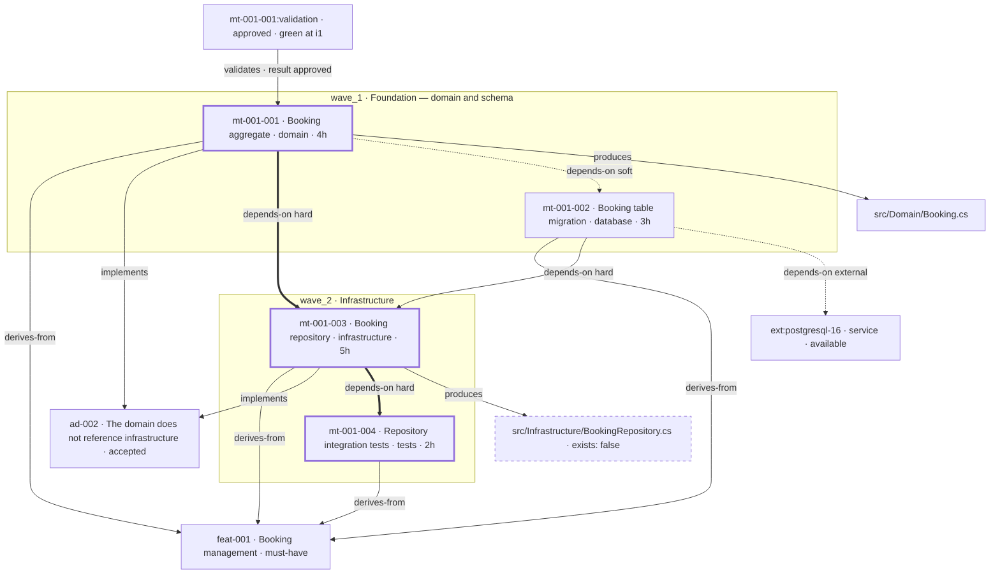
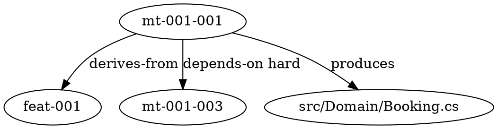

<!--
====================================================================
MDPE Framework - Traceability Graph - Template
====================================================================
Version: 1.0.0
Skill: mdpe-graph
Decision of record: docs/adr/adr-005-traceability-graph.md

Save to:
  docs/graph/traceability-graph.md                  # project view
  docs/graph/{feature-id}-traceability.md           # only under size class L

--------------------------------------------------------------------
OBLIGATION LEGEND (per block)
  [E] essential    - the graph is invalid without it
  [C] conditional  - required only in the stated situation
  [O] optional     - include only if it carries real content
Blocks marked [C] / [O] are created LAZILY: no content -> no block.
Delete every block that does not apply. A deleted block is correct;
a block filled by deduction is a fabricated graph.

--------------------------------------------------------------------
HARD RULES (the template exists to enforce these)
  1. NO SOURCE, NO ELEMENT. Every edge names its source ARTIFACT and
     FIELD in the edge table. Every node id comes from an artifact, or
     is a real repo-relative path. Not inferable -> does not exist.
  2. NO SYNTHETIC IDS. The diagram key is the canonical id with `-`
     and `:` replaced by `_` (mt-001-002 -> mt_001_002); the LABEL
     carries the canonical id or the real path. That is escaping, not
     renaming.
  3. EVERY EDGE DRAWN IS IN THE TABLE. An edge in the diagram and not
     in the table is fabricated. The table is never collapsed, even
     when the diagram is.
  4. `impacts` IS COMPUTED ONLY. It has no field of its own, so it
     never appears in the standard view. Answered on demand, always
     citing the chain of declared edges that produced it.
  5. WAVES AND CRITICAL PATH ARE READ, NEVER RECOMPUTED. They come
     from dependencies/waves.yml (or execution_order) and
     dependencies/critical-path.yml. Divergence is REPORTED as a
     signal, never resolved by your own calculation.
  6. REGENERATED, NEVER HAND-EDITED. Editing this file turns a
     projection into a source.
  7. A DECLARED PATH THAT DOES NOT EXIST IS NOT OMITTED. It enters as
     an artifact node with `exists: false`, styled `missing`.
  8. NO MANDATORY TOOLING. Inline Mermaid is the minimum viable and it
     is enough. No line here may point at a script, workflow, CLI or
     dashboard. DOT is optional.
  9. NO LAZY FILE. Nothing to draw -> do not create this file; answer
     "there is no graph to draw; run mdpe-transformation first".
 10. THE GRAPH DECIDES NOTHING. Cycles, orphans and drift are signals
     with a route. Gates stay in mdpe-coding, mdpe-architecture and
     mdpe-transformation.

--------------------------------------------------------------------
EDGE ORIENTATION (fix it once, keep it everywhere)
  derives-from   dependent -> origin        (mt -> feat, feat -> cf)
  depends-on     predecessor -> dependent   (follows `source` -> `target`
                 of hard/soft-dependencies.yml, so the arrow reads as
                 execution order)
  implements     mt -> ad
  produces       mt -> artifact
  validates      evidence -> what it verified
  learned-from   learning -> evidence | ad
  supersedes     new ad -> old ad
  affects        risk | hypothesis -> feat | mt

EDGE STROKE (semantics are fixed, do not improvise)
  -->    hard
  -.->   soft and external
  ==>    an edge of the critical-path sequence
  class critical   nodes in the critical-path sequence
  class missing    artifact nodes with exists: false
Assign classes with explicit `class a,b name;` statements. Never use
`linkStyle` by index - it breaks the moment an edge is inserted.

Remove this whole instruction block when done.
====================================================================
-->

# Traceability graph — {product or repository name}

<!-- [E] The generation header. Without it nobody can tell a current graph from a
stale one, and a stale graph is worse than none because it looks like the truth. -->

- **generated_at:** {YYYY-MM-DD HH:MM}
- **read at:** {branch} @ {short commit}
- **scope:** {project | feat-XXX} · **generated by:** {agent or person}
- **size class:** {S: <=~40 nodes, full view · M: ~40-80, artifacts and evidence collapsed · L: >80, one view per feature + rollup}
- **nodes / edges:** {N} / {M}

---

## 1. Sources read

<!-- [E] One line per artifact. ABSENCE IS A RESULT: no docs/architecture/decisions.yml
means no `ad` node and no `implements` edge, and that is correct output - not a hole to
fill. Delete rows for artifact families this project does not use. -->

| Artifact | Path | Read |
|---|---|:---:|
| micro-task index | `docs/transformation/feat-XXX/microtasks-index.yml` | yes |
| micro-task contracts | `docs/transformation/feat-XXX/microtasks/*.yml` | yes |
| dependencies | `docs/transformation/feat-XXX/dependencies/` (hard, soft, external, full-graph, waves, critical-path, parallelizable) | yes |
| backlog | `docs/backlog/backlog-index.yml` | yes |
| architecture decisions | `docs/architecture/decisions.yml` | yes |
| brownfield inventory | `docs/brownfield/inventory.md` §4 | absent |
| execution (context / validation / review) | `docs/transformation/feat-XXX/execution/` | partial — see §7 path pendency |
| tracking | `docs/tracking/mdpe-tracking.yml` | yes |
| learnings | `{microtask-id}-learnings.yml` · `docs/learning-loops/aggregated-learnings.yml` | absent — no template exists yet |
| discovery | `docs/discovery/00-discovery-session-complete.yml` · `05-validation-risks.yml` | absent |

---

## 2. Graph

<!-- [E] Waves are subgraphs; a feature is a classDef plus the id prefix in the label.
A Mermaid node belongs to exactly ONE subgraph: declaring it under both a wave and a
feature does not fail the parser, it silently keeps one grouping and loses the other.

Under size class M, delete the artifact and evidence nodes and carry them as attributes
in the micro-task label ("· 2 artifacts · validated"). The edge table below stays whole.

The example is illustrative and MUST be replaced. Keep only nodes and edges that a real
artifact declares. -->

**Legend.** `-->` hard · `-.->` soft and external · `==>` critical-path sequence ·
thick border = critical path · dashed border = declared artifact that does not exist.

---

## 3. Edge table

<!-- [E] THE PROOF. Every edge drawn above appears here with its source artifact AND
field. Canonical ids, not the render-safe keys. This table is never collapsed.

`note` is [O]: use it for `strength`, `result`, the `reason` of a dependency, or the
source that was DISCARDED WHEN IT DISAGREED (a disagreement is drift, section 7 - not a
merge detail). When two sources declare the same edge, the one closest to execution
wins: review > validation > context > contract. -->

| from | to | type | source artifact | field | note |
|---|---|---|---|---|---|
| `mt-001-001` | `feat-001` | derives-from | `microtasks/mt-001-001.yml` | `traceability.feature_id` | |
| `mt-001-002` | `feat-001` | derives-from | `microtasks/mt-001-002.yml` | `traceability.feature_id` | |
| `mt-001-003` | `feat-001` | derives-from | `microtasks/mt-001-003.yml` | `traceability.feature_id` | |
| `mt-001-004` | `feat-001` | derives-from | `microtasks/mt-001-004.yml` | `traceability.feature_id` | |
| `mt-001-001` | `ad-002` | implements | `execution/mt-001-001-code-review.yml` | `scope.architecture_decisions_in_scope` | review wins over context |
| `mt-001-003` | `ad-002` | implements | `execution/mt-001-003-context.yml` | `technical_context.architecture.applies[].id` | |
| `mt-001-001` | `mt-001-003` | depends-on | `dependencies/hard-dependencies.yml` | `dependencies[].source/.target` | hard · on the critical path |
| `mt-001-002` | `mt-001-003` | depends-on | `dependencies/hard-dependencies.yml` | `dependencies[].source/.target` | hard |
| `mt-001-003` | `mt-001-004` | depends-on | `dependencies/hard-dependencies.yml` | `dependencies[].source/.target` | hard · on the critical path |
| `mt-001-001` | `mt-001-002` | depends-on | `dependencies/soft-dependencies.yml` | `dependencies[].source/.target` | soft — does not block, changes order |
| `mt-001-002` | `ext:postgresql-16` | depends-on | `dependencies/external-dependencies.yml` | `dependencies[].microtask/.resource` | external · status available |
| `mt-001-001` | `src/Domain/Booking.cs` | produces | `microtasks/mt-001-001.yml` | `output.generated_artifacts[].location` | confirmed by `fidelity.declared_outputs[].exists: true` |
| `mt-001-003` | `src/Infrastructure/BookingRepository.cs` | produces | `microtasks/mt-001-003.yml` | `output.generated_artifacts[].location` | contract only — not executed yet |
| `mt-001-001:validation` | `mt-001-001` | validates | `execution/mt-001-001-validation.yml` | `summary.overall_status` | result approved |

<!-- Edge types available, each with the field that declares it. An edge type with no
source artifact in this project is simply ABSENT - that is correct output:

  derives-from  metadata.discovery_session_id · traceability.related_discovery_sessions[].id
                traceability.feature_origin[].source · origin: cf-NNN
                traceability.feature_id · drivers[].source + .evidence · learnings filename
  depends-on    hard/soft-dependencies.yml (source, target, reason)
                external-dependencies.yml (microtask, resource, status)
                cross-checked against full-graph.yml upstream_*/downstream_*
  implements    scope.architecture_decisions_in_scope > architecture.applies[].id >
                traceability.origin_decisions > decisions.yml scope/scope_ref
                (the last one is ad -> feat granularity, NEVER promoted to a
                 micro-task by deduction)
  produces      output.generated_artifacts[].location · fidelity.declared_outputs[].declared
  validates     summary.overall_status · verdict.status · fidelity.declared_outputs[].exists
                dimensions.architecture.decisions_checked[].result
                findings[].violates -> result: violated
  learned-from  {id}-learnings.yml · aggregated-learnings.yml
  supersedes    supersedes / superseded_by
  affects       affected_features[].id · feature_risks[].affected_microtasks
                related_features[].id
  impacts       COMPUTED ONLY - never in this table

A graph carrying only `depends-on` between micro-tasks FAILS the gate: that is the
dependency drawing the framework already had. At least one `derives-from`, one
`implements` and one `produces` must be present whenever their source artifacts exist.
-->

---

## 4. Node table  [C]

<!-- [C] Required ONLY for a node that appears in the diagram and in NO row of section
3 - otherwise its provenance is unstated. Every other node has its provenance in the
edge table. Nothing to declare -> delete this section. -->

| node | type | source artifact | field | attributes |
|---|---|---|---|---|
| `ad-002` | decision | `docs/architecture/decisions.yml` | `decisions[].id` | type ratify · status accepted · scope system |

---

## 5. Execution plan

<!-- [E] when the artifacts exist. READ, never recomputed. Each line cites the file it
came from. A wave is a grouping, not a node: no wave is invented, reordered or merged. -->

**Waves** — source: `docs/transformation/feat-XXX/dependencies/waves.yml` →
`waves.{key}.microtasks[]` (or `microtasks-index.yml` → `execution_order.wave_N`).

| wave | micro-tasks | estimate | source |
|---|---|---|---|
| `wave_1` · Foundation | `mt-001-001`, `mt-001-002` | 7h | `waves.yml` |
| `wave_2` · Infrastructure | `mt-001-003`, `mt-001-004` | 7h | `waves.yml` |

**Critical path** — source: `dependencies/critical-path.yml` → `sequence[]` and
`metadata.total_time`. Not recalculated here.

- **sequence:** `mt-001-001` → `mt-001-003` → `mt-001-004`
- **total_time:** 11h
- **divergence:** none <!-- [C] If your reading disagrees with the artifact, the
  ARTIFACT STANDS and the divergence is reported here and in section 7. -->

---

## 6. What runs now  [C]

<!-- [C] The wave calculation has existed since the first version and never decided
anything. This is where it does. Delete the block when nothing is dispatchable and say
why in section 7.

Dispatchable = micro-tasks of the LOWEST wave whose hard dependencies are closed
(reconciled status from docs/tracking/mdpe-tracking.yml) and whose external
dependencies are `available`.

When the available parallelism is LOWER than parallelizable.yml says, name WHY in one
line, citing the node. That explanation is the point of this block - a number with no
reason is not actionable. This block OFFERS work; it does not launch anything and does
not reorder a wave. -->

- **dispatchable now:** `mt-001-002` — wave_1, hard dependencies: none, external
  `ext:postgresql-16` available
- **available parallelism:** 1 of 2 declared in `dependencies/parallelizable.yml`
  (group `group_1_wave_1`)
- **why it is reduced:** `mt-001-001` is `in_progress` (`mdpe-tracking.yml` →
  `microtasks[].status`), so it is not dispatchable again

---

## 7. Signals  [C]

<!-- [C] Reported and ROUTED, never fixed by deduction. Nothing here approves, blocks
or releases anything. Nothing to report -> delete the whole section: a clean graph is a
legitimate result. -->

**Cycles** — `depends-on(hard)` and `derives-from` must be acyclic. Report the closed
path node by node. A `soft` cycle is a warning: it does not block, it means the order is
undefined. Acyclicity inside a feature is already a `mdpe-transformation` gate; what
this view adds is the **cross-feature** cycle nobody was checking.

| cycle | edges | route |
|---|---|---|
| — | — | — |

**Orphans, by type** — a generic orphan is not actionable.

| orphan | node(s) | condition | route |
|---|---|---|---|
| promised artifact missing | `src/Infrastructure/BookingRepository.cs` | `exists: false` in `fidelity.declared_outputs[]` | `mdpe-coding` — fidelity failure |
| micro-task with no decision in scope | `mt-001-002` | no `implements`, review already generated | `mdpe-architecture` |

<!-- Full catalogue of orphan types:
  feature not decomposed          Must-Have feat with no mt        -> mdpe-transformation
  mt with no decision in scope    no implements, context/review done -> mdpe-architecture
  decision with no work           accepted ad implemented by no mt  -> revise scope or decompose
  promised artifact missing       artifact exists: false            -> mdpe-coding
  mt with no evidence             completed mt with no evidence node -> mdpe-learnings
  cf-NNN not promoted             reconstructed feature, no feat/mt  -> conscious decision, not a defect
  learning with no target         learning with no routed action     -> mdpe-learnings
An ABSENT `implements` edge is the datum, not a gap to fill. -->

**Drift** — compared against the previous generation of this file.

| drift | element | observed | route |
|---|---|---|---|
| — | — | — | — |

<!-- What counts as drift: an artifact that became exists: false; an edge that vanished
from its source; a `superseded` ad still pointed at by a mt; a path declared in one
place and found in another. -->

**Path pendency**  [C] — two locations for execution artifacts are declared in the
framework and both are legal input: `docs/transformation/{feature-id}/execution/`
(canonical, used by the validation report, the review template and `mdpe-learnings`)
and `docs/execution/` (where `mdpe-execution-context` writes context and setup). Record
where each file was actually found. Never repoint anything silently, and never count a
convention mismatch as an orphan.

| file | declared at | found at | pendency |
|---|---|---|---|
| `mt-001-001-context.yml` | `docs/transformation/feat-001/execution/` | `docs/execution/` | path convention to be reconciled |

---

## 8. DOT projection  [O]

<!-- [O] Only for someone who wants a large-graph layout. Its absence invalidates
nothing, and no layout tool is required anywhere in this file. Same edges as section 3
- if you emit DOT, it may not contain an edge the table does not have. -->

---

## 9. Regeneration

<!-- [E] Kept short and kept honest. -->

- **This file is regenerated, never hand-edited.** Editing it turns a projection into a
  source; on any divergence the source artifact wins and this file is regenerated.
- **Triggers are events, not a schedule:** the end of a `mdpe-transformation` run (new
  feature or new wave), a new or revised decision in `docs/architecture/decisions.yml`,
  the close of a micro-task (`mdpe-learnings`), and an on-demand question.
- **Derived readings** available to `mdpe-learnings` (ADR-004 block G):
  `orphans_count` (§7 by type) · `critical_path_length` (§5) ·
  `parallelism_available` (§6) · `cycles_detected` (§7) · `drift_count` (§7).
- **Skill:** `skills/mdpe-graph/SKILL.md` · **decision of record:**
  `docs/adr/adr-005-traceability-graph.md`

<!--
====================================================================
SELF-CHECK before saving
====================================================================
  - Is every edge in the diagram present in section 3, with artifact AND field?
  - Does every node id come from an artifact, or is it a real repo-relative path?
  - Any synthetic id? Any render-safe key without its canonical id in the label?
  - Is `impacts` absent from the table (computed only)?
  - Is there at least one derives-from, one implements and one produces, whenever
    their source artifacts exist? (Only depends-on -> fails.)
  - Are soft and external edges present when the artifacts declare them?
  - Was the critical path READ from critical-path.yml, and any divergence reported?
  - Do the waves mirror waves.yml / execution_order, with none invented?
  - Does the Mermaid block render? Quoted labels, no HTML, one subgraph per node,
    `class` statements instead of indexed linkStyle.
  - Does every path cited exist - or appear explicitly as exists: false?
  - Are generated_at, branch and commit filled in?
  - Does any line point at a script, workflow, CLI or dashboard? Remove it.
  - Was this file created with nothing to draw? Delete it and route to
    mdpe-transformation.
====================================================================
-->
