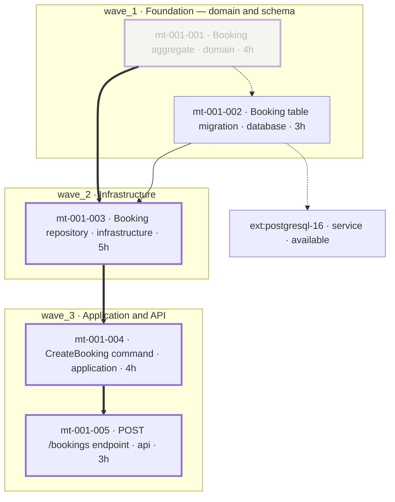
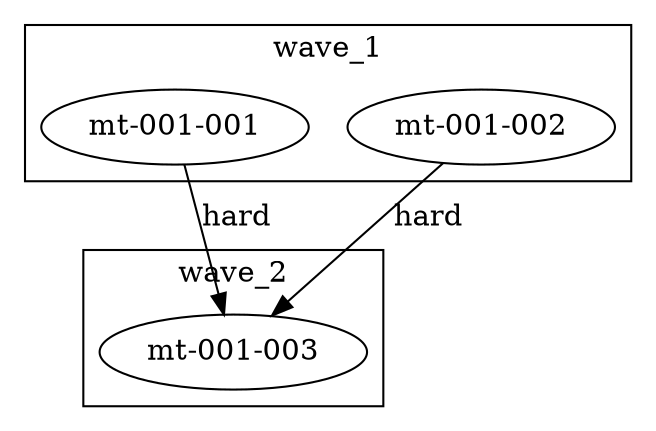

<!--
====================================================================
MDPE Framework - Waves x Features (Mermaid) - Template
====================================================================
Version: 1.0.0
Skill: mdpe-graph
Decision of record: docs/adr/adr-005-traceability-graph.md (D3, D8, D10)

Save to:
  docs/graph/{feature-id}-waves.md    # default - one view per feature
  docs/graph/waves.md                 # [O] combined view, several features

Question this view answers: WHAT RUNS NOW, IN WHAT ORDER, WITH WHOM IN
PARALLEL. The transversal chain (feature -> decision -> micro-task ->
artifact -> evidence) is the OTHER view:
docs/graph/traceability-graph.md (assets/templates/traceability-graph-template.md).
Do not merge the two - each one exists because the other does not answer
its question.

--------------------------------------------------------------------
OBLIGATION LEGEND (per block)
  [E] essential    - the view is invalid without it
  [C] conditional  - required only in the stated situation
  [O] optional     - include only if it carries real content
Blocks marked [C] / [O] are created LAZILY: no content -> no block.
Delete every block that does not apply. A deleted block is correct; a
block filled by deduction is a fabricated diagram.

--------------------------------------------------------------------
WHAT THIS VIEW DRAWS - and nothing else

  NODES      `microtask` (mt-XXX-YYY) and `external` (ext:{slug})
  EDGES      `depends-on` only, with strength hard | soft | external
  WAVE       a `subgraph` - it is the execution axis
  FEATURE    a `classDef` plus the id prefix in the label - NEVER a
             subgraph, and NEVER an edge

Why so narrow: a Mermaid node belongs to exactly ONE subgraph. Wave and
feature are CROSSED groupings, so one of them has to be the subgraph and
the other a style. The wave wins because this view is about execution
order. Declaring the same node under two subgraphs does not fail the
parser - it silently keeps ONE of the groupings, which is worse than an
error: a wrong diagram that renders.

Feature membership is therefore proved in section 3 (feature -> its
micro-tasks -> source field), not by an arrow. Keeping the stroke
alphabet exclusively for dependency strength is what makes this diagram
readable at a glance.

--------------------------------------------------------------------
HARD RULES (the template exists to enforce these)
  1. NO SOURCE, NO ELEMENT. Every micro-task node comes from
     microtasks-index.yml -> microtasks[].id. Every edge names its
     source ARTIFACT and FIELD in the edge table. Not declared ->
     does not exist. There is no "reasonable inference" edge.
  2. WAVES ARE READ, NEVER COMPUTED. They come from
     dependencies/waves.yml -> waves.{key}.microtasks[], or from
     microtasks-index.yml -> execution_order.wave_N when waves.yml is
     absent. No wave is invented, renamed, reordered or merged.
  3. NEITHER SOURCE DECLARES WAVES -> DO NOT CREATE THIS FILE. Answer
     "there are no waves to draw; run mdpe-transformation Phase 2
     first" and route there. Grouping micro-tasks by category, layer or
     your own dependency reading is FABRICATING waves.
  4. CRITICAL PATH IS READ from dependencies/critical-path.yml ->
     sequence[] and metadata.total_time. Divergence from your own
     reading is REPORTED in section 7, never resolved by recomputing.
  5. NO SYNTHETIC IDS. The diagram key is the canonical id with `-` and
     `:` replaced by `_` (mt-001-002 -> mt_001_002); the LABEL carries
     the canonical id. That is escaping, not renaming.
  6. EVERY EDGE DRAWN IS IN THE TABLE, with artifact and field. The
     table is never collapsed, even when the diagram is.
  7. SOFT AND EXTERNAL ARE DRAWN. Soft does not block but changes
     order; an external with status in_development or unavailable is
     the most common real blocker. Dropping them hides the two things
     that actually move a plan.
  8. A WAVE OF ONE FEATURE IS NOT A WAVE OF ANOTHER. In the combined
     view, `wave_1` of feat-001 and `wave_1` of feat-002 are two
     subgraphs. Merging them invents a cross-feature wave that no
     artifact declares - transformation computes waves per feature.
  9. NO MANDATORY TOOLING. Inline Mermaid is the minimum viable and it
     is enough. No line here may point at a script, workflow, CLI or
     dashboard. DOT is optional.
 10. REGENERATED, NEVER HAND-EDITED, AND IT DECIDES NOTHING. It offers
     the dispatchable set and waits; it does not reorder a wave and
     does not launch work. Order belongs to mdpe-transformation.

--------------------------------------------------------------------
EDGE STROKE (fixed semantics, do not improvise)
  -->    depends-on, strength hard      (blocks)
  -.->   depends-on, strength soft or external
  ==>    an edge of the critical-path sequence
  class critical    nodes in the critical-path sequence
  class blocked     micro-task with status blocked
  class done        micro-task with reconciled status completed
Assign classes with explicit `class a,b name;` statements. Never use
`linkStyle` by index - it breaks the moment an edge is inserted.

ORIENTATION: `depends-on` follows the artifact, `source` -> `target` of
hard/soft-dependencies.yml (predecessor -> dependent), so the arrow
reads as execution order. The EXTERNAL edge is the one exception, and it
is the same exception the traceability view makes:
external-dependencies.yml declares `microtask` and `resource` - not
source and target - so the edge is drawn `mt` -> `ext` and reads "needs",
not "runs before". Fix it once and keep it everywhere.

Remove this whole instruction block when done.
====================================================================
-->

# Waves x features — {feature-id · feature name, or product name in the combined view}

<!-- [E] The generation header. A stale view is worse than none, because it looks
like the truth. -->

- **generated_at:** {YYYY-MM-DD HH:MM}
- **read at:** {branch} @ {short commit}
- **scope:** {feat-XXX | project — feat-001, feat-002}
- **waves / micro-tasks:** {N} / {M} · **generated by:** {agent or person}
- **source of the waves:** `dependencies/waves.yml` <!-- or `microtasks-index.yml → execution_order` -->

---

## 1. Sources read

<!-- [E] One line per artifact. ABSENCE IS A RESULT, not a hole to fill: no
soft-dependencies.yml means no dashed edge, and that is correct output. Delete
rows for artifact families this project does not have. -->

| Artifact | Path | Read |
|---|---|:---:|
| micro-task index | `docs/transformation/feat-001/microtasks-index.yml` | yes |
| waves | `docs/transformation/feat-001/dependencies/waves.yml` | yes |
| hard dependencies | `docs/transformation/feat-001/dependencies/hard-dependencies.yml` | yes |
| soft dependencies | `docs/transformation/feat-001/dependencies/soft-dependencies.yml` | yes |
| external dependencies | `docs/transformation/feat-001/dependencies/external-dependencies.yml` | yes |
| critical path | `docs/transformation/feat-001/dependencies/critical-path.yml` | yes |
| parallelizable groups | `docs/transformation/feat-001/dependencies/parallelizable.yml` | yes |
| full graph (cross-check) | `docs/transformation/feat-001/dependencies/full-graph.yml` | yes |
| backlog index | `docs/backlog/backlog-index.yml` | yes |
| tracking (reconciled status) | `docs/tracking/mdpe-tracking.yml` | absent — status read from the index |

---

## 2. Diagram

<!-- [E] One subgraph per wave. Feature is a classDef plus the id prefix in the
label (`mt-001-*` is feat-001). The example below is illustrative and MUST be
replaced: keep only micro-tasks that microtasks-index.yml declares and only
edges that a dependency file declares.

Label content, in this order: canonical id · title · category or layer ·
estimate. All of it is READ from microtasks-index.yml (`title`, `category`,
`layer`, `estimated_hours`) - nothing is written here that another artifact does
not already own.

Above ~40 micro-tasks, emit one file per feature instead of the combined view;
never simplify by dropping a wave or an edge. -->

**Legend.** `-->` hard (blocks) · `-.->` soft or external · `==>` critical-path
sequence · thick border = critical path · dashed border = `blocked` · faded =
`completed`. A subgraph is a wave; the `mt-XXX-*` prefix and the node class are
the feature.

---

## 3. Features in scope

<!-- [E] This is where the FEATURE GROUPING is proved, since the diagram carries
it as a style. One row per feature, listing its micro-tasks in wave order, each
row naming the field that declares the membership.

Source of membership, in precedence order: microtasks/mt-XXX-YYY.yml →
`traceability.feature_id`; microtasks-index.yml → `metadata.feature_id`. Name and
MoSCoW come from docs/backlog/backlog-index.yml → `features[]`. With no backlog,
the feature row carries the id from `metadata.feature_id` alone and says so -
that is correct output, not a gap. -->

| feature | name · MoSCoW | class | micro-tasks (in wave order) | source of membership |
|---|---|---|---|---|
| `feat-001` | Booking management · must-have | `f001` | w1: `mt-001-001`, `mt-001-002` · w2: `mt-001-003` · w3: `mt-001-004`, `mt-001-005` | `microtasks-index.yml` → `metadata.feature_id`; name and MoSCoW from `backlog-index.yml` → `features[]` |

---

## 4. Wave table

<!-- [E] READ from waves.yml → `waves.{key}` (`name`, `description`,
`microtasks[].id`, `sequential_estimate`, `parallel_estimate`,
`can_run_parallel`), or from microtasks-index.yml → `execution_order.wave_N`
(`description`, `microtasks[]`, `estimated_time`) when waves.yml is absent.

Cite which of the two you read - the two files can disagree, and a disagreement
is a signal (section 7), not something to average. -->

| wave | name | micro-tasks | sequential | parallel | parallel? | source |
|---|---|---|---|---|:---:|---|
| `wave_1` | Foundation — domain and schema | `mt-001-001`, `mt-001-002` | 7h | 4h | yes | `waves.yml` → `waves.wave_1` |
| `wave_2` | Infrastructure | `mt-001-003` | 5h | 5h | no | `waves.yml` → `waves.wave_2` |
| `wave_3` | Application and API | `mt-001-004`, `mt-001-005` | 7h | 7h | no | `waves.yml` → `waves.wave_3` |

---

## 5. Edge table

<!-- [E] THE PROOF. Every edge drawn in section 2 appears here with its source
artifact AND field, using canonical ids - not the render-safe keys. Never
collapsed.

`note` is [O]: use it for the dependency `reason`, the external `status`, or a
source that was DISCARDED WHEN IT DISAGREED with the one that won (a
disagreement is a signal, section 7 - not a merge detail). When two files
declare the same edge, it stays ONE edge. -->

| from | to | strength | source artifact | field | note |
|---|---|---|---|---|---|
| `mt-001-001` | `mt-001-003` | hard | `dependencies/hard-dependencies.yml` | `dependencies[].source/.target` | on the critical path |
| `mt-001-002` | `mt-001-003` | hard | `dependencies/hard-dependencies.yml` | `dependencies[].source/.target` | repository needs the table |
| `mt-001-003` | `mt-001-004` | hard | `dependencies/hard-dependencies.yml` | `dependencies[].source/.target` | on the critical path |
| `mt-001-004` | `mt-001-005` | hard | `dependencies/hard-dependencies.yml` | `dependencies[].source/.target` | on the critical path |
| `mt-001-001` | `mt-001-002` | soft | `dependencies/soft-dependencies.yml` | `dependencies[].source/.target` | preferred order, does not block |
| `mt-001-002` | `ext:postgresql-16` | external | `dependencies/external-dependencies.yml` | `dependencies[].microtask/.resource` | status available — reads "needs", not order |

<!-- Cross-check, do not re-derive: full-graph.yml → `upstream_*` /
`downstream_*` must agree with the rows above. A disagreement goes to section 7
as a signal; it is NOT fixed here by picking the version you prefer. -->

---

## 6. What runs now  [C]

<!-- [C] This is the block that makes the wave calculation decide something
(ADR-005 D10). Delete it when nothing is dispatchable, and say why in section 7.

Dispatchable = micro-tasks of the LOWEST open wave whose hard dependencies are
closed (reconciled status: docs/tracking/mdpe-tracking.yml, falling back to
microtasks-index.yml → `microtasks[].status`) and whose external dependencies are
`available`.

When the available parallelism is LOWER than parallelizable.yml declares, name
WHY in one line, CITING THE NODE: open hard dependency, unavailable external
resource, or a `blocked` micro-task with its route. A number with no reason is
not actionable, and that reason is the point of this block.

This block OFFERS work. It does not launch a subagent on its own and it does not
reorder a wave. -->

- **dispatchable now:** `mt-001-002` — `wave_1`, hard dependencies: none, external
  `ext:postgresql-16` `available`
- **available parallelism:** 1 of 2 declared in `dependencies/parallelizable.yml`
  (`parallelization_groups.group_1_wave_1`)
- **why it is reduced:** `mt-001-001` is `completed` (`microtasks-index.yml` →
  `microtasks[].status`), so it is not dispatchable again
- **critical path** — read from `dependencies/critical-path.yml` → `sequence[]`,
  `metadata.total_time`: `mt-001-001` → `mt-001-003` → `mt-001-004` →
  `mt-001-005` · **16h**

---

## 7. Signals  [C]

<!-- [C] Reported and ROUTED, never fixed by deduction. Nothing here approves,
blocks or releases anything. Nothing to report -> delete the whole section: a
clean view is a legitimate result. -->

| signal | element | observed | route |
|---|---|---|---|
| micro-task in no wave | `mt-001-006` | in `microtasks[]`, absent from every `waves.{key}.microtasks[]` | `mdpe-transformation` Phase 2 — resequence |
| wave source disagreement | `wave_2` | `waves.yml` lists `mt-001-003`; `execution_order.wave_2` lists `mt-001-003`, `mt-001-004` | `mdpe-transformation` — reconcile the two files |
| critical-path divergence | `sequence[]` | the artifact's sequence is not the longest chain in the edge table | reported only; the ARTIFACT STANDS |
| dependency crossing a wave backwards | `mt-001-004` → `mt-001-002` | hard edge from `wave_3` to `wave_1` | `mdpe-transformation` — the sequencing is inconsistent |
| edge not in `full-graph.yml` | `mt-001-002` → `mt-001-003` | declared in `hard-dependencies.yml`, missing from `downstream_hard` | `mdpe-transformation` — cross-artifact drift |
| external not available | `ext:postgresql-16` | `status: in_development` | dispatch risk — `mdpe-execution-context` |
| cycle in `depends-on(hard)` | `mt-001-003` → `mt-001-004` → `mt-001-003` | closed path, node by node | `mdpe-transformation` — re-decompose |

<!-- A `soft` cycle is a WARNING, not a defect: it does not block, it means the
order between those tasks is undefined. Acyclicity inside a feature is already a
mdpe-transformation gate; report it here, do not re-gate it. -->

---

## 8. DOT projection  [O]

<!-- [O] Only for someone who wants a large-graph layout. Its absence invalidates
nothing and no layout tool is required anywhere in this file. Same edges as
section 5 - if you emit DOT, it may not contain an edge the table does not have. -->

---

## 9. Regeneration

<!-- [E] Short and honest. -->

- **This file is regenerated, never hand-edited.** Editing it turns a projection
  into a source; on any divergence the source artifact wins and this file is
  regenerated.
- **Triggers are events, not a schedule:** the end of a `mdpe-transformation` run
  (new feature, new wave, resequencing), the close of a micro-task
  (`mdpe-learnings` reconciles status, so "what runs now" moves), and an on-demand
  question about order or parallelism.
- **Derived readings** available to `mdpe-learnings` (ADR-004 block G):
  `critical_path_length` (§6) · `parallelism_available` (§6) · `cycles_detected`
  (§7). `orphans_count` and `drift_count` belong to the traceability view.
- **Companion view:** `docs/graph/traceability-graph.md` — the transversal chain
  (feature → decision → micro-task → artifact → evidence). This file does not
  replace it, and a project that has only this one has no traceability.
- **Skill:** `skills/mdpe-graph/SKILL.md` · **decision of record:**
  `docs/adr/adr-005-traceability-graph.md` (D3, D8, D10)

<!--
====================================================================
SELF-CHECK before saving
====================================================================
  - Did waves.yml (or execution_order) actually declare these waves? If NEITHER
    exists, delete this file and route to mdpe-transformation Phase 2.
  - Is every micro-task node in microtasks-index.yml -> microtasks[].id?
  - Is every edge drawn present in section 5, with artifact AND field?
  - Any edge in the diagram that no dependency file declares? Remove it.
  - Are soft and external edges present when the artifacts declare them?
  - Is every micro-task of the index in exactly one wave - and is any leftover
    reported in section 7 instead of being quietly placed?
  - Is the feature carried by classDef + label prefix (never a subgraph, never an
    edge), and is its membership proved in section 3 with a source field?
  - In the combined view, is each feature's wave its own subgraph?
  - Was the critical path READ from critical-path.yml, with any divergence
    reported rather than resolved?
  - Does the Mermaid block render? Quoted labels, no HTML, one subgraph per node,
    `class` statements instead of indexed linkStyle.
  - Any synthetic id? Any render-safe key without its canonical id in the label?
  - Does "what runs now" name WHY the parallelism is reduced, citing the node?
  - Are generated_at, branch and commit filled in?
  - Does any line point at a script, workflow, CLI or dashboard? Remove it.
====================================================================
-->
