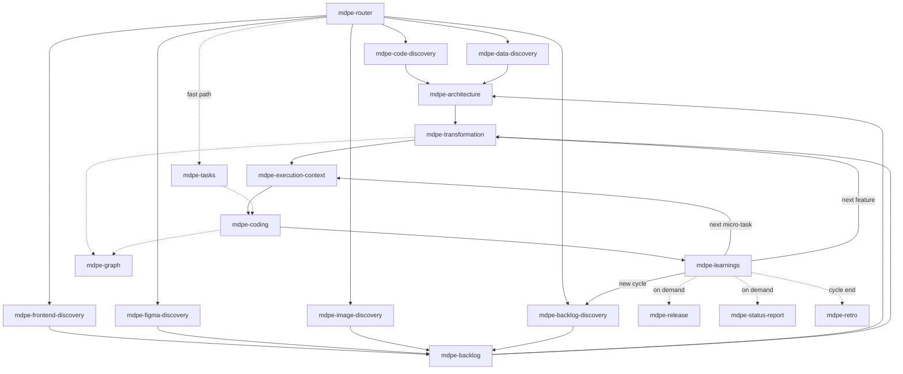

# MDPE Router

> **Role**: Orchestrate the MDPE lifecycle and route to the correct skill.
> **Covers**: all 6 core functional skills, the enabler skills (architecture, graph),
> the 5 discovery entry points (code, data, frontend, Figma, image), the fast path,
> the outward-facing projections (release, status report, retro), and the return
> loops.
> **Memory decision of record**: `docs/adr/adr-006-memory-model.md`

## What MDPE is

MDPE is a methodology based on **micro-task-oriented prompt engineering**. Work flows
through four stages with learning loops: **Discovery → Backlog → Transformation →
Execution (Plan → Produce → Proof → Propagate)**.

## Step 0 — Read the memory, then route

Before routing anything, read `docs/memory/project-memory.yml` — the derived index over the
project's three memory layers (decisions and conventions in force, confirmed lessons, open
questions, staleness). It is short by construction, so read the whole thing.

1. **Read the index.** No file → *"there is no memory to consult"*, and proceed. An absent
   index blocks nothing.
2. **Reconcile it against the repository.** Compare `metadata.repo_state` (`branch@commit`)
   with the current state. Diverged → **regenerate before using it**. A stale index is worse
   than an absent one, because it looks true.
3. **Check `staleness[]`.** An inventory older than `HEAD`, a cited path that no longer
   exists, a `superseded` decision still referenced. Each is a **warning with a route** —
   never a correction by deduction.
4. **Announce it in one line** before naming the destination: what is in force, what is open,
   what is stale, and the next step. The next step is **read** from the dispatch (`next` in
   the index, the `mdpe-graph` wave view, or `microtasks-index.yml`) — never recomputed here.

**Precedence, in every case: code > owner artifact > index.** The index is a projection: it
says what was already decided and where to check it. It decides nothing, and it approves
nothing.

What the router must **not** conclude from memory: no architecture decision, no scope change,
no micro-task status. Reading the index informs the route; it never substitutes for the skill
that owns the call. And a `candidate` lesson never appears in the index, so it is never read
here as advice.

## Routing flow

`mdpe-code-discovery` is the brownfield entry point: run it first when the repository
already contains readable application code, in place of (not before)
`mdpe-backlog-discovery`. `mdpe-data-discovery` is its sibling for the case a
codebase does not cover: a legacy schema or database with no application code worth
reading — the two compose when both a schema and readable code exist.
`mdpe-frontend-discovery`, `mdpe-figma-discovery`, and `mdpe-image-discovery` are
narrower, design-led entry points at the same level: they read an existing frontend
codebase, a Figma prototype, or plain images/screenshots respectively, and
reconstruct the features each one shows — without running a greenfield discovery
session. Pick the one matching what the user actually has (code vs. schema vs.
prototype vs. picture); they may also run alongside each other on the same product
(e.g. Figma inventory vs. frontend inventory, to compare designed vs. built).
`mdpe-architecture` is an enabler, not a mandatory stage: it runs only when a
driver — a backlog item, a non-functional requirement, or an inventory itself —
demands an architectural decision; most items skip straight from backlog/discovery to
transformation. `mdpe-graph` is an observer: it renders the traceability already
produced by transformation and coding, on demand, and never blocks the pipeline.

Three further skills project execution outward, on demand, after `mdpe-learnings`
has closed micro-tasks: `mdpe-release` turns completed, evidenced work into
`CHANGELOG.md` for whoever consumes the software; `mdpe-status-report` turns tracking,
the graph, and memory into a one-page, jargon-free brief for a non-technical
stakeholder; `mdpe-retro` aggregates multiple closes into a cycle-end ceremony (what
went well, what to improve, action items with an owner) over a scope the user
declares. None of the three gates the pipeline, none recomputes what another skill
already produced, and none runs on a schedule.

`mdpe-tasks` is a shortcut: it consolidates discovery framing, transformation, and
execution-context into a single Markdown file for one item/feature, skipping the
multi-artifact pipeline. Use it instead of the `T → EC` chain when the item is small
enough to fit in one file (roughly 3-25 tasks) and does not need the full traceable
YAML trail.

## Routing table

| User situation | Route to |
|----------------|----------|
| "Where were we?" / resuming after a break / "what's the state of this project?" | answer from Step 0 — the index, reconciled — then route to the `next` it points at |
| The repository already contains readable application code; adopting MDPE on an existing codebase | `mdpe-code-discovery` |
| A legacy schema/database with no application code worth reading | `mdpe-data-discovery` |
| An existing frontend codebase whose screens/flows should become features | `mdpe-frontend-discovery` |
| A Figma prototype/link to turn into features | `mdpe-figma-discovery` |
| A screenshot, mockup, sketch, or photo to turn into features | `mdpe-image-discovery` |
| "Starting a new product/project", pasted a vision/problem/goals | `mdpe-backlog-discovery` |
| Too many features / unclear priority / stakeholder conflict | `mdpe-backlog-discovery` (refined prioritization mode) |
| "What are the risks / hypotheses?" | `mdpe-backlog-discovery` (risk validation mode) |
| Discovery outputs exist; need a structured/traceable backlog | `mdpe-backlog` |
| A driver (requirement, NFR, risk, observed debt) demands an architecture choice, or a review collided with an undocumented decision | `mdpe-architecture` |
| A Must-Have feature is ready to break down; need micro-tasks / dependency graph / `tasks.md` | `mdpe-transformation` |
| A micro-task is next; need context or environment setup | `mdpe-execution-context` |
| Micro-task is Ready to Code; implement / validate / review | `mdpe-coding` |
| Micro-task done; capture learnings / update loops | `mdpe-learnings` |
| "Can I see how features/waves/decisions relate?" / need to check impact, orphans, cycles, or critical path | `mdpe-graph` |
| Cutting a version; need a changelog for whoever uses the software | `mdpe-release` |
| A stakeholder asks how the project is doing / need a one-page, jargon-free brief | `mdpe-status-report` |
| A cycle/sprint/feature set is ending; want a consolidated look-back with action items | `mdpe-retro` |
| Finished a task, "what's next?" | `mdpe-learnings` → then next micro-task / feature / cycle |
| Pasted a single backlog item/feature/text, wants one checklist file (no full multi-artifact pipeline) | `mdpe-tasks` |

## Return loops

- After `mdpe-learnings`: **next micro-task** → `mdpe-execution-context`; **next feature** → `mdpe-transformation`; **new strategic cycle** → `mdpe-backlog-discovery`.
- A blocking dependency during execution → resolve the upstream micro-task first (`mdpe-execution-context` → `mdpe-coding`).
- A strategic learning that invalidates scope → `mdpe-backlog-discovery` / `mdpe-backlog`.

## When to ask before routing

Ask one clarifying question only when two or more paths genuinely fit, e.g.:
- Discovery outputs exist but priorities look unstable → `mdpe-backlog` vs `mdpe-backlog-discovery` (refined mode)?
- A "feature" that is actually one atomic unit → `mdpe-transformation` vs straight to `mdpe-execution-context`?

Otherwise route directly and state which skill and why.

## Skill directory

- `mdpe-code-discovery` — brownfield entry point: inventories an existing repository
  (stack, modules, conventions, reconstructed features) into `docs/brownfield/inventory.md`.
  Runs instead of `mdpe-backlog-discovery` when the code already exists.
- `mdpe-data-discovery` — brownfield entry point, sibling of `mdpe-code-discovery`:
  inventories a legacy schema/database with no application code worth reading into
  `docs/brownfield/data-inventory.md`. Composes with `mdpe-code-discovery` when both
  exist.
- `mdpe-frontend-discovery` — design-led entry point scoped to an existing frontend
  codebase: reconstructs screens/flows into `docs/frontend/inventory.md`.
- `mdpe-figma-discovery` — design-led entry point for a Figma prototype: reconstructs
  screens/flows into `docs/design/figma-inventory.md`.
- `mdpe-image-discovery` — design-led entry point for plain images/screenshots:
  reconstructs features into `docs/design/image-inventory.md`.
- `mdpe-backlog-discovery` — DP-01/02/03: discovery session, prioritization, risks.
- `mdpe-backlog` — BC-01: cognitive backlog structuring.
- `mdpe-architecture` — enabler between backlog/code-discovery and transformation:
  turns drivers into recorded architecture decisions (`docs/architecture/decisions.yml`)
  that transformation, execution-context, tasks, and coding's review consume.
- `mdpe-transformation` — TL-01/02/03/04 + TG-01: feature → micro-tasks + `tasks.md`.
- `mdpe-execution-context` — EX-01 + CD-01: context (6 dimensions) + Ready-to-Code.
- `mdpe-coding` — CD-02/03/04: implement + validate + review.
- `mdpe-learnings` — EX-02: extract learnings, feed loops, and **own the project memory**
  (lesson register + the `docs/memory/project-memory.yml` index this router reads in Step 0).
- `mdpe-graph` — observer: renders the traceability graph (Mermaid/DOT) from the YAMLs
  transformation and coding already produced, and answers impact/orphan/cycle/critical-path
  questions. Never recomputes dependencies and never blocks the pipeline.
- `mdpe-release` — on-demand projection: turns completed, evidenced micro-tasks into
  `CHANGELOG.md` (Keep a Changelog format) for whoever consumes the software. Never
  recomputes tracking; never rewrites a published version.
- `mdpe-status-report` — on-demand projection: turns tracking, the graph, and memory
  into a one-page, jargon-free brief (RAG traffic light + 4 sections) for a
  non-technical stakeholder. Decides nothing; every claim is provenance-backed in an
  appendix.
- `mdpe-retro` — on-demand ceremony: aggregates multiple `mdpe-learnings` closes over
  a user-declared cycle scope into What Went Well / What to Improve / Action Items,
  every action with an owner. Never re-curates a lesson; routes to the same three
  `mdpe-learnings` feedback targets.
- `mdpe-tasks` — fast path: discovery framing + transformation + execution-context, consolidated into one Markdown checklist for a single item/feature.

See `docs/mapping-commands-to-skills.md` for the original 15→7 command traceability
(the 10 enabler skills added since — `mdpe-architecture`, `mdpe-code-discovery`,
`mdpe-data-discovery`, `mdpe-graph`, `mdpe-frontend-discovery`, `mdpe-figma-discovery`,
`mdpe-image-discovery`, `mdpe-release`, `mdpe-status-report`, `mdpe-retro` — map to no
original command; see their own `SKILL.md` and decision of record instead) and
`docs/mdpe-flow.md` for the lifecycle diagrams.
