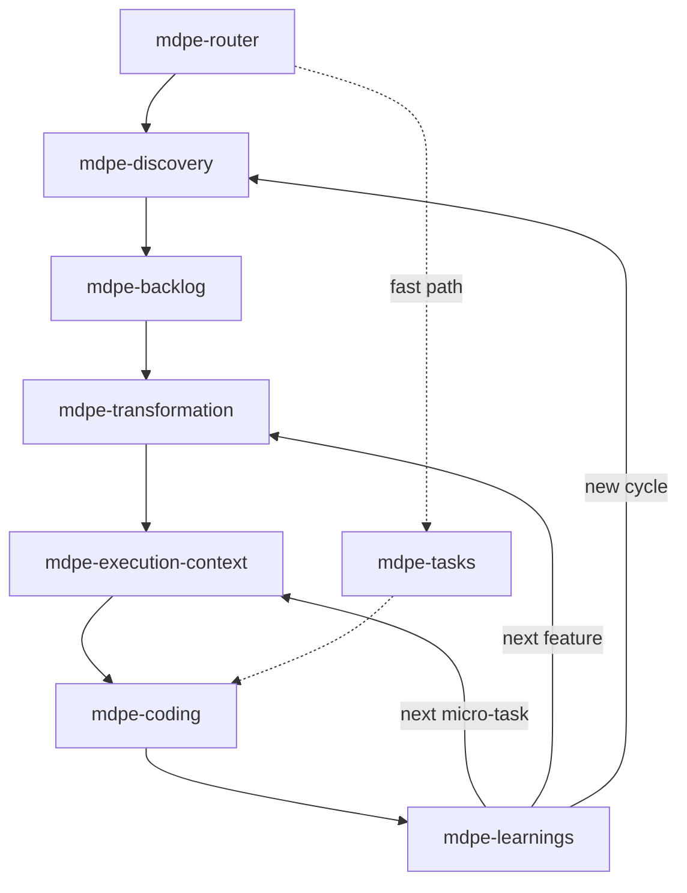

# MDPE Router

> **Role**: Orchestrate the MDPE lifecycle and route to the correct skill.
> **Covers**: all 6 functional skills + the return loops.
> **Memory decision of record**: `docs/adr/adr-006-memory-model.md`

## What MDPE is

MDPE is a methodology based on **micro-task-oriented prompt engineering**. Work flows
through four stages with learning loops: **Discovery → Backlog → Transformation →
Execution (Plan → Produce → Proof → Propagate)**.

## Step 0 — Read the memory, then route

Before routing anything, read `docs/memory/project-memory.yml` — the derived index over the
project's three memory layers (decisions and conventions in force, confirmed lessons, open
questions, staleness). It is short by construction, so read the whole thing.

1. **Read the index.** No file → *"there is no memory to consult"*, and proceed. An absent
   index blocks nothing.
2. **Reconcile it against the repository.** Compare `metadata.repo_state` (`branch@commit`)
   with the current state. Diverged → **regenerate before using it**. A stale index is worse
   than an absent one, because it looks true.
3. **Check `staleness[]`.** An inventory older than `HEAD`, a cited path that no longer
   exists, a `superseded` decision still referenced. Each is a **warning with a route** —
   never a correction by deduction.
4. **Announce it in one line** before naming the destination: what is in force, what is open,
   what is stale, and the next step. The next step is **read** from the dispatch (`next` in
   the index, the `mdpe-graph` wave view, or `microtasks-index.yml`) — never recomputed here.

**Precedence, in every case: code > owner artifact > index.** The index is a projection: it
says what was already decided and where to check it. It decides nothing, and it approves
nothing.

What the router must **not** conclude from memory: no architecture decision, no scope change,
no micro-task status. Reading the index informs the route; it never substitutes for the skill
that owns the call. And a `candidate` lesson never appears in the index, so it is never read
here as advice.

## Routing flow

`mdpe-tasks` is a shortcut: it consolidates discovery framing, transformation, and
execution-context into a single Markdown file for one item/feature, skipping the
multi-artifact pipeline. Use it instead of the `T → EC` chain when the item is small
enough to fit in one file (roughly 3-25 tasks) and does not need the full traceable
YAML trail.

## Routing table

| User situation | Route to |
|----------------|----------|
| "Where were we?" / resuming after a break / "what's the state of this project?" | answer from Step 0 — the index, reconciled — then route to the `next` it points at |
| "Starting a new product/project", pasted a vision/problem/goals | `mdpe-discovery` |
| Too many features / unclear priority / stakeholder conflict | `mdpe-discovery` (refined prioritization mode) |
| "What are the risks / hypotheses?" | `mdpe-discovery` (risk validation mode) |
| Discovery outputs exist; need a structured/traceable backlog | `mdpe-backlog` |
| A Must-Have feature is ready to break down; need micro-tasks / dependency graph / `tasks.md` | `mdpe-transformation` |
| A micro-task is next; need context or environment setup | `mdpe-execution-context` |
| Micro-task is Ready to Code; implement / validate / review | `mdpe-coding` |
| Micro-task done; capture learnings / update loops | `mdpe-learnings` |
| Finished a task, "what's next?" | `mdpe-learnings` → then next micro-task / feature / cycle |
| Pasted a single backlog item/feature/text, wants one checklist file (no full multi-artifact pipeline) | `mdpe-tasks` |

## Return loops

- After `mdpe-learnings`: **next micro-task** → `mdpe-execution-context`; **next feature** → `mdpe-transformation`; **new strategic cycle** → `mdpe-discovery`.
- A blocking dependency during execution → resolve the upstream micro-task first (`mdpe-execution-context` → `mdpe-coding`).
- A strategic learning that invalidates scope → `mdpe-discovery` / `mdpe-backlog`.

## When to ask before routing

Ask one clarifying question only when two or more paths genuinely fit, e.g.:
- Discovery outputs exist but priorities look unstable → `mdpe-backlog` vs `mdpe-discovery` (refined mode)?
- A "feature" that is actually one atomic unit → `mdpe-transformation` vs straight to `mdpe-execution-context`?

Otherwise route directly and state which skill and why.

## Skill directory

- `mdpe-discovery` — DP-01/02/03: discovery session, prioritization, risks.
- `mdpe-backlog` — BC-01: cognitive backlog structuring.
- `mdpe-transformation` — TL-01/02/03/04 + TG-01: feature → micro-tasks + `tasks.md`.
- `mdpe-execution-context` — EX-01 + CD-01: context (6 dimensions) + Ready-to-Code.
- `mdpe-coding` — CD-02/03/04: implement + validate + review.
- `mdpe-learnings` — EX-02: extract learnings, feed loops, and **own the project memory**
  (lesson register + the `docs/memory/project-memory.yml` index this router reads in Step 0).
- `mdpe-tasks` — fast path: discovery framing + transformation + execution-context, consolidated into one Markdown checklist for a single item/feature.

See `docs/mapping-commands-to-skills.md` for the full 15→7 traceability and
`docs/mdpe-flow.md` for the lifecycle diagrams.
